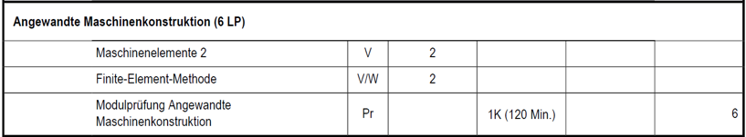
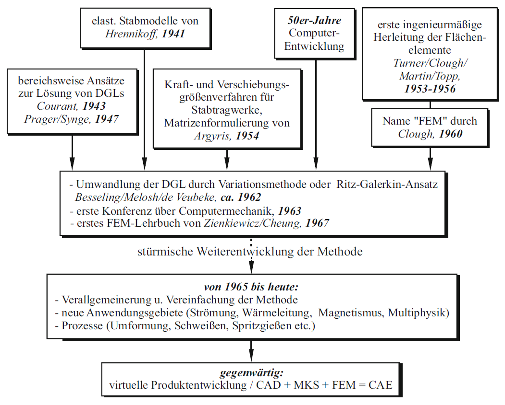
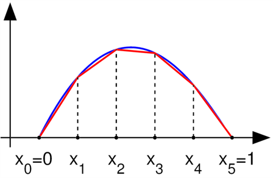
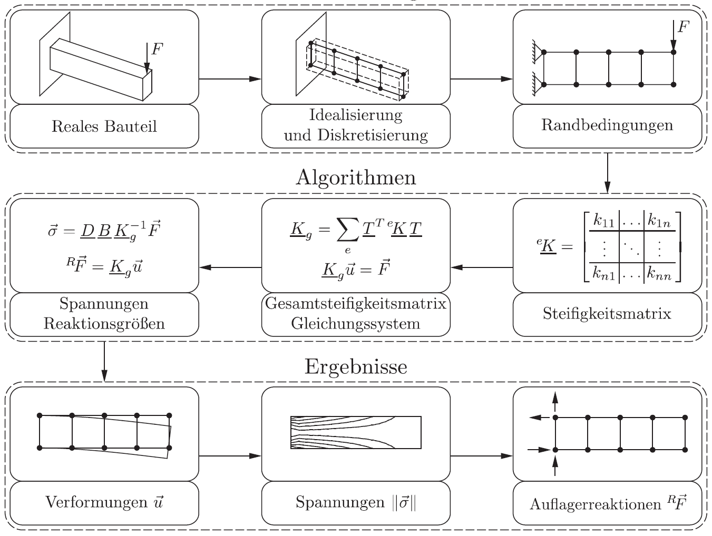

# Introduction to the Course

???+ danger "FIXME"
    1. SMA FEM regulations  
    2. Abbildungen EN
    3. Sources EN
     

## Course Classification

- WING students in the 5th semester, PEB program  
- Part of the **Applied Mechanical Design** module  
- 6 ECTS credits  
- Together with **Machine Elements 2**

## Organization

### Prerequisites

- Introduction to Design  
- Technical Drawing  
- Engineering Mechanics  
- Materials and Manufacturing Technology  
- CAD using Creo  
- Machine Elements 1  

### Topics

- Simulation to support the mechanical design process  
- Strength calculation  
- Basic machine dynamics  

### Didactic Concept

- Lecture with exercises  
- Computer-based exercises using **ANSYS**[^1] and **Creo**[^1]  
- Additional homework assignments  
- FELIX, lecture notes, exercise sheets, forum, tools …

[^1]: We use the latest available versions of the software. See [Installing ANSYS](02_installation_ansys.md)

### Exam

- Combined with **Machine Elements 2**  
- **E-exam, 120 minutes**  
- No aids allowed  
- FEM tasks on the computer  

[{width=900px}](media/01_einfuehrung/01_SPO.png "Excerpt from examination regulations (SPO)"){.glightbox}

### Course Schedule

This overview shows the planned structure of the 15 lecture blocks. The content builds on each other and serves as general orientation.

**Block 1**: Organization, introduction, fundamentals  
**Block 2**: FEM basics, static linear analysis (cantilever under tension)  
**Block 3**: Static linear analysis (tensile test, mesh influence study)  
**Block 4**: Static linear analysis (cantilever under bending)  
**Block 5**: Static linear analysis (notch stress concentration factor)  
**Block 6**: Static linear analysis (combined bending line cases, load introduction issues)  
**Block 7**: Static linear analysis (combined bending line cases, load introduction issues)  
**Block 8**: Static linear analysis **tbd, welding, notch stress concept**  
**Block 9**: Static linear analysis **tbd, welding, notch stress concept**  
**Block 10**: Static linear analysis – using symmetry  
**Block 11**: Modal analysis (basics, degrees of freedom, natural frequencies)  
**Block 12**: Modal analysis (variation of support conditions, material combinations)  
**Block 13**: **tbd CFD in Discovery/FLUENT??**  
**Block 14**: **tbd CFD in Discovery/FLUENT??**  
**Block 15**: **Review, open questions, exam preparation**

## Fundamentals of FEM

### Why CAx?

- Objective: **More efficient and faster product development**
- In small and medium-sized companies: **Designers do the simulations themselves**
- In large companies:
    - **Coordination** between design and simulation is key
    - **Communication** must work smoothly
    - Project management must **understand all departments**

### Origins of FEM

- Desire to solve arbitrary continuum mechanics problems  
- Idea: Divide the continuum into known elements (finite elements)  
- Mathematical foundation: **Ritz method**, around 1909  
- Today: Solving complex systems of equations using high-performance computing  

[{width=500px}](media/01_einfuehrung/01_fem_historie.png "Historical development of FEM"){.glightbox}

Image source[@Klein2015]

### Approximation Method

- Approximate the true solution using known element behavior  
- FEM is a **displacement-based method** (principle of virtual displacements)  
- **Stresses** are computed in a **postprocessing step**  

[{width=300px}](media/01_einfuehrung/01_naeherung.png "Example of approximation"){.glightbox}

### Basic Workflow of an FE Simulation

*1.* Create the model (CAD / geometry)  
*2.* Generate mesh (meshing)  
*3.* Define boundary conditions (supports, loads)  
*4.* Solve the system (solver)  
*5.* Interpret results (postprocessing)

[{width=250px}](media/01_einfuehrung/01_Ablauf_FEM_grob.png "Basic workflow of FEM"){.glightbox}

Image source[@Klein2015]

### Detailed Workflow of an FE Simulation

[{width=800px}](media/01_einfuehrung/01_Ablauf_FEM_detailliert.png "Detailed workflow of FEM"){.glightbox}

Image source[@Steinke2015]

### Result Interpretation

- Are the results plausible and meaningful?  
- Are boundary conditions, units, and magnitudes correct?  
- Is the chosen material behavior appropriate?  
- Can results be compared to experience or analytical solutions?  
- Is the computing time acceptable?  
- Is the influence of mesh size eliminated?  
- Has convergence been reached?  
- Are any divergences intentionally considered?  
- ...
