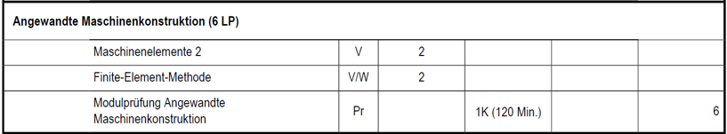
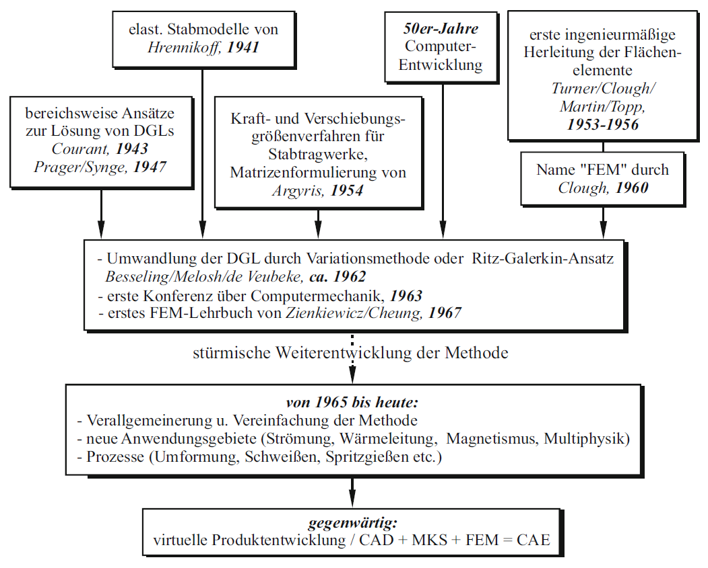
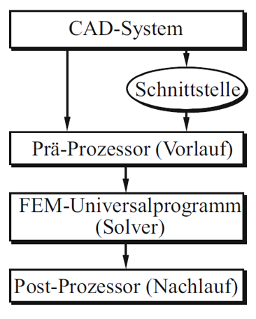

# Einführung in die Vorlesung

## Einordnung der Vorlesung

- WING-Studierende im 5. Semester, Studiengang PEB  
- Teil des Moduls **Angewandte Maschinenkonstruktion**
- 6 Leistungspunkte  
- Zusammen mit **Maschinenelemente 2**

## Organisation

### Vorkenntnisse

- Einführung in die Konstruktion  
- Technisches Zeichnen  
- Technische Mechanik  
- Werkstoff- und Fertigungstechnik  
- CAD in Creo  
- Maschinenelemente 1  

### Inhalte

- Konstruktionsbegleitende Simulation von Maschinenbauteilen  
- Festigkeitsberechnung  
- Einfachste Maschinendynamik  

### Didaktischer Aufbau

- Vorlesung mit Übungen  
- Übungen am Rechner mit **ANSYS**[^1] und **Creo**[^1]
- Weiterführende Aufgaben für Zuhause  
- FELIX, Vorlesungsmitschriebe, Übungsaufgaben, Forum, Tools …

[^1]: Die Programme verwenden wir in der jeweils aktuellen Version, siehe [Installation von ANSYS](02_installation_ansys.md)

### Klausur

- Gemeinsam mit **Maschinenelemente 2**  
- **E-Klausur, 120 Minuten**  
- Keine Hilfsmittel  
- FEM-Aufgaben am Rechner  

[{width=900px}](media/01_einfuehrung/01_SPO.png "Auszug Prüfungsordnung (SPO)"){.glightbox}

### Vorlesungsplan

Diese Übersicht zeigt die geplante Struktur der 15 Vorlesungsblöcke. Die Inhalte bauen aufeinander auf und dienen hier lediglich der Orientierung.

**Block 1**: Organisation, Einführung, Grundlagen  
**Block 2**: Grundlagen der FEM, statisch lineare Analysen (Kragbalken unter Zug)  
**Block 3**: Statisch lineare Analysen (Zugversuch, Netzeinflussstudie)  
**Block 4**: Statisch lineare Analysen (Kragbalken unter Biegung)  
**Block 5**: Statisch lineare Analysen (Kerbformzahl)  
**Block 6**: Statisch lineare Analysen (Biegelinien Dubbelfälle, Krafteinleitungsproblematik)  
**Block 7**: Statisch lineare Analysen (Biegelinien Dubbelfälle, Krafteinleitungsproblematik)  
**Block 8**: Statisch lineare Analysen **tbd, Schweißen, Kerbspannungsprinzip**  
**Block 9**:  Statisch lineare Analysen **tbd, Schweißen, Kerbspannungsprinzip**  
**Block 10**: Statisch lineare Analysen – Symmetrien ausnutzen  
**Block 11**: Modalanalyse (Grundlagen, Freiheitsgrade, Eigenfrequenzen)  
**Block 12**: Modalanalyse (Variation der Aufspannung, Materialkombinationen)  
**Block 13**: **tdb CFD in Discovery/FLUENT??**  
**Block 14**: **tdb CFD in Discovery/FLUENT??**  
**Block 15**: **Wiederholung, offene Fragen, Klausurvorbereitung**

## Grundlagen der FEM

### Warum CAx?

- Ziel: **Effizientere und schnellere Produktentwicklung**
- In kleinen und mittleren Firmen: **Konstrukteur berechnet selbst**
- In großen Firmen:
    - **Abstimmung** zwischen Konstruktion und Berechnung entscheidend
    - **Kommunikation** muss funktionieren
    - Projektmanagement muss **Verständnis für alle Fachabteilungen** aufbauen

### Entstehung der FEM

- Wunsch: Lösungen für beliebige kontinuumsmechanische Probleme
- Idee: Zerlegung des Kontinuums in bekannte Elemente (finite Elemente)
- Mathematische Grundlagen: **Ritz-Ansatz**, ca. 1909
- Heute: Lösung komplexer Gleichungssysteme mittels Hochleistungsrechnern

[{width=500px}](media/01_einfuehrung/01_fem_historie.png "Historische Entwicklung der FEM"){.glightbox}

Bildquelle[@Klein2015]

### Näherungsverfahren

- Näherung der wahren Lösung durch bekannte Elementeigenschaften
- FEM ist ein **Verschiebungsverfahren** (Prinzip virtueller Verschiebungen)
- **Spannungen** resultieren aus einer **Nachlaufrechnung**

[{width=300px}](media/01_einfuehrung/01_naeherung.png "Beispiel Näherung"){.glightbox}

### Ablauf einer FE-Berechnung (grob)

*1.* Modell erstellen (CAD / Geometrie)  
*2.* Netz generieren (Meshing)  
*3.* Randbedingungen setzen (Lagerung, Lasten)  
*4.* Lösung berechnen (Solver)  
*5.* Ergebnisse interpretieren (Postprocessing)  

[{width=250px}](media/01_einfuehrung/01_Ablauf_FEM_grob.png "Grobablauf der FEM"){.glightbox}

### Ablauf einer FE-Berechnung (detailliert)

[{width=800px}](media/01_einfuehrung/01_Ablauf_FEM_detailliert.png "Detaillierter Ablauf einer FEM-Berechnung"){.glightbox}

### Ergebnisinterpretation

- Ergebnisse plausibel und zweckmäßig?
- Randbedingungen, Größenordnungen, Einheiten korrekt?
- Materialverhalten angemessen gewählt?
- Abgleich mit Erfahrungen oder analytischen Lösungen möglich?
- Rechenzeit vertretbar?
- Netzeinfluss eliminiert?
- Konvergenz erreicht?
- Divergenzen bewusst berücksichtigt?
- ...
