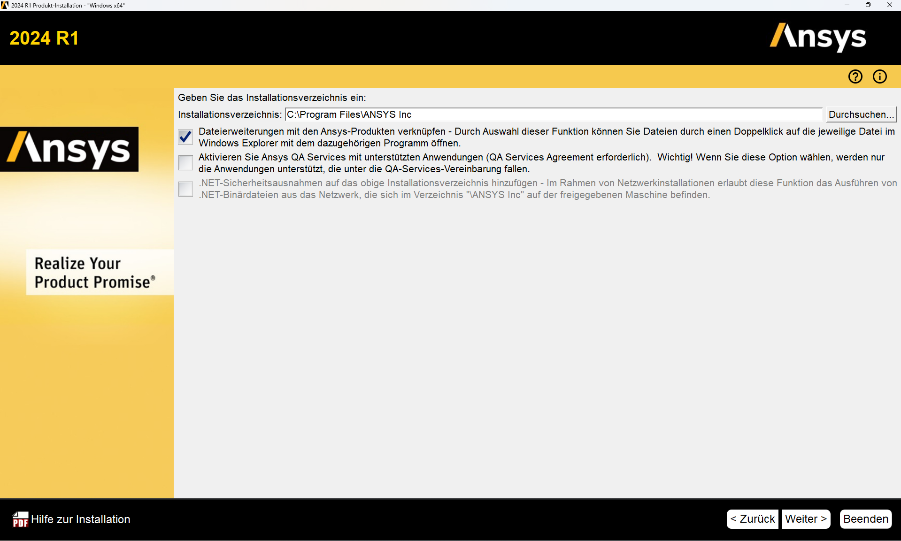
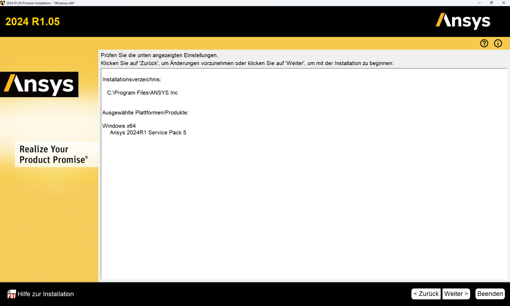
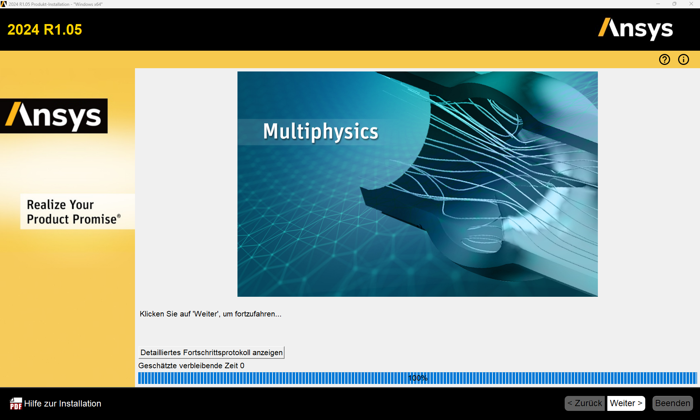

# Installation of ANSYS 2024R1

This guide describes the installation of ANSYS 2024R1 on a private Windows computer.

???+ danger "FIXME"
    - Update to the current version!
    - Adjust image captions

---

## Requirements

This guide applies to the following requirements:

* ANSYS 2024R1  
* Windows 11 (other systems not tested)  
* Active HFU VPN connection (only required outside the campus)

---

## VPN

To use ANSYS, a connection to the HFU license server must be established. This is only possible _outside_ the university via an active VPN connection. Within the campus network, no VPN is required.

* VPN installation guide: [https://howto.hs-furtwangen.de/vpn](https://howto.hs-furtwangen.de/vpn)  
* If you experience issues: [it-support@hs-furtwangen.de](mailto:it-support@hs-furtwangen.de)

---

## Installation of ANSYS

### Step 1: Download installation files

The installation files are available at:

[https://bwsyncandshare.kit.edu/s/5P9a3FnCCfMgnbC](https://bwsyncandshare.kit.edu/s/5P9a3FnCCfMgnbC)

Download the following files (VPN not required):

* `STRUCTURES_2024R1_WINX64.zip` (main application)
* `ANSYS_2024R1.04_WINX64.zip` (latest service update)

---

### Step 2: Extract and install ANSYS

*1.*  **Activate VPN connection.**  
*2.*  Extract `STRUCTURES_2024R1_WINX64.zip`. Run `setup.exe` **as administrator** (right-click → Run as administrator).  
*3.*  Follow the installation steps as shown in the images below. Some settings must be adjusted. **Do not change any file paths.**  
*4.*  Select “Install ANSYS Products”:

[{width=600px}](media/02_Installation_ansys/02_01.png "Install start"){.glightbox}  

*5.*  Accept settings:

[{width=600px}](media/02_Installation_ansys/02_02.png "EULA"){.glightbox}  

*6.*  Accept settings, do not change file paths:

[{width=600px}](media/02_Installation_ansys/02_03.png "Path settings"){.glightbox}  

*7.*  Enter license server: `10.10.13.101`, VPN connection required:

[{width=600px}](media/02_Installation_ansys/02_04.png "License server"){.glightbox}  

*8.*  Only select **Geometry Interfaces** and **Mechanical Products**:

[{width=600px}](media/02_Installation_ansys/02_05.png "Components"){.glightbox}  

*9.*  Next:

[{width=600px}](media/02_Installation_ansys/02_06.png "CAD interfaces"){.glightbox}  

*10.*  Next (contents may vary by system):

[{width=600px}](media/02_Installation_ansys/02_07.png "CAD interface configuration"){.glightbox}  

*11.*  Next (contents may vary by system):

[{width=600px}](media/02_Installation_ansys/02_08.png "Review settings"){.glightbox}  

*12.*  Installation complete:

[{width=600px}](media/02_Installation_ansys/02_09.png "Installation"){.glightbox}  

*13.*  Installation finished (contents may vary by system):

[{width=600px}](media/02_Installation_ansys/02_10.png "Finish"){.glightbox}  

*14.*  To use ANSYS, a connection to the HFU license server is required. This is only possible outside the university via VPN. Inside the campus network, VPN is not necessary.  
*15.*  Continue with the service update.

---

### Step 3: Install the service update

*1.*  Extract `ANSYS_2024R1.04_WINX64.zip`.  
*2.*  Run `setup.exe` **as administrator**.  
*3.*  Select “Install ANSYS Products”:

[{width=600px}](media/02_Installation_ansys/02_11.png "Service update"){.glightbox}  

*4.*  Accept settings:

[{width=600px}](media/02_Installation_ansys/02_12.png "EULA"){.glightbox}  

*5.*  Next, do not change file paths:

[{width=600px}](media/02_Installation_ansys/02_13.png "Path settings"){.glightbox}  

*6.*  Accept settings and continue:

[{width=600px}](media/02_Installation_ansys/02_14.png "Component selection"){.glightbox}  

*7.*  Next:

[{width=600px}](media/02_Installation_ansys/02_15.png "Review settings"){.glightbox}  

*8.*  Installation complete:

[{width=600px}](media/02_Installation_ansys/02_16.png "Service install"){.glightbox}  

*9.*  Finish:

[{width=600px}](media/02_Installation_ansys/02_17.png "Finish"){.glightbox}  

*10.*  The ZIP file and extracted data can now be deleted.

---

## Starting ANSYS

* Activate VPN connection (outside the HFU network).
* Start ANSYS via the Windows Start menu.
* If issues occur: right-click → “Run as administrator”.

---

## Coupling ANSYS with Creo

A direct bidirectional link between ANSYS and PTC Creo is possible.

*1.*  Install Creo and the HFU CAD environment as described in the relevant guide.  
*2.*  Use the **ANSYS CAD Configuration Manager** to set up the associative Workbench interface.  
*3.*  The setup must be run **as administrator**.

---
