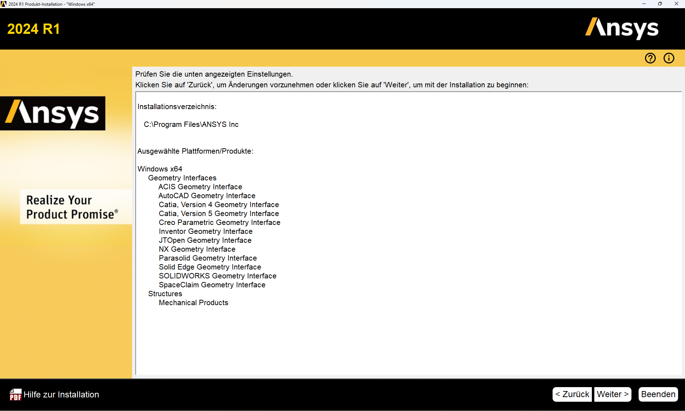
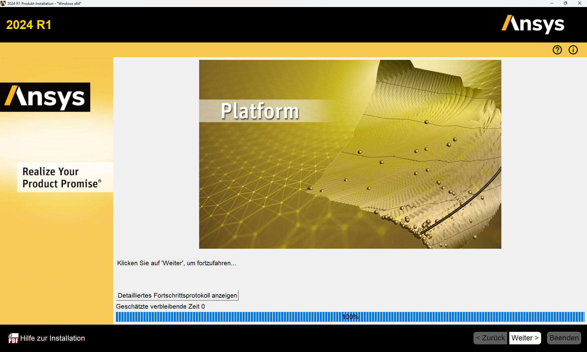
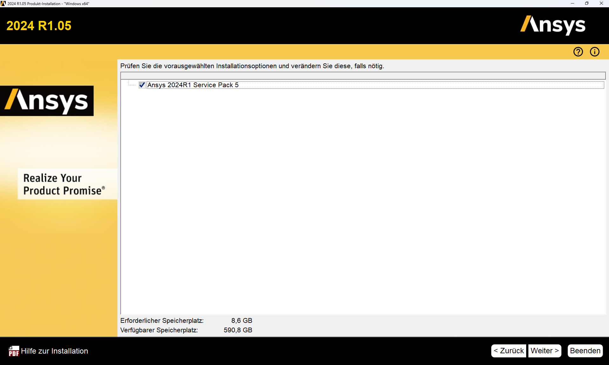

# Installation von ANSYS 2024R1

Diese Anleitung beschreibt die Installation von ANSYS 2024R1 auf einem privaten Windows-Rechner.

???+ danger "FIXME"
    - auf aktuelle Version anpassen!

---

## Voraussetzungen

Diese Anleitung gilt für folgende Voraussetzungen:

* ANSYS 2024R1  
* Windows 11 (andere Systeme nicht getestet)  
* Aktive HFU-VPN-Verbindung (nur außerhalb des Campus erforderlich)

---

## VPN
Um ANSYS nutzen zu können, muss eine Verbindung zum Lizenzserver der HFU hergestellt werden. Das wird _außerhalb_ der Hochschule nur mit einer aktiven VPN-Verbindung erreicht. Innerhalb des Hochschulnetzwerks ist kein VPN erforderlich. 

* Anleitung zur VPN-Installation: [https://howto.hs-furtwangen.de/vpn](https://howto.hs-furtwangen.de/vpn)  
* Bei Problemen: [it-support@hs-furtwangen.de](mailto:it-support@hs-furtwangen.de)

---

## Installation von ANSYS

### Schritt 1: Herunterladen der Installationsdateien

Die Installationsdaten finden sich unter:

[https://bwsyncandshare.kit.edu/s/5P9a3FnCCfMgnbC](https://bwsyncandshare.kit.edu/s/5P9a3FnCCfMgnbC)

Folgende Dateien müssen heruntergeladen werden (VPN nicht erforderlich):

* `STRUCTURES_2024R1_WINX64.zip` (Hauptprogramm)
* `ANSYS_2024R1.04_WINX64.zip` (aktuelles Service-Update)

---

### Schritt 2: Entpacken und Installation von ANSYS

*1.* **VPN-Verbindung aktivieren.**  
*2.* `STRUCTURES_2024R1_WINX64.zip` entpacken. `setup.exe` **als Administrator** ausführen (Rechtsklick → Als Administrator ausführen).  
*3.* Folgen Sie dem Installationsprozess wie in den folgenden Abbildungen angegeben. Die Einstellungen müssen z.T. angepasst werden, ändern Sie bitte keine Dateipfade  
*4.* „Installation ANSYS Produkte“ auswählen:    

[{width=600px}](media/02_Installation_ansys/02_01.png "Installationsstart"){.glightbox}  

*5.* Einstellungen übernehmen:

[{width=600px}](media/02_Installation_ansys/02_02.png "EULA"){.glightbox}  

*6.* Einstellungen übernehmen, keine Dateipfade ändern:  

[{width=600px}](media/02_Installation_ansys/02_03.png "Einstellungen Pfade"){.glightbox}  

*7.* Lizenzserver eintragen: `10.10.13.101`, VPN-Verbindung erforderlich.  

[{width=600px}](media/02_Installation_ansys/02_04.png "Lizenzserver"){.glightbox}  

*8.* Nur **Geometry Interfaces** und **Mechanical Products** auswählen:  

[{width=600px}](media/02_Installation_ansys/02_05.png "Komponenten"){.glightbox}  

*9.* Weiter:  

[{width=600px}](media/02_Installation_ansys/02_06.png "CAD-Schnittstellen"){.glightbox}  

*10.* Weiter (je nach System andere Inhalte):  

[{width=600px}](media/02_Installation_ansys/02_07.png "CAD-Schnittstellen Konfiguration"){.glightbox}  

*11.* Weiter (je nach System andere Inhalte):  

[{width=600px}](media/02_Installation_ansys/02_08.png "Einstellungen prüfen"){.glightbox}  

*12.* Installation fertig:  

[{width=600px}](media/02_Installation_ansys/02_09.png "Installation"){.glightbox}  

*13.* Installation abgeschlossen (je nach System andere Inhalte):  

[{width=600px}](media/02_Installation_ansys/02_10.png "Fertigstellung"){.glightbox}  

*14.* Um ANSYS nutzen zu können, muss eine Verbindung zum Lizenzserver der HFU hergestellt werden. Das wird außerhalb der Hochschule nur mit einer aktiven VPN-Verbindung erreicht. Innerhalb des Hochschulnetzwerks ist kein VPN erforderlich.  
*15.* Weiter mit dem Service-Update.  

---

### Schritt 3: Installation des Service-Updates

*1*. `ANSYS_2024R1.04_WINX64.zip` entpacken.  
*2.* `setup.exe` **als Administrator** starten.  
*3.* „Installation ANSYS Produkte“ wählen:  

[{width=600px}](media/02_Installation_ansys/02_11.png "Serviceupdate"){.glightbox}  

*4*. Einstellungen übernehmen:

[{width=600px}](media/02_Installation_ansys/02_12.png "EULA"){.glightbox}  

*5.* Weiter, keine Dateipfade ändern:

[{width=600px}](media/02_Installation_ansys/02_13.png "Einstellungen Pfade"){.glightbox}  

*6.* Einstellungen übernehmen und weiter:

[{width=600px}](media/02_Installation_ansys/02_14.png "Auswahl Komponenten"){.glightbox}  

*7.* Weiter:

[{width=600px}](media/02_Installation_ansys/02_15.png "Einstellungen prüfen"){.glightbox} 

*8.* Installation abgeschlossen:

[{width=600px}](media/02_Installation_ansys/02_16.png "Installation Service"){.glightbox} 

*9.* Fertig:

[{width=600px}](media/02_Installation_ansys/02_17.png "Fertigstellung"){.glightbox} 

*10.* ZIP-Datei und entpackte Daten können gelöscht werden.

---

## Start von ANSYS

* VPN-Verbindung aktivieren (außerhalb des HFU-Netzwerks).
* Start über das Windows-Startmenü.
* Bei Problemen: Rechtsklick → „Als Administrator ausführen“.

??? warning "Probleme beim Starten"

    Kann ANSYS trotz richtiger Installation und VPN-Verbindung keine Lizenz ziehen (Fehlermeldung beim Start), gehen Sie wie folgt vor:

    - Navigieren Sie zu `C:\Windows\System32\drivers\etc`  
    - Ergänzen Sie in der Datei `hosts` ganz am Ende die Zeile: `10.10.13.101 Flex`  
    - Speichern und fertig. Falls das Speichern Probleme macht, müssen Sie die Datei evtl. erst auf den Desktop o. ä. kopieren. Und beachten Sie, dass der Dateityp sich nicht ändert.

---

## Kopplung von ANSYS mit Creo

Eine direkte bidirektionale Kopplung zwischen ANSYS und PTC Creo ist möglich.

*1.* Creo und die HFU-CAD-Umgebung gemäß Anleitung installieren.  
*2.* Über den **ANSYS CAD Configuration Manager** die Workbench-assoziative Schnittstelle einrichten.  
*3.* Einrichtung **als Administrator** ausführen.  

---

