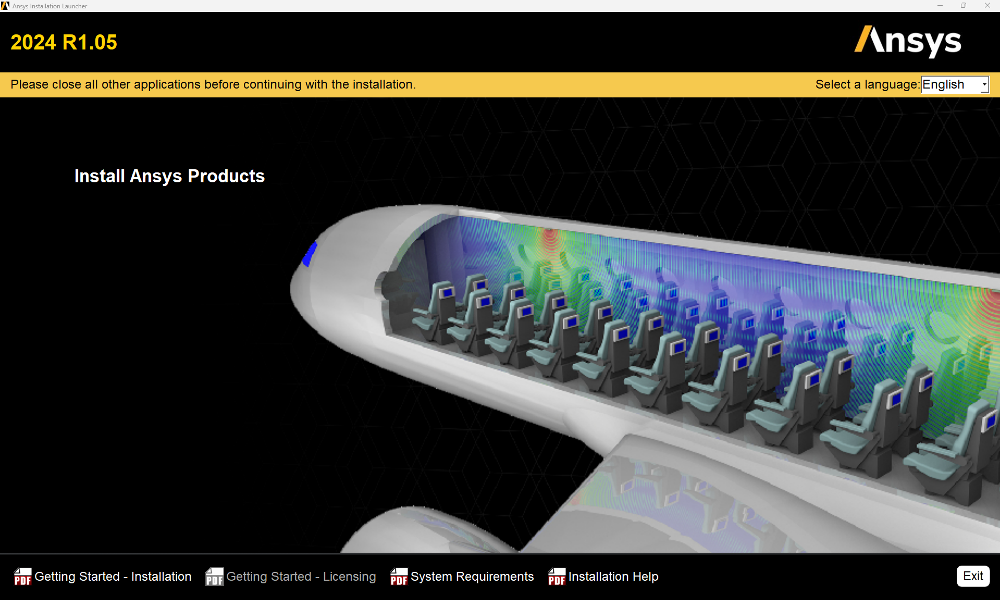
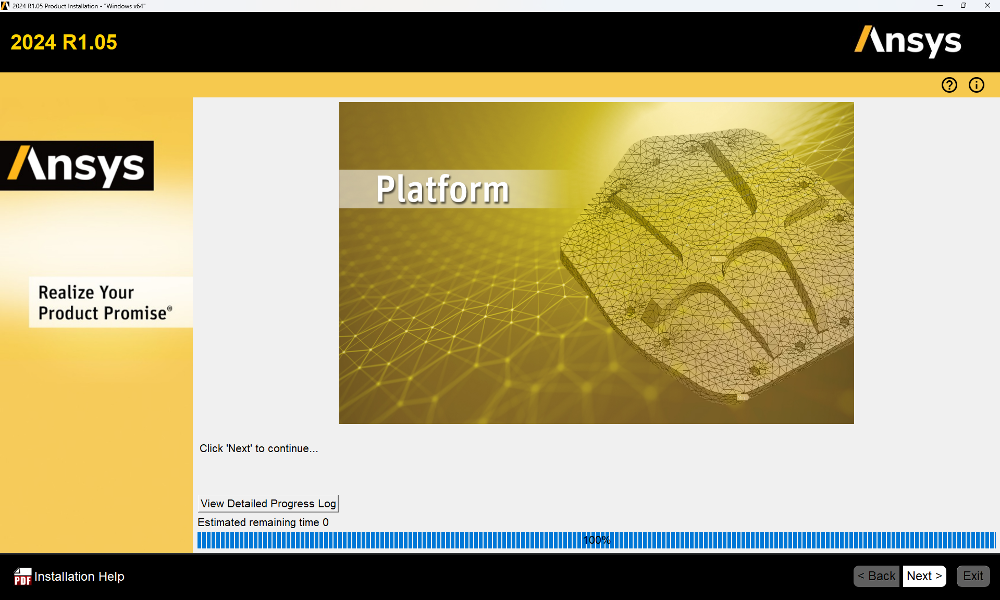

# Installation and getting started with ANSYS

## Learning Objectives

* perform the installation process on Windows step by step  
* set up and verify the VPN connection to the HFU license server  
* start ANSYS Workbench and identify the basic user interface  
* create and save initial projects in ANSYS Workbench  

## ANSYS Installation

### Requirements

This guide applies to the following requirements:

* ANSYS 2024R1  
* Windows 11 (other systems not tested)  
* Active HFU VPN connection (only required outside the campus)

---

### VPN

To use ANSYS, a connection to the HFU license server must be established. This is only possible _outside_ the university via an active VPN connection. Within the campus network, no VPN is required.

* VPN installation guide: [https://howto.hs-furtwangen.de/vpn](https://howto.hs-furtwangen.de/vpn)  
* If you experience issues: [it-support@hs-furtwangen.de](mailto:it-support@hs-furtwangen.de)

---

### Step 1: Download installation files

The installation files are available at:

[https://bwsyncandshare.kit.edu/s/5P9a3FnCCfMgnbC](https://bwsyncandshare.kit.edu/s/5P9a3FnCCfMgnbC)

Download the following files (VPN not required):

* `STRUCTURES_2024R1_WINX64.zip` (main application)
* `ANSYS_2024R1.04_WINX64.zip` (latest service update)

---

### Step 2: Extract and install ANSYS

_1._ **Activate VPN connection.**  
_2._  Extract `STRUCTURES_2024R1_WINX64.zip`. Run `setup.exe` **as administrator** (right-click → Run as administrator).  
_3._  Follow the installation steps as shown in the images below. Some settings must be adjusted. **Do not change any file paths.**  
_4._  Select “Install ANSYS Products”:

[{width=600px}](media/02_Installation_erste_Schritte/02_01.en.png "Install start"){.glightbox}  

_5._ Accept settings:

[{width=600px}](media/02_Installation_erste_Schritte/02_02.en.png "EULA"){.glightbox}  

_6._  Accept settings, do not change file paths:

[{width=600px}](media/02_Installation_erste_Schritte/02_03.en.png "Path settings"){.glightbox}  

_7._  Enter license server: `10.10.13.101`, VPN connection required:

[{width=600px}](media/02_Installation_erste_Schritte/02_04.en.png "License server"){.glightbox}  

_8._  Only select **Geometry Interfaces** and **Mechanical Products**:

[{width=600px}](media/02_Installation_erste_Schritte/02_05.en.png "Components"){.glightbox}  

_9._  Next:

[{width=600px}](media/02_Installation_erste_Schritte/02_06.en.png "CAD interfaces"){.glightbox}  

_10._  Next (contents may vary by system):

[{width=600px}](media/02_Installation_erste_Schritte/02_07.en.png "CAD interface configuration"){.glightbox}  

_11._  Next (contents may vary by system):

[{width=600px}](media/02_Installation_erste_Schritte/02_08.en.png "Review settings"){.glightbox}  

_12._  Installation complete:

[{width=600px}](media/02_Installation_erste_Schritte/02_09.en.png "Installation"){.glightbox}  

_13._  Installation finished (contents may vary by system):

[{width=600px}](media/02_Installation_erste_Schritte/02_10.en.png "Finish"){.glightbox}  

_14._  To use ANSYS, a connection to the HFU license server is required. This is only possible outside the university via VPN. Inside the campus network, VPN is not necessary.  
_15._  Continue with the service update.

---

### Step 3: Install the service update

_1._  Extract `ANSYS_2024R1.04_WINX64.zip`.  
_2._  Run `setup.exe` **as administrator**.  
_3._  Select “Install ANSYS Products”:

[{width=600px}](media/02_Installation_erste_Schritte/02_11.en.png "Service update"){.glightbox}  

_4._  Accept settings:

[{width=600px}](media/02_Installation_erste_Schritte/02_12.en.png "EULA"){.glightbox}  

_5._  Next, do not change file paths:

[{width=600px}](media/02_Installation_erste_Schritte/02_13.en.png "Path settings"){.glightbox}  

_6._  Accept settings and continue:

[{width=600px}](media/02_Installation_erste_Schritte/02_14.en.png "Component selection"){.glightbox}  

_7._  Next:

[{width=600px}](media/02_Installation_erste_Schritte/02_15.en.png "Review settings"){.glightbox}  

_8._  Installation complete:

[{width=600px}](media/02_Installation_erste_Schritte/02_16.en.png "Service install"){.glightbox}  

_9._  Finish:

[{width=600px}](media/02_Installation_erste_Schritte/02_17.en.png "Finish"){.glightbox}  

_10._  The ZIP file and extracted data can now be deleted.

---

### Starting ANSYS

* Activate VPN connection (outside the HFU network).
* Start ANSYS via the Windows Start menu.
* If issues occur: right-click → “Run as administrator”.

??? warning "Problems at Startup"

    If ANSYS cannot acquire a license at startup despite a correct installation and VPN connection (error message appears), proceed as follows:

    - Navigate to `C:\Windows\System32\drivers\etc`  
    - At the very end of the `hosts` file, add the line: `10.10.13.101 Flex`  
    - Save and you're done. If saving causes issues, you may need to copy the file to the desktop first. Make sure the file type does not change when saving.

---

### Coupling ANSYS with Creo

A direct bidirectional link between ANSYS and PTC Creo is possible.

_1._  Install Creo and the HFU CAD environment as described in the relevant guide.  
_2._  Use the **ANSYS CAD Configuration Manager** to set up the associative Workbench interface.  
_3._  The setup must be run **as administrator**.

---

## Getting Started with ANSYS Workbench

This information is intended to help you get started with ANSYS Workbench. Before performing any simulations, a project must be created, the analysis type selected, geometry imported or created, and material properties defined.

---

### Project Interface

ANSYS Workbench provides a central interface for organizing and managing simulation projects.  
All steps of a simulation can be carried out from the following window:

[{width=800px}](media/02_Installation_erste_Schritte/workbench.en.png "Project interface in ANSYS Workbench"){.glightbox}  

On the left side, various analysis types are available that can be inserted into the project schematic via drag-and-drop. Existing analyses can be linked, for example, to reuse the same geometry multiple times (see next figure). In this way, System B uses the same geometry as System A, while System D refers to the results of System C. The project interface can also display and edit parameters defined within individual modules (parameter set).

[{width=800px}](media/02_Installation_erste_Schritte/verknuepfte_Analysen.en.png "Linked analyses with parameter set"){.glightbox}

A typical analysis system consists of the following components.  
To run a simulation, these are usually processed from top to bottom.

| Component           | Description |
|---------------------|-------------|
| **Analysis Type**    | Defines the physics and numerical method to be used. |
| **Engineering Data** | Describes material properties for the part or assembly. A default material is used unless data is transferred from the CAD system. Therefore, this component is marked complete even without user input. |
| **Geometry**         | CAD files can be imported directly, or neutral formats such as IGES, STEP, or Parasolid can be used. Geometry can also be created with ANSYS DesignModeler or SpaceClaim. Importing models from CAD is also possible. |
| **Model**            | Contains all definitions beyond geometry, such as meshing, contact settings, and local coordinate systems. |
| **Setup**            | Contains loads, boundary conditions, and solver settings. |
| **Solution**         | Displays messages and progress from the equation solver. |
| **Results**          | Shows the results calculated by the FEM analysis. |

Source[@Gebhardt2018]

### Types of Analyses

Available analysis types depend on the license. Examples include:

* **Eigenvalue Buckling**: Linear buckling analysis of thin-walled structures under high compressive loads.  
* **Explicit Dynamics**: Solves highly nonlinear transient problems, such as drop tests or containment simulations.  
* **Harmonic Analysis**: Analyzes the steady-state response to harmonic excitation.  
* **Modal Analysis**: Identifies natural frequencies and mode shapes of a structure.  
* **Static Structural**: Calculates the deformation, stresses, and strains in components under external, static loads without dynamic or damping effects. Optionally, fatigue analysis provides the service life of a design under dynamic loads. Taking geometric nonlinearities into account, static structural analyses can also be used to perform nonlinear buckling calculations.
* **Steady-State Thermal**: Calculates temperature distribution under constant thermal load.  
* **Transient Thermal**: Captures the time-dependent evolution of the temperature field.  
* **Topology Optimization**: Helps derive load-adapted shapes of components.  
* **Transient Structural (MBD)**: Multi-body dynamics for analyzing rigid-body motion and interaction.

---

### File Storage and Structure

After creating a project, it should be saved immediately. The project is stored in a `.wbpj` file, and ANSYS creates a corresponding project directory named `<projectname>_files`.  
This directory contains all simulation data and subfolders, which affects computation speed.

**Note:** Use a fast local drive for simulation. Do **not** work directly from network drives or USB sticks.

???+ warning "Important"
     Avoid using umlauts or spaces in file names.

---

### Verifying and Adjusting Settings

ANSYS Workbench works without further adjustment. However, two settings are recommended:

* **Change units**: Switch to a more common system in the project interface, such as **kg and mm**.
* **Review options**: Under **Tools → Options**, performance-relevant settings can be adjusted to improve solver efficiency.

---

### Geometry

If a CAD system is available, it is recommended to import CAD data directly.  
If direct or bidirectional associative transfer is not possible, a neutral exchange format such as `.step` is usually sufficient.

In this course, using ANSYS tools for geometry creation — **DesignModeler** or **SpaceClaim** — is **not recommended**. These tools are suitable for basic geometry creation and simplification, but they are significantly less powerful than full-featured CAD systems like **PTC Creo**.

!!! info "Importing geometry"
    Geometry is imported via right-click on **Geometry → Import Geometry**.  
    If geometry has already been imported, the label changes to **Replace Geometry**.

!!! warning "Important"
    Do not double-click on **Geometry** unless editing in an ANSYS tool is intended.  
    A double-click will open the geometry in **DesignModeler** or **SpaceClaim**, which may break the link to the CAD system.

When importing exchange formats, it can be helpful to view or simplify geometry in **DesignModeler** or **SpaceClaim**.  
For nonparametric models such as `.step`, **ANSYS SpaceClaim** is recommended, as it allows edits even on history-free geometry.

For parametric geometry connected via a bidirectional CAD interface, updates from the CAD system can be transferred into ANSYS using **Update Geometry** (right-click on Geometry).  
In parameter studies, it is also possible to initiate geometry changes from ANSYS and push them back to the CAD model.

---

### Engineering Data

ANSYS Workbench provides a small library of predefined materials.  
Double-click **Engineering Data** to open the material database, where materials can be edited or newly defined.

A data source can be selected in the upper left (see image below).  
Materials are assigned to the project in the center panel using the plus icon. Material properties are shown at the bottom.

[{width=800px}](media/02_Installation_erste_Schritte/materialdatenbank.en.png "Material database in Workbench"){.glightbox}  

Note that the database is largely based on US standards.

## ANSYS Mechanical

In ANSYS Workbench, the term _Model_ encompasses all definitions between geometry creation and load case definition. This includes:

* Material properties and additional masses  
* Auxiliary geometry for boundary conditions and result evaluation  
* Virtual topology for meshing control  
* Coordinate systems and contacts  
* Meshing definitions  
* Combination of multiple load cases

The **Mechanical Application (ANSYS Mechanical)** is the central FEM tool. It is used to assign physical properties, generate meshes, run simulations, and visualize results. A single Mechanical window can contain multiple analysis branches with different load cases. The structure is defined via the project manager. Double-clicking _Model_ opens the Mechanical Application.

---

### User Interface

[{width=700px}](media/02_Installation_erste_Schritte/mechanical_ui.en.png "Mechanical-Applikation in ANSYS"){.glightbox}  

Key elements of the interface:

* **Left**: Tree structure with all analysis components  
* **Below**: Details of the currently selected element  
* **Top**: Menu bar with display and selection tools  
* **Above the geometry window**: Context-sensitive commands

### Status indicators in the tree view

* Green check: Definition complete  
* Blue question mark: Input missing  
* Grey X: Element suppressed  
* Red exclamation mark: Warning or inconsistency  
* Yellow lightning: Ready to solve  
* Green lightning: Solving in progress  
* Red lightning: Solution aborted  
* Green arrow: Archived result ready to load  
* Red arrow: Aborted result ready to load

### Colors in the details pane

* Yellow: Incomplete input  
* White: Editable field  
* Grey: Display only (read-only)  
* Red: Invalid (e.g., after model change without recalculation)

### View controls

[{width=500px}](media/02_Installation_erste_Schritte/ansichtssteuerung.en.png "Steuerung der Ansichten"){.glightbox}  

Typical functions:

* Rotate, pan, zoom  
* Fit to window or rectangle  
* Previous/next view  
* ISO and top views  
* Save or manage views

### Selection options

Selections are made using mouse interaction.

* Use icons to choose selection type: point, edge, face, or body  
* Mouseover highlights geometry  
* Click to select; use `CTRL` for multi-selection  
* Remove elements with a second click while holding `CTRL`  
* **Box selection**: hold mouse button and drag across model  
* **Expand selection**: add tangential neighboring surfaces  
* Tangent angle (default: 20°) can be adjusted  
* Repeating the function adds further tangents  
* **Adjacent/All**: selects all tangential surfaces until the next sharp edge

[{width=600px}](media/02_Installation_erste_Schritte/selektion.png "Selektionsfunktionen"){.glightbox}  

**Selecting hidden elements:**

When clicking on overlapping geometry, a selection menu appears in the 3D viewer. The mouse can be used to highlight and select individual layers.  
In assemblies, surfaces are color-coded according to their part assignment.

---

### Geometry in Mechanical

The _Geometry_ section lists all imported parts with their attributes.

Functions:

* Show/hide parts  
* Suppress or restore elements  
* Assign materials per part  
* Add point masses (deformable or rigid)  
  → This choice has a significant influence on results.

---

### Coordinate Systems

After importing, the global coordinate system appears, usually matching the one from Creo.

Additional local systems can be added via the context menu:

* Select geometry  
* Right-click → Insert → Coordinate System

**Rules for defining the origin:**

* Point → at the selected point  
* Line → at the midpoint  
* Circle/Arc → at the center  
* Flat face → at the center of mass  
* Cylindrical face → on the axis, axially centered

[{width=350px}](media/02_Installation_erste_Schritte/koordinaten.en.png "Koordinatensysteme bearbeiten"){.glightbox}  

Created systems can be moved or rotated.

---

### Basics of meshing

Meshing divides the component into finite elements, which are connected via nodes.

In design-related FEM workflows, extensive mesh optimization is rarely needed, modern computers handle coarse meshes well.  
What matters is the **mesh-independent quality of results**, not the visual perfection of the mesh.

This requires a **mesh sensitivity study**, typically done by:

* Varying global element size  
* Local mesh refinement  
* Adaptive meshing (see exercise)

The goal is a balanced trade-off between result quality and computation time.

!!! note "Note"
    This section marks the starting point for practical meshing work in ANSYS.  
    Manual meshing is the most direct way to control element size.

The global element size – the average edge length for all elements – is defined in the tree under _Mesh_.

[{width=400px}](media/02_Installation_erste_Schritte/globale_elementgröße.en.png "Setting global element size"){.glightbox}  

The entire model is meshed using this value.  
**This can be inefficient** if the area of interest is small: a fine mesh everywhere increases computation time without added benefit.

Instead, **local refinement** is often preferable:

* Under _Mesh Control_, you can assign element sizes to specific parts or faces  
* Edges or faces can be refined individually  
* The _Method_ function forces a specific **element type** (e.g., tetrahedral or hexahedral)  
  → Choose carefully, based on literature or application

Manual meshing is useful for simple models or early-stage studies.

---

### Contacts

When importing assemblies, ANSYS automatically defines contact regions between parts. Optionally, these can be manually adjusted.

| Contact Type | Property / Behavior |
|--------------|----------------------|
| Bonded       | no separation or sliding, as if glued/welded |
| No Separation | no normal separation, tangential sliding allowed (frictionless) |
| Frictionless | separation allowed, sliding without friction |
| Rough        | separation allowed, but no sliding (infinite friction coefficient) |
| Frictional   | separation allowed, sliding resisted, friction coefficient user-defined |

Contacts serve two purposes:

1. **Transfer of forces**  
2. **Prevention of penetration**

Typical types:

* **Bonded**  
* **No separation**  
* **Frictionless**  
* **Rough**  
* **Frictional**

Caution with complex contact models:  
Contacts involving friction or separation greatly increase computation time.  
In most cases, _Bonded_ or _No Separation_ provides a good balance.

!!! note "Note"
    This section provides only a basic overview of contact definitions.  
    Detailed handling, selection, and evaluation will follow in later exercises.

## Self-assessment quiz

<!-- markdownlint-disable MD033 -->

<?quiz?>
question: Which connection is required outside the campus to use ANSYS?
answer: University Wi-Fi
answer: Mobile data connection
answer-correct: VPN connection to HFU
content:
<strong>Note:</strong> The license server is only accessible on campus or via VPN.
<?/quiz?>

<?quiz?>
question: Where is the list of available analysis types located in ANSYS Workbench?
answer: At the bottom of the window
answer: On the right side of the window
answer-correct: On the left side of the window
content:
<strong>Note:</strong> The analysis types are displayed on the left in the project interface and can be used via drag-and-drop.
<?/quiz?>

<?quiz?>
question: How can blocks be linked in ANSYS Workbench?
answer: By right-clicking and <em>Connect</em>
answer: By dragging a file into the window
answer-correct: By drag-and-dropping a connection line between the systems
content:
<strong>Note:</strong> Connection lines allow data exchange between systems (e.g., geometry or results).
<?/quiz?>

<?quiz?>
question: How is geometry imported into an ANSYS project?
answer: Via the <em>Engineering Data</em> menu
answer-correct: By right-clicking on <em>Geometry</em> and selecting <em>Import Geometry</em>
answer: By dragging a STEP file into the project window
content:
<strong>Note:</strong> Import formats such as STEP, IGES, or Parasolid can be used.
<?/quiz?>

<?quiz?>
question: How is the Mechanical environment started?
answer: By right-clicking on <em>Solution</em>
answer: Automatically after starting the project
answer-correct: By double-clicking on <em>Model</em>
content:
<strong>Note:</strong> Mechanical opens in a separate window for defining boundary conditions, meshes, and evaluations.
<?/quiz?>

<?quiz?>
question: Which elements in the tree outline typically need to be processed?
answer: Only <em>Geometry</em> and <em>Solution</em>
answer-correct: <em>Geometry</em>, <em>Material Assignments</em>, <em>Mesh</em>, <em>Setup</em>, <em>Solution</em>
answer: Only <em>Mesh</em> and <em>Solution</em>
content:
<strong>Note:</strong> These steps ensure a complete definition of the simulation before it is calculated.
<?/quiz?>

<!-- markdownlint-enable MD033 -->
