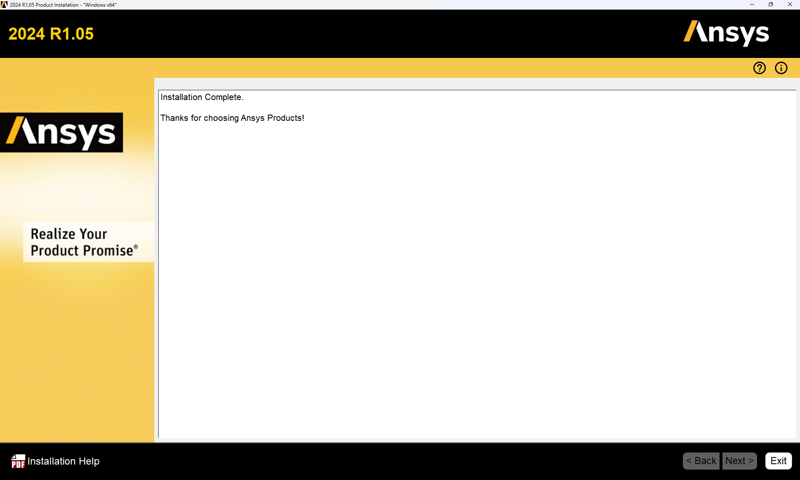

# Installation and getting started with ANSYS

This guide describes the installation of ANSYS 2024R1 on a private Windows computer.

???+ danger "FIXME"
    - Update to the current version!

---

## ANSYS Installation

### Requirements

This guide applies to the following requirements:

* ANSYS 2024R1  
* Windows 11 (other systems not tested)  
* Active HFU VPN connection (only required outside the campus)

---

### VPN

To use ANSYS, a connection to the HFU license server must be established. This is only possible _outside_ the university via an active VPN connection. Within the campus network, no VPN is required.

* VPN installation guide: [https://howto.hs-furtwangen.de/vpn](https://howto.hs-furtwangen.de/vpn)  
* If you experience issues: [it-support@hs-furtwangen.de](mailto:it-support@hs-furtwangen.de)

---

### Step 1: Download installation files

The installation files are available at:

[https://bwsyncandshare.kit.edu/s/5P9a3FnCCfMgnbC](https://bwsyncandshare.kit.edu/s/5P9a3FnCCfMgnbC)

Download the following files (VPN not required):

* `STRUCTURES_2024R1_WINX64.zip` (main application)
* `ANSYS_2024R1.04_WINX64.zip` (latest service update)

---

### Step 2: Extract and install ANSYS

*1.*  **Activate VPN connection.**  
*2.*  Extract `STRUCTURES_2024R1_WINX64.zip`. Run `setup.exe` **as administrator** (right-click → Run as administrator).  
*3.*  Follow the installation steps as shown in the images below. Some settings must be adjusted. **Do not change any file paths.**  
*4.*  Select “Install ANSYS Products”:

[{width=600px}](media/02_Installation_ansys/02_01.en.png "Install start"){.glightbox}  

*5.*  Accept settings:

[{width=600px}](media/02_Installation_ansys/02_02.en.png "EULA"){.glightbox}  

*6.*  Accept settings, do not change file paths:

[{width=600px}](media/02_Installation_ansys/02_03.en.png "Path settings"){.glightbox}  

*7.*  Enter license server: `10.10.13.101`, VPN connection required:

[{width=600px}](media/02_Installation_ansys/02_04.en.png "License server"){.glightbox}  

*8.*  Only select **Geometry Interfaces** and **Mechanical Products**:

[{width=600px}](media/02_Installation_ansys/02_05.en.png "Components"){.glightbox}  

*9.*  Next:

[{width=600px}](media/02_Installation_ansys/02_06.en.png "CAD interfaces"){.glightbox}  

*10.*  Next (contents may vary by system):

[{width=600px}](media/02_Installation_ansys/02_07.en.png "CAD interface configuration"){.glightbox}  

*11.*  Next (contents may vary by system):

[{width=600px}](media/02_Installation_ansys/02_08.en.png "Review settings"){.glightbox}  

*12.*  Installation complete:

[{width=600px}](media/02_Installation_ansys/02_09.en.png "Installation"){.glightbox}  

*13.*  Installation finished (contents may vary by system):

[{width=600px}](media/02_Installation_ansys/02_10.en.png "Finish"){.glightbox}  

*14.*  To use ANSYS, a connection to the HFU license server is required. This is only possible outside the university via VPN. Inside the campus network, VPN is not necessary.  
*15.*  Continue with the service update.

---

### Step 3: Install the service update

*1.*  Extract `ANSYS_2024R1.04_WINX64.zip`.  
*2.*  Run `setup.exe` **as administrator**.  
*3.*  Select “Install ANSYS Products”:

[{width=600px}](media/02_Installation_ansys/02_11.en.png "Service update"){.glightbox}  

*4.*  Accept settings:

[{width=600px}](media/02_Installation_ansys/02_12.en.png "EULA"){.glightbox}  

*5.*  Next, do not change file paths:

[{width=600px}](media/02_Installation_ansys/02_13.en.png "Path settings"){.glightbox}  

*6.*  Accept settings and continue:

[{width=600px}](media/02_Installation_ansys/02_14.en.png "Component selection"){.glightbox}  

*7.*  Next:

[{width=600px}](media/02_Installation_ansys/02_15.en.png "Review settings"){.glightbox}  

*8.*  Installation complete:

[{width=600px}](media/02_Installation_ansys/02_16.en.png "Service install"){.glightbox}  

*9.*  Finish:

[{width=600px}](media/02_Installation_ansys/02_17.en.png "Finish"){.glightbox}  

*10.*  The ZIP file and extracted data can now be deleted.

---

### Starting ANSYS

* Activate VPN connection (outside the HFU network).
* Start ANSYS via the Windows Start menu.
* If issues occur: right-click → “Run as administrator”.

??? warning "Problems at Startup"

    If ANSYS cannot acquire a license at startup despite a correct installation and VPN connection (error message appears), proceed as follows:

    - Navigate to `C:\Windows\System32\drivers\etc`  
    - At the very end of the `hosts` file, add the line: `10.10.13.101 Flex`  
    - Save and you're done. If saving causes issues, you may need to copy the file to the desktop first. Make sure the file type does not change when saving.

---

### Coupling ANSYS with Creo

A direct bidirectional link between ANSYS and PTC Creo is possible.

*1.*  Install Creo and the HFU CAD environment as described in the relevant guide.  
*2.*  Use the **ANSYS CAD Configuration Manager** to set up the associative Workbench interface.  
*3.*  The setup must be run **as administrator**.

---

## Getting Started with ANSYS Workbench

???+ danger "FIXME"
    - Import Geometrie wirklich so benannt?

This information is intended to help you get started with ANSYS Workbench. Before performing any simulations, a project must be created, the analysis type selected, geometry imported or created, and material properties defined.

---

### Project Interface

ANSYS Workbench provides a central interface for organizing and managing simulation projects.  
All steps of a simulation can be carried out from the following window:

[{width=800px}](media/02_erste_Schritte/workbench.en.png "Project interface in ANSYS Workbench"){.glightbox}  

On the left-hand side, various analysis types are available and can be added to the project schematic using drag and drop. Existing analyses can be linked to reuse geometry, as shown in the next image.  
In System B, the same geometry is used as in System A; System D refers to results from System C. Parameters defined in individual components can also be displayed and edited in the project interface.

[{width=800px}](media/02_erste_Schritte/verknuepfte_Analysen.en.png "Linked analyses with parameter set"){.glightbox}

A typical analysis system consists of the following components.  
To run a simulation, these are usually processed from top to bottom.

| Component           | Description |
|---------------------|-------------|
| **Analysis Type**    | Defines the physics and numerical method to be used. |
| **Engineering Data** | Describes material properties for the part or assembly. A default material is used unless data is transferred from the CAD system. Therefore, this component is marked complete even without user input. |
| **Geometry**         | CAD files can be imported directly, or neutral formats such as IGES, STEP, or Parasolid can be used. Geometry can also be created with ANSYS DesignModeler or SpaceClaim. Importing models from CAD is also possible. |
| **Model**            | Contains all definitions beyond geometry, such as meshing, contact settings, and local coordinate systems. |
| **Setup**            | Contains loads, boundary conditions, and solver settings. |
| **Solution**         | Displays messages and progress from the equation solver. |
| **Results**          | Shows the results calculated by the FEM analysis. |

Source[@Gebhardt2018]

### Types of Analyses

Available analysis types depend on the license. Examples include:

* **Eigenvalue Buckling**: Linear buckling analysis of thin-walled structures under high compressive loads.  
* **Explicit Dynamics**: Solves highly nonlinear transient problems, such as drop tests or containment simulations.  
* **Harmonic Analysis**: Analyzes the steady-state response to harmonic excitation.  
* **Modal Analysis**: Identifies natural frequencies and mode shapes of a structure.  
* **Static Structural**: Calculates deformations, stresses, and strains under static loading. Fatigue life prediction is also possible. Geometric nonlinearity can be considered for nonlinear buckling.  
* **Steady-State Thermal**: Calculates temperature distribution under constant thermal load.  
* **Transient Thermal**: Captures the time-dependent evolution of the temperature field.  
* **Topology Optimization**: Helps derive load-adapted shapes of components.  
* **Transient Structural (MBD)**: Multi-body dynamics for analyzing rigid-body motion and interaction.

---

### File Storage and Structure

After creating a project, it should be saved immediately. The project is stored in a `.wbpj` file, and ANSYS creates a corresponding project directory named `<projectname>_files`.  
This directory contains all simulation data and subfolders, which affects computation speed.

**Note:** Use a fast local drive for simulation. Do **not** work directly from network drives or USB sticks.

???+ warning "Important"
     Avoid using umlauts or spaces in file names.

---

### Verifying and Adjusting Settings

ANSYS Workbench works without further adjustment. However, two settings are recommended:

* **Change units**: Switch to a more common system in the project interface, such as **kg and mm**.
* **Review options**: Under **Tools → Options**, performance-relevant settings can be adjusted to improve solver efficiency.

---

### Geometry

If a CAD system is available, it is recommended to import CAD data directly.  
If direct or bidirectional associative transfer is not possible, a neutral exchange format such as `.step` is usually sufficient.

In this course, using ANSYS tools for geometry creation — **DesignModeler** or **SpaceClaim** — is **not recommended**. These tools are suitable for basic geometry creation and simplification, but they are significantly less powerful than full-featured CAD systems like **PTC Creo**.

!!! info "Importing geometry"
    Geometry is imported via right-click on **Geometry → Import Geometry**.

!!! warning "Important"
    Do not double-click on **Geometry** unless editing in an ANSYS tool is intended.  
    A double-click will open the geometry in **DesignModeler** or **SpaceClaim**, which may break the link to the CAD system.

When importing exchange formats, it can be helpful to view or simplify geometry in **DesignModeler** or **SpaceClaim**.  
For nonparametric models such as `.step`, **ANSYS SpaceClaim** is recommended, as it allows edits even on history-free geometry.

For parametric geometry connected via a bidirectional CAD interface, updates from the CAD system can be transferred into ANSYS using **Update Geometry** (right-click on Geometry).  
In parameter studies, it is also possible to initiate geometry changes from ANSYS and push them back to the CAD model.

---

### Engineering Data

ANSYS Workbench provides a small library of predefined materials.  
Double-click **Engineering Data** to open the material database, where materials can be edited or newly defined.

A data source can be selected in the upper left (see image below).  
Materials are assigned to the project in the center panel using the plus icon. Material properties are shown at the bottom.

[{width=800px}](media/02_erste_Schritte/materialdatenbank.en.png "Material database in Workbench"){.glightbox}  

Note that the database is largely based on US standards.
