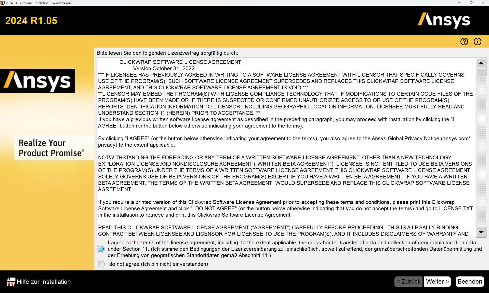

# Installation von ANSYS und erste Schritte

Diese Anleitung beschreibt die Installation von ANSYS 2024R1 auf einem privaten Windows-Rechner.

???+ danger "FIXME"
    - auf aktuelle Version anpassen!

---

## Installation von ANSYS  

### Voraussetzungen  

Diese Anleitung gilt für folgende Voraussetzungen:

* ANSYS 2024R1  
* Windows 11 (andere Systeme nicht getestet)  
* Aktive HFU-VPN-Verbindung (nur außerhalb des Campus erforderlich)

---

### VPN
Um ANSYS nutzen zu können, muss eine Verbindung zum Lizenzserver der HFU hergestellt werden. Das wird _außerhalb_ der Hochschule nur mit einer aktiven VPN-Verbindung erreicht. Innerhalb des Hochschulnetzwerks ist kein VPN erforderlich. 

* Anleitung zur VPN-Installation: [https://howto.hs-furtwangen.de/vpn](https://howto.hs-furtwangen.de/vpn)  
* Bei Problemen: [it-support@hs-furtwangen.de](mailto:it-support@hs-furtwangen.de)

---

### Schritt 1: Herunterladen der Installationsdateien

Die Installationsdaten finden sich unter:

[https://bwsyncandshare.kit.edu/s/5P9a3FnCCfMgnbC](https://bwsyncandshare.kit.edu/s/5P9a3FnCCfMgnbC)

Folgende Dateien müssen heruntergeladen werden (VPN nicht erforderlich):

* `STRUCTURES_2024R1_WINX64.zip` (Hauptprogramm)
* `ANSYS_2024R1.04_WINX64.zip` (aktuelles Service-Update)

---

### Schritt 2: Entpacken und Installation von ANSYS

*1.* **VPN-Verbindung aktivieren.**  
*2.* `STRUCTURES_2024R1_WINX64.zip` entpacken. `setup.exe` **als Administrator** ausführen (Rechtsklick → Als Administrator ausführen).  
*3.* Folgen Sie dem Installationsprozess wie in den folgenden Abbildungen angegeben. Die Einstellungen müssen z.T. angepasst werden, ändern Sie bitte keine Dateipfade  
*4.* „Installation ANSYS Produkte“ auswählen:    

[{width=600px}](media/02_Installation_ansys/02_01.png "Installationsstart"){.glightbox}  

*5.* Einstellungen übernehmen:

[{width=600px}](media/02_Installation_ansys/02_02.png "EULA"){.glightbox}  

*6.* Einstellungen übernehmen, keine Dateipfade ändern:  

[{width=600px}](media/02_Installation_ansys/02_03.png "Einstellungen Pfade"){.glightbox}  

*7.* Lizenzserver eintragen: `10.10.13.101`, VPN-Verbindung erforderlich.  

[{width=600px}](media/02_Installation_ansys/02_04.png "Lizenzserver"){.glightbox}  

*8.* Nur **Geometry Interfaces** und **Mechanical Products** auswählen:  

[{width=600px}](media/02_Installation_ansys/02_05.png "Komponenten"){.glightbox}  

*9.* Weiter:  

[{width=600px}](media/02_Installation_ansys/02_06.png "CAD-Schnittstellen"){.glightbox}  

*10.* Weiter (je nach System andere Inhalte):  

[{width=600px}](media/02_Installation_ansys/02_07.png "CAD-Schnittstellen Konfiguration"){.glightbox}  

*11.* Weiter (je nach System andere Inhalte):  

[{width=600px}](media/02_Installation_ansys/02_08.png "Einstellungen prüfen"){.glightbox}  

*12.* Installation fertig:  

[{width=600px}](media/02_Installation_ansys/02_09.png "Installation"){.glightbox}  

*13.* Installation abgeschlossen (je nach System andere Inhalte):  

[{width=600px}](media/02_Installation_ansys/02_10.png "Fertigstellung"){.glightbox}  

*14.* Um ANSYS nutzen zu können, muss eine Verbindung zum Lizenzserver der HFU hergestellt werden. Das wird außerhalb der Hochschule nur mit einer aktiven VPN-Verbindung erreicht. Innerhalb des Hochschulnetzwerks ist kein VPN erforderlich.  
*15.* Weiter mit dem Service-Update.  

---

### Schritt 3: Installation des Service-Updates

*1*. `ANSYS_2024R1.04_WINX64.zip` entpacken.  
*2.* `setup.exe` **als Administrator** starten.  
*3.* „Installation ANSYS Produkte“ wählen:  

[{width=600px}](media/02_Installation_ansys/02_11.png "Serviceupdate"){.glightbox}  

*4*. Einstellungen übernehmen:

[{width=600px}](media/02_Installation_ansys/02_12.png "EULA"){.glightbox}  

*5.* Weiter, keine Dateipfade ändern:

[{width=600px}](media/02_Installation_ansys/02_13.png "Einstellungen Pfade"){.glightbox}  

*6.* Einstellungen übernehmen und weiter:

[{width=600px}](media/02_Installation_ansys/02_14.png "Auswahl Komponenten"){.glightbox}  

*7.* Weiter:

[{width=600px}](media/02_Installation_ansys/02_15.png "Einstellungen prüfen"){.glightbox} 

*8.* Installation abgeschlossen:

[{width=600px}](media/02_Installation_ansys/02_16.png "Installation Service"){.glightbox} 

*9.* Fertig:

[{width=600px}](media/02_Installation_ansys/02_17.png "Fertigstellung"){.glightbox} 

*10.* ZIP-Datei und entpackte Daten können gelöscht werden.

---

### Start von ANSYS

* VPN-Verbindung aktivieren (außerhalb des HFU-Netzwerks).
* Start über das Windows-Startmenü.
* Bei Problemen: Rechtsklick → „Als Administrator ausführen“.

??? warning "Probleme beim Starten"

    Kann ANSYS trotz richtiger Installation und VPN-Verbindung keine Lizenz ziehen (Fehlermeldung beim Start), gehen Sie wie folgt vor:

    - Navigieren Sie zu `C:\Windows\System32\drivers\etc`  
    - Ergänzen Sie in der Datei `hosts` ganz am Ende die Zeile: `10.10.13.101 Flex`  
    - Speichern und fertig. Falls das Speichern Probleme macht, müssen Sie die Datei evtl. erst auf den Desktop o. ä. kopieren. Und beachten Sie, dass der Dateityp sich nicht ändert.

---

### Kopplung von ANSYS mit Creo

Eine direkte bidirektionale Kopplung zwischen ANSYS und PTC Creo ist möglich.

*1.* Creo und die HFU-CAD-Umgebung gemäß Anleitung installieren.  
*2.* Über den **ANSYS CAD Configuration Manager** die Workbench-assoziative Schnittstelle einrichten.  
*3.* Einrichtung **als Administrator** ausführen.  

---

## Erste Schritte mit ANSYS Workbench

Dieses Informationen soll helfen, die ersten Schritte in ANSYS Workbench zu gehen. Bevor Analysen durchgeführt werden, muss ein Projekt mit seinen Analysearten angelegt, Geometrie importiert oder erstellt und die technischen Daten des Projekts festgelegt werden.

---

### Projektoberfläche

ANSYS Workbench dient als zentrale Oberfläche, um Simulationsprojekte zu organisieren und durchzuführen. Alle Arbeitsschritte einer Simulation lassen sich aus dem folgenden Fenster heraus erledigen:

[{width=800px}](media\02_erste_Schritte\workbench.png "Projektoberfläche in ANSYS Workbench"){.glightbox}  

Auf der linken Seite befinden sich verschiedene Analysearten, die per Drag-and-Drop ins Projektschema eingefügt werden können. Bereits vorhandene Analysen lassen sich verknüpfen, um beispielsweise dieselbe Geometrie mehrfach zu verwenden, siehe nächste Abbildung. So wird in System B die gleiche Geometrie wie in System A verwendet, System D bezieht sich auf Ergebnisse des Systems C. Auch können in der Projektoberfläche Parameter, die in den Einzelbausteinen ausgewiesen wurden, angezeigt und bearbeitet werden (Parametersatz).  

[{width=800px}](media/02_erste_Schritte/verknuepfte_Analysen.png "Verknüpfte Analysen mit Parametersatz"){.glightbox}

Ein Analysesystem besteht typischerweise aus folgenden Komponenten. Um eine Simulation durchzuführen werden in der Regel die Punkte von oben nach unten abgearbeitet werden.

| Komponente       | Beschreibung |
|------------------|--------------|
| **Analyse-Art**  | Hier wird festgelegt, welche Physik und welches numerische Verfahren verwendet werden. |
| **Technische Daten** | Hiermit werden Materialdaten für das Bauteil oder die Baugruppe beschrieben. Es wird ein Standardmaterial verwendet, sofern die Materialdaten vom CAD-System nicht mit übernommen werden. Daher ist diese Komponente auch ohne eine Materialauswahl durch den Anwender mit einem grünen Haken versehen. |
| **Geometrie**    | Hier können die Dateien eines CAD-Systems eingeladen, ein neutrales Format wie z.B. IGES, STEP oder Parasolid importiert oder eine Geometrie mit dem ANSYS DesignModeler oder SpaceClaim neu erstellt werden. Auch die Übernahme eines in einem CAD-System geladenen Modells ist möglich. |
| **Modell**       | Alle Definitionen, die neben der Geometrie notwendig sind, um ein FE-Modell zu beschreiben, wie z. B. die Vernetzungseinstellungen, Kontakte oder auch lokale Koordinatensysteme, werden unter dem Begriff Modell zusammengefasst. |
| **Setup**        | Die Analyse-Einstellungen, die Belastung und die sonstigen Randbedingungen werden in den Setup-Einstellungen zusammengefasst. |
| **Lösung**       | Die Rückmeldungen des Gleichungslösers sind unter der Lösung verfügbar. |
| **Ergebnisse**   | Unter Ergebnisse sind die durch die FEM-Analyse ermittelten Resultate zu finden. |

Quelle[@Gebhardt2018]

### Analysearten

Je nach Lizenz sind verschiedene Analysen verfügbar. Beispiele:

* **Eigenwert-Beulen** bietet ein lineares Knicken/Beulen dünnwandiger Strukturen unter hohen Druckbelastungen.  
* **Explizite Dynamik** ermöglicht es, transiente Dynamik mit nichtlinearen Effekten zu beschreiben z. B. für Falltests oder Containment-Tests.  
* **Harmonische Analysen** bieten die Untersuchung von schwingenden Systemen auf eine harmonische Anregung.  
* **Modalanalysen** ermitteln die Eigenfrequenzen und die Schwingungsformen einer Struktur.  
* **Statisch-strukturmechanische Analysen** ermitteln die Verformung, Spannungen und Dehnungen in Bauteilen in Abhängigkeit von äußeren, ruhenden Lasten ohne dynamische oder dämpfende Effekte. Optional liefert die Betriebsfestigkeitsanalyse die Lebensdauer eines Designs unter dynamischen Lasten. Unter Berücksichtigung von geometrischen Nichtlinearitäten können mit statisch-mechanischen Analysen auch nichtlineare Beulberechnungen durchgeführt werden.  
* **Thermisch-stationäre Analysen** dienen dazu, die Temperaturverteilung unter thermischen Lasten im eingeschwungenen (stationären) Zustand zu ermitteln.  
* **Thermisch-transiente Analysen** bilden den zeitlichen Verlauf eines Temperaturfeldes ab.  
* **Topologie-Optimierungen** helfen, die grundlegende Form eines Bauteils belastungsgerecht zu gestalten.  
* **Transiente strukturmechanische Analysen auf Basis von Mehrkörperdynamik (MBD, Multi Body Dynamics)** erlauben kinematische und dynamische Analysen von Systemen aus Starrkörpern.  

--

### Dateiablage und -struktur

Nach dem Anlegen eines Projekts sollte es sofort gespeichert werden. Die Datei hat die Endung `.wbpj` und erzeugt ein Projektverzeichnis `<projektname>_files`. Darin speichert ANSYS strukturierte Daten, was die Berechnungsgeschwindigkeit beeinflusst.  

**Hinweis:** Nutze zur Berechnung unbedingt eine schnelle, lokale Festplatte – nicht das Netzlaufwerk oder einen USB-Stick.

!!! warning "**Wichtig:**"
    Vermeide Umlaute und Leerzeichen in Dateinamen.

---

### Einstellungen überprüfen und anpassen

ANSYS Workbench funktioniert auch ohne weitere Anpassungen. Zwei Empfehlungen:

* **Maßeinheiten umstellen**: In der Projektoberfläche auf ein gängigeres System wechseln, z. B. **kg und mm**.
* **Einstellungen prüfen**: Unter **Extras → Optionen** können Parameter angepasst werden, die Rechenleistung und Berechnungsdauer beeinflussen.

---

### Geometrie

Steht ein CAD-System zur Verfügung, ist der direkte Import von CAD-Daten empfehlenswert. Falls eine direkte oder bidirektional assoziative Verbindung nicht möglich ist, genügt in vielen Fällen der Weg über ein gängiges Austauschformat, zum Beispiel `.step`.

In diesem Kurs wird die Verwendung der ANSYS-eigenen Programme zur Geometrieerzeugung, **DesignModeler** und **SpaceClaim**, **nicht empfohlen**. Beide Werkzeuge ermöglichen zwar das Erstellen und Vereinfachen von Geometrie, sind jedoch im Vergleich zu vollwertigen CAD-Systemen wie **PTC Creo** funktional deutlich eingeschränkt.

!!! info "Geometrie Import"
    Die Geometrie wird über einen Rechtsklick auf **Geometrie → Geometrie importieren** eingebunden.

!!! warning "**Wichtig:**"
    Kein Doppelklick auf „Geometrie“, wenn keine Bearbeitung im ANSYS-Editor gewünscht ist.  
Ein Doppelklick würde die Geometrie automatisch in **DesignModeler** oder **SpaceClaim** laden und dabei unter Umständen die Verbindung zum ursprünglichen CAD-System aufheben.

Beim Import über ein Austauschformat kann es sinnvoll sein, die Geometrie in **DesignModeler** oder **SpaceClaim** zu betrachten oder anzupassen. Für unparametrische Modelle wie `.step` bietet sich **ANSYS SpaceClaim** an, da es als direkter Modellierer auch Änderungen an historienfreien Geometrien erlaubt.

Bei parametrischer Geometrie, die über eine bidirektionale CAD-Schnittstelle eingebunden ist, lassen sich Änderungen im CAD-System über **Geometrie aktualisieren** (Rechtsklick auf „Geometrie“) nach ANSYS übernehmen. Auch bei Parameterstudien ist es möglich, die Geometrie ausgehend von ANSYS im CAD-System zu verändern und anschließend zurückzuspielen.

---

### Technische Daten

ANSYS Workbench bringt eine kleine Vorauswahl an Materialien mit vordefinierten Eigenschaften mit. Mit einem Doppelklick auf **Technische Daten** kann auf die Materialdatenbank zugegriffen werden. Dort lassen sich Materialien bearbeiten oder neu erstellen.

Oben links kann eine Datenquelle ausgewählt werden (siehe folgende Abbildung). Anschließend können Materialien dem aktuellen Projekt zugewiesen werden. Die Zuordnung erfolgt im mittleren Fensterbereich durch Klick auf das Plus-Symbol. Die Materialeigenschaften werden im unteren Bereich angezeigt.

[{width=800px}](media/02_erste_Schritte/materialdatenbank.png "Materialdatenbank in Workbench"){.glightbox}  

Zu beachten ist, dass die Datenbank im Wesentlichen auf US-amerikanischen Normen basiert.

