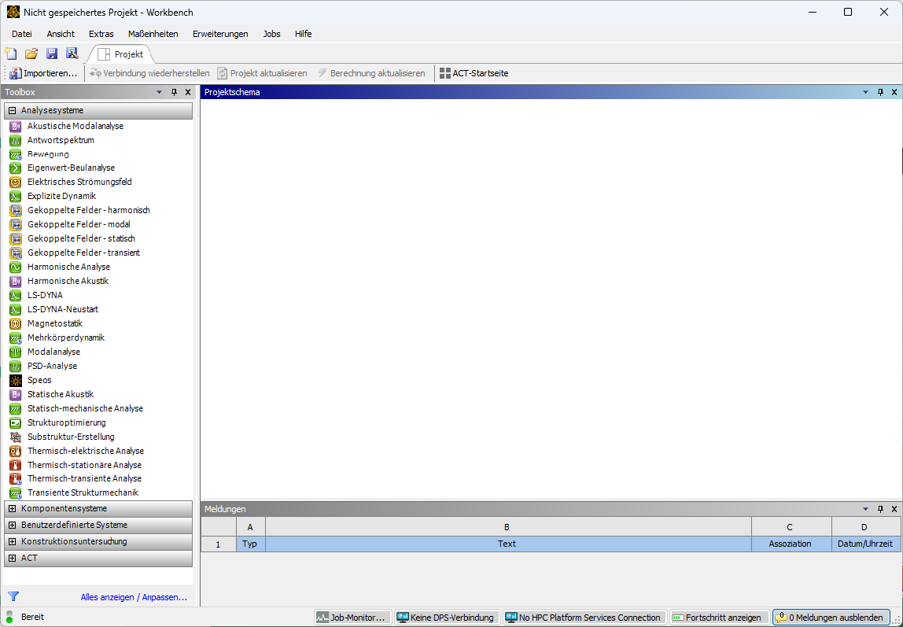

# Getting Started with ANSYS Workbench

???+ danger "FIXME"
    - Import Geometrie wirklich so benannte?

## Introduction

This information sheet is intended to help you get started with ANSYS Workbench.  
Before performing any simulations, a project must be created, the analysis type selected, geometry imported or created, and material properties defined.

---

## Getting Started in Workbench

### Launching the Program

Further information on installation and launching can be found at  
[Starting ANSYS](../02_installation_ansys/#start-von-ansys).

### Project Interface

ANSYS Workbench provides a central interface for organizing and managing simulation projects.  
All steps of a simulation can be carried out from the following window:

[{width=800px}](media/03_erste_Schritte/workbench.png "Project interface in ANSYS Workbench"){.glightbox}  

On the left-hand side, various analysis types are available and can be added to the project schematic using drag and drop. Existing analyses can be linked to reuse geometry, as shown in the next image.  
In System B, the same geometry is used as in System A; System D refers to results from System C. Parameters defined in individual components can also be displayed and edited in the project interface.

[{width=800px}](media/03_erste_Schritte/verknuepfte_Analysen.png "Linked analyses with parameter set"){.glightbox}

A typical analysis system consists of the following components.  
To run a simulation, these are usually processed from top to bottom.

| Component           | Description |
|---------------------|-------------|
| **Analysis Type**    | Defines the physics and numerical method to be used. |
| **Engineering Data** | Describes material properties for the part or assembly. A default material is used unless data is transferred from the CAD system. Therefore, this component is marked complete even without user input. |
| **Geometry**         | CAD files can be imported directly, or neutral formats such as IGES, STEP, or Parasolid can be used. Geometry can also be created with ANSYS DesignModeler or SpaceClaim. Importing models from CAD is also possible. |
| **Model**            | Contains all definitions beyond geometry, such as meshing, contact settings, and local coordinate systems. |
| **Setup**            | Contains loads, boundary conditions, and solver settings. |
| **Solution**         | Displays messages and progress from the equation solver. |
| **Results**          | Shows the results calculated by the FEM analysis. |

Source[@Gebhardt2018]

### Types of Analyses

Available analysis types depend on the license. Examples include:

* **Eigenvalue Buckling**: Linear buckling analysis of thin-walled structures under high compressive loads.  
* **Explicit Dynamics**: Solves highly nonlinear transient problems, such as drop tests or containment simulations.  
* **Harmonic Analysis**: Analyzes the steady-state response to harmonic excitation.  
* **Modal Analysis**: Identifies natural frequencies and mode shapes of a structure.  
* **Static Structural**: Calculates deformations, stresses, and strains under static loading. Fatigue life prediction is also possible. Geometric nonlinearity can be considered for nonlinear buckling.  
* **Steady-State Thermal**: Calculates temperature distribution under constant thermal load.  
* **Transient Thermal**: Captures the time-dependent evolution of the temperature field.  
* **Topology Optimization**: Helps derive load-adapted shapes of components.  
* **Transient Structural (MBD)**: Multi-body dynamics for analyzing rigid-body motion and interaction.

---

## File Storage and Structure

### Project File and Project Directory

After creating a project, it should be saved immediately. The project is stored in a `.wbpj` file, and ANSYS creates a corresponding project directory named `<projectname>_files`.  
This directory contains all simulation data and subfolders, which affects computation speed.

**Note:** Use a fast local drive for simulation. Do **not** work directly from network drives or USB sticks.

### File Naming

Avoid using umlauts or spaces in file names.

---

## Verifying and Adjusting Settings

ANSYS Workbench works without further adjustment. However, two settings are recommended:

* **Change units**: Switch to a more common system in the project interface, such as **kg and mm**.
* **Review options**: Under **Tools → Options**, performance-relevant settings can be adjusted to improve solver efficiency.

---

## Geometry

If a CAD system is available, it is recommended to import CAD data directly.  
If direct or bidirectional associative transfer is not possible, a neutral exchange format such as `.step` is usually sufficient.

In this course, using ANSYS tools for geometry creation — **DesignModeler** or **SpaceClaim** — is **not recommended**. These tools are suitable for basic geometry creation and simplification, but they are significantly less powerful than full-featured CAD systems like **PTC Creo**.

!!! info "Importing geometry"
    Geometry is imported via right-click on **Geometry → Import Geometry**.

!!! warning "Important"
    Do not double-click on **Geometry** unless editing in an ANSYS tool is intended.  
    A double-click will open the geometry in **DesignModeler** or **SpaceClaim**, which may break the link to the CAD system.

When importing exchange formats, it can be helpful to view or simplify geometry in **DesignModeler** or **SpaceClaim**.  
For nonparametric models such as `.step`, **ANSYS SpaceClaim** is recommended, as it allows edits even on history-free geometry.

For parametric geometry connected via a bidirectional CAD interface, updates from the CAD system can be transferred into ANSYS using **Update Geometry** (right-click on Geometry).  
In parameter studies, it is also possible to initiate geometry changes from ANSYS and push them back to the CAD model.

---

## Engineering Data

ANSYS Workbench provides a small library of predefined materials.  
Double-click **Engineering Data** to open the material database, where materials can be edited or newly defined.

A data source can be selected in the upper left (see image below).  
Materials are assigned to the project in the center panel using the plus icon. Material properties are shown at the bottom.

[{width=800px}](media/03_erste_Schritte/materialdatenbank.png "Material database in Workbench"){.glightbox}  

Note that the database is largely based on US standards.
