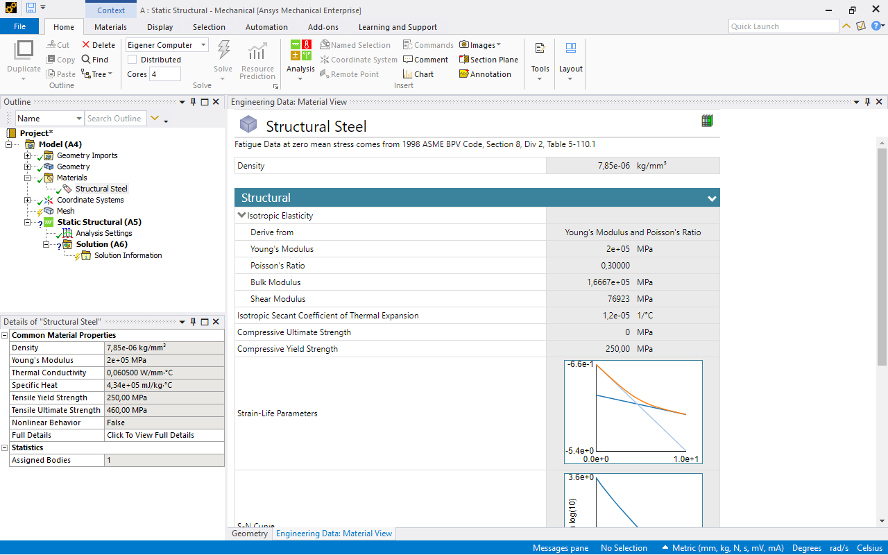
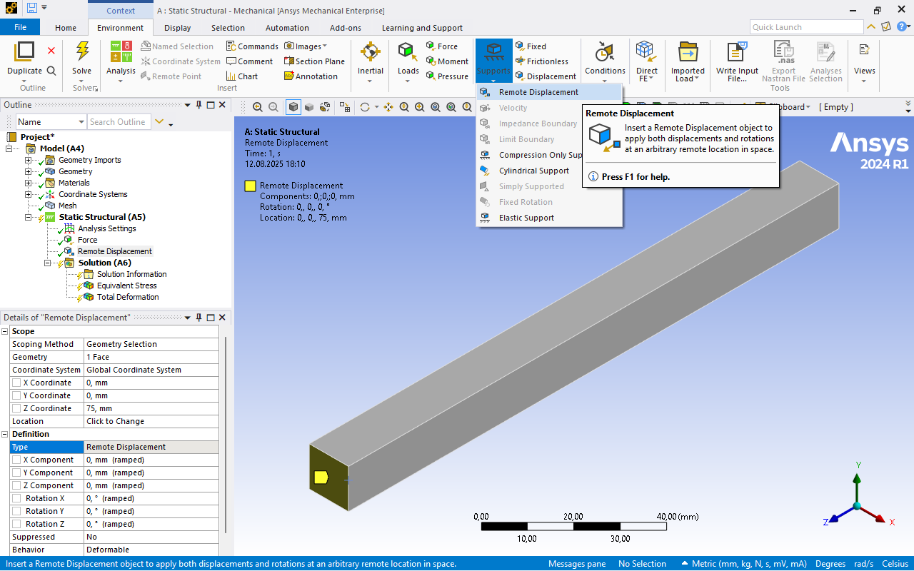

# Module 1 Cantilever Beam

## Learning objectives

* First use of ANSYS Workbench and ANSYS Mechanical.
* Understanding boundary conditions and load cases for a cantilever beam.
* Application of the von Mises stress to assess strength.
* Comparison of simulation results with analytical calculations.
* Understanding the influence of the type of support and the choice of boundary conditions.

---

## Task tensile load

For the cantilever beam with square cross-section shown in the figure, calculate the maximum stress and deformation using ANSYS Mechanical.  

* Length: \( L = 150 \,\text{mm} \)  
* Edge length: \( a = 12 \,\text{mm} \)  
* Force: \( F = 7{.}500 \,\text{N} \)  
* Material: Structural steel with yield strength \( R_e = 250 \,\text{N/mm}^2 \)  

Download the file [kragbalken.stp](media/03_kragbalken/kragbalken.stp) and import it into ANSYS Workbench.

Compare your result with the analytical solution and discuss any deviations.  

[{width=500px}](media/03_kragbalken/kragbalken_zug.svg "Cantilever beam, tensile load"){.glightbox}  

---

## Theoretical Background, tensile load

### Hooke’s Law

The calculation is based on **Hooke’s Law**. It describes the linear relationship between stress and strain in the elastic range of a material.

\[
\sigma = \frac{F}{A},  
\quad \varepsilon = \frac{\Delta l}{l},  
\quad E = \frac{\sigma}{\varepsilon}
\]

with  

* \( \sigma \): normal stress  
* \( F \): applied force  
* \( A = a^2 \): cross-sectional area of the beam  
* \( \varepsilon \): strain in the direction of loading  
* \( E \): modulus of elasticity (material constant)  

The **elongation** is calculated as:

\[
\Delta l = \frac{F \cdot l}{A \cdot E}
\]

### Lateral Contraction

In addition to the strain in the loading direction, a lateral contraction occurs. It is described by the **Poisson’s ratio** (\(\nu\)). It defines the ratio of transverse strain to longitudinal strain.

[{width=700}](media/03_kragbalken/querkontraktion.svg "lateral contraction"){.glightbox}  
Bildquelle nach [@Altenbach2016]

\[
\nu \;=\; - \frac{\varepsilon_q}{\varepsilon_l}
\]

with  

\[
\varepsilon_l = \frac{\Delta l}{l},  
\qquad
\varepsilon_q = \frac{\Delta a}{a}
\]

* \( \varepsilon_l \): longitudinal strain  
* \( \varepsilon_q \): transverse strain  
* \( \Delta l \): elongation  
* \( \Delta a \): change in cross-section (e.g. edge length for a square beam)  
* \( l, a \): original length and cross-section dimension  

Thus:

\[
\varepsilon_q = -\nu \cdot \varepsilon_l
\]

For steel, \(\nu \approx 0{,}3\).  
This means that with a longitudinal strain of 1 %, the cross-section shortens transversely by about 0.3 %.  

### Stress-Strain Diagram

Hooke’s Law applies only in the **linear elastic range** of a material. This range appears as a straight line in the stress-strain diagram.  

The first diagram shows the behavior of a material **without a distinct yield point**. After the linear increase up to the proof stress, the curve gradually transitions into the plastic range. This is typical for many non-ferrous metals such as aluminum:

[{width=450}](media/03_kragbalken/Spgs-Dehnungs-Kurve_Dehngrenze.en.svg "Stress-strain curve without distinct yield point"){.glightbox}  
Image source based on[@Wikipedia2023]

The second diagram shows the behavior of a material **with a distinct yield point**, as is typical for structural steel. The linear range ends abruptly, followed by a plateau with nearly constant stress, before the plastic increase begins:

[{width=450}](media/03_kragbalken/Spgs-Dehnungs-Kurve_Streckgrenze.en.svg "Stress-strain curve with distinct yield point"){.glightbox}  
Image source based on[@Wikipedia2023]

For the calculation of the cantilever beam in this exercise, the load lies within the **elastic range**. Hooke’s Law is therefore sufficient.

---

## Implementation in ANSYS Mechanical

### 1. Geometry Import

Load the file [kragbalken.stp](media/03_kragbalken/kragbalken.stp) into ANSYS Workbench.  

[{width=600px}](media/03_kragbalken/01_Kragbalken_Geometrieimport.en.png "Cantilever beam, geometry import"){.glightbox}  

The dimensions of the bounding box provide a quick indication of whether the imported geometry is in the correct units.

[{width=600px}](media/03_kragbalken/02_Kragbalken_Begrenzungsrahmen.en.png "Cantilever beam, bounding box"){.glightbox}  

### 2. Material Assignment  

By default, ANSYS assigns structural steel as the material. Before further use, the respective material properties should be verified to ensure suitability for the intended application.

View under _Geometry:_

[{width=600px}](media/03_kragbalken/03_Kragbalken_Materialdefinition.en.png "Cantilever beam, material definition"){.glightbox}  

View under _Materials:_

[{width=600px}](media/03_kragbalken/04_Kragbalken_Materialdefinition.en.png "Cantilever beam, material definition"){.glightbox}  

### 3. Meshing

For the calculation, the component is divided into finite elements connected by nodes. This process is called **meshing**.  

* First, use Mesh/Create to generate a **global automatic mesh**.  
  ANSYS assigns an element size that applies to the entire model.  
  The mesh is created quickly and uniformly but is often not optimal for local details.  

* In the second step, the **element size is varied** to investigate the **mesh sensitivity**.  
  The goal is to check whether the results (stress, deformation) remain stable when the mesh is refined.  
  Only when the results change minimally can the solution be considered reliable.  

From an FEM perspective:  

* Mesh too coarse → short computation time, but potentially inaccurate results.  
* Mesh too fine → high accuracy, but significantly longer computation time.  
* The optimal mesh provides **sufficiently accurate results** without generating an unnecessary number of elements.  

[{width=600px}](media/03_kragbalken/05_Kragbalken_Netzgenerierung.en.png "Cantilever beam, mesh definition"){.glightbox}  

### 4. Boundary Conditions

Considering the problem statement, two boundary conditions are obvious:

* **Fixed support** at the left end  
* **Tensile force** \( F \) at the right face  

The fixed support is modeled in ANSYS by blocking **all degrees of freedom** of the selected face. Concretely: translations in \(x\), \(y\), and \(z\) directions as well as rotations about all three axes are prevented. Physically, this represents the connection of the beam to a rigid environment.  

The tensile force is applied at the right face. In ANSYS this is done as a **total force**, distributed evenly over the entire face. This ensures the load is not applied at a point (which would cause a singularity) but is realistically distributed.  

From an FEM perspective:

* The fixed support creates a **displacement boundary condition**:  
  Nodes cannot move → reaction forces develop.
* The tensile force creates a **load condition**:  
  Nodes experience additional external forces → leading to stresses and deformations.  

Together, the combination of **displacement-controlled** and **force-controlled** conditions forms a **closed system of equations** for the FEM solver.  

[{width=600px}](media/03_kragbalken/06_Kragbalken_Randbedingungen.en.png "Cantilever beam, boundary conditions"){.glightbox}  

[{width=600px}](media/03_kragbalken/07_Kragbalken_Randbedingungen.en.png "Cantilever beam, boundary conditions"){.glightbox}  

???+ note "Modelling note"
    If the force is applied only to a small edge or a single node, unrealistically high local stresses (singularities) will occur. Therefore, always select a surface to distribute the load realistically.

### 5. Evaluation

Two results are examined in ANSYS:

* **Total deformation**  
* **von Mises stress**

The deformation shows the total displacement of the component. In ANSYS, it is usually displayed in an exaggerated form so that the shape change is clearly visible. It is important to note that this is a **scaling for visualization purposes** — the actual values can be found in the results tables.  

The von Mises stress is a reference value that combines the effects of all normal and shear stresses into a single “equivalent” stress:

\[
\sigma_\text{vM} = \sqrt{\frac{1}{2} \left[(\sigma_x-\sigma_y)^2 + (\sigma_y-\sigma_z)^2 + (\sigma_z-\sigma_x)^2 \right] + 3(\tau_{xy}^2+\tau_{yz}^2+\tau_{zx}^2)}
\]

This value is useful for comparing with allowable stresses. For this tensile beam in the elastic range, the von Mises stress should be close to the analytical normal stress.  

Steps in ANSYS:

1. Select **total deformation** → check magnitude and plausibility.  
2. Display **von Mises stress** → compare with analytical stress.  
3. . **Deformation result** with selection of a direction (here: global x-axis) → evaluation of lateral contraction.  

Selection via the context menu of _Solution_:  

[{width=600px}](media/03_kragbalken/08_Kragbalken_Auswertung.en.png "Cantilever beam, add solutions"){.glightbox}  

[{width=600px}](media/03_kragbalken/10_Kragbalken_Auswertung.en.png "Cantilever beam, add solutions"){.glightbox}  

Alternatively, by right-clicking on _Solution_ in the tree structure:  

[{width=600px}](media/03_kragbalken/10a_Kragbalken_Auswertung.en.png "Cantilever beam, add solutions"){.glightbox}  

Here with selection of the global x-axis to evaluate the cross-section change:  

[{width=600px}](media/03_kragbalken/10b_Kragbalken_Auswertung.en.png "Cantilever beam, add solutions"){.glightbox}  

---

## Discussion of Results, Tensile Load

### Comparison with Analytical Solution

Expectation: very good agreement of average stress and deformation.

**Results from ANSYS:**

The total deformation shows an elongation of the beam by 0.03895 mm.

[{width=600px}](media/03_kragbalken/09_Kragbalken_Auswertung.en.png "Cantilever beam, solutions"){.glightbox}  

The **maximum equivalent stress** (von Mises) is 57.528 MPa. It appears as a stress peak at the corners of the fixed surface (red area).

[{width=600px}](media/03_kragbalken/11_Kragbalken_Auswertung.en.png "Cantilever beam, solutions"){.glightbox}  

Using a _Probe_ taken slightly away from the fixed support, the equivalent stress (von Mises) is 52.082 MPa.

**Note:** The _Probe_ can be found in the _Result_ context menu. There, the minimum and maximum values of the respective result can also be displayed.  

[{width=600px}](media/03_kragbalken/12_Kragbalken_Auswertung.en.png "Cantilever beam, solutions"){.glightbox}  

The **deformation result** in the x-axis direction is 0.000472 mm.  

[{width=600px}](media/03_kragbalken/12a_Kragbalken_Auswertung.en.png "Cantilever beam, solutions"){.glightbox}  

The following box contains the analytical solution. First, carry out the calculation yourself and use the [theory presented above](#theoretical-background-tensile-load).

??? note "Calculation of Δl, Δa and σ"
    For the analytical solution, the elongation Δl, the cross-section change Δa, and the normal stress σ are calculated.

    **Stress**

    \[
    \sigma = \frac{F}{A}
    \]

    With the given values:

    \[
    F = 7{.}500 \,\text{N}, \quad A = 144 \,\text{mm}^2
    \]

    \[
    \sigma = \frac{7{.}500 \,\text{N}}{144 \,\text{mm}^2} \approx 52{,}1 \,\text{N/mm}^2
    \]

    **Elongation**

    \[
    \Delta l = \frac{F \cdot l}{A \cdot E}
    \]

    Using the given values:

    \[
    l = 150 \,\text{mm}, \quad E = 210{.}000 \,\text{N/mm}^2
    \]

    \[
    \Delta l = \frac{7{.}500 \,\text{N}\cdot 150 \,\text{mm}}{144 \,\text{mm}^2\cdot 210{.}000 \,\text{N/mm}^2} 
             \approx 0{,}037 \,\text{mm}
    \]

    **Cross-section Change**

    Using the Poisson’s ratio \(\nu = 0{,}3\):

    \[
    \varepsilon_q = - \nu \cdot \varepsilon_l
    \]

    with  

    \[
    \varepsilon_l = \frac{\Delta l}{l} = \frac{0{,}037 \,\text{mm}}{150 \,\text{mm}} \approx 2{,}47 \cdot 10^{-4}
    \]

    \[
    \varepsilon_q = -0{,}3 \cdot 2{,}47 \cdot 10^{-4}
                  \approx -7{,}4 \cdot 10^{-5}
    \]

    Thus, the cross-section change is:

    \[
    \Delta a = \varepsilon_q \cdot a = -7{,}4 \cdot 10^{-5} \cdot 12 \,\text{mm}
            \approx -8{,}9 \cdot 10^{-4} \,\text{mm}
    \]

    **Result:**  
    * Normal stress: approx. **52 N/mm²**  
    * Beam elongation: approx. **0.037 mm**  
    * Reduction of edge length: approx. **0.0009 mm**

The following table shows the analytical results, the FEM results, and the resulting percentage deviations. The percentage deviation is calculated as:

\[
\text{Deviation} = \frac{\text{FEM} - \text{Analytical}}{\text{Analytical}} \times 100
\]

| Quantity (Symbol)                     | Analytical Result  | FEM Result                       | Deviation [%] |
|----------------------------------------|--------------------|-----------------------------------|---------------|
| max. stress ($\sigma_\mathrm{max}$)    | 52.1 N/mm²          | 57.53 N/mm²                   | 10.4 %        |
| stress (σ) sample                      | 52.1 N/mm²          | 52.08 N/mm²                       | −0.04 %       |
| beam elongation (Δl)                   | 0.037 mm            | 0.039 mm                          | 5.41 %        |
| edge length reduction (Δa)             | 0.00089 mm          | 0.000944 mm (2 × 0.000472 mm)     | 6.07 %        |

The results are generally in good agreement with the analytical solution. More noticeable deviations occur only for the maximum equivalent stress, caused by local stress peaks (singularities) at the corners of the fixed support.  

For such a simple problem, deviations of 5–6% are relatively high, and a nearly exact match would be expected. The observed difference is primarily due to stress peaks at the corner and should be further investigated.

Possible initial measures for improvement:  

* Analysis of the influence of **meshing**  
* Analysis of the influence of the **fixed support**

### Mesh Influence

As a general rule:

* Coarse mesh → less accurate.  
* Fine mesh → more accurate but longer time.  
* Aim: results independent of mesh (mesh influence minimized).  

As introduced in [Basics of Meshing](02_installation_erste_schritte.en.md/#basics-of-meshing), manually specifying the global element size is the simplest way to refine the mesh.

Result near the fixed support with a global element size of **5 mm**

[{width=600px}](media/03_kragbalken/14_Kragbalken_Auswertung.en.png "Cantilever beam, solutions"){.glightbox}  

Result near the fixed support with a global element size of **1 mm**

[{width=600px}](media/03_kragbalken/15_Kragbalken_Auswertung.en.png "Cantilever beam, solutions"){.glightbox}  

Result near the fixed support with a global element size of **0.5 mm**

[{width=600px}](media/03_kragbalken/16_Kragbalken_Auswertung.en.png "Cantilever beam, solutions"){.glightbox}  

Considering the maximum equivalent stress, there is a clear increase from one refinement step to the next. This may indicate **divergence**, meaning that the calculated value does not converge to a fixed limit as the mesh is refined, but instead continues to increase (cf. [singularities caused by applying a load to a point or an edge](03_kragbalken.en.md#4-boundary-conditions)).

<!-- markdownlint-disable MD033 -->

</extra>"
         },
         {
           "x": ["Standard mesh","5 mm","1 mm","0.5 mm"],
           "y": [621,1720,97981,736825],
           "name": "Number of nodes",
           "type": "scatter",
           "mode": "lines+markers",
           "yaxis": "y2",
           "text": ["621","1 720","97 981","736 825"],
           "hovertemplate": "%{text}<extra></extra>"
         },
         {
           "x": ["Standard mesh","5 mm","1 mm","0.5 mm"],
           "y": [80,270,21600,172800],
           "name": "Number of elements",
           "type": "scatter",
           "mode": "lines+markers",
           "yaxis": "y2",
           "text": ["80","270","21 600","172 800"],
           "hovertemplate": "%{text}<extra></extra>"
         }
       ],
       "layout": {
         "title": "Mesh size vs. maximum stress, number of nodes and elements",
         "xaxis": {"title": "Mesh size"},
         "yaxis": {"title": "Max. stress (MPa)"},
         "yaxis2": {"title": "Nodes / Elements", "overlaying": "y", "side": "right"},
         "legend": {"x": 0.01, "y": 0.99},
         "hovermode": "x unified",
         "hoverlabel": {
           "bgcolor": "rgba(255,255,255,0.95)",
           "bordercolor": "rgba(0,0,0,0.2)",
           "font": {"color": "black"}
         }
       }
     }'>

<!-- markdownlint-enable MD033 -->

??? note "Mesh refinement results as a table"
    | Mesh size     | Max. stress  | Number of nodes | Number of elements |
    |---------------|--------------|-----------------|--------------------|
    | Standard mesh | 57.528 MPa   | 621             | 80                 |
    | 5 mm          | 61.47 MPa    | 1,720           | 270                |
    | 1 mm          | 105.38 MPa   | 97,981          | 21,600             |
    | 0.5 mm        | 136.92 MPa   | 736,825         | 172,800            |

### Influence of the support

In reality, the beam can contract laterally.  
In the FEM model with fixed support, this **lateral contraction is locally prevented**.  
This leads to **edge stress peaks** not predicted analytically.  
→ Explains deviations near the support.

An _external displacement_ offers more configuration options since individual **translational and rotational degrees of freedom** can be selectively released or constrained, and **Poisson’s effect** can either be allowed or suppressed. The latter is controlled via the setting _Behavior: Deformable_.

[{width=600px}](media/03_kragbalken/17_Kragbalken_Auswertung.en.png "External displacement"){.glightbox}

With a _deformable external displacement_ as boundary condition, the **total deformation** is 0.0391 mm.

[{width=600px}](media/03_kragbalken/18_Kragbalken_Auswertung.en.png "Total deformation with external displacement"){.glightbox}

!!! danger "FIXME"
    Screenshot missing – 18_Kragbalken_Auswertung.en.png

The **von Mises stress** shows the expected constant distribution across the entire component. There are no longer any stress peaks in the fixed region; Poisson’s effect is enabled. The von Mises stress is 52.083 MPa.  

[{width=600px}](media/03_kragbalken/20_Kragbalken_Auswertung.en.png "von Mises stress with external displacement"){.glightbox}

The **deformation result** in the x-direction is 0.000469 mm.

[{width=600px}](media/03_kragbalken/19_Kragbalken_Auswertung.en.png "Deformation in x-direction with external displacement"){.glightbox}

!!! danger "FIXME"
    Screenshot missing – 19_Kragbalken_Auswertung.en.png

---

## Task bending

Implement the following model for the cantilever beam and compute the maximum stress and the maximum deflection. Also use the geometry from [kragbalken.stp](media/03_kragbalken/kragbalken.stp).

* Length: \( L = 150 \,\text{mm} \)  
* Edge length: \( a = 12 \,\text{mm} \)  
* Force: \( F_B = 750 \,\text{N} \)  
* Material: structural steel with yield strength \( R_e = 250 \,\text{N/mm}^2 \)

Address the following topics:

* Comparison with the analytical solution (maximum stress and deflection)  
* Identification of the location of maximum stress (numerically and analytically)  
* Display of tensile and compressive stresses in ANSYS  

[{width=500px}](media/03_kragbalken/kragbalken_biegung.svg "Cantilever beam, bending"){.glightbox}

---

## Theoretical Background, Bending

In bending, a force acting perpendicular to the beam axis generates a moment that causes tensile and compressive stresses in the outer fibers. The neutral axis remains free of stress. For small deflections and linear material behavior, the Bernoulli hypothesis applies, stating that cross sections remain plane and only rotate.

The **maximum bending moment** of a cantilever beam with an applied force \(F_B\) and length \(l\) is given by

\[
M_B = F_B \cdot l
\]

The **section modulus** \(W_b\) describes the geometry-dependent stiffness of the cross section. For a square cross section with side length \(a\), it is

\[
W_b = \frac{a^3}{6}
\]

Table of additional section moduli and second moments of area:

[{width=250px}](media/03_kragbalken/29_Flächenmomente_Dubbel.png "Second moments of area and section moduli"){.glightbox}
Image source[@Dubbel2020]

The **maximum normal stress due to bending** is

\[
\sigma_\text{max} = \frac{M_B}{W_b} = \frac{6\,F_B\,l}{a^3}
\]

It occurs in the outermost fibers of the cross section – tensile stress on one side and compressive stress on the opposite side. The normal stress in the neutral axis is zero.

The **maximum deflection** at the free end is

\[
f = \frac{F_B\,l^3}{3\,E\,I} = \frac{4\,F_B\,l^3}{E\,a^4}
\]

Table of additional deflection curves. The relevant load case here is case 6.

[{width=250px}](media/03_kragbalken/28_Biegelinie_Dubbel.png "Deflection curves of beams with constant cross section"){.glightbox}
Image source[@Dubbel2020]

The resulting stresses are distributed linearly over the cross section: one side is under tension, the other under compression. In contrast to the tensile test, bending produces a **non-uniform stress distribution**

## Implementation in ANSYS

**Requirements**  
Geometry import, material assignment, and mesh generation are identical to the tensile loading task. See:

* [Geometry import](#1-geometry-import)
* [Material assignment](#2-material-assignment)
* [Mesh generation](#3-meshing)

### Load case and boundary conditions

Based on the previous results, the following boundary conditions are appropriate here:

* **External displacement** on the left end face  
* **Force (bending)** on the right end face  

The direction of the force is perpendicular to the beam axis, with magnitude \(F_B\) according to the task definition. The direction can either be defined via **Define by vector**, by selecting an appropriate edge to specify the direction (note the arrow orientation), or via **Define by components**, where the magnitude is entered directly in global coordinates.  

[{width=800px}](media/03_kragbalken/22_kragbalken_biegung_randbedingungen.en.png "Cantilever bending – force"){.glightbox}  

!!! danger "FIXME"
    Screenshot missing – 22_kragbalken_biegung_randbedingungen.en.png

The boundary conditions are thus as follows:  

[{width=800px}](media/03_kragbalken/21_kragbalken_biegung.en.png "Cantilever bending – boundary conditions"){.glightbox}  

!!! danger "FIXME"
    Screenshot missing – 21_kragbalken_biegung.en.png

### Evaluation

As described [above](#5-evaluation), the following two results are first examined:

* **Deformation (total deformation)**
* **von Mises stress**

To evaluate the **normal stress**, it can be added under _Solution_ via the context menu by selecting normal stress in the beam’s longitudinal direction. Pay attention to the _orientation_ of the coordinate axis. A linear stress distribution across the cross section with tension and compression sides is expected.

[{width=800px}](media/03_kragbalken/25_Kragbalken_Biegung_Auswertung.en.png "Cantilever bending – normal stress"){.glightbox}  

!!! danger "FIXME"
    Screenshot missing – 25_Kragbalken_Biegung_Auswertung.en.png

## Discussion of the results, bending

### Comparison with analytical solution

The total deformation shows a maximum **deflection** of the beam of 2.5143 mm.

[{width=800px}](media/03_kragbalken/23_Kragbalken_Biegung_Auswertung.en.png "Cantilever bending – maximum deflection"){.glightbox}  

!!! danger "FIXME"
    Screenshot missing – 23_Kragbalken_Biegung_Auswertung.en.png

The **maximum von Mises stress** is 479.71 MPa and appears as a stress peak at the corners of the fixed face (red region).  

[{width=800px}](media/03_kragbalken/24_Kragbalken_Biegung_Auswertung.en.png "Cantilever bending – maximum von Mises stress"){.glightbox}  

!!! danger "FIXME"
    Screenshot missing – 24_Kragbalken_Biegung_Auswertung.en.png

The **maximum normal stress** according to the figure above is 437.36 MPa.  

When evaluating the results, note that a _probe_ of the stress field is not meaningful here. The maximum stress occurs in a very small region near the fixed end and is highly localized.

The following box contains the analytical solution. Perform the calculation yourself first, using the [bending theory](#theoretical-background-bending) presented above.

**Note:** Shear stress due to shear force is neglected here.

??? note "Calculation of \(\sigma_\text{max}\) and \(f\)"
    For the analytical solution, the maximum normal stress \(\sigma_\text{max}\) and the deflection \(f\) of the cantilever beam are determined.

    **Given:**
    
    \[
    F_B = 750 \,\text{N}, \quad l = 150 \,\text{mm}, \quad a = 12 \,\text{mm}, \quad E = 210000 \,\text{N/mm}^2
    \]

    **Bending moment**
    
    \[
    M_B = F_B \cdot l = 750 \,\text{N} \cdot 150 \,\text{mm} = 112500 \,\text{Nmm}
    \]

    **Section modulus (square cross section)**
    
    \[
    W_b = \frac{a^3}{6} = \frac{12^3 \,\text{mm}^3}{6} = 288 \,\text{mm}^3
    \]

    **Maximum normal stress**
    
    \[
    \sigma_\text{max} = \frac{M_B}{W_b} = \frac{112500 \,\text{Nmm}}{288 \,\text{mm}^3}
                     = 390.6 \,\text{N/mm}^2
    \]

    **Deflection at the free end**
    
    \[
    I = \frac{a^4}{12} = \frac{12^4 \,\text{mm}^4}{12} = 1728 \,\text{mm}^4
    \]

    \[
    f = \frac{F_B \cdot l^3}{3 \cdot E \cdot I}
      = \frac{750 \,\text{N} \cdot (150 \,\text{mm})^3}{3 \cdot 210000 \,\text{N/mm}^2 \cdot 1728 \,\text{mm}^4}
      \approx 2.33 \,\text{mm}
    \]

    **Notes:**  
    \(\sigma_\text{max}\) occurs in the outermost fibers at the clamped end (tension on one side, compression on the opposite).  
    The deflection \(f\) is maximum at the free end.

The following table shows the analytical results, the FEM results, and the resulting percentage deviations. The percentage deviation is calculated as:

\[
\text{Deviation} = \frac{\text{FEM} - \text{Analytical}}{\text{Analytical}} \times 100
\]

| Quantity (symbol)                     | Analytical solution | FEM result | Deviation [%] |
|--------------------------------------|----------------------|-------------|----------------|
| Max. normal stress ($\sigma_\mathrm{max}$) | 390.6 N/mm²          | 437.36 N/mm² | 11.97 %        |
| Max. deflection (f)                  | 2.33 mm              | 2.5143 mm   | 7.91 %         |

### Mesh influence

The influence of the meshing on the result is examined again here. The starting point is the standard mesh, which is successively refined in several steps.

<!-- markdownlint-disable MD033 -->

Max. stress: %{y:.2f} MPa"
    },
    {
      "x": ["Standard mesh", "5 mm", "2 mm", "1 mm", "0.5 mm"],
      "y": [621, 1720, 13873, 97981, 736825],
      "type": "scatter",
      "mode": "lines+markers",
      "name": "Number of nodes",
      "yaxis": "y2",
      "hovertemplate": "Mesh size: %{x} Nodes: %{y:,d}"
    },
    {
      "x": ["Standard mesh", "5 mm", "2 mm", "1 mm", "0.5 mm"],
      "y": [80, 270, 2700, 21600, 172800],
      "type": "scatter",
      "mode": "lines+markers",
      "name": "Number of elements",
      "yaxis": "y2",
      "hovertemplate": "Mesh size: %{x} Elements: %{y:,d}"
    }
  ],
  "layout": {
    "title": {"text": "Mesh size vs. maximum stress, nodes and elements", "x": 0.5},
    "xaxis": {"title": "Mesh size"},
    "yaxis": {
      "title": "Max. stress (MPa)",
      "type": "linear"
    },
    "yaxis2": {
      "title": "Nodes / Elements",
      "overlaying": "y",
      "side": "right",
      "type": "linear",
      "tickformat": ",d"
    },
    "hovermode": "x unified",
    "hoverlabel": {"bgcolor": "white", "font": {"color": "black"}, "bordercolor": "rgba(0,0,0,0)"},
    "margin": {"l": 80, "r": 80, "t": 80, "b": 80},
    "legend": {"x": 0.02, "y": 0.98}
  }
}'>

<!-- markdownlint-enable MD033 -->

??? note "Mesh refinement results as table"
    | Mesh size     | Max. normal stress | Number of nodes | Number of elements |
    |---------------|--------------------|-----------------|--------------------|
    | Standard mesh | 437.36 MPa         | 621             | 80                 |
    | 5 mm          | 406.62 MPa         | 1,720           | 270                |
    | 2 mm          | 400.01 MPa         | 13,873          | 2,700              |
    | 1 mm          | 394.11 MPa         | 97,981          | 21,600             |
    | 0.5 mm        | 391.22 MPa         | 736,825         | 172,800            |

The following trend becomes evident from this mesh study: the maximum normal stress decreases with increasing mesh refinement and approaches the value obtained from the analytical solution. In contrast, the computation time increases significantly.

## Add-on: Bending Moment Instead of Force

!!! note "Note"
    Alternatively, instead of a force, a pure _bending moment_ can be applied to the free end face.  
    This eliminates shear forces and results in a more uniform stress field. However, both variants show the same characteristic linear stress distribution across the cross section.

As an alternative, a pure **bending moment** can be applied.  
This results in a beam **free of shear forces** with a more uniform stress field.

* Implementation: Load type _Moment_ applied to the end face.  
* Observation: Uniform distribution, no singularity caused by force introduction.  

[{width=800px}](media/03_kragbalken/30_Krakbalken_Biegung_Auswertung.en.png "Cantilever bending – bending moment"){.glightbox}  

!!! danger "FIXME"
    Screenshot missing – 30_Krakbalken_Biegung_Auswertung.en.png

---

## Further Notes

### Variants of Load Application

In ANSYS Mechanical, various options are available for applying loads. The choice strongly influences the stress distribution and physical plausibility.

* **Force on surface**  
  Recommended for this cantilever beam:  
  A total force evenly distributed over a face.  
  → Prevents unrealistic high stresses from point loading.  

* **Edge load**  
  Force along an edge.  
  Used when real application is along a weld seam or support edge.  
  → Note: higher stress gradients, mesh quality critical.  

* **Point load**  
  Force at a single node.  
  → Usually to be avoided, as it leads to singularities.  
  Only for special theoretical models.  

* **Moment**  
  Load type “Moment” on face or edge.  
  → Suitable for applying a constant bending moment without shear.  

* **Vectors and direction selection**  
  In ANSYS the direction of force can be chosen:  
    * global coordinate system (x, y, z)  
    * local coordinate system (part orientation)  
    * user-defined vector input  
  → Ensures the force acts in the intended direction.  

These options illustrate that the “same” load can yield very different results depending on how it is applied. Choosing the correct method is a key part of FEM modeling.

### Videos

???+ danger "FIXME"
    Add video?

## Self-assessment quiz

<!-- markdownlint-disable MD033 -->

<?quiz?>
question: Why should a force in an FEM model not be applied only to an edge or a single node?
answer: To make the calculation run faster.
answer-correct: Because otherwise unrealistically high local stresses (singularities) occur.
answer: To reduce the von Mises stress.
content:
<strong>Note:</strong> Always apply loads to surfaces to obtain realistic results.
<?/quiz?>

<?quiz?>
question: Why is deformation in ANSYS often shown exaggerated?
answer-correct: To make the shape change visually more apparent.
answer: Because the mesh is too coarse.
answer: To increase the stresses.
content:
<em>Tip:</em> The scale factor is only for visualization; the numerical values are shown in the results tables.
<?/quiz?>

<?quiz?>
question: What is the unit of the von Mises stress?
answer: Newton
answer-correct: Pascal (N/m²)
answer: Meter per second
content:
<em>Tip:</em> It is a unit of stress.
<?/quiz?>

<?quiz?>
question: How can divergence in an FEM result be recognized?
answer: When the deformation decreases.
answer: When the stresses remain constant.
answer-correct: When the stresses keep increasing with further mesh refinement.
content:
<em>Tip:</em> Divergent behavior often indicates geometric or load-related singularities.
<?/quiz?>

<?quiz?>
question: Why is the analytical solution important for the bending of a cantilever beam?
answer-correct: It serves as a reference for verifying the FEM results.
answer: It completely replaces the simulation.
answer: It shows only qualitative trends.
content:
<strong>Note:</strong> Analytical comparisons help identify modeling errors and deviations in FEM results.
<?/quiz?>

<?quiz?>
question: Why does a fixed constraint not allow Poisson’s effect?
answer: Because the material becomes completely rigid.
answer-correct: Because all degrees of freedom are fixed, including lateral deformations.
answer: Because the load no longer acts.
content:
<strong>Note:</strong> With a fixed constraint, all displacements—including lateral ones—are locked, so Poisson’s effect cannot occur.
<?/quiz?>

<?quiz?>
question: What can be set instead if Poisson’s effect should be allowed?
answer: Nothing, it always remains fixed.
answer-correct: The lateral displacement degree of freedom can be released (external displacement).
answer: The material can be changed to viscous.
content:
<em>Tip:</em> If Poisson’s effect is desired, the lateral displacement at the constraint must not be fixed.
<?/quiz?>

<!-- markdownlint-enable MD033 -->
