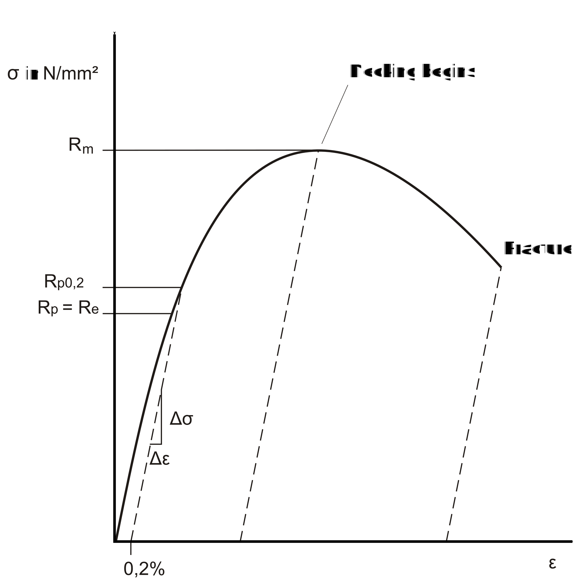
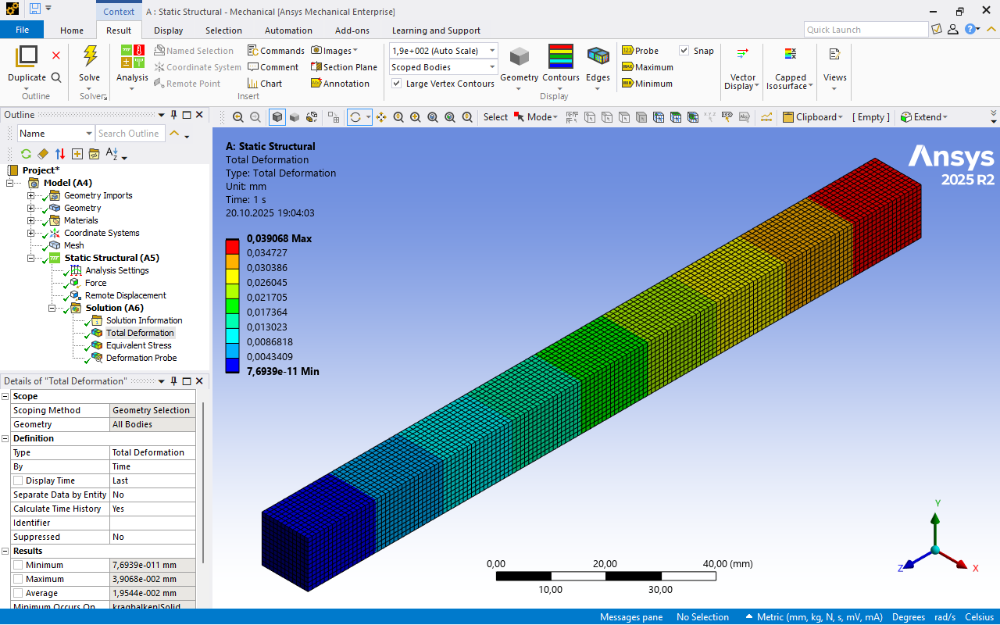

# Beam Exercise

## Learning objectives

* First use of ANSYS Workbench and ANSYS Mechanical.
* Understanding boundary conditions and load cases for a cantilever beam.
* Application of the von Mises stress to assess strength.
* Comparison of simulation results with analytical calculations.
* Understanding the influence of the type of support and the choice of boundary conditions.

## Theoretical Background

### Hooke’s Law

The calculation is based on **Hooke’s Law**. It describes the linear relationship between stress and strain in the elastic range of a material.

\[
\sigma = \frac{F}{A},  
\quad \varepsilon = \frac{\Delta l}{l},  
\quad E = \frac{\sigma}{\varepsilon}
\]

with  

* \( \sigma \): normal stress  
* \( F \): applied force  
* \( A = a^2 \): cross-sectional area of the beam  
* \( \varepsilon \): strain in the direction of loading  
* \( E \): modulus of elasticity (material constant)  

The **elongation** is calculated as:

\[
\Delta l = \frac{F \cdot l}{A \cdot E}
\]

### Lateral Contraction

In addition to the strain in the loading direction, a lateral contraction occurs. It is described by the **Poisson’s ratio** (\(\nu\)). It defines the ratio of transverse strain to longitudinal strain.

[{width=700}](media/03_kragbalken/querkontraktion.svg "lateral contraction"){.glightbox}  
Bildquelle nach [@Altenbach2016]

\[
\nu \;=\; - \frac{\varepsilon_q}{\varepsilon_l}
\]

with  

\[
\varepsilon_l = \frac{\Delta l}{l},  
\qquad
\varepsilon_q = \frac{\Delta a}{a}
\]

* \( \varepsilon_l \): longitudinal strain  
* \( \varepsilon_q \): transverse strain  
* \( \Delta l \): elongation  
* \( \Delta a \): change in cross-section (e.g. edge length for a square beam)  
* \( l, a \): original length and cross-section dimension  

Thus:

\[
\varepsilon_q = -\nu \cdot \varepsilon_l
\]

For steel, \(\nu \approx 0{,}3\).  
This means that with a longitudinal strain of 1 %, the cross-section shortens transversely by about 0.3 %.  

### Stress-Strain Diagram

Hooke’s Law applies only in the **linear elastic range** of a material. This range appears as a straight line in the stress-strain diagram.  

The first diagram shows the behavior of a material **without a distinct yield point**. After the linear increase up to the proof stress, the curve gradually transitions into the plastic range. This is typical for many non-ferrous metals such as aluminum:

[{width=450}](media/03_kragbalken/Spgs-Dehnungs-Kurve_Dehngrenze.en.svg "Stress-strain curve without distinct yield point"){.glightbox}  
Image source based on[@Wikipedia2023]

The second diagram shows the behavior of a material **with a distinct yield point**, as is typical for structural steel. The linear range ends abruptly, followed by a plateau with nearly constant stress, before the plastic increase begins:

[{width=450}](media/03_kragbalken/Spgs-Dehnungs-Kurve_Streckgrenze.en.svg "Stress-strain curve with distinct yield point"){.glightbox}  
Image source based on[@Wikipedia2023]

For the calculation of the cantilever beam in this exercise, the load lies within the **elastic range**. Hooke’s Law is therefore sufficient.

---

## Task tensile load

For the cantilever beam with square cross-section shown in the figure, calculate the maximum stress and deformation using ANSYS Mechanical.  

* Length: \( L = 150 \,\text{mm} \)  
* Edge length: \( a = 12 \,\text{mm} \)  
* Force: \( F = 7{.}500 \,\text{N} \)  
* Material: Structural steel with yield strength \( R_e = 250 \,\text{N/mm}^2 \)  

Download the file [kragbalken.stp](media/03_kragbalken/kragbalken.stp) and import it into ANSYS Workbench.

Compare your result with the analytical solution and discuss any deviations.  

[{width=500px}](media/03_kragbalken/kragbalken_zug.svg "Cantilever beam, tensile load"){.glightbox}  

---

## Implementation in ANSYS Mechanical

### 1. Geometry Import

Load the file [kragbalken.stp](media/03_kragbalken/kragbalken.stp) into ANSYS Workbench.  

[{width=600px}](media/03_kragbalken/01_Kragbalken_Geometrieimport.en.png "Cantilever beam, geometry import"){.glightbox}  

The dimensions of the bounding box provide a quick indication of whether the imported geometry is in the correct units.

[{width=600px}](media/03_kragbalken/02_Kragbalken_Begrenzungsrahmen.en.png "Cantilever beam, bounding box"){.glightbox}  

### 2. Material Assignment  

By default, ANSYS assigns structural steel as the material. Before further use, the respective material properties should be verified to ensure suitability for the intended application.

View under _Geometry:_

[{width=600px}](media/03_kragbalken/03_Kragbalken_Materialdefinition.en.png "Cantilever beam, material definition"){.glightbox}  

View under _Materials:_

[{width=600px}](media/03_kragbalken/04_Kragbalken_Materialdefinition.en.png "Cantilever beam, material definition"){.glightbox}  

### 3. Meshing

For the calculation, the component is divided into finite elements connected by nodes. This process is called **meshing**.  

* First, use Mesh/Create to generate a **global automatic mesh**.  
  ANSYS assigns an element size that applies to the entire model.  
  The mesh is created quickly and uniformly but is often not optimal for local details.  

* In the second step, the **element size is varied** to investigate the **mesh sensitivity**.  
  The goal is to check whether the results (stress, deformation) remain stable when the mesh is refined.  
  Only when the results change minimally can the solution be considered reliable.  

From an FEM perspective:  

* Mesh too coarse → short computation time, but potentially inaccurate results.  
* Mesh too fine → high accuracy, but significantly longer computation time.  
* The optimal mesh provides **sufficiently accurate results** without generating an unnecessary number of elements.  

[{width=600px}](media/03_kragbalken/05_Kragbalken_Netzgenerierung.en.png "Cantilever beam, mesh definition"){.glightbox}  

### 4. Boundary Conditions

Considering the problem statement, two boundary conditions are obvious:

* **Fixed support** at the left end  
* **Tensile force** \( F \) at the right face  

The fixed support is modeled in ANSYS by blocking **all degrees of freedom** of the selected face. Concretely: translations in \(x\), \(y\), and \(z\) directions as well as rotations about all three axes are prevented. Physically, this represents the connection of the beam to a rigid environment.  

The tensile force is applied at the right face. In ANSYS this is done as a **total force**, distributed evenly over the entire face. This ensures the load is not applied at a point (which would cause a singularity) but is realistically distributed.  

From an FEM perspective:

* The fixed support creates a **displacement boundary condition**:  
  Nodes cannot move → reaction forces develop.
* The tensile force creates a **load condition**:  
  Nodes experience additional external forces → leading to stresses and deformations.  

Together, the combination of **displacement-controlled** and **force-controlled** conditions forms a **closed system of equations** for the FEM solver.  

[{width=600px}](media/03_kragbalken/06_Kragbalken_Randbedingungen.en.png "Cantilever beam, boundary conditions"){.glightbox}  

[{width=600px}](media/03_kragbalken/07_Kragbalken_Randbedingungen.en.png "Cantilever beam, boundary conditions"){.glightbox}  

???+ note "Modelling note"
    If the force is applied only to a small edge or a single node, unrealistically high local stresses (singularities) will occur. Therefore, always select a surface to distribute the load realistically.

### 5. Evaluation

Two results are examined in ANSYS:

* **Total deformation**  
* **von Mises stress**

The deformation shows the total displacement of the component. In ANSYS, it is usually displayed in an exaggerated form so that the shape change is clearly visible. It is important to note that this is a **scaling for visualization purposes** — the actual values can be found in the results tables.  

The von Mises stress is a reference value that combines the effects of all normal and shear stresses into a single “equivalent” stress:

\[
\sigma_\text{vM} = \sqrt{\frac{1}{2} \left[(\sigma_x-\sigma_y)^2 + (\sigma_y-\sigma_z)^2 + (\sigma_z-\sigma_x)^2 \right] + 3(\tau_{xy}^2+\tau_{yz}^2+\tau_{zx}^2)}
\]

This value is useful for comparing with allowable stresses. For this tensile beam in the elastic range, the von Mises stress should be close to the analytical normal stress.  

Steps in ANSYS:

1. Select **total deformation** → check magnitude and plausibility.  
2. Display **von Mises stress** → compare with analytical stress.  
3. Assess the **stress distribution**.  

[{width=600px}](media/03_kragbalken/08_Kragbalken_Auswertung.en.png "Cantilever beam, add solutions"){.glightbox}  

[{width=600px}](media/03_kragbalken/10_Kragbalken_Auswertung.en.png "Cantilever beam, add solutions"){.glightbox}  

---

## Discussion of Results

### Comparison with Analytical Solution

Expectation: very good agreement of average stress and deformation.

???+ danger "FIXME"
    Describe images

Results from ANSYS:

[{width=600px}](media/03_kragbalken/09_Kragbalken_Auswertung.en.png "Cantilever beam, solutions"){.glightbox}  

[{width=600px}](media/03_kragbalken/11_Kragbalken_Auswertung.en.png "Cantilever beam, solutions"){.glightbox}  

[{width=600px}](media/03_kragbalken/12_Kragbalken_Auswertung.en.png "Cantilever beam, solutions"){.glightbox}  

[{width=600px}](media/03_kragbalken/13_Kragbalken_Auswertung.en.png "Cantilever beam, solutions"){.glightbox}  

[{width=600px}](media/03_kragbalken/14_Kragbalken_Auswertung.en.png "Cantilever beam, solutions"){.glightbox}  

??? note "Calculation of Δl, Δa and σ"
    For the analytical solution, the elongation Δl, the cross-section change Δa, and the normal stress σ are calculated.

    **Stress**

    \[
    \sigma = \frac{F}{A}
    \]

    With the given values:

    \[
    F = 7{.}500 \,\text{N}, \quad A = 144 \,\text{mm}^2
    \]

    \[
    \sigma = \frac{7{.}500 \,\text{N}}{144 \,\text{mm}^2} \approx 52{,}1 \,\text{N/mm}^2
    \]

    **Elongation**

    \[
    \Delta l = \frac{F \cdot l}{A \cdot E}
    \]

    Using the given values:

    \[
    l = 150 \,\text{mm}, \quad E = 210{.}000 \,\text{N/mm}^2
    \]

    \[
    \Delta l = \frac{7{.}500 \,\text{N}\cdot 150 \,\text{mm}}{144 \,\text{mm}^2\cdot 210{.}000 \,\text{N/mm}^2} 
             \approx 0{,}037 \,\text{mm}
    \]

    **Cross-section Change**

    Using the Poisson’s ratio \(\nu = 0{,}3\):

    \[
    \varepsilon_q = - \nu \cdot \varepsilon_l
    \]

    with  

    \[
    \varepsilon_l = \frac{\Delta l}{l} = \frac{0{,}037 \,\text{mm}}{150 \,\text{mm}} \approx 2{,}47 \cdot 10^{-4}
    \]

    \[
    \varepsilon_q = -0{,}3 \cdot 2{,}47 \cdot 10^{-4}
                  \approx -7{,}4 \cdot 10^{-5}
    \]

    Thus, the cross-section change is:

    \[
    \Delta a = \varepsilon_q \cdot a = -7{,}4 \cdot 10^{-5} \cdot 12 \,\text{mm}
            \approx -8{,}9 \cdot 10^{-4} \,\text{mm}
    \]

    **Result:**  
    * Normal stress: approx. **52 N/mm²**  
    * Beam elongation: approx. **0.037 mm**  
    * Reduction of edge length: approx. **0.0009 mm**

???+ danger "FIXME"
    A result for the reduction of the edge length is still missing

| Quantity                              | Analytical solution | FEM result     |
|---------------------------------------|---------------------|----------------|
| Normal stress $\sigma_\mathrm{max}$   | 52.1 N/mm²          | 52.53 N/mm²    |
| Normal stress $\sigma$ (sample)       | –                   | 52.08 N/mm²    |
| Beam elongation (Δl)            | 0.037 mm            | 0.039 mm       |
| Edge length reduction (Δa)      | 0.0009 mm           |                |

### Mesh Influence

* Coarse mesh → less accurate.  
* Fine mesh → more accurate but longer time.  
* Aim: results independent of mesh (mesh influence minimized).  

[{width=600px}](media/03_kragbalken/15_Kragbalken_Auswertung.en.png "Cantilever beam, solutions"){.glightbox}  

[{width=600px}](media/03_kragbalken/16_Kragbalken_Auswertung.en.png "Cantilever beam, solutions"){.glightbox}  

### Prevented Lateral Contraction

In reality, the beam can contract laterally.  
In the FEM model with fixed support, this **lateral contraction is locally prevented**.  
This leads to **edge stress peaks** not predicted analytically.  
→ Explains deviations near the support.

---

## Task bending

---

## Add-on: Bending Moment Instead of Force

As an alternative, a **pure bending moment** can be applied.  
This results in a **shear-free beam** with a more uniform stress field.  

* Implementation: load type “Moment” on the face.  
* Observation: smoother distribution, no singularity from force application.  

???+ danger "FIXME"
    Add screenshot: moment at face.

???+ danger "FIXME"
    belongs more to exercise beam bending

[{width=600px}](media/03_kragbalken/17_Kragbalken_Auswertung.en.png "Cantilever beam, solutions"){.glightbox}  

[{width=600px}](media/03_kragbalken/18_Kragbalken_Auswertung.en.png "Cantilever beam, solutions"){.glightbox}  

---

## Further Notes

### Variants of Load Application

In ANSYS Mechanical, various options are available for applying loads. The choice strongly influences the stress distribution and physical plausibility.

* **Force on surface**  
  Recommended for this cantilever beam:  
  A total force evenly distributed over a face.  
  → Prevents unrealistic high stresses from point loading.  

* **Edge load**  
  Force along an edge.  
  Used when real application is along a weld seam or support edge.  
  → Note: higher stress gradients, mesh quality critical.  

* **Point load**  
  Force at a single node.  
  → Usually to be avoided, as it leads to singularities.  
  Only for special theoretical models.  

* **Moment**  
  Load type “Moment” on face or edge.  
  → Suitable for applying a constant bending moment without shear.  

* **Vectors and direction selection**  
  In ANSYS the direction of force can be chosen:  
    * global coordinate system (x, y, z)  
    * local coordinate system (part orientation)  
    * user-defined vector input  
  → Ensures the force acts in the intended direction.  

These options illustrate that the “same” load can yield very different results depending on how it is applied. Choosing the correct method is a key part of FEM modeling.

???+ danger "FIXME"
    Add video?

## Self-assessment quiz

<!-- markdownlint-disable MD033 -->

<?quiz?>
question: Why should the force in the FEM model not be applied only to an edge or a single node?
answer: To make the calculation run faster.
answer-correct: Because otherwise unrealistically high local stresses (singularities) occur.
answer: To reduce the von Mises stress.
content:
<strong>Hint:</strong> Always distribute loads over surfaces to obtain realistic results.
<?/quiz?>

<?quiz?>
question: Why is deformation often shown exaggerated in ANSYS?
answer-correct: To make the shape change visually more apparent.
answer: Because the mesh is too coarse.
answer: To increase the stresses.
content:
<em>Tip:</em> The scaling factor is only for visualization; the actual values can be found in the results tables.
<?/quiz?>

<?quiz?>
question: What is the unit of the von Mises stress?
answer: Newton
answer-correct: Pascal (N/m²)
answer: Meters per second
content:
<em>Tip:</em> It is a stress unit.
<?/quiz?>

<?quiz?>
question: What influence does the choice of boundary conditions have on the simulation result?
answer: None at all.
answer: It only affects the color of the display.
answer-correct: It has a decisive influence on the deformations and stress distribution.
content:
<strong>Hint:</strong> Incorrect boundary conditions lead to physically incorrect results.
<?/quiz?>

<!-- markdownlint-enable MD033 -->
