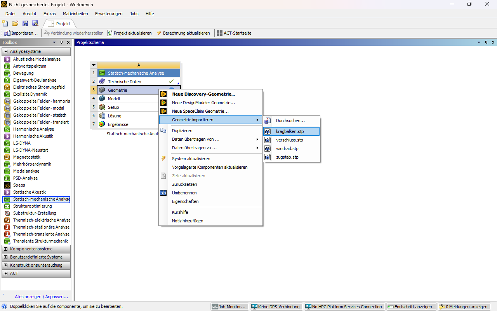
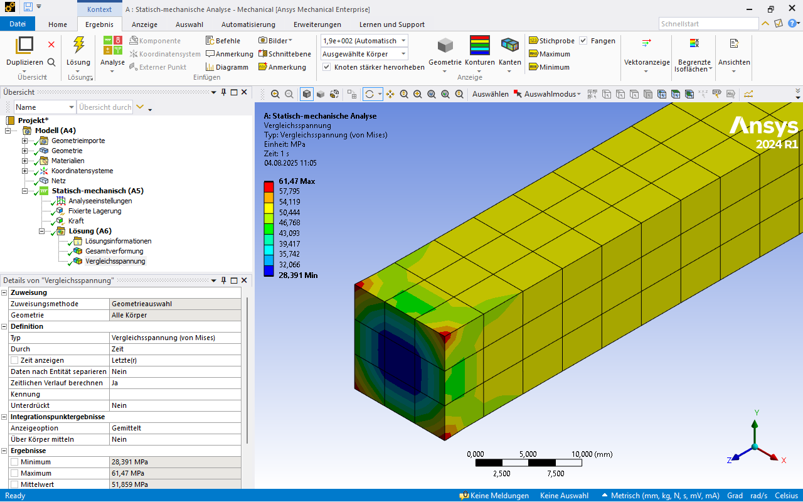
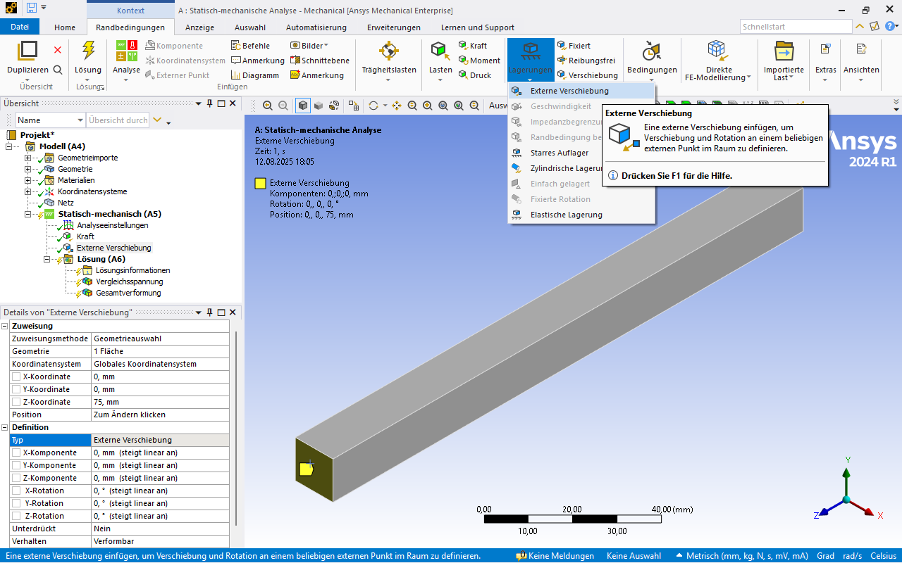
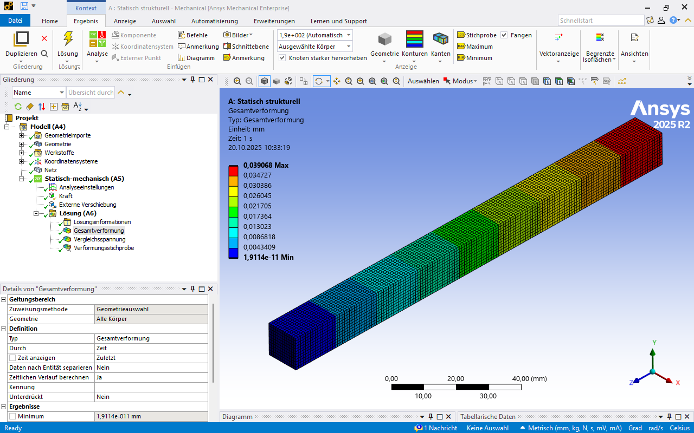

# Übung Kragbalken

## Lernziele

* Erstes Arbeiten mit ANSYS Workbench und ANSYS Mechanical.
* Verständnis der Randbedingungen und Lastfälle bei einem Kragbalken.
* Anwendung der von-Mises-Spannung zur Beurteilung der Festigkeit.
* Vergleich von Simulationsergebnissen mit analytischen Berechnungen.
* Einfluss der Einspannung und Wahl der Randbedingungen verstehen.

## Theoretischer Hintergrund

### Hookesches Gesetz

Die Berechnung basiert auf dem **Hookeschen Gesetz**. Es beschreibt den linearen Zusammenhang zwischen Spannung und Dehnung im elastischen Bereich eines Werkstoffs.

\[
\sigma = \frac{F}{A},  
\quad \varepsilon = \frac{\Delta l}{l},  
\quad E = \frac{\sigma}{\varepsilon}
\]

mit  

* \( \sigma \): Normalspannung  
* \( F \): aufgebrachte Kraft  
* \( A = a^2 \): Querschnittsfläche des Balkens  
* \( \varepsilon \): Dehnung in Belastungsrichtung  
* \( E \): Elastizitätsmodul (Materialkonstante)  

Die **Längenänderung** ergibt sich zu:

\[
\Delta l = \frac{F \cdot l}{A \cdot E}
\]

### Querkontraktion

Neben der Dehnung in Belastungsrichtung tritt eine Querkontraktion auf. Sie wird durch die **Querkontraktionszahl** (Poissonzahl) \(\nu\) beschrieben. Sie definiert das Verhältnis von Querdehnung zur Längsdehnung.

[{width=700}](media/03_kragbalken/querkontraktion.svg "Querkontraktion"){.glightbox}  
Bildquelle nach [@Altenbach2016]

\[
\nu \;=\; - \frac{\varepsilon_q}{\varepsilon_l}
\]

mit  

\[
\varepsilon_l = \frac{\Delta l}{l},  
\qquad
\varepsilon_q = \frac{\Delta a}{a}
\]

* \( \varepsilon_l \): Längsdehnung  
* \( \varepsilon_q \): Querdehnung  
* \( \Delta l \): Längenänderung  
* \( \Delta a \): Querschnittsänderung (z. B. Kantenlänge bei quadratischem Balken)  
* \( l, a \): ursprüngliche Länge bzw. Querschnittsmaß  

Damit ergibt sich:

\[
\varepsilon_q = -\nu \cdot \varepsilon_l
\]

Für Stahl gilt typischerweise \(\nu \approx 0{,}3\).  
Das bedeutet: Bei einer Längsdehnung von 1 % verkürzt sich der Querschnitt quer um 0,3 %.  

### Spannungs-Dehnungs-Diagramm

Das Hookesche Gesetz gilt nur im **linear-elastischen Bereich** eines Werkstoffes. Dieser Bereich ist im Spannungs-Dehnungs-Diagramm als gerade Linie erkennbar. Das erste Diagramm zeigt das Verhalten eines Werkstoffs **ohne ausgeprägte Streckgrenze**. Nach dem linearen Anstieg bis zur Dehngrenze geht die Kurve allmählich in den plastischen Bereich über.  
Typisch ist dieses Verhalten bei vielen NE-Metallen, etwa Aluminium:

[{width=450}](media/03_kragbalken/Spgs-Dehnungs-Kurve_Dehngrenze.svg "Spannungs-Dehnungs-Kurve ohne ausgeprägte Streckgrenze"){.glightbox}  
Bildquelle[@Wikipedia2023]

Das zweite Diagramm zeigt das Verhalten eines Werkstoffs **mit ausgeprägter Streckgrenze**, wie es für Baustahl typisch ist. Der lineare Bereich endet abrupt, es folgt ein Plateau mit nahezu konstanter Spannung, bevor der plastische Anstieg beginnt:

[{width=450}](media/03_kragbalken/Spgs-Dehnungs-Kurve_Streckgrenze.svg "Spannungs-Dehnungs-Kurve mit ausgeprägter Streckgrenze"){.glightbox}  
Bildquelle[@Wikipedia2023]

Für die Berechnung des Kragbalkens in dieser Übung liegt die Belastung im **elastischen Bereich**. Das Hookesche Gesetz ist daher ausreichend.

---

## Aufgabenstellung Zugbelastung

Berechnen Sie für den in der Abbildung dargestellten Kragbalken quadratischen Querschnitts die maximale Spannung und die Verformung mit ANSYS Mechanical.  

* Länge: \( L = 150 \,\text{mm} \)  
* Kantenlänge: \( a = 12 \,\text{mm} \)  
* Kraft: \( F = 7{.}500 \,\text{N} \)  
* Material: Baustahl mit Streckgrenze \( R_e = 250 \,\text{N/mm}^2 \)  

Laden Sie die Datei [kragbalken.stp](media/03_kragbalken/kragbalken.stp) und importieren Sie sie in ANSYS Workbench.

Gleichen Sie Ihr Ergebnis mit der analytischen Lösung ab und diskutieren Sie die etwaige Abweichung.  

[{width=500px}](media/03_kragbalken/kragbalken_zug.svg "Kragbalken, Zug"){.glightbox}  

---

## Umsetzung in ANSYS Mechanical

### 1. Geometrieimport

Laden Sie die Datei [kragbalken.stp](media/03_kragbalken/kragbalken.stp) in ANSYS Workbench.  

[{width=600px}](media/03_kragbalken/01_Kragbalken_Geometrieimport.png "Kragbalken, Geometrieimport"){.glightbox}  

Anhand der Abmessungen des Begrenzungsrahmens lässt sich unmittelbar erkennen, ob die importierte Geometrie in den korrekten Einheiten vorliegt.

[{width=600px}](media/03_kragbalken/02_Kragbalken_Begrenzungsrahmen.png "Kragbalken, Begrenzungsrahmen"){.glightbox}  

### 2. Materialzuweisung

Als Standardmaterial wird von ANSYS Baustahl zugewiesen. Vor der weiteren Verwendung sollten die jeweiligen Materialeigenschaften überprüft werden, um die Eignung für die geplante Anwendung sicherzustellen.

Ansicht unter _Geometrie:_

[{width=600px}](media/03_kragbalken/03_Kragbalken_Materialdefinition.png "Kragbalken, Materialdefinition"){.glightbox}  

Ansicht unter _Materialien:_

[{width=600px}](media/03_kragbalken/04_Kragbalken_Materialdefinition.png "Kragbalken, Materialdefinition"){.glightbox}  

### 3. Netzgenerierung

Für die Berechnung wird das Bauteil in finite Elemente unterteilt, die über Knoten miteinander verbunden sind. Dieser Vorgang heißt **Vernetzung**.  

* Zunächst wird über Netz/Erstellen eine **globale automatische Vernetzung** erzeugt.  
  Dabei vergibt ANSYS eine Elementgröße, die für das gesamte Modell gilt.  
  Das Netz entsteht schnell und gleichmäßig, ist aber oft nicht optimal für lokale Details.  

* Im zweiten Schritt wird die **Elementgröße variiert**, um den **Netzeinfluss** zu untersuchen.  
  Ziel ist zu prüfen, ob das Ergebnis (Spannung, Verformung) stabil bleibt, wenn das Netz feiner wird.  
  Nur wenn sich die Ergebnisse kaum noch ändern, gilt die Lösung als verlässlich.  

Aus FEM-Sicht gilt:  

* Zu grobes Netz → geringe Rechenzeit, aber möglicherweise ungenaue Ergebnisse.  
* Zu feines Netz → hohe Genauigkeit, aber deutlich längere Rechenzeit.  
* Optimal ist ein Netz, das **ausreichend genaue Ergebnisse** liefert, ohne unnötig viele Elemente zu erzeugen.  

[{width=600px}](media/03_kragbalken/05_Kragbalken_Netzgenerierung.png "Kragbalken, Netzdefinition"){.glightbox}  

### 4. Randbedingungen

Betrachtet man die Aufgabenstellung sind zwei Randbedingungen naheliegend:

* **Feste Einspannung** am linken Ende  
* **Zugkraft** \( F \) an der rechten Stirnfläche  

Die feste Einspannung wird in ANSYS umgesetzt, indem **alle Freiheitsgrade** der ausgewählten Fläche blockiert werden. Das bedeutet konkret: Translationen in \(x\)-, \(y\)- und \(z\)-Richtung sowie Rotationen um alle drei Achsen sind dort nicht mehr möglich. Im physikalischen Sinn wird so die Verbindung des Balkens mit einer starren Umgebung modelliert.

Die Zugkraft wird an der rechten Stirnfläche aufgebracht. In ANSYS erfolgt dies über die Angabe einer **Gesamtkraft (Kraft)**, die sich über die gesamte Fläche verteilt. Damit wird sichergestellt, dass die Kraft nicht punktförmig wirkt (was numerisch eine Singularität erzeugen würde), sondern gleichmäßig eingeleitet wird.

Aus FEM-Sicht geschieht Folgendes:

* Die Einspannung erzeugt eine **Verschiebungsrandbedingung**:  
  Knoten in diesem Bereich können sich nicht bewegen → Reaktionskräfte bilden sich aus.
* Die Zugkraft erzeugt eine **Lastbedingung**:  
  Knoten in diesem Bereich erfahren zusätzliche äußere Kräfte → führen zu inneren Spannungen und Verformungen im gesamten Bauteil.

Im Zusammenspiel von **verschiebungsgebundenen** und **kraftgebundenen** Randbedingungen entsteht ein **geschlossenes Gleichungssystem**, das im FEM‑Solver gelöst wird.

[{width=600px}](media/03_kragbalken/06_Kragbalken_Randbedingungen.png "Kragbalken, Randbedingungen"){.glightbox}  

[{width=600px}](media/03_kragbalken/07_Kragbalken_Randbedingungen.png "Kragbalken, Randbedingungen"){.glightbox}  

???+ note "Hinweis zur Modellierung"
    Wird die Kraft nur auf eine kleine Kante oder einen einzelnen Knoten angesetzt, entstehen unrealistisch hohe lokale Spannungen (Singularitäten). Deshalb immer eine Fläche auswählen, um die Last realistisch zu verteilen.

### 5. Auswertung

Für die erste Auswertung in ANSYS werden zwei Ergebnisse betrachtet:

* **Verformung (Gesamtverformung)**  
* **Spannung nach von Mises**

Die Verformung zeigt die Gesamtauslenkung des Bauteils. In ANSYS wird sie üblicherweise in überhöhter Darstellung angezeigt, damit die Formänderung deutlich erkennbar ist. Wichtig ist, dass es sich dabei um eine **Skalierung zur Visualisierung** handelt – die Werte sind den Ergebnistabellen zu entnehmen.  

Die von-Mises-Spannung ist ein Vergleichswert, der die kombinierte Wirkung aller Normal- und Schubspannungen zu einer einzigen „äquivalenten“ Spannung zusammenfasst:

\[
\sigma_\text{vM} = \sqrt{\frac{1}{2} \left[(\sigma_x-\sigma_y)^2 + (\sigma_y-\sigma_z)^2 + (\sigma_z-\sigma_x)^2 \right] + 3(\tau_{xy}^2+\tau_{yz}^2+\tau_{zx}^2)}
\]

Dieser Wert eignet sich besonders gut, um in der späteren Festigkeitsbewertung mit einer zulässigen Spannung zu vergleichen, auch wenn verschiedene Spannungsanteile gleichzeitig wirken. Für den hier betrachteten Zugbalken im linearen Bereich sollte die von-Mises-Spannung nahe bei der Normalspannung aus der analytischen Lösung liegen.  

Auswertungsschritte in ANSYS:

1. Auswahl der **Gesamtverformung** → Kontrolle der Größenordnung und Plausibilität.  
2. Darstellung der **von-Mises-Spannung** → Vergleich mit analytisch berechneter Spannung.  
3. **Verformungsergebnis** mit Auswahl einer Richtung (hier globale x-Achse) → Auswertung der Querkontraktion.  

Auswahl über Kontextmenü _Lösung_:

[{width=600px}](media/03_kragbalken/08_Kragbalken_Auswertung.png "Kragbalken, Lösungen hinzufügen"){.glightbox}  

[{width=600px}](media/03_kragbalken/10_Kragbalken_Auswertung.png "Kragbalken, Lösungen hinzufügen"){.glightbox}  

Alternativ über Klick (rechte Maustaste) auf _Lösung_ im Strukturbaum:

[{width=600px}](media/03_kragbalken/10a_Kragbalken_Auswertung.png "Kragbalken, Lösungen hinzufügen"){.glightbox}  

Hier mit Auswahl der globalen x-Achse zur Auswertung der Querschnittsänderung:

[{width=600px}](media/03_kragbalken/10b_Kragbalken_Auswertung.png "Kragbalken, Lösungen hinzufügen"){.glightbox}  

---

## Diskussion der Ergebnisse, Zug

### Vergleich mit analytischer Lösung

Erwartung: Sehr gute Übereinstimmung der mittleren Spannung und der Verformungen.

**Ergebnisse in ANSYS:**

Die **Gesamtverformung** zeigt eine Längung des Balkens um 0,03895 mm.

[{width=600px}](media/03_kragbalken/09_Kragbalken_Auswertung.png "Kragbalken, Lösungen"){.glightbox}  

Die **maximale Vergleichsspanunng** (von Mises) ist 57,528 MPa. Sie zeigt sich in einer Spannungsspitze an den Ecken bei der fest eingespannten Fläche (roter Bereich).  

[{width=600px}](media/03_kragbalken/11_Kragbalken_Auswertung.png "Kragbalken, Lösungen"){.glightbox}  

Nutzt man eine _Stichprobe_ etwas von der Einspannung entfernt ist die **Vergleichsspanunng** (von Mises) 52,082 MPa.  

**Hinweis:** Die Stichprobe ist im Kontextmenü _Ergebnis_ zu finden. Dort lässt sich auch der minimale und maximale Wert des jeweiligen Ergebnisses anzeigen.  

[{width=600px}](media/03_kragbalken/12_Kragbalken_Auswertung.png "Kragbalken, Lösungen"){.glightbox}  

Das **Verformungsergebnis** in Richtung der x-Achse ist 0,000472 mm.

[{width=600px}](media/03_kragbalken/12a_Kragbalken_Auswertung.png "Kragbalken, Lösungen"){.glightbox}  

Die folgende Box enthält die analytische Lösung. Führen Sie die Berechnung zunächst selbst durch und nutzen Sie dabei die [oben vorgestellte Theorie](#theoretischer-hintergrund).

??? note "Berechnung von Δl, Δa und σ"
    Für die analytische Lösung werden die Längenänderung Δl, die Querschnittsänderung Δa und die Normalspannung σ bestimmt.

    **Spannung**

    \[
    \sigma = \frac{F}{A}
    \]

    Mit den gegebenen Werten:

    \[
    F = 7{.}500 \,\text{N}, \quad A = 144 \,\text{mm}^2
    \]

    \[
    \sigma = \frac{7{.}500 \,\text{N}}{144 \,\text{mm}^2} \approx 52{,}1 \,\text{N/mm}^2
    \]

    **Längenänderung**

    \[
    \Delta l = \frac{F \cdot l}{A \cdot E}
    \]

    Eingesetzt mit den Werten der Aufgabe:

    \[
    l = 150 \,\text{mm}, \quad E = 210{.}000 \,\text{N/mm}^2
    \]

    \[
    \Delta l = \frac{7{.}500 \,\text{N}\cdot 150 \,\text{mm}}{144 \,\text{mm}^2\cdot 210{.}000 \,\text{N/mm}^2} 
             \approx 0{,}037 \,\text{mm}
    \]

    **Querschnittsänderung**

    Über die Querkontraktionszahl \(\nu = 0{,}3\):

    \[
    \varepsilon_q = - \nu \cdot \varepsilon_l
    \]

    mit  

    \[
    \varepsilon_l = \frac{\Delta l}{l} = \frac{0{,}037 \,\text{mm}}{150 \,\text{mm}} \approx 2{,}47 \cdot 10^{-4}
    \]

    \[
    \varepsilon_q = -0{,}3 \cdot 2{,}47 \cdot 10^{-4}
                  \approx -7{,}4 \cdot 10^{-5}
    \]

    Daraus ergibt sich die Querschnittsänderung:

    \[
    \Delta a = \varepsilon_q \cdot a = -7{,}4 \cdot 10^{-5} \cdot 12 \,\text{mm}
             \approx -8{,}9 \cdot 10^{-4} \,\text{mm}
    \]

    **Ergebnis:**  
    * Normalspannung: ca. **52 N/mm²**  
    * Verlängerung des Balkens: ca. **0,037 mm**  
    * Verringerung der Kantenlänge: ca. **0,0009 mm**

Die folgende Tabelle zeigt die analytischen Ergebnisse, die FEM-Ergebnisse sowie die daraus ermittelten prozentualen Abweichungen. Die prozentuale Abweichung wird berechnet als:

\[
\text{Abweichung} = \frac{\text{FEM} - \text{Analytisch}}{\text{Analytisch}} \times 100
\]

| Größe (Formelzeichen)                  | Analytische Lösung | FEM-Ergebnis                 | Abweichung [%] |
|-----------------------------------------|--------------------|------------------------------|----------------|
| max. Spannung ($\sigma_\mathrm{max}$)   | 52,1 N/mm²          | 52,53 N/mm²                   | 0,83 %         |
| Spannung (σ) Stichprobe                 | 52,1 N/mm²          | 52,08 N/mm²                   | −0,04 %        |
| Verlängerung des Balkens (Δl)           | 0,037 mm            | 0,039 mm                      | 5,41 %         |
| Verringerung der Kantenlänge (Δa)       | 0,00089 mm          | 0,000944 mm (2 × 0,000472 mm)  | 6,07 %         |

Die Ergebnisse stimmen insgesamt gut mit der analytischen Lösung überein. Deutlichere Abweichungen treten nur bei der maximalen Vergleichsspannung auf, verursacht durch lokale Spannungsspitzen (Singularitäten) an den Ecken der Einspannung.  

Für ein derart einfaches Problem sind Abweichungen von 5–6 % relativ hoch, es wäre eine nahezu exakte Übereinstimmung zu erwarten. Die beobachtete Differenz ist vor allem auf die Spannungsspitzen an der Ecke zurückzuführen und sollte weiter untersucht werden.

Mögliche Maßnahmen zur Verbesserung zunächst:  

* Analyse des Einflusses der **Vernetzung**
* Analyse des Einflusses der **Einspannung**

### Einfluss des Netzes

Generell gilt:

* Grobes Netz → geringere Genauigkeit.  
* Feines Netz → längere Rechenzeit, bessere Übereinstimmung.  
* Ziel: Ergebnis unabhängig vom Netz (Netzeinfluss weitgehend eliminiert).  

Wie unter [Grundlegendes zur Vernetzung](02_installation_erste_schritte.md#grundlegendes-zur-vernetzung) eingeführt, ist die manuelle Festlegung der globalen Elementgröße die einfachste Möglichkeit zur Netzverfeinerung.  

Ergebnis nahe der Einspannung mit globaler Elementgröße **5 mm**

[{width=600px}](media/03_kragbalken/14_Kragbalken_Auswertung.png "Kragbalken, Lösungen"){.glightbox}  

Ergebnis nahe der Einspannung mit globaler Elementgröße **1 mm**

[{width=600px}](media/03_kragbalken/15_Kragbalken_Auswertung.png "Kragbalken, Lösungen"){.glightbox}  

Ergebnis nahe der Einspannung mit globaler Elementgröße **0,5 mm**

[{width=600px}](media/03_kragbalken/16_Kragbalken_Auswertung.png "Kragbalken, Lösungen"){.glightbox}  

Betrachtet man die maximale Vergleichsspannung, ist eine deutliche Zunahme von Verfeinerungsschritt zu Verfeinerungsschritt zu erkennen. Dies kann auf eine **Divergenz** hindeuten, also darauf, dass der berechnete Wert mit zunehmender Netzverfeinerung nicht gegen einen festen Grenzwert konvergiert, sondern stetig weiter ansteigt (vgl. [Singularitäten bei Krafteinleitung auf Punkt oder Kante](03_kragbalken.md#4-randbedingungen)).

<!-- markdownlint-disable MD033 -->

<!-- markdownlint-disable MD033 -->

??? note "Ergebnisse Netzverfeinerung als Tabelle"
    | Netzgröße     | Max. Spannung | Anzahl Knoten | Anzahl Elemente |
    |---------------|--------------|--------------|----------------|
    | Standardnetz  | 57,528 MPa   | 621          | 80             |
    | 5 mm          | 61,47 MPa    | 1 720        | 270            |
    | 1 mm          | 105,38 MPa   | 97 981       | 21 600         |
    | 0,5 mm        | 136,92 MPa   | 736 825      | 172 800        |

### Einfluss der Einspannung

In der Realität kann sich der Balken quer zur Belastungsrichtung verkürzen.  
Im FEM‑Modell mit fester Einspannung wird diese **Querkontraktion lokal verhindert**.  
Dadurch entstehen **Randspannungsspitzen**, die analytisch nicht vorhergesagt werden.  
→ Erklärung für Abweichungen zwischen analytischer und numerischer Lösung nahe der Einspannung.

???+ danger "FIXME"
    Screenshots hinzufügen: externe Verschiebung, verformbar (sollte Querkontraktion zulassen)

---

## Aufgabenstellung Biegung

Implementieren Sie für den Kragbalken folgendes Modell und berechnen Sie die maximale Spannung und die maximale Verformung. Verwenden Sie auch die Geometrie aus [kragbalken.stp](media/03_kragbalken/kragbalken.stp).  

* Länge: \( L = 150 \,\text{mm} \)  
* Kantenlänge: \( a = 12 \,\text{mm} \)  
* Kraft: \( F_B = 750 \,\text{N} \)  
* Material: Baustahl mit Streckgrenze \( R_e = 250 \,\text{N/mm}^2 \)  

Bearbeiten Sie folgende Themen:

* Vergleich der Ergebnisse mit der analytischen Lösung (maximale Spannung und Verformung)  
* Bestimmung der Stelle maximaler Spannung (numerisch und analytisch)  
* Darstellung von Zug- und Druckspannungen in ANSYS  

[{width=500px}](media/03_kragbalken/kragbalken_biegung.svg "Kragbalken, Biegung"){.glightbox}

---

## Umsetzung ANSYS

## Diskussion der Ergebnisse, Biegung

## Add-on: Biegemoment statt Kraft

Als Alternative kann ein **reines Biegemoment** angesetzt werden.  
Dies führt zu einem **querkraftfreien Balken** mit gleichmäßigerem Spannungsfeld.

* Umsetzung: Lasttyp „Moment“ an der Stirnfläche.  
* Beobachtung: Gleichmäßiger Verlauf, keine Singularität durch Krafteinleitung.  

???+ danger "FIXME"
    Screenshots hinzufügen: Moment an Stirnfläche.

[{width=600px}](media/03_kragbalken/17_Kragbalken_Auswertung.png "Kragbalken, Lösungen"){.glightbox}  

[{width=600px}](media/03_kragbalken/18_Kragbalken_Auswertung.png "Kragbalken, Lösungen"){.glightbox}  

---

## Weiterführende Hinweise

### Varianten der Krafteinleitung

In ANSYS Mechanical stehen verschiedene Möglichkeiten zur Verfügung, eine äußere Belastung aufzubringen. Die Auswahl beeinflusst maßgeblich die Spannungsverteilung und die physikalische Plausibilität.

* **Kraft auf Fläche**  
  Die empfohlene Variante für den Kragbalken:  
  Eine Gesamtkraft wird gleichmäßig über eine Fläche verteilt.  
  → Verhindert unrealistisch hohe Spannungen, die bei punktförmiger Last entstehen würden.  

* **Kantenlast**  
  Belastung entlang einer Kante.  
  Wird verwendet, wenn eine reale Krafteinleitung tatsächlich über eine Linie erfolgt, z. B. durch eine Schweißnaht oder Auflagerkante.  
  → Achtung: höhere Spannungsgradienten, Netzqualität besonders wichtig.  

* **Punktlast**  
  Kraft wirkt in einem einzelnen Knoten.  
  → In der Praxis meist zu vermeiden, da dies numerisch zu Singularitäten führt.  
  Nur in Spezialfällen für theoretische Modellierungen sinnvoll.  

* **Moment**  
  Lasttyp „Moment“ auf Fläche oder Kante.  
  → Besonders geeignet, wenn gezielt ein konstantes Biegemoment ohne Querkraft wirken soll.  

* **Vektoren und Richtungswahl**  
  In ANSYS kann die Richtung der Kraft gewählt werden:  
    * globales Koordinatensystem (x, y, z)  
    * lokales Koordinatensystem (z. B. Bauteilorientierung)  
    * benutzerdefinierte Richtung über Vektor-Eingabe  
    → Wichtig, um sicherzustellen, dass die Kraft in der beabsichtigten Raumrichtung wirkt.  

Diese Auswahl verdeutlicht, dass die „gleiche“ Belastung je nach Ansetzpunkt und Typ sehr unterschiedliche Ergebnisse liefern kann. Die Entscheidung, wie eine Last angesetzt wird, gehört deshalb zu den wesentlichen Modellierungsaufgaben im FEM.

???+ danger "FIXME"
    Video hinzu?

## Quiz zur Selbstkontrolle

<!-- markdownlint-disable MD033 -->

<?quiz?>
question: Warum sollte die Kraft im FEM-Modell nicht nur auf eine Kante oder einen einzelnen Knoten angesetzt werden?
answer: Damit die Berechnung schneller läuft.
answer-correct: Weil sonst unrealistisch hohe lokale Spannungen (Singularitäten) entstehen.
answer: Um die von-Mises-Spannung zu verringern.
content:
<strong>Hinweis:</strong> Lasten immer auf Flächen verteilen, um realistische Ergebnisse zu erhalten.
<?/quiz?>

<?quiz?>
question: Warum wird die Verformung in ANSYS oft überhöht dargestellt?
answer-correct: Damit die Formänderung visuell deutlich erkennbar ist.
answer: Weil das Netz zu grob ist.
answer: Um die Spannungen zu erhöhen.
content:
<em>Tipp:</em> Der Skalierungsfaktor dient nur der Visualisierung; die Werte sind in den Ergebnistabellen zu finden.
<?/quiz?>

<?quiz?>
question: Welche Einheit hat die von-Mises-Spannung?
answer: Newton
answer-correct: Pascal (N/m²)
answer: Meter pro Sekunde
content:
<em>Tipp:</em> Es handelt sich um eine Spannungseinheit.
<?/quiz?>

<?quiz?>
question: Welcher Einfluss hat die Wahl der Randbedingungen auf das Simulationsergebnis?
answer: Gar keinen.
answer: Sie beeinflusst nur die Farbe der Darstellung.
answer-correct: Sie bestimmt maßgeblich die Verformungen und Spannungsverteilung.
content:
<strong>Hinweis:</strong> Falsche Randbedingungen führen zu physikalisch falschen Ergebnissen.
<?/quiz?>

<!-- markdownlint-enable MD033 -->