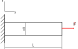

# ANSYS Mechanical and Beam Exercise

## ANSYS Mechanical

In ANSYS Workbench, the term *Model* encompasses all definitions between geometry creation and load case definition. This includes:

* Material properties and additional masses  
* Auxiliary geometry for boundary conditions and result evaluation  
* Virtual topology for meshing control  
* Coordinate systems and contacts  
* Meshing definitions  
* Combination of multiple load cases

The **Mechanical Application (ANSYS Mechanical)** is the central FEM tool. It is used to assign physical properties, generate meshes, run simulations, and visualize results. A single Mechanical window can contain multiple analysis branches with different load cases. The structure is defined via the project manager. Double-clicking *Model* opens the Mechanical Application.

---

### User Interface

[{width=700px}](media/03_mechanical_kragbalken/mechanical_ui.en.png "Mechanical-Applikation in ANSYS"){.glightbox}  

Key elements of the interface:

* **Left**: Tree structure with all analysis components  
* **Below**: Details of the currently selected element  
* **Top**: Menu bar with display and selection tools  
* **Above the geometry window**: Context-sensitive commands

### Status indicators in the tree view

* Green check: Definition complete  
* Blue question mark: Input missing  
* Grey X: Element suppressed  
* Red exclamation mark: Warning or inconsistency  
* Yellow lightning: Ready to solve  
* Green lightning: Solving in progress  
* Red lightning: Solution aborted  
* Green arrow: Archived result ready to load  
* Red arrow: Aborted result ready to load

### Colors in the details pane

* Yellow: Incomplete input  
* White: Editable field  
* Grey: Display only (read-only)  
* Red: Invalid (e.g., after model change without recalculation)

### View controls

[{width=500px}](media/03_mechanical_kragbalken/ansichtssteuerung.en.png "Steuerung der Ansichten"){.glightbox}  

Typical functions:

* Rotate, pan, zoom  
* Fit to window or rectangle  
* Previous/next view  
* ISO and top views  
* Save or manage views

### Selection options

Selections are made using mouse interaction.

* Use icons to choose selection type: point, edge, face, or body  
* Mouseover highlights geometry  
* Click to select; use `CTRL` for multi-selection  
* Remove elements with a second click while holding `CTRL`  
* **Box selection**: hold mouse button and drag across model  
* **Expand selection**: add tangential neighboring surfaces  
* Tangent angle (default: 20°) can be adjusted  
* Repeating the function adds further tangents  
* **Adjacent/All**: selects all tangential surfaces until the next sharp edge

[{width=600px}](media/03_mechanical_kragbalken/selektion.png "Selektionsfunktionen"){.glightbox}  

**Selecting hidden elements:**

When clicking on overlapping geometry, a selection menu appears in the 3D viewer. The mouse can be used to highlight and select individual layers.  
In assemblies, surfaces are color-coded according to their part assignment.

---

### Geometry

The *Geometry* section lists all imported parts with their attributes.

Functions:

* Show/hide parts  
* Suppress or restore elements  
* Assign materials per part  
* Add point masses (deformable or rigid)  
  → This choice has a significant influence on results.

---

### Coordinate Systems

After importing, the global coordinate system appears, usually matching the one from Creo.

Additional local systems can be added via the context menu:

* Select geometry  
* Right-click → Insert → Coordinate System

**Rules for defining the origin:**

* Point → at the selected point  
* Line → at the midpoint  
* Circle/Arc → at the center  
* Flat face → at the center of mass  
* Cylindrical face → on the axis, axially centered

[{width=350px}](media/03_mechanical_kragbalken/koordinaten.en.png "Koordinatensysteme bearbeiten"){.glightbox}  

Created systems can be moved or rotated.

---

### Meshing

#### Basics of meshing

Meshing divides the component into finite elements, which are connected via nodes.

In design-related FEM workflows, extensive mesh optimization is rarely needed, modern computers handle coarse meshes well.  
What matters is the **mesh-independent quality of results**, not the visual perfection of the mesh.

This requires a **mesh sensitivity study**, typically done by:

* Varying global element size  
* Local mesh refinement  
* Adaptive meshing (see exercise)

The goal is a balanced trade-off between result quality and computation time.

#### Manual meshing

!!! note "Note"
    This section marks the starting point for practical meshing work in ANSYS.  
    Manual meshing is the most direct way to control element size.

The global element size – the average edge length for all elements – is defined in the tree under *Mesh*.

[{width=400px}](media/03_mechanical_kragbalken/globale_elementgröße.en.png "Setting global element size"){.glightbox}  

The entire model is meshed using this value.  
**This can be inefficient** if the area of interest is small: a fine mesh everywhere increases computation time without added benefit.

Instead, **local refinement** is often preferable:

* Under *Mesh Control*, you can assign element sizes to specific parts or faces  
* Edges or faces can be refined individually  
* The *Method* function forces a specific **element type** (e.g., tetrahedral or hexahedral)  
  → Choose carefully, based on literature or application

Manual meshing is useful for simple models or early-stage studies.

---

### Contacts

When importing assemblies, ANSYS automatically defines contact regions between parts. Optionally, these can be manually adjusted.

[{width=500px}](media/03_mechanical_kragbalken/kontakte.en.png "Contacts in ANSYS"){.glightbox}  
Bildquelle[@Gebhardt2018]

???+ danger "FIXME"
    check table content  

Contacts serve two purposes:

1. **Transfer of forces**  
2. **Prevention of penetration**

Typical types:

* **Bonded**  
* **No separation**  
* **Frictionless**  
* **Rough**  
* **Frictional**

Caution with complex contact models:  
Contacts involving friction or separation greatly increase computation time.  
In most cases, *Bonded* or *No Separation* provides a good balance.

!!! note "Note"
    This section provides only a basic overview of contact definitions.  
    Detailed handling, selection, and evaluation will follow in later exercises.

## Beam Exercise

### Task

For the cantilever beam with square cross-section shown in the figure, calculate the maximum stress and deformation using ANSYS Mechanical.  

* Length: \( L = 150 \,\text{mm} \)  
* Edge length: \( a = 12 \,\text{mm} \)  
* Force: \( F = 7{.}500 \,\text{N} \)  
* Material: Structural steel with yield strength \( R_e = 250 \,\text{N/mm}^2 \)  

Download the file [kragbalken.stp](media/03_mechanical_kragbalken/kragbalken.stp) and import it into ANSYS Workbench.

???+ danger "FIXME"
    rename file  

Compare your result with the analytical solution and discuss any deviations.  

[{width=500px}](media/03_mechanical_kragbalken/kragbalken_zug.svg "Cantilever beam under tension"){.glightbox}  

---

### Theoretical Background

#### Hooke’s Law

The calculation is based on **Hooke’s Law**. It describes the linear relationship between stress and strain in the elastic range of a material.

\[
\sigma = \frac{F}{A},  
\quad \varepsilon = \frac{\Delta l}{l},  
\quad E = \frac{\sigma}{\varepsilon}
\]

with  

* \( \sigma \): normal stress  
* \( F \): applied force  
* \( A = a^2 \): cross-sectional area of the beam  
* \( \varepsilon \): strain in the direction of loading  
* \( E \): modulus of elasticity (material constant)  

The **elongation** is calculated as:

\[
\Delta l = \frac{F \cdot l}{A \cdot E}
\]

---

#### Lateral Contraction

???+ danger "FIXME"
    Insert a schematic figure showing the relationship between longitudinal strain and lateral contraction.

In addition to the strain in the loading direction, a lateral contraction occurs. It is described by the **Poisson’s ratio** (\(\nu\)).  
It defines the ratio of transverse strain to longitudinal strain:

\[
\nu \;=\; - \frac{\varepsilon_q}{\varepsilon_l}
\]

with  

\[
\varepsilon_l = \frac{\Delta l}{l},  
\qquad
\varepsilon_q = \frac{\Delta a}{a}
\]

* \( \varepsilon_l \): longitudinal strain  
* \( \varepsilon_q \): transverse strain  
* \( \Delta l \): elongation  
* \( \Delta a \): change in cross-section (e.g. edge length for a square beam)  
* \( l, a \): original length and cross-section dimension  

Thus:

\[
\varepsilon_q = -\nu \cdot \varepsilon_l
\]

For steel, \(\nu \approx 0{,}3\).  
This means that with a longitudinal strain of 1 %, the cross-section shortens transversely by about 0.3 %.  

---

#### Stress-Strain Diagram

Hooke’s Law applies only in the **linear elastic range** of a material. This range appears as a straight line in the stress-strain diagram.  

The first diagram shows the behavior of a material **without a distinct yield point**. After the linear increase up to the proof stress, the curve gradually transitions into the plastic range. This is typical for many non-ferrous metals such as aluminum:

[{width=450}](media/03_mechanical_kragbalken/Spgs-Dehnungs-Kurve_Dehngrenze.en.svg "Stress-strain curve without distinct yield point"){.glightbox}  
Image source based on[@Wikipedia2023]

The second diagram shows the behavior of a material **with a distinct yield point**, as is typical for structural steel. The linear range ends abruptly, followed by a plateau with nearly constant stress, before the plastic increase begins:

[{width=450}](media/03_mechanical_kragbalken/Spgs-Dehnungs-Kurve_Streckgrenze.en.svg "Stress-strain curve with distinct yield point"){.glightbox}  
Image source based on[@Wikipedia2023]

For the calculation of the cantilever beam in this exercise, the load lies within the **elastic range**. Hooke’s Law is therefore sufficient.

---

### Implementation in ANSYS Mechanical

#### 1. Geometry Import

Load the file [kragbalken.stp](media/03_mechanical_kragbalken/kragbalken.stp) into ANSYS Workbench.  

???+ danger "FIXME"
    rename file  

???+ danger "FIXME"
    Screenshot?

#### 2. Material Definition  

???+ danger "FIXME"
    Material definition ist glaube ich nicht richtig übersetzt. Es muss Materialzuweisung heißen

By default, ANSYS assigns structural steel as the material. Before further use, the respective material properties should be verified to ensure suitability for the intended application.

???+ danger "FIXME"
    Screenshot

#### 3. Meshing

The part is divided into finite elements connected via nodes (**meshing**).  

???+ danger "FIXME"
    vgl. deutsche Version. Ergänze wie wird das Netz erstellt

* Start with a **global automatic mesh**.  
* Then vary the **element size** to study **mesh influence**.  
* Convergence is confirmed if results remain nearly unchanged with further refinement.  

Rules of thumb:  

* Coarse mesh → low computation time, possibly inaccurate.  
* Fine mesh → high accuracy, but longer computation time.  
* Optimal mesh → sufficiently accurate without excessive elements.  

???+ danger "FIXME"
    Screenshot

#### 4. Boundary Conditions

Two boundary conditions are required:

* **Fixed support** at the left end  
* **Tensile force** \( F \) at the right face  

The fixed support is modeled in ANSYS by blocking **all degrees of freedom** of the selected face. Concretely: translations in \(x\), \(y\), and \(z\) directions as well as rotations about all three axes are prevented. Physically, this represents the connection of the beam to a rigid environment.  

The tensile force is applied at the right face. In ANSYS this is done either as a **surface load (pressure)** or as a **total force**, distributed evenly over the entire face. This ensures the load is not applied at a point (which would cause a singularity) but is realistically distributed.  

From an FEM perspective:

* The fixed support creates a **displacement boundary condition**:  
  Nodes cannot move → reaction forces develop.
* The tensile force creates a **load condition**:  
  Nodes experience additional external forces → leading to stresses and deformations.  

Together, the combination of **displacement-controlled** and **force-controlled** conditions forms a **closed system of equations** for the FEM solver.  

???+ note "Modeling Note"
    If the force is applied only to a small edge or a single node, unrealistically high local stresses (singularities) appear. Always use a surface to distribute the load realistically.

???+ danger "FIXME"
    Screenshots?

#### 5. Evaluation

Two results are examined in ANSYS:

* **Total deformation**  
* **von Mises stress**

The deformation shows the total displacement. ANSYS usually displays it in an exaggerated scale for visualization. The actual numerical values must be read from the results tables.  

The von Mises stress is an equivalent stress combining normal and shear stresses:

\[
\sigma_\text{vM} = \sqrt{\frac{1}{2} \left[(\sigma_x-\sigma_y)^2 + (\sigma_y-\sigma_z)^2 + (\sigma_z-\sigma_x)^2 \right] + 3(\tau_{xy}^2+\tau_{yz}^2+\tau_{zx}^2)}
\]

This value is useful for comparing with allowable stresses. For this tensile beam in the elastic range, the von Mises stress should be close to the analytical normal stress.  

Steps in ANSYS:

1. Select **total deformation** → check magnitude and plausibility.  
2. Display **von Mises stress** → compare with analytical stress.  
3. Assess the **stress distribution**.  

???+ danger "FIXME"
    Screenshot

---

### Discussion of Results

#### Comparison with Analytical Solution

Expectation: very good agreement of average stress and deformation.

Results from ANSYS...

???+ danger "FIXME"
    Add screenshots and discuss “what is observed”.

???+ danger "FIXME"
    Einheiten in Formeln ergänzen

??? note "Calculation of Δl, Δa and σ"
    For the analytical solution, the elongation Δl, the cross-section change Δa, and the normal stress σ are calculated.

    **Stress**

    \[
    \sigma = \frac{F}{A}
    \]

    With the given values:

    \[
    F = 7{.}500 \,\text{N}, \quad A = 144 \,\text{mm}^2
    \]

    \[
    \sigma = \frac{7{.}500}{144} \approx 52{,}1 \,\text{N/mm}^2
    \]

    **Elongation**

    \[
    \Delta l = \frac{F \cdot l}{A \cdot E}
    \]

    Using the given values:

    \[
    l = 150 \,\text{mm}, \quad E = 210{.}000 \,\text{N/mm}^2
    \]

    \[
    \Delta l = \frac{7{.}500 \cdot 150}{144 \cdot 210{.}000} 
            \approx 0{,}037 \,\text{mm}
    \]

    **Cross-section Change**

    Using the Poisson’s ratio \(\nu = 0{,}3\):

    \[
    \varepsilon_q = - \nu \cdot \varepsilon_l
    \]

    with  

    \[
    \varepsilon_l = \frac{\Delta l}{l} = \frac{0{,}037}{150} \approx 2{,}47 \cdot 10^{-4}
    \]

    \[
    \varepsilon_q = -0{,}3 \cdot 2{,}47 \cdot 10^{-4}
                  \approx -7{,}4 \cdot 10^{-5}
    \]

    Thus, the cross-section change is:

    \[
    \Delta a = \varepsilon_q \cdot a = -7{,}4 \cdot 10^{-5} \cdot 12
            \approx -8{,}9 \cdot 10^{-4} \,\text{mm}
    \]

    **Result:**  
    * Normal stress: approx. **52 N/mm²**  
    * Beam elongation: approx. **0.037 mm**  
    * Reduction of edge length: approx. **0.0009 mm**

#### Mesh Influence

* Coarse mesh → less accurate.  
* Fine mesh → more accurate but longer time.  
* Aim: results independent of mesh (mesh influence minimized).  

???+ danger "FIXME"
    Add screenshots. Relevant here? Divergence at the support...

#### Prevented Lateral Contraction

In reality, the beam can contract laterally.  
In the FEM model with fixed support, this **lateral contraction is locally prevented**.  
This leads to **edge stress peaks** not predicted analytically.  
→ Explains deviations near the support.

---

### Add-on: Bending Moment Instead of Force

As an alternative, a **pure bending moment** can be applied.  
This results in a **shear-free beam** with a more uniform stress field.  

* Implementation: load type “Moment” on the face.  
* Observation: smoother distribution, no singularity from force application.  

???+ danger "FIXME"
    Add screenshot: moment at face.

---

### Variants of Load Application

In ANSYS Mechanical, various options are available for applying loads. The choice strongly influences the stress distribution and physical plausibility.

* **Force on surface**  
  Recommended for this cantilever beam:  
  A total force evenly distributed over a face.  
  → Prevents unrealistic high stresses from point loading.  

* **Edge load**  
  Force along an edge.  
  Used when real application is along a weld seam or support edge.  
  → Note: higher stress gradients, mesh quality critical.  

* **Point load**  
  Force at a single node.  
  → Usually to be avoided, as it leads to singularities.  
  Only for special theoretical models.  

* **Moment**  
  Load type “Moment” on face or edge.  
  → Suitable for applying a constant bending moment without shear.  

* **Vectors and direction selection**  
  In ANSYS the direction of force can be chosen:  
    * global coordinate system (x, y, z)  
    * local coordinate system (part orientation)  
    * user-defined vector input  
  → Ensures the force acts in the intended direction.  

These options illustrate that the “same” load can yield very different results depending on how it is applied. Choosing the correct method is a key part of FEM modeling.

---

### Further Notes

???+ danger "FIXME"
    Add video?
