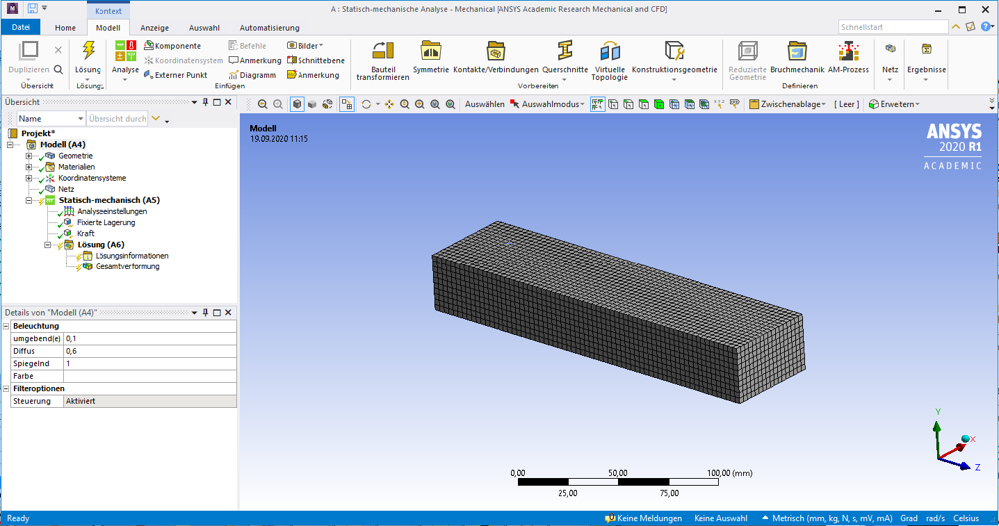
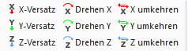

# ANSYS Mechanical and Beam Exercise

## ANSYS Mechanical

In ANSYS Workbench, the term *Model* encompasses all definitions between geometry creation and load case definition. This includes:

* Material properties and additional masses  
* Auxiliary geometry for boundary conditions and result evaluation  
* Virtual topology for meshing control  
* Coordinate systems and contacts  
* Meshing definitions  
* Combination of multiple load cases

The **Mechanical Application (ANSYS Mechanical)** is the central FEM tool. It is used to assign physical properties, generate meshes, run simulations, and visualize results. A single Mechanical window can contain multiple analysis branches with different load cases. The structure is defined via the project manager. Double-clicking *Model* opens the Mechanical Application.

---

### User Interface

[{width=700px}](media/03_mechanical_kragbalken/mechanical_ui.png "Mechanical-Applikation in ANSYS"){.glightbox}  

Key elements of the interface:

* **Left**: Tree structure with all analysis components  
* **Below**: Details of the currently selected element  
* **Top**: Menu bar with display and selection tools  
* **Above the geometry window**: Context-sensitive commands

### Status indicators in the tree view

* Green check: Definition complete  
* Blue question mark: Input missing  
* Grey X: Element suppressed  
* Red exclamation mark: Warning or inconsistency  
* Yellow lightning: Ready to solve  
* Green lightning: Solving in progress  
* Red lightning: Solution aborted  
* Green arrow: Archived result ready to load  
* Red arrow: Aborted result ready to load

### Colors in the details pane

* Yellow: Incomplete input  
* White: Editable field  
* Grey: Display only (read-only)  
* Red: Invalid (e.g., after model change without recalculation)

### View controls

[{width=500px}](media/03_mechanical_kragbalken/ansichtsteuerung.png "Steuerung der Ansichten"){.glightbox}  

Typical functions:

* Rotate, pan, zoom  
* Fit to window or rectangle  
* Previous/next view  
* ISO and top views  
* Save or manage views

### Selection options

Selections are made using mouse interaction.

* Use icons to choose selection type: point, edge, face, or body  
* Mouseover highlights geometry  
* Click to select; use `CTRL` for multi-selection  
* Remove elements with a second click while holding `CTRL`  
* **Box selection**: hold mouse button and drag across model  
* **Expand selection**: add tangential neighboring surfaces  
* Tangent angle (default: 20°) can be adjusted  
* Repeating the function adds further tangents  
* **Adjacent/All**: selects all tangential surfaces until the next sharp edge

[{width=600px}](media/03_mechanical_kragbalken/selektion.png "Selektionsfunktionen"){.glightbox}  

**Selecting hidden elements:**

When clicking on overlapping geometry, a selection menu appears in the 3D viewer. The mouse can be used to highlight and select individual layers.  
In assemblies, surfaces are color-coded according to their part assignment.

---

### Geometry

The *Geometry* section lists all imported parts with their attributes.

Functions:

* Show/hide parts  
* Suppress or restore elements  
* Assign materials per part  
* Add point masses (deformable or rigid)  
  → This choice has a significant influence on results.

---

### Coordinate Systems

After importing, the global coordinate system appears – usually matching the one from Creo.

Additional local systems can be added via the context menu:

* Select geometry  
* Right-click → Insert → Coordinate System

**Rules for defining the origin:**

* Point → at the selected point  
* Line → at the midpoint  
* Circle/Arc → at the center  
* Flat face → at the center of mass  
* Cylindrical face → on the axis, axially centered

[{width=350px}](media/03_mechanical_kragbalken/koordinaten.png "Koordinatensysteme bearbeiten"){.glightbox}  

Created systems can be moved or rotated.

---

### Meshing

#### Basics of meshing

Meshing divides the component into finite elements, which are connected via nodes.

In design-related FEM workflows, extensive mesh optimization is rarely needed – modern computers handle coarse meshes well.  
What matters is the **mesh-independent quality of results**, not the visual perfection of the mesh.

This requires a **mesh sensitivity study**, typically done by:

* Varying global element size  
* Local mesh refinement  
* Adaptive meshing (see exercise)

The goal is a balanced trade-off between result quality and computation time.

#### Manual meshing

!!! note "Note"
    This section marks the starting point for practical meshing work in ANSYS.  
    Manual meshing is the most direct way to control element size.

The global element size – the average edge length for all elements – is defined in the tree under *Mesh*.

[{width=400px}](media/03_mechanical_kragbalken/globale_elementgröße.png "Globale Elementgröße festlegen"){.glightbox}  

The entire model is meshed using this value.  
**This can be inefficient** if the area of interest is small: a fine mesh everywhere increases computation time without added benefit.

Instead, **local refinement** is often preferable:

* Under *Mesh Control*, you can assign element sizes to specific parts or faces  
* Edges or faces can be refined individually  
* The *Method* function forces a specific **element type** (e.g., tetrahedral or hexahedral)  
  → Choose carefully, based on literature or application

Manual meshing is useful for simple models or early-stage studies.

---

### Contacts

When importing assemblies, ANSYS automatically defines contact regions between parts – optionally, these can be manually adjusted.

[{width=500px}](media/03_mechanical_kragbalken/kontakte.png "Kontakttypen in ANSYS"){.glightbox}  
Bildquelle[@Gebhardt2018]

Contacts serve two purposes:

1. **Transfer of forces**  
2. **Prevention of penetration**

Typical types:

* **Bonded**  
* **No separation**  
* **Frictionless**  
* **Rough**  
* **Frictional**

Caution with complex contact models:  
Contacts involving friction or separation greatly increase computation time.  
In most cases, *Bonded* or *No Separation* provides a good balance.

!!! note "Note"
    This section provides only a basic overview of contact definitions.  
    Detailed handling, selection, and evaluation will follow in later exercises.

## Beam Exercise
