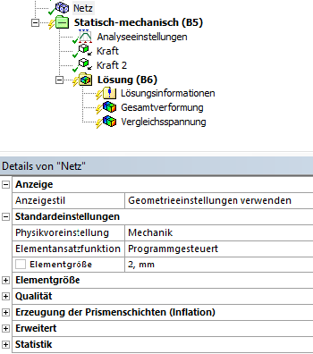

# ANSYS Mechanical und Übung Kragbalken

## ANSYS Mechanical

In ANSYS Workbench werden unter dem Begriff *Modell* sämtliche Definitionen zusammengefasst, die zwischen Geometrie und Lastfallbeschreibung liegen. Dazu gehören:

* Materialeigenschaften und Zusatzmassen,
* Hilfsgeometrien für Randbedingungen und Auswertungen,
* virtuelle Topologien zur Vernetzungssteuerung,
* Koordinatensysteme und Kontakte,
* Netzdefinitionen sowie
* Kombinationen mehrerer Lastfälle.

Die **Mechanical-Applikation (ANSYS Mechanical)** dient dabei als zentrales FEM-Werkzeug. Hier werden physikalische Eigenschaften zugewiesen, Netze generiert, Berechnungen gestartet und Ergebnisse visualisiert. Ein Mechanical-Fenster kann mehrere Berechnungszweige mit unterschiedlichen Lastfällen enthalten. Der Aufbau dieser Struktur wird durch den Projektmanager festgelegt. Ein Doppelklick auf *Modell* öffnet die Mechanical-Applikation.

---

### Benutzeroberfläche

[{width=700px}](media/03_mechanical_kragbalken/mechanical_ui.png "Mechanical-Applikation in ANSYS"){.glightbox}  

Typische Elemente der Oberfläche:

* **Links**: Strukturbaum mit Analyseobjekten  
* **Darunter**: Detailfenster für das aktuell markierte Element  
* **Oben**: Menü, Darstellungstools, Selektionseinstellungen  
* **Über der Geometrieanzeige**: kontextsensitive Befehle

### Statusanzeigen im Strukturbaum

* Grüner Haken: Eingabe vollständig  
* Blaues Fragezeichen: Eingabe fehlt  
* Graues X: Element unterdrückt  
* Rotes Ausrufezeichen: Unstimmigkeit  
* Gelber Blitz: Bereit zur Berechnung  
* Grüner Blitz: Berechnung läuft  
* Roter Blitz: Berechnung abgebrochen  
* Grüner Pfeil: Ausgelagerte Berechnung kann geladen werden  
* Roter Pfeil: Ausgelagerte, abgebrochene Berechnung  

### Farben im Detailfenster

* Gelb: Eingabe unvollständig  
* Weiß: Eingabe erlaubt  
* Grau: Nur Anzeige (nicht änderbar)  
* Rot: Ungültig, z. B. nach Änderung ohne Neuberechnung

### Steuerung der Ansicht

[{width=500px}](media/03_mechanical_kragbalken/ansichtsteuerung.png "Steuerung der Ansichten"){.glightbox}  

Typische Funktionen:

* Rotieren, Verschieben, Zoomen  
* In Rahmen oder Fenster einpassen  
* Vorige/Nächste Ansicht  
* ISO-Ansichten, Draufsicht  
* Ansicht speichern oder verwalten

### Selektionsmöglichkeiten

Die Selektion erfolgt über Mausaktionen.

* Auswahltyp über Icons festlegen: Punkt, Kante, Fläche, Körper  
* Mouseover hebt Geometrien optisch hervor  
* Mit Klick selektieren; mit `STRG` Mehrfachauswahl  
* Entfernen durch erneuten Klick bei gedrückter `STRG`-Taste  
* **Fortlaufende Selektion**: gedrückte Maustaste → Flächen überfahren  
* **Auswahl erweitern**: tangential angrenzende Flächen hinzufügen  
* Tangentenwinkel (Standard: 20°) in den Einstellungen einstellbar  
* Doppelte Anwendung der Funktion erweitert tangential erneut  
* **Angrenzend/Alle**: selektiert alle tangential verbundenen Flächen bis zur nächsten scharfen Kante

[{width=600px}](media/03_mechanical_kragbalken/selektion.png "Selektionsfunktionen"){.glightbox}  

**Verdeckte Objekte selektieren:**

Beim Klick auf überlagerte Geometrie erscheint ein Auswahlfenster im 3D-Viewer. Mit der Maus kann eine der überlagerten Flächen gezielt ausgewählt werden.  
Bei Baugruppen sind die Flächen farblich entsprechend ihrer Bauteilzugehörigkeit gekennzeichnet.

---

### Geometrie

Im Abschnitt *Geometrie* erscheinen alle importierten Bauteile mit ihren Eigenschaften.

Funktionen:

* Sichtbarkeit ein-/ausblenden  
* Elemente unterdrücken oder wiederherstellen  
* Materialzuweisung je Teil  
* Hinzufügen von Punktmassen (verformbar oder starr)  
  → Diese Entscheidung beeinflusst das Rechenergebnis erheblich.

---

### Koordinatensysteme

Nach dem Geometrieimport erscheint zunächst das globale Koordinatensystem – meist identisch mit dem Creo-Koordinatensystem.

Weitere lokale Koordinatensysteme lassen sich über das Kontextmenü erzeugen. Dazu:

* Geometrie selektieren  
* Einfügen → Koordinatensystem

**Logik für den Ursprung:**

* Punkt → exakt dort  
* Linie → in der Mitte  
* Kreis/Bogen → im Zentrum  
* Fläche → Flächenschwerpunkt  
* Zylinderfläche → Achse, axial mittig

[{width=350px}](media/03_mechanical_kragbalken/koordinaten.png "Koordinatensysteme bearbeiten"){.glightbox}  

Erstellte Systeme lassen sich verschieben oder verdrehen.

---

### Netz

#### Grundlegendes zur Vernetzung

Die Vernetzung unterteilt das Bauteil in finite Elemente, die über Knoten verbunden sind.

In konstruktionsbegleitenden FEM-Anwendungen ist keine aufwendige Netzoptimierung erforderlich – moderne Rechner bewältigen auch gröbere Netze. Entscheidend ist hier die **Unabhängigkeit des Ergebnisses vom Netz**, nicht die perfekte Netzqualität.

Dazu führt man eine **Netzeinflussstudie** durch:

* Variation der globalen Elementgröße  
* lokale Netzverfeinerung  
* adaptive Vernetzung (siehe Übung)

Ziel ist ein tragfähiger Kompromiss aus Ergebnisqualität und Rechenzeit.

#### Manuelle Vernetzung

!!! note "Hinweis"
    Dieser Abschnitt markiert den Einstieg in die praktische Arbeit mit Netzen in ANSYS.  
    Die manuelle Vernetzung ist die einfachste Methode zur Steuerung der Elementgrößen.

Die globale Elementgröße – also die durchschnittliche Kantenlänge der Elemente für das gesamte Modell – wird direkt im Strukturbaum unter dem Eintrag *Netz* eingestellt.

[{width=400px}](media/03_mechanical_kragbalken/globale_elementgröße.png "Globale Elementgröße festlegen"){.glightbox}  

Das Modell wird auf Basis dieses Wertes komplett mit Elementen vernetzt.  
**Problematisch wird dieses Vorgehen**, wenn das relevante Ergebnis nur in einem lokalen Bereich auftritt:  
Eine globale Verfeinerung erzeugt dann unnötig viele Elemente und verlängert die Rechenzeit erheblich – ohne zusätzlichen Nutzen.

Alternativ lässt sich das Netz auch **lokal verfeinern**:

* Unter *Netzsteuerung* kann man die **Elementgröße pro Bauteil oder Fläche** einzeln festlegen.
* Einzelne Geometriebereiche (z. B. Kanten, Flächen) lassen sich gezielt mit feineren Elementen versehen.
* Die Funktion *Methode* ermöglicht die Auswahl eines bestimmten **Elementtyps** (z. B. Tetraeder oder Hexaeder).  
  → Diese Auswahl sollte fundiert erfolgen – siehe Literatur.

Das manuelle Vorgehen eignet sich besonders für einfache Modelle oder gezielte Voruntersuchungen.

---

### Kontakte

Bei Baugruppen erzeugt ANSYS automatisch Kontaktflächen zwischen Bauteilen – optional können sie auch manuell definiert werden.

[{width=500px}](media/03_mechanical_kragbalken/kontakte.png "Kontakttypen in ANSYS"){.glightbox}  
Bildquelle[@Gebhardt2018]

Kontakte erfüllen zwei Aufgaben:

1. **Kraftübertragung**  
2. **Verhinderung von Durchdringung**

Typische Einstellungen:

* **Verbund**  
* **Keine Trennung**  
* **Reibungsfrei**  
* **Rau**  
* **Reibungsbehaftet**

Achtung bei komplexeren Kontaktmodellen:  
Kontakte mit Reibung oder Abheben erfordern deutlich mehr Rechenzeit. Für die meisten Fälle sind *Verbund* oder *Keine Trennung* ein guter Kompromiss.

!!! note "Hinweis"
    Diese Übersicht vermittelt nur die Grundlagen der Kontaktdefinition.  
    Die konkrete Anwendung, Auswahl und Bewertung von Kontakten erfolgt in späteren Übungen.

## Übung Kragbalken  
