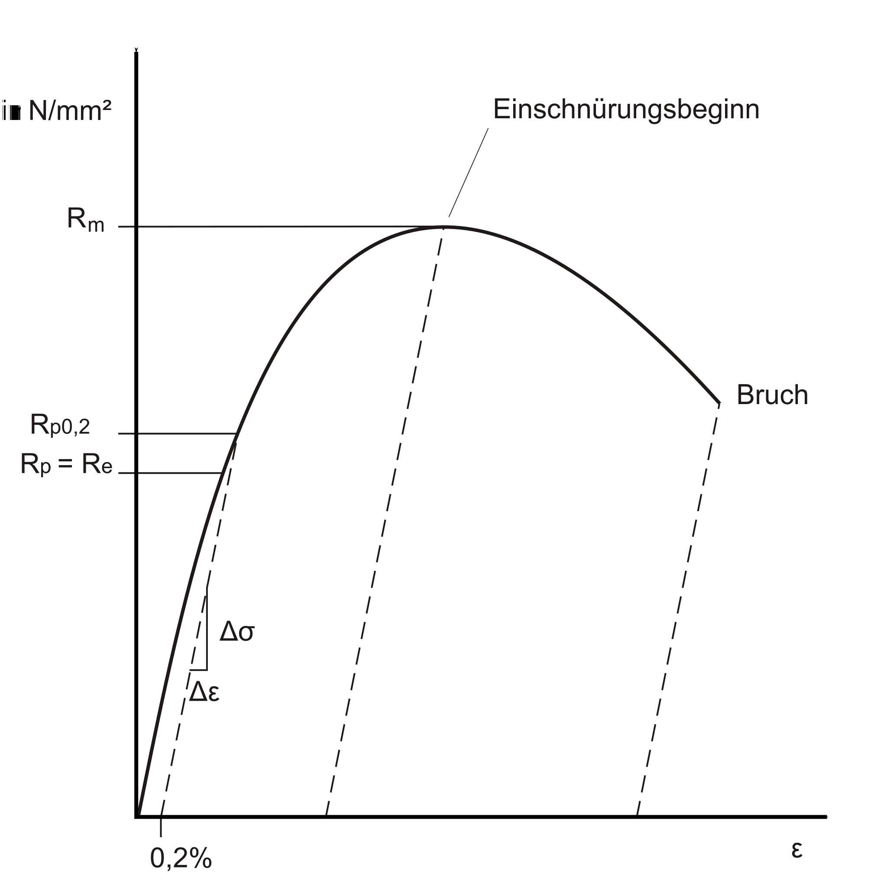
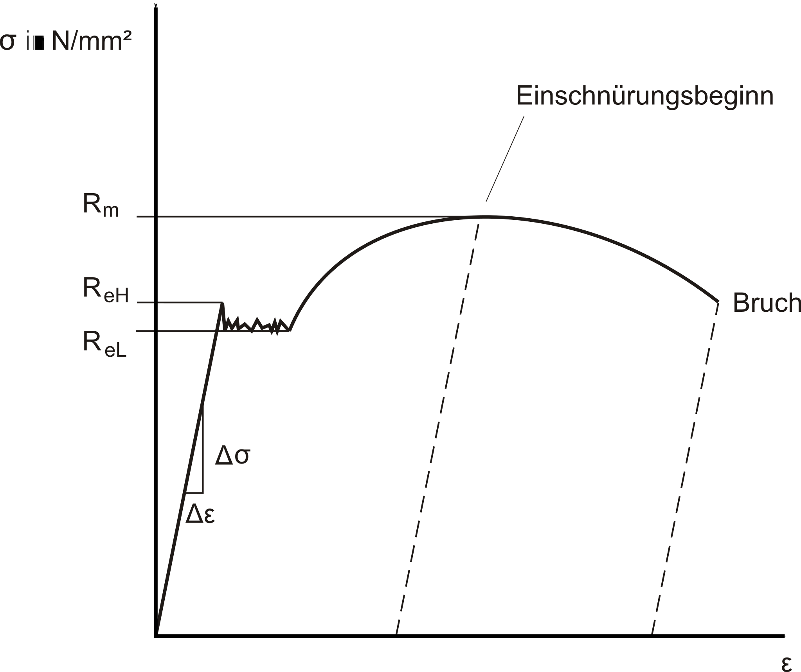

# ANSYS Mechanical und Übung Kragbalken

## ANSYS Mechanical

In ANSYS Workbench werden unter dem Begriff *Modell* sämtliche Definitionen zusammengefasst, die zwischen Geometrie und Lastfallbeschreibung liegen. Dazu gehören:

* Materialeigenschaften und Zusatzmassen,
* Hilfsgeometrien für Randbedingungen und Auswertungen,
* virtuelle Topologien zur Vernetzungssteuerung,
* Koordinatensysteme und Kontakte,
* Netzdefinitionen sowie
* Kombinationen mehrerer Lastfälle.

Die **Mechanical-Applikation (ANSYS Mechanical)** dient dabei als zentrales FEM-Werkzeug. Hier werden physikalische Eigenschaften zugewiesen, Netze generiert, Berechnungen gestartet und Ergebnisse visualisiert. Ein Mechanical-Fenster kann mehrere Berechnungszweige mit unterschiedlichen Lastfällen enthalten. Der Aufbau dieser Struktur wird durch den Projektmanager festgelegt.  
Ein Doppelklick auf *Modell* öffnet die Mechanical-Applikation.

---

### Benutzeroberfläche

[{width=700px}](media/03_mechanical_kragbalken/mechanical_ui.png "Mechanical-Applikation in ANSYS"){.glightbox}  

Typische Elemente der Oberfläche:

* **Links**: Strukturbaum mit Analyseobjekten  
* **Darunter**: Detailfenster für das aktuell markierte Element  
* **Oben**: Menü, Darstellungstools, Selektionseinstellungen  
* **Über der Geometrieanzeige**: kontextsensitive Befehle

### Statusanzeigen im Strukturbaum

* Grüner Haken: Eingabe vollständig  
* Blaues Fragezeichen: Eingabe fehlt  
* Graues X: Element unterdrückt  
* Rotes Ausrufezeichen: Unstimmigkeit  
* Gelber Blitz: Bereit zur Berechnung  
* Grüner Blitz: Berechnung läuft  
* Roter Blitz: Berechnung abgebrochen  
* Grüner Pfeil: Ausgelagerte Berechnung kann geladen werden  
* Roter Pfeil: Ausgelagerte, abgebrochene Berechnung  

### Farben im Detailfenster

* Gelb: Eingabe unvollständig  
* Weiß: Eingabe erlaubt  
* Grau: Nur Anzeige (nicht änderbar)  
* Rot: Ungültig, z. B. nach Änderung ohne Neuberechnung

### Steuerung der Ansicht

[{width=500px}](media/03_mechanical_kragbalken/ansichtsteuerung.png "Steuerung der Ansichten"){.glightbox}  

Typische Funktionen:

* Rotieren, Verschieben, Zoomen  
* In Rahmen oder Fenster einpassen  
* Vorige/Nächste Ansicht  
* ISO-Ansichten, Draufsicht  
* Ansicht speichern oder verwalten

### Selektionsmöglichkeiten

Die Selektion erfolgt über Mausaktionen.

* Auswahltyp über Icons festlegen: Punkt, Kante, Fläche, Körper  
* Mouseover hebt Geometrien optisch hervor  
* Mit Klick selektieren; mit `STRG` Mehrfachauswahl  
* Entfernen durch erneuten Klick bei gedrückter `STRG`-Taste  
* **Fortlaufende Selektion**: gedrückte Maustaste → Flächen überfahren  
* **Auswahl erweitern**: tangential angrenzende Flächen hinzufügen  
* Tangentenwinkel (Standard: 20°) in den Einstellungen einstellbar  
* Doppelte Anwendung der Funktion erweitert tangential erneut  
* **Angrenzend/Alle**: selektiert alle tangential verbundenen Flächen bis zur nächsten scharfen Kante

[{width=600px}](media/03_mechanical_kragbalken/selektion.png "Selektionsfunktionen"){.glightbox}  

**Verdeckte Objekte selektieren:**

Beim Klick auf überlagerte Geometrie erscheint ein Auswahlfenster im 3D-Viewer. Mit der Maus kann eine der überlagerten Flächen gezielt ausgewählt werden.  
Bei Baugruppen sind die Flächen farblich entsprechend ihrer Bauteilzugehörigkeit gekennzeichnet.

---

### Geometrie

Im Abschnitt *Geometrie* erscheinen alle importierten Bauteile mit ihren Eigenschaften.

Funktionen:

* Sichtbarkeit ein-/ausblenden  
* Elemente unterdrücken oder wiederherstellen  
* Materialzuweisung je Teil  
* Hinzufügen von Punktmassen (verformbar oder starr)  
  → Diese Entscheidung beeinflusst das Rechenergebnis erheblich.

---

### Koordinatensysteme

Nach dem Geometrieimport erscheint zunächst das globale Koordinatensystem – meist identisch mit dem Creo-Koordinatensystem.

Weitere lokale Koordinatensysteme lassen sich über das Kontextmenü erzeugen. Dazu:

* Geometrie selektieren  
* Einfügen → Koordinatensystem

**Logik für den Ursprung:**

* Punkt → exakt dort  
* Linie → in der Mitte  
* Kreis/Bogen → im Zentrum  
* Fläche → Flächenschwerpunkt  
* Zylinderfläche → Achse, axial mittig

[{width=350px}](media/03_mechanical_kragbalken/koordinaten.png "Koordinatensysteme bearbeiten"){.glightbox}  

Erstellte Systeme lassen sich verschieben oder verdrehen.

---

### Netz

#### Grundlegendes zur Vernetzung

Die Vernetzung unterteilt das Bauteil in finite Elemente, die über Knoten verbunden sind.

In konstruktionsbegleitenden FEM-Anwendungen ist keine aufwendige Netzoptimierung erforderlich – moderne Rechner bewältigen auch gröbere Netze. Entscheidend ist hier die **Unabhängigkeit des Ergebnisses vom Netz**, nicht die perfekte Netzqualität.

Dazu führt man eine **Netzeinflussstudie** durch:

* Variation der globalen Elementgröße  
* lokale Netzverfeinerung  
* adaptive Vernetzung (siehe Übung)

Ziel ist ein tragfähiger Kompromiss aus Ergebnisqualität und Rechenzeit.

#### Manuelle Vernetzung

!!! note "Hinweis"
    Dieser Abschnitt markiert den Einstieg in die praktische Arbeit mit Netzen in ANSYS.  
    Die manuelle Vernetzung ist die einfachste Methode zur Steuerung der Elementgrößen.

Die globale Elementgröße – also die durchschnittliche Kantenlänge der Elemente für das gesamte Modell – wird direkt im Strukturbaum unter dem Eintrag *Netz* eingestellt.

[{width=400px}](media/03_mechanical_kragbalken/globale_elementgröße.png "Globale Elementgröße festlegen"){.glightbox}  

Das Modell wird auf Basis dieses Wertes komplett mit Elementen vernetzt.  
**Problematisch wird dieses Vorgehen**, wenn das relevante Ergebnis nur in einem lokalen Bereich auftritt:  
Eine globale Verfeinerung erzeugt dann unnötig viele Elemente und verlängert die Rechenzeit erheblich – ohne zusätzlichen Nutzen.

Alternativ lässt sich das Netz auch **lokal verfeinern**:

* Unter *Netzsteuerung* kann man die **Elementgröße pro Bauteil oder Fläche** einzeln festlegen.
* Einzelne Geometriebereiche (z. B. Kanten, Flächen) lassen sich gezielt mit feineren Elementen versehen.
* Die Funktion *Methode* ermöglicht die Auswahl eines bestimmten **Elementtyps** (z. B. Tetraeder oder Hexaeder).  
  → Diese Auswahl sollte fundiert erfolgen – siehe Literatur.

Das manuelle Vorgehen eignet sich besonders für einfache Modelle oder gezielte Voruntersuchungen.

---

### Kontakte

Bei Baugruppen erzeugt ANSYS automatisch Kontaktflächen zwischen Bauteilen – optional können sie auch manuell definiert werden.

[{width=500px}](media/03_mechanical_kragbalken/kontakte.png "Kontakttypen in ANSYS"){.glightbox}  
Bildquelle[@Gebhardt2018]

Kontakte erfüllen zwei Aufgaben:

1. **Kraftübertragung**  
2. **Verhinderung von Durchdringung**

Typische Einstellungen:

* **Verbund**  
* **Keine Trennung**  
* **Reibungsfrei**  
* **Rau**  
* **Reibungsbehaftet**

Achtung bei komplexeren Kontaktmodellen:  
Kontakte mit Reibung oder Abheben erfordern deutlich mehr Rechenzeit. Für die meisten Fälle sind *Verbund* oder *Keine Trennung* ein guter Kompromiss.

!!! note "Hinweis"
    Diese Übersicht vermittelt nur die Grundlagen der Kontaktdefinition.  
    Die konkrete Anwendung, Auswahl und Bewertung von Kontakten erfolgt in späteren Übungen.

## Übung Kragbalken  

### Aufgabenstellung

Berechnen Sie für den in der Abbildung dargestellten Kragbalken quadratischen Querschnitts die maximale Spannung und die Verformung mit ANSYS Mechanical.  

* Länge: \( L = 150 \,\text{mm} \)  
* Kantenlänge: \( a = 12 \,\text{mm} \)  
* Kraft: \( F = 7{.}500 \,\text{N} \)  
* Material: Baustahl mit Streckgrenze \( R_e = 250 \,\text{N/mm}^2 \)  

Laden Sie die Datei [kragbalken.stp](media/03_mechanical_kragbalken/kragbalken.stp) und importieren Sie sie in ANSYS Workbench.

Gleichen Sie Ihr Ergebnis mit der analytischen Lösung ab und diskutieren Sie die etwaige Abweichung.  

[{width=500px}](media/03_mechanical_kragbalken/kragbalken_zug.svg "Kragbalken, Zug"){.glightbox}  

---

### Theoretischer Hintergrund

#### Hookesches Gesetz

Die Berechnung basiert auf dem **Hookeschen Gesetz**. Es beschreibt den linearen Zusammenhang zwischen Spannung und Dehnung im elastischen Bereich eines Werkstoffs.

\[
\sigma = \frac{F}{A},  
\quad \varepsilon = \frac{\Delta l}{l},  
\quad E = \frac{\sigma}{\varepsilon}
\]

mit  

* \( \sigma \): Normalspannung  
* \( F \): aufgebrachte Kraft  
* \( A = a^2 \): Querschnittsfläche des Balkens  
* \( \varepsilon \): Dehnung in Belastungsrichtung  
* \( E \): Elastizitätsmodul (Materialkonstante)  

Die **Längenänderung** ergibt sich zu:

\[
\Delta l = \frac{F \cdot l}{A \cdot E}
\]

---

#### Querkontraktion

???+ danger "FIXME"
    Hier noch eine Abbildung einfügen, die den Zusammenhang von Längsdehnung und Querkontraktion schematisch darstellt.

Neben der Dehnung in Belastungsrichtung tritt eine Querkontraktion auf. Sie wird durch die **Querkontraktionszahl** (Poissonzahl) \(\nu\) beschrieben.  
Sie definiert das Verhältnis von Querdehnung zur Längsdehnung:

\[
\nu \;=\; - \frac{\varepsilon_q}{\varepsilon_l}
\]

mit  

\[
\varepsilon_l = \frac{\Delta l}{l},  
\qquad
\varepsilon_q = \frac{\Delta a}{a}
\]

* \( \varepsilon_l \): Längsdehnung  
* \( \varepsilon_q \): Querdehnung  
* \( \Delta l \): Längenänderung  
* \( \Delta a \): Querschnittsänderung (z. B. Kantenlänge bei quadratischem Balken)  
* \( l, a \): ursprüngliche Länge bzw. Querschnittsmaß  

Damit ergibt sich:

\[
\varepsilon_q = -\nu \cdot \varepsilon_l
\]

Für Stahl gilt typischerweise \(\nu \approx 0{,}3\).  
Das bedeutet: Bei einer Längsdehnung von 1 % verkürzt sich der Querschnitt quer um 0,3 %.  

---

#### Spannungs-Dehnungs-Diagramm

Das Hookesche Gesetz gilt nur im **linear-elastischen Bereich** eines Werkstoffes. Dieser Bereich ist im Spannungs-Dehnungs-Diagramm als gerade Linie erkennbar. Das erste Diagramm zeigt das Verhalten eines Werkstoffs **ohne ausgeprägte Streckgrenze**. Nach dem linearen Anstieg bis zur Dehngrenze geht die Kurve allmählich in den plastischen Bereich über.  
Typisch ist dieses Verhalten bei vielen NE-Metallen, etwa Aluminium:

[{width=450}](media/03_mechanical_kragbalken/Spgs-Dehnungs-Kurve_Dehngrenze.svg "Spannungs-Dehnungs-Kurve ohne ausgeprägte Streckgrenze"){.glightbox}  
Bildquelle[@Wikipedia2023]

Das zweite Diagramm zeigt das Verhalten eines Werkstoffs **mit ausgeprägter Streckgrenze**, wie es für Baustahl typisch ist. Der lineare Bereich endet abrupt, es folgt ein Plateau mit nahezu konstanter Spannung, bevor der plastische Anstieg beginnt:

[{width=450}](media/03_mechanical_kragbalken/Spgs-Dehnungs-Kurve_Streckgrenze.svg "Spannungs-Dehnungs-Kurve mit ausgeprägter Streckgrenze"){.glightbox}  
Bildquelle[@Wikipedia2023]

Für die Berechnung des Kragbalkens in dieser Übung liegt die Belastung im **elastischen Bereich**. Das Hookesche Gesetz ist daher ausreichend.

---

### Umsetzung in ANSYS Mechanical

#### 1. Geometrieimport

Laden Sie die Datei [kragbalken.stp](media/03_mechanical_kragbalken/kragbalken.stp) in ANSYS Workbench.  

???+ danger "FIXME"
    Screenshot sinnvoll?

#### 2. Materialdefinition

Weisen Sie Baustahl aus der ANSYS-Datenbank zu.

???+ danger "FIXME"
    Screenshot

#### 3. Randbedingungen

Für die Berechnung werden zwei Randbedingungen benötigt:

* **Feste Einspannung** am linken Ende  
* **Zugkraft** \( F \) an der rechten Stirnfläche  

Die feste Einspannung wird in ANSYS umgesetzt, indem **alle Freiheitsgrade** der ausgewählten Fläche blockiert werden. Das bedeutet konkret: Translationen in \(x\)-, \(y\)- und \(z\)-Richtung sowie Rotationen um alle drei Achsen sind dort nicht mehr möglich. Im physikalischen Sinn wird so die Verbindung des Balkens mit einer starren Umgebung modelliert.

Die Zugkraft wird an der rechten Stirnfläche aufgebracht. In ANSYS erfolgt dies über die Angabe einer **Flächenlast (Druck)** oder einer **Gesamtkraft (Kraft)**, die sich über die gesamte Fläche verteilt. Damit wird sichergestellt, dass die Kraft nicht punktförmig wirkt (was numerisch eine Singularität erzeugen würde), sondern gleichmäßig eingeleitet wird.

Aus FEM-Sicht geschieht Folgendes:

* Die Einspannung erzeugt eine **Verschiebungsrandbedingung**:  
  Knoten in diesem Bereich können sich nicht bewegen → Reaktionskräfte bilden sich aus.
* Die Zugkraft erzeugt eine **Lastbedingung**:  
  Knoten in diesem Bereich erfahren zusätzliche äußere Kräfte → führen zu inneren Spannungen und Verformungen im gesamten Bauteil.

Im Zusammenspiel von **verschiebungsgebundenen** und **kraftgebundenen** Randbedingungen entsteht ein **geschlossenes Gleichungssystem**, das im FEM‑Solver gelöst wird.

???+ note "Hinweis zur Modellierung"
    Wird die Kraft nur auf eine kleine Kante oder einen einzelnen Knoten angesetzt, entstehen unrealistisch hohe lokale Spannungen (Singularitäten). Deshalb immer eine Fläche auswählen, um die Last realistisch zu verteilen.
  
???+ danger "FIXME"
    Screenshots?

#### 4. Netzgenerierung

Für die Berechnung wird das Bauteil in finite Elemente unterteilt, die über Knoten miteinander verbunden sind. Dieser Vorgang heißt **Vernetzung**.  

* Zunächst wird eine **globale automatische Vernetzung** erzeugt.  
  Dabei vergibt ANSYS eine Elementgröße, die für das gesamte Modell gilt.  
  Das Netz entsteht schnell und gleichmäßig, ist aber oft nicht optimal für lokale Details.  

* Im zweiten Schritt wird die **Elementgröße variiert**, um den **Netzeinfluss** zu untersuchen.  
  Ziel ist zu prüfen, ob das Ergebnis (Spannung, Verformung) stabil bleibt, wenn das Netz feiner wird.  
  Nur wenn sich die Ergebnisse kaum noch ändern, gilt die Lösung als verlässlich.  

Aus FEM-Sicht gilt:  

* Zu grobes Netz → geringe Rechenzeit, aber möglicherweise ungenaue Ergebnisse.  
* Zu feines Netz → hohe Genauigkeit, aber deutlich längere Rechenzeit.  
* Optimal ist ein Netz, das **ausreichend genaue Ergebnisse** liefert, ohne unnötig viele Elemente zu erzeugen.  

Diese einfache Netzeinflussstudie vermittelt den Grundgedanken, dass FEM-Ergebnisse nicht automatisch exakt sind, sondern von der **Diskretisierung** abhängen.

???+ danger "FIXME"
    Screenshot

#### 5. Auswertung

Für die erste Auswertung in ANSYS werden zwei Ergebnisse betrachtet:

* **Verformung (Gesamtverschiebung)**  
* **Spannung nach von Mises**

Die Verformung zeigt die Gesamtauslenkung des Bauteils. In ANSYS wird sie üblicherweise in überhöhter Darstellung angezeigt, damit die Formänderung deutlich erkennbar ist. Wichtig ist, dass es sich dabei um eine **Skalierung zur Visualisierung** handelt – die Werte sind den Ergebnistabellen zu entnehmen.  

Die von-Mises-Spannung ist ein Vergleichswert, der die kombinierte Wirkung aller Normal- und Schubspannungen zu einer einzigen „äquivalenten“ Spannung zusammenfasst:

\[
\sigma_\text{vM} = \sqrt{\frac{1}{2} \left[(\sigma_x-\sigma_y)^2 + (\sigma_y-\sigma_z)^2 + (\sigma_z-\sigma_x)^2 \right] + 3(\tau_{xy}^2+\tau_{yz}^2+\tau_{zx}^2)}
\]

Dieser Wert eignet sich besonders gut, um in der späteren Festigkeitsbewertung mit einer zulässigen Spannung zu vergleichen, auch wenn verschiedene Spannungsanteile gleichzeitig wirken. Für den hier betrachteten Zugbalken im linearen Bereich sollte die von-Mises-Spannung nahe bei der Normalspannung aus der analytischen Lösung liegen.  

Auswertungsschritte in ANSYS:

1. Auswahl der **Gesamtverformung** → Kontrolle der Größenordnung und Plausibilität.  
2. Darstellung der **von-Mises-Spannung** → Vergleich mit analytisch berechneter Spannung.  
3. Beurteilung der **Spannungsverteilung** im Bauteil.  

???+ danger "FIXME"
    Screenshot

---

### Diskussion der Ergebnisse

#### Vergleich mit analytischer Lösung

Erwartung: Sehr gute Übereinstimmung der mittleren Spannung und der Verformungen

Ergebnisse aus ANSYS...

???+ danger "FIXME"
    Screenshots hinzu und Diskussion zu "was sieht man"

???+ danger "FIXME"
    Einheiten in Formeln ergänzen

??? note "Berechnung von Δl, Δa und σ"
    Für die analytische Lösung werden die Längenänderung Δl, die Querschnittsänderung Δa und die Normalspannung σ bestimmt.

    **Spannung**

    \[
    \sigma = \frac{F}{A}
    \]

    Mit den gegebenen Werten:

    \[
    F = 7{.}500 \,\text{N}, \quad A = 144 \,\text{mm}^2
    \]

    \[
    \sigma = \frac{7{.}500}{144} \approx 52{,}1 \,\text{N/mm}^2
    \]

    **Längenänderung**

    \[
    \Delta l = \frac{F \cdot l}{A \cdot E}
    \]

    Eingesetzt mit den Werten der Aufgabe:

    \[
    l = 150 \,\text{mm}, \quad E = 210{.}000 \,\text{N/mm}^2
    \]

    \[
    \Delta l = \frac{7{.}500 \cdot 150}{144 \cdot 210{.}000} 
             \approx 0{,}037 \,\text{mm}
    \]

    **Querschnittsänderung**

    Über die Querkontraktionszahl \(\nu = 0{,}3\):

    \[
    \varepsilon_q = - \nu \cdot \varepsilon_l
    \]

    mit  

    \[
    \varepsilon_l = \frac{\Delta l}{l} = \frac{0{,}037}{150} \approx 2{,}47 \cdot 10^{-4}
    \]

    \[
    \varepsilon_q = -0{,}3 \cdot 2{,}47 \cdot 10^{-4}
                  \approx -7{,}4 \cdot 10^{-5}
    \]

    Daraus ergibt sich die Querschnittsänderung:

    \[
    \Delta a = \varepsilon_q \cdot a = -7{,}4 \cdot 10^{-5} \cdot 12
             \approx -8{,}9 \cdot 10^{-4} \,\text{mm}
    \]

    **Ergebnis:**  
    * Normalspannung: ca. **52 N/mm²**  
    * Verlängerung des Balkens: ca. **0,037 mm**  
    * Verringerung der Kantenlänge: ca. **0,0009 mm**

#### Einfluss des Netzes

* Grobes Netz → geringere Genauigkeit.  
* Feines Netz → längere Rechenzeit, bessere Übereinstimmung.  
* Ziel: Ergebnis unabhängig vom Netz (Netzeinfluss weitgehend eliminiert).  

???+ danger "FIXME"
    Screenshots hinzu. Sinnvoll?
    Thema hier überhaupt sinnvoll? Divergenz an der Einspannung...

#### Verhinderte Querkontraktion

In der Realität kann sich der Balken quer zur Belastungsrichtung verkürzen.  
Im FEM‑Modell mit fester Einspannung wird diese **Querkontraktion lokal verhindert**.  
Dadurch entstehen **Randspannungsspitzen**, die analytisch nicht vorhergesagt werden.  
→ Erklärung für Abweichungen zwischen analytischer und numerischer Lösung nahe der Einspannung.

---

### Add-on: Biegemoment statt Kraft

Als Alternative kann ein **reines Biegemoment** angesetzt werden.  
Dies führt zu einem **querkraftfreien Balken** mit gleichmäßigerem Spannungsfeld.

* Umsetzung: Lasttyp „Moment“ an der Stirnfläche.  
* Beobachtung: Gleichmäßiger Verlauf, keine Singularität durch Krafteinleitung.  

???+ danger "FIXME"
    Screenshots hinzufügen: Moment an Stirnfläche.

---

### Varianten der Krafteinleitung

In ANSYS Mechanical stehen verschiedene Möglichkeiten zur Verfügung, eine äußere Belastung aufzubringen. Die Auswahl beeinflusst maßgeblich die Spannungsverteilung und die physikalische Plausibilität.

* **Kraft auf Fläche**  
  Die empfohlene Variante für den Kragbalken:  
  Eine Gesamtkraft wird gleichmäßig über eine Fläche verteilt.  
  → Verhindert unrealistisch hohe Spannungen, die bei punktförmiger Last entstehen würden.  

* **Kantenlast**  
  Belastung entlang einer Kante.  
  Wird verwendet, wenn eine reale Krafteinleitung tatsächlich über eine Linie erfolgt, z. B. durch eine Schweißnaht oder Auflagerkante.  
  → Achtung: höhere Spannungsgradienten, Netzqualität besonders wichtig.  

* **Punktlast**  
  Kraft wirkt in einem einzelnen Knoten.  
  → In der Praxis meist zu vermeiden, da dies numerisch zu Singularitäten führt.  
  Nur in Spezialfällen für theoretische Modellierungen sinnvoll.  

* **Moment**  
  Lasttyp „Moment“ auf Fläche oder Kante.  
  → Besonders geeignet, wenn gezielt ein konstantes Biegemoment ohne Querkraft wirken soll.  

* **Vektoren und Richtungswahl**  
  In ANSYS kann die Richtung der Kraft gewählt werden:  
    * globales Koordinatensystem (x, y, z)  
    * lokales Koordinatensystem (z. B. Bauteilorientierung)  
    * benutzerdefinierte Richtung über Vektor-Eingabe  
    → Wichtig, um sicherzustellen, dass die Kraft in der beabsichtigten Raumrichtung wirkt.  

Diese Auswahl verdeutlicht, dass die „gleiche“ Belastung je nach Ansetzpunkt und Typ sehr unterschiedliche Ergebnisse liefern kann. Die Entscheidung, wie eine Last angesetzt wird, gehört deshalb zu den wesentlichen Modellierungsaufgaben im FEM.

---

### Weiterführende Hinweise

???+ danger "FIXME"
    Video hinzu?
