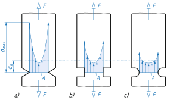
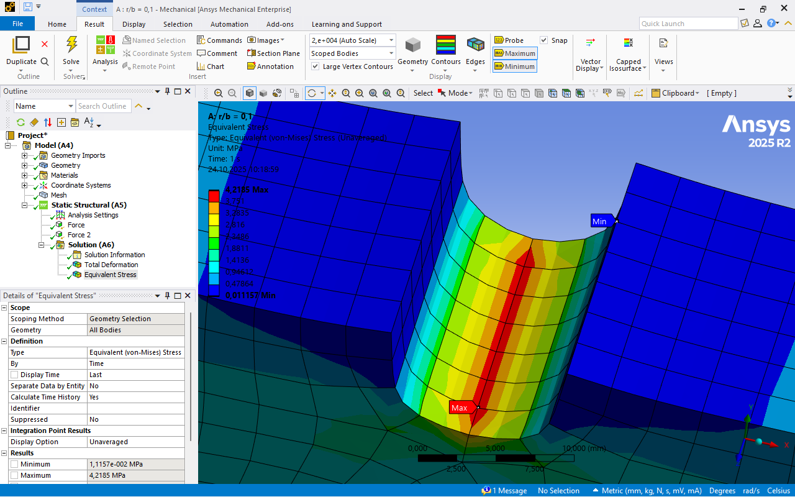
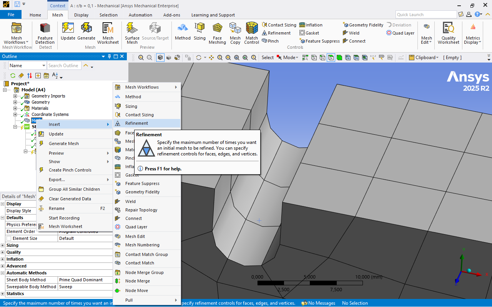
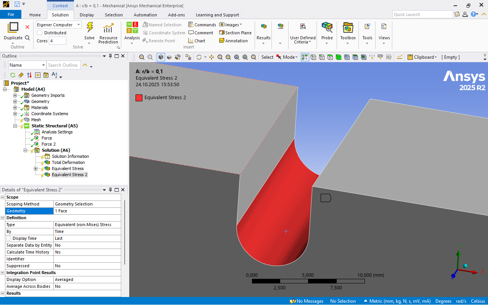

# Module 2 Stress Concentration

## Learning Objectives

After completing this chapter, you should be able to

* explain the concept of **notch effect / stress concentration** and describe the physical causes of local stress increases,  
* explain the relationship between **notch shape factor** and **stress concentration**,  
* determine the **notch shape factor** using the Finite Element Method (FEM) for various notch radii,  
* carry out a **mesh influence study** and assess when a result can be considered **mesh-independent**,  
* critically analyze the calculation results and compare them with theoretical values,  
* apply suitable **refinement strategies** (local, adaptive) in the FEM tool to achieve a convergent solution with reasonable computation time.

## Mathematical Fundamentals of FEM

The FEM is a numerical method for the approximate solution of continuous field problems. This chapter explains the basic mathematical relationships of the method. Considering FEM as a design-supporting tool, detailed knowledge of simulation setup and evaluation plays an important role. Even more crucial, however, is the physical understanding of the underlying problem[@Gebhardt2018].

A complete description of a physical problem includes:

* the **geometry** defining the domain  
* the **field equations** within the domain  
* the **boundary conditions**[@Merkel2020]  

The following sections illustrate the procedure using simple examples.

---

### Calculation with One Element

A single bar element is subjected to two external forces. The forces _F₁_ and _F₂_ cause elongations _u₁_ and _u₂_. The bar has a length _l_. The nodes define the element boundaries and its degrees of freedom.

[{width=700px}](media/04_kerbwirkung/Stab-Element_1.png "Bar element"){.glightbox}  

#### Fundamental Finite Equation

\[
F = c \cdot \Delta u
\]

The total force _F_ is obtained as the product of the spring stiffness _c_ and the elongation \(\Delta u = u_1 - u_2\).  

According to Hooke’s law:

\[
\sigma = \varepsilon \cdot E \quad \text{and} \quad \varepsilon = \frac{\Delta l}{l}
\]

With \(\sigma_z = \frac{F_z}{A}\), the spring stiffness is:

\[
c = \frac{E \cdot A}{l}
\]

Hence: The product of the elastic modulus _E_ and cross-sectional area _A_ divided by the length _l_ gives the spring stiffness _c_.

#### Force Equilibrium

\[
\begin{aligned}
F_1 &= c \cdot (u_1 - u_2) = c \cdot u_1 - c \cdot u_2 \\
F_2 &= c \cdot (-u_1 + u_2) = -c \cdot u_1 + c \cdot u_2
\end{aligned}
\]

In matrix form:

$$
\begin{bmatrix}
F_1 \\[4pt]
F_2
\end{bmatrix}
=
c
\begin{bmatrix}
1 & -1 \\[4pt]
-1 & 1
\end{bmatrix}
\begin{bmatrix}
u_1 \\[4pt]
u_2
\end{bmatrix}
$$

For a fixed support at the left end, \(u_1 = 0\). The system simplifies to:

\[
F_2 = c \cdot u_2
\]

and therefore:

\[
u_2 = \frac{F_2}{c}
\]

---

### Calculation with Two Elements

The example is extended to two bar elements with one fixed support.

[{width=700px}](media/04_kerbwirkung/Stab-Element_2.png "Bar element"){.glightbox}  

Given:

* \(u_1 = 0\)
* \(c_1, c_2\)
* \(F_2 = 2F\)
* \(F_3 = -F\)

Find:

* \(F_1\) (reaction force)
* \(u_2, u_3\)

#### Force Vector

$$
\vec{f} =
\begin{bmatrix}
F_1 \\[4pt]
F_2 \\[4pt]
F_3
\end{bmatrix}
=
\begin{bmatrix}
F_1 \\[4pt]
2F \\[4pt]
- F
\end{bmatrix}
$$

#### Global Stiffness Matrix

The element stiffness matrix describes the stiffness of an element as a function of its length, cross-section, and material parameters. The global stiffness matrix is obtained as the sum of all element stiffness matrices:

\[
k = \sum_{i=1}^{z} k_i
\]

For two bars:

\[
k =
\begin{bmatrix}
c_1 & -c_1 & 0 \\[4pt]
-c_1 & c_1 + c_2 & -c_2 \\[4pt]
0 & -c_2 & c_2
\end{bmatrix}
\]

For identical stiffness values \(c_1 = c_2 = c\):

\[
k =
\begin{bmatrix}
c & -c & 0 \\[4pt]
-c & 2c & -c \\[4pt]
0 & -c & c
\end{bmatrix}
\]

#### Fundamental Equation in Vector Form

The fundamental equation in vector form is:

\[
\vec{f} = k \cdot \vec{d}
\]

The matrix–vector product of the displacement vector \(\vec{d}\) and the stiffness matrix \(k\) yields the force vector \(\vec{f}\). As in the first example, a force equilibrium is established, which is directly written in matrix form:

$$
\begin{bmatrix}
F_1 \\[4pt]
F_2 \\[4pt]
F_3
\end{bmatrix}
=
\begin{bmatrix}
c & -c & 0 \\[4pt]
-c & 2c & -c \\[4pt]
0 & -c & c
\end{bmatrix}
\cdot
\begin{bmatrix}
u_1 \\[4pt]
u_2 \\[4pt]
u_3
\end{bmatrix}
$$

As stated above, \(u_1 = 0\). Thus:

$$
\begin{bmatrix}
F_1 \\[4pt]
F_2 \\[4pt]
F_3
\end{bmatrix}
=
\begin{bmatrix}
\cancel{c} & \cancel{-c} & 0 \\[4pt]
\cancel{-c} & 2c & -c \\[4pt]
0 & -c & c
\end{bmatrix}
\cdot
\begin{bmatrix}
\cancel{u_1} \\[4pt]
u_2 \\[4pt]
u_3
\end{bmatrix}
$$

and therefore:

$$
\begin{bmatrix}
F_2 \\[4pt]
F_3
\end{bmatrix}
=
\begin{bmatrix}
2F \\[4pt]
- F
\end{bmatrix}
=
\begin{bmatrix}
2c & -c \\[4pt]
-c & c
\end{bmatrix}
\cdot
\begin{bmatrix}
u_2 \\[4pt]
u_3
\end{bmatrix}
$$

The matrix representation is then transformed into a system of linear equations, which can be solved by addition:

\[
\begin{aligned}
\text{I:} & \quad 2F = 2c \cdot u_2 - c \cdot u_3 \\[4pt]
\text{II:} & \quad -F = -c \cdot u_2 + c \cdot u_3
\end{aligned}
\]

Adding yields:

\[
u_2 = \frac{F}{c}, \quad u_3 = 0
\]

In vector form:

$$
\vec{d} =
\begin{bmatrix}
u_2 \\[4pt]
u_3
\end{bmatrix}
=
\frac{F}{c}
\cdot
\begin{bmatrix}
1 \\[4pt]
0
\end{bmatrix}.
$$

Substituting into the eliminated equation gives:

\[
F_1 =
\begin{bmatrix}
c & -c & 0
\end{bmatrix}
\cdot
\begin{bmatrix}
u_1 \\[4pt]
u_2 \\[4pt]
u_3
\end{bmatrix}
\]

and for the reaction force:

\[
F_1 = -c \cdot u_2 = -c \cdot \frac{F}{c}
\]

\[
F_1 = -F
\]

### Note on Practical Computation

The examples shown here are analytically solvable. In real applications, however, very large systems of equations arise (often several million nodes) that can only be solved approximately and iteratively. Established approximation methods include the **Ritz** and **Galerkin methods**[@Betten2003].

---

## Convergence and Divergence

### Convergence

The Finite Element Method (FEM) is an approximation technique in which a continuous physical system is represented by a finite number of elements. Within each element, the result quantity — such as displacement or temperature — is approximated by a shape function.

When strong gradients occur in the results, for example in regions of stress concentration, a sufficiently accurate representation can only be achieved if these regions are meshed finely enough. Local mesh refinement increases the accuracy of the calculation, and the result asymptotically approaches the physically correct value.

[{width=350px}](media/04_kerbwirkung/konvergenz.en.svg "Convergence behavior with increasing mesh refinement"){.glightbox}  
Image source based on[@Gebhardt2018]

Plotting the calculated stress against the mesh density yields a curve that approaches a limiting value. This approach is referred to as _convergence_. In ANSYS Workbench, convergence can be checked automatically by performing multiple solution steps with increasing mesh refinement until the results change only slightly (e.g. < 10%).

### Divergence

_Divergence_ occurs when the result does **not** approach a limiting value with increasing mesh refinement but instead increases without bound.

A typical example is a sharp notch with a theoretical notch radius of zero. In reality, no infinite stresses occur because real notches always have a small rounding and the material undergoes local plastic deformation. If these effects are not considered in the model, the calculated stress value increases continuously with increasing mesh density — the solution _diverges_.

[{width=350px}](media/04_kerbwirkung/divergenz.en.svg "Divergence"){.glightbox}  
Image source based on[@Gebhardt2018]

Such singular regions cannot be meaningfully evaluated. Instead, the evaluation should focus on physically meaningful areas, or the geometry should be modified with a fillet to restore a realistic stress state.

## Task: Stress Concentration  

For components with notches, stress concentration factors are available in strength analysis to determine the maximum stress in the notch root (keyword: stress concentration).  

* Use the FEM to calculate the stress concentration factors for the case shown below, see figure.  
* Compare the calculated stress concentration factors with the theoretical values.  
* The material is _structural steel_ according to the ANSYS material database.  
* Use radii for $r/b = 0.1$ to $0.5$ (see geometry below).  
* Ensure that the solution is convergent.

[{width=400}](media/04_kerbwirkung/kerbformzahl_aufgabenstellung.svg "Task: Stress concentration factor"){.glightbox}

The geometry files are:  

* [kerbformzahl_01.stp](media/04_kerbwirkung/kerbformzahl_01.stp)
* [kerbformzahl_02.stp](media/04_kerbwirkung/kerbformzahl_02.stp)  
* [kerbformzahl_03.stp](media/04_kerbwirkung/kerbformzahl_03.stp)
* [kerbformzahl_04.stp](media/04_kerbwirkung/kerbformzahl_04.stp)  
* [kerbformzahl_05.stp](media/04_kerbwirkung/kerbformzahl_05.stp)

## Theory: Stress Concentration  

Notches occur at cross-section changes, holes, grooves, or other geometric transitions. They cause a local **concentration of the stress flow**, meaning a **concentration of the force flow lines**, which leads to an **increase in local stress**.  

[{width=400px}](media/04_kerbwirkung/Kerbwirkung.en.svg "Stress flow and stress distribution in a notched and unnotched component"){.glightbox}
Image source[@Wittel2021]

In contrast to unnotched components, where the stress flow is uniform and the nominal stress is approximately constant across the cross-section, the presence of a notch disturbs the force flow. This disturbance causes stress peaks at the notch root, which are described by the **stress concentration factor** $\alpha_k$:[@Wittel2021]

\[
\alpha_k = \frac{\sigma_\text{max}}{\sigma_\text{n}}
\]

* $\alpha_k$ – stress concentration factor (dimensionless measure of stress increase)  
* $\sigma_k=\sigma_\text{max}$ – maximum stress at the notch root  
* $\sigma_\text{n}$ – **nominal stress at the notch root**, i.e., the nominal stress in the undisturbed notch cross-section  

[{width=200px}](media/04_kerbwirkung/Kerbwirkung_Bezeichnungen.svg "Definitions related to stress concentration"){.glightbox}
Image adapted from[@Altenbach2016]

The stress concentration factor $\alpha_k$ is a measure of the strength-reducing effect of the notch. In the elastic range, it depends only on the **notch geometry** and the **type of loading**. As the notch becomes sharper, $\alpha_k$ increases, and so does the local stress $\sigma_\text{max}$. Materials with high ductility show less sensitivity to notches, since plastic deformation can partially reduce stress peaks.

### Influence of the notch shape

The sharper the notch, the more the stress flow is concentrated at the notch root. This leads to higher stress peaks $\sigma_\text{max}$ and greater values of the stress concentration factor $\alpha_k$. A rounded notch, on the other hand, relaxes the force flow and reduces the local stress increase.

[{width=600px}](media/04_kerbwirkung/Kerbwirkung_Einfluss_Kerbform.svg "Influence of notch geometry on stress concentration"){.glightbox}
Image source[@Wittel2021]

### Charts for determining $\alpha_k$

The following diagrams show the dependence of the stress concentration factor $\alpha_k$ on the ratio of the notch radius $r$ to the component dimension ($b$, $d$) for different types of loading. As the ratio $r/b$ or $r/d$ decreases, $\alpha_k$ increases significantly, illustrating the influence of notch sharpness.  

[{width=600px}](media/04_kerbwirkung/01_kerbformzahlen_flachstab.png "Stress concentration factors for flat bars under tension"){.glightbox}
Image source[@Wittel2021]

[{width=600px}](media/04_kerbwirkung/02_kerbformzahlen_flachstab_abgesetzt.png "Stress concentration factors for stepped flat bars"){.glightbox}
Image source[@Wittel2021]

[{width=600px}](media/04_kerbwirkung/03_kerbformzahlen_rundstab_zug.png "Stress concentration factors for round bars under tension"){.glightbox}
Image source[@Wittel2021]

[{width=600px}](media/04_kerbwirkung/04_kerbformzahlen_rundstab_biegung.png "Stress concentration factors for round bars under bending"){.glightbox}
Image source[@Wittel2021]

[{width=600px}](media/04_kerbwirkung/05_kerbformzahlen_rundstab_torsion.png "Stress concentration factors for round bars under torsion"){.glightbox}
Image source[@Wittel2021]

## Implementation in ANSYS

### 1. Project Management and Geometry Import

For the investigation of notch shape factors, five geometry variants with different notch radii ($r/b = 0{,}1$ to $0{,}5$) are required. Each variant can be managed in a separate project or within a common project containing multiple geometry versions.  

[{width=750px}](media/04_kerbwirkung/06_Kerbwirkung_Projekt.en.png "Project management and geometry import in ANSYS Workbench"){.glightbox}  

**Procedure:**

* The geometries are imported individually or sequentially into the _Project Schematic_. The same material definition should be used to ensure comparable results.  
* A shared material can be linked via the _Engineering Data_ database. Any change in the material model will then automatically affect all variants.  
* To avoid redundancy, the base model can be created once in full and then duplicated. Afterwards, only the geometry is replaced (_Replace Geometry_). This ensures that boundary conditions, mesh definitions, and result evaluations are preserved.  
* It is important to label the results of each variant clearly (e.g., “r01”, “r02”, …). This allows the stress distributions and notch shape factors to be systematically compared later on.  

**Note:**  
When replacing a geometry, assignment issues may occur if surfaces or edges in the new model do not exactly match the original ones. In such cases, the corresponding regions in ANSYS must be redefined.

### 2. Material Assignment

For this task, no manual material assignment is required. ANSYS automatically assigns the standard material _Structural Steel_ to the imported geometry.  

It is nevertheless recommended to verify the material properties in the _Engineering Data_ section. In particular, check whether the values for Young’s modulus, Poisson’s ratio, and yield strength correspond to those used in the analytical calculation. If necessary, the material model can be adjusted, or a custom material with defined properties can be created.

### 3. Mesh Generation

At the beginning, it is advisable to work with the automatic _Default Meshing_ option to check whether the geometry can be successfully meshed at all. An initial visual inspection of the mesh is helpful for this purpose.  

Noticeably **large elements** or **strongly distorted mesh regions** often indicate problematic geometric transitions and can lead to inaccurate results.  

[{width=750px}](media/04_kerbwirkung/07_Kerbwirkung_Standardnetz.en.png "Default meshing in ANSYS Mechanical"){.glightbox}

### 4. Boundary Conditions

For the simulation, a boundary condition without a fixed constraint is recommended. Instead of a rigid support, the force is applied directly to a deformable surface. This allows the system to develop a realistic equilibrium of forces, and the local stress field in the notch root is captured in a physically accurate manner.  

[{width=750px}](media/04_kerbwirkung/08_Kerbwirkung_Randbedingungen.en.png "Boundary conditions in the model for determining the notch shape factor"){.glightbox}

**Recommended settings in ANSYS Mechanical:**  

* Apply a _Force_ on both sides  
* No _Fixed Support_ to avoid unrealistic stress peaks  

!!! question "Question"
    Is the magnitude of the applied force relevant?  
    The analytical solution helps to answer this.  

??? success "Answer"
    No. For determining the notch shape factor, the applied force cancels out. Only the ratio between the local stress in the notch root and the nominal stress is decisive.

### 5. Analysis Settings

In the _Analysis Settings_, the default parameters should initially be retained. For linear static analyses, no additional adjustments are usually required.  

Particular attention should be paid to the so-called **weak springs**. These must be activated if the system does not have a defined support. They prevent numerical instabilities by adding a minimal spring stiffness to the degrees of freedom without boundary constraints.  

[{width=300px}](media/04_kerbwirkung/09_Kerbwirkung_Analyseeinstellungen.en.png "Analysis settings in ANSYS Mechanical"){.glightbox}

**Notes:**  

* The _weak springs_ do not affect the physical result as long as the model is properly constrained.  
* If the analysis still becomes unstable or critical error messages such as “rigid body motion” appear, the supports should be checked and, if necessary, slightly adjusted.  
* The message indicating that weak springs have been used should not be considered critical.  

### 6. Evaluation

For an initial assessment, the _Total Deformation_ and the _Equivalent Stress_ are examined.  

## Mesh Influence

### Motivation

The result of a simulation depends on the chosen mesh size. The objective of a mesh influence study is to find a result that is **independent of the mesh**.  

Especially in areas with **high stress gradients** – such as in the notch root – the local element size can have a significant influence on the calculated stresses. What matters is not the absolute stress value, but the stability of the result as the mesh is refined.  

However, as the mesh becomes finer, the computation time increases considerably (due to the larger system of equations to be solved). A good mesh is therefore characterized not by maximum fineness, but by a **compromise between result quality and computation time**.

!!! note
    In the Finite Element Method, the continuous system is represented by a finite number of elements.  
    Only when the result remains nearly unchanged with further refinement can it be considered **mesh-independent**.  
    The goal is an efficient mesh that provides high result quality within reasonable computation time.

---

### Visual Assessment of Mesh Quality

The initial assessment of mesh quality is made after a coarse calculation based on a **visual analysis of the stress field**. The results are examined in the area of interest, here in the notch root, and the distribution of the equivalent stress is evaluated.  

An ideally fine mesh shows a **discrete stress distribution from node to node**. If visible color gradients occur within an element, this indicates excessive stress gradients inside the element and thus an element size that is too large.  

[{width=700px}](media/04_kerbwirkung/10_Kerbwirkung_Netzqualitaet_Farbverlauf.png "Assessment of mesh quality by color distribution"){.glightbox}  
Image source[@Comsol2025]

For a more detailed evaluation, a comparison between **averaged** and **unaveraged stresses** can be used. In the standard representation, ANSYS averages stresses between elements, which smooths out local maxima. When stresses are displayed without averaging, a more realistic assessment of the actual stress distribution becomes possible. A pronounced difference between both representations indicates insufficient mesh quality.

[{width=300px}](media/04_kerbwirkung/11_Kerbwirkung_Ergebnis_Standardnetz.en.png "Result with averaged stresses"){.glightbox}
[{width=300px}](media/04_kerbwirkung/12_Kerbwirkung_Ergebnis_Standardnetz_nicht_gemittelt.en.png "Result with unaveraged stresses"){.glightbox}

Numerical indicators of mesh quality, such as aspect ratio or skewness, are intentionally **not** used at this point. The focus is initially on the **visual assessment based on the result field**, in order to develop a physical understanding of the mesh influence.

!!! note
    An assessment of mesh quality is only meaningful after an initial calculation.  
    A visually uniform stress field without abrupt color changes usually indicates good mesh quality.

The following result shows the equivalent stress in the notch root for the standard mesh. In this state, the mesh is **still too coarse**, as can be seen from the clearly visible **two large stress gradients** within the notch. The color transitions indicate insufficient resolution of the local stress field.

[{width=650px}](media/04_kerbwirkung/11_Kerbwirkung_Ergebnis_Standardnetz.en.png "Result with standard mesh – distinct stress gradients in the notch"){.glightbox}

---

### Global Mesh Refinement

The effect of the global element size is examined step by step in the following. For this purpose, the element size throughout the entire component is first reduced by means of **global refinement**. As a result, the element size decreases uniformly across the model. This refinement is set, as usual, via the element size in the _Details of "Mesh"_.  

[{width=700px}](media/04_kerbwirkung/13_Kerbwirkung_GlobalFein_Netz.en.png "Globally refined component (example view)"){.glightbox}

Key quantities for evaluation are the maximum stress in the notch root, the number of nodes and elements, and the computation time.  

<!-- markdownlint-disable MD033 -->

</extra>"
         },
         {
           "x": ["Standard","5 mm","3 mm","2 mm","1 mm","0,5 mm"],
           "y": [2519,6671,28370,86607,647596,4984682],
           "name": "Number of nodes",
           "type": "scatter",
           "mode": "lines+markers",
           "yaxis": "y2",
           "text": ["2 519","6 671","28 370","86 607","647 596","4 984 682"],
           "hovertemplate": "%{text}<extra></extra>"
         },
         {
           "x": ["Standard","5 mm","3 mm","2 mm","1 mm","0,5 mm"],
           "y": [432,1264,6034,19340,152900,1211000],
           "name": "Number of elements",
           "type": "scatter",
           "mode": "lines+markers",
           "yaxis": "y2",
           "text": ["432","1 264","6 034","19 340","152 900","1 211 000"],
           "hovertemplate": "%{text}<extra></extra>"
         }
       ],
       "layout": {
         "title": "Mesh size vs. maximum stress, node and element count",
         "xaxis": {"title": "Element size"},
         "yaxis": {"title": "Max. stress (MPa)", "range": [2, 4.6]},
         "yaxis2": {"title": "Nodes / Elements", "overlaying": "y", "side": "right"},
         "legend": {"x": 0.01, "y": 0.99},
         "hovermode": "x unified",
         "hoverlabel": {
           "bgcolor": "rgba(255,255,255,0.95)",
           "bordercolor": "rgba(0,0,0,0.2)",
           "font": {"color": "black"}
         }
       }
     }'>

<!-- markdownlint-enable MD033 -->

<!-- markdownlint-disable MD033 -->

</extra>"
         },
         {
           "x": ["Standard","5 mm","3 mm","2 mm","1 mm","0,5 mm"],
           "y": [18,17,19,24,66,461],
           "name": "Computation time (s)",
           "type": "scatter",
           "mode": "lines+markers",
           "yaxis": "y2",
           "text": ["18 s","17 s","19 s","24 s","66 s","461 s"],
           "hovertemplate": "%{text}<extra></extra>"
         }
       ],
       "layout": {
         "title": "Mesh size vs. maximum stress and computation time",
         "xaxis": {"title": "Element size"},
         "yaxis": {"title": "Max. stress (MPa)", "range": [2, 4.6]},
         "yaxis2": {"title": "Computation time (s)", "overlaying": "y", "side": "right"},
         "legend": {"x": 0.01, "y": 0.99},
         "hovermode": "x unified",
         "hoverlabel": {
           "bgcolor": "rgba(255,255,255,0.95)",
           "bordercolor": "rgba(0,0,0,0.2)",
           "font": {"color": "black"}
         }
       }
     }'>

<!-- markdownlint-enable MD033 -->

??? note "Table of mesh variants and parameters"
    | Element size | $\sigma_\text{max}$ | $\Delta\sigma_\text{max}$ vs. previous mesh | Nodes | Elements | Computation time |
    |--------------:|------------------:|--------------------------------:|--------:|----------:|------------:|
    | Standard      | 3.7340 MPa        | 0 %                            | 2 519   | 432       | 18 s        |
    | 5 mm          | 4.0096 MPa        | +7.4 %                         | 6 671   | 1 264     | 17 s        |
    | 3 mm          | 4.2185 MPa        | +5.2 %                         | 28 370  | 6 034     | 19 s        |
    | 2 mm          | 4.4406 MPa        | +5.3 %                         | 86 607  | 19 340    | 24 s        |
    | 1 mm          | 4.2213 MPa        | –4.9 %                         | 647 596 | 152 900   | 66 s        |
    | 0.5 mm        | 4.2172 MPa        | –0.1 %                         | 4 984 682 | 1 211 000 | 461 s       |

As the element size decreases, the computation time increases significantly, while the result generally approaches a stable value. This trend characterizes the typical **convergence of the result** with increasing mesh refinement.  

The absolute computation time strongly depends on the available hardware. Therefore, the relative comparison between mesh variants is more meaningful than the absolute time value.

**Evaluation** of the global refinement

* Uniform reduction of element size across the entire model  
* Significant increase in node and element count with limited information gain  
* Noticeable increase in computation time, even in regions with minor stress changes  
* Only moderately efficient for local phenomena such as notch stresses  
* Useful as a first step for calibrating the mesh influence, but not as a permanent strategy  

**Evaluate** the color gradient in regions with high gradients – here **element size 3 mm**

[{width=700px}](media/04_kerbwirkung/15_Kerbwirkung_Farbverlauf_Kerbe_3mm.en.png "Equivalent stress for element size 3 mm"){.glightbox}

Here **element size 1 mm**

[{width=700px}](media/04_kerbwirkung/14_Kerbwirkung_Farbverlauf_Kerbe_1mm.en.png "Equivalent stress for element size 1 mm"){.glightbox}

---

### Convergence of the Result

The values shown in the plots indicate that the maximum equivalent stress stabilizes at approximately **4.2 MPa** with increasing mesh refinement. This indicates a **convergent behavior** of the model, as further refinements no longer lead to significant changes in the result.

---

### Local Mesh Refinement – Tool _Refinement_

The **Refinement** tool is used to control the element size locally. It defines how many times the initial mesh should be refined in a specific region. This control can be applied to **surfaces**, **edges**, or **points**, allowing for targeted refinement of the mesh in relevant geometric areas.

[{width=700px}](media/04_kerbwirkung/16_Kerbwirkung_Verfeinerung.en.png "Refinement in ANSYS Mechanical"){.glightbox}

**Access:**

* In the tree structure, right-click on _Mesh_ and select _Insert → Refinement_.  
* Alternatively, in the _Mesh_ tab of the ribbon, select the _Refinement_ icon.  
* Refinement can also be inserted directly by right-clicking on a surface, edge, or point and selecting _Insert → Refinement_.  

**Relevant settings in the detail window:**

* _Scoping Method:_ Selection of the geometry to be refined (surfaces, edges, or points) or a named selection.  
* _Refinement:_ Specifies how many times the base mesh should be refined. The default value is **1**.  

The refinement divides existing elements hierarchically into smaller sub-elements, maintaining the original element topology (e.g., tetrahedrons, hexahedrons). The refinement level defines how many times the elements are subdivided; for _Refinement = 1_, for example, eight smaller tetrahedral elements are created. The method is not based on an absolute element size but on relative subdivision ratios, resulting in a smooth mesh transition without abrupt jumps.

[{width=700px}](media/04_kerbwirkung/16_Kerbwirkung_Verfeinerung_Netz.en.png "Mesh refinement in ANSYS Mechanical"){.glightbox}

!!! warning "FIXME"
    Screenshot is missing here.  

---

### Local Mesh Refinement – Tool _Element Size_ / _Sizing_

The **Sizing** tool is used for targeted control of the **local element size** in defined areas. This allows critical geometric zones – such as notch radii, holes, or transitions – to be represented with higher accuracy without refining the entire model.

[{width=700px}](media/04_kerbwirkung/17_Kerbwirkung_Elementgroesse.en.png "Sizing in ANSYS Mechanical"){.glightbox}

**Access:**

* In the tree structure, right-click on _Mesh_ and select _Insert → Sizing_.  
* Alternatively, select the _Sizing_ icon in the _Mesh_ tab of the ribbon.  
* Sizing can also be applied directly by right-clicking on a surface, edge, or body and selecting _Insert → Sizing_.  

**Relevant settings in the detail window:**

* _Geometry:_ Selection of the geometry to be refined (bodies, surfaces, edges, points) or a named selection.  
* _Type – Element Size:_ Defines the maximum element size within the selected region.  
* _Type – Sphere of Influence:_ Specifies how far the local sizing extends into neighboring regions.  
* _Affect Solid:_ Determines whether the sizing also affects the volume. If this option is enabled, adjacent volume elements in depth are adjusted according to the defined size.  

**Functionality:**

The _Sizing_ tool is based on an **absolute element size**, in contrast to the relative subdivision used in _Refinement_. ANSYS automatically generates **transition regions** between areas of different mesh density to ensure a compatible mesh.  

!!! note
    The sizing tool is the most important method for targeted local control of element size.  
    It enables high accuracy in the area of the notch effect while maintaining reasonable computation time.

    ---

### Adaptive Meshing

**Adaptive meshing** automatically adjusts the local element size to the result field. Areas with high stress or strain gradients are selectively refined until a defined accuracy is reached. The goal is a **mesh-independent result** with the most efficient element distribution possible.

**Procedure:**

* First, a calculation is performed with a standard mesh to roughly capture the stress distribution.  
* Through the context menu of a result (e.g., equivalent stress) in the tree structure (right-click → Add Convergence), adaptive meshing is activated.  

[{width=700px}](media/04_kerbwirkung/18_Kerbwirkung_Adaptive_Vernetzung_Aktivierung.en.png "Activation of adaptive meshing in ANSYS Mechanical"){.glightbox}  

The settings of the adaptive meshing define the **result type** (here _Maximum of Equivalent Stress_) as well as the **allowable change** between two refinement steps.

[{width=700px}](media/04_kerbwirkung/19_Kerbwirkung_Adaptive_Vernetzung_einstellungen.en.png "Settings of adaptive meshing in ANSYS Mechanical"){.glightbox}  

In the **Details of "Solution"**, the **maximum number of refinement cycles** and the **refinement depth** are defined.  

* The _maximum number of refinement cycles_ specifies how many times ANSYS may automatically refine the mesh before the convergence check is terminated.  
* The _refinement depth_ defines into how many subelements an existing element is divided during one cycle.  
* A larger depth results in a finer but more computationally intensive mesh.  

[{width=300px}](media/04_kerbwirkung/20_Kerbwirkung_Adaptive_Vernetzung_Lösungseinstell.en.png "Settings of adaptive meshing in the solution definition"){.glightbox}  

!!! note "Rule of thumb for adaptive meshing"
    A practical setting consists of a _maximum number of refinement cycles_ of **5** and a _refinement depth_ of **3**.  
    This should result in a **convergent solution**.  
    If convergence is still not achieved, the initial mesh should be refined and the model checked for **divergences or singularities**.

??? note "Relation to the _Refinement_ tool"
    In contrast to the _Refinement_ tool (local, manually controlled subdivision), this subdivision is performed **automatically** based on the result field of the respective analysis.  
    Both mechanisms, however, use the same hierarchical approach to element subdivision – adaptive meshing simply controls this process iteratively and criterion-based.  

ANSYS then automatically refines the regions with high **result gradients**. This process repeats until the deviation between two refinement steps is smaller than the specified tolerance (_allowable change_) or the maximum number of steps is reached.

The convergence curve shows the development of the maximum equivalent stress over several refinement cycles. After initial fluctuations, the result approaches a stable value, indicating convergent behavior.

[{width=700px}](media/04_kerbwirkung/21_Kerbwirkung_Adaptive_Vernetzung_Konvergenzverlauf.en.png "Convergence curve of adaptive meshing"){.glightbox}  

The resulting mesh shows a targeted local concentration in the notch root, while a coarse mesh is retained in less stressed regions. This achieves high accuracy while maintaining reduced computation time.

[{width=700px}](media/04_kerbwirkung/22_Kerbwirkung_Adaptive_Vernetzung_Netz.en.png "Mesh after adaptive refinement"){.glightbox}  

**Functionality:**

* Adaptive meshing uses an **error indicator** based on the change in strain energy or stress gradients.  
* Elements with above-average deviation are refined in the next iteration.  
* Areas with stable results remain unchanged.  
* Thus, the mesh density is automatically increased where it is physically relevant.  

!!! note
    Adaptive meshing is particularly efficient for models with locally varying stress levels, such as notches, holes, or contact regions.  
    It significantly reduces computation time compared to global refinement while providing convergent results.

---

### Adaptive Meshing of a Focused Result

A **focused result** in finite element analysis refers to a **specifically selected partial result** that relates to a particular region or result quantity.  

Examples include:

* the _Equivalent Stress_ on a specific surface or within a selected solid body  
* the _Strain_ along a defined line  
* the _Displacement_ at a single node or on a contact surface  

In contrast to global results, adaptive mesh refinement can thus be performed **not across the entire model**, but **only in relevant areas**. The decision regarding which region is examined in a focused manner is typically based on a global analysis.  

The principle of **adaptive meshing of a focused result** makes it possible to achieve a **convergent solution** in a defined subregion, even if **divergences** occur in other areas (e.g., at fixed supports or point loads).

[{width=700px}](media/04_kerbwirkung/23_Kerbwirkung_Adaptive_Vernetzung_Fokusbereich.en.png "Example of a focused result: Equivalent stress on a defined surface"){.glightbox}  

!!! warning "FIXME"
    Screenshot is missing here.  

**Procedure:**

* Selection of the **focused result** as the criterion for mesh adaptation (e.g., equivalent stress on a surface instead of the entire body)  
* Insertion of a convergence criterion  
* Definition of the **allowable change** (e.g., stress change < 5 % per iteration)  

This results in an automatic **local mesh refinement** exclusively in the area of interest, while regions with **non-convergent behavior** are deliberately excluded.

[{width=700px}](media/04_kerbwirkung/24_Kerbwirkung_Adaptive_Vernetzung_Fokusergebnis.en.png "Adaptive meshing of a focused result – schematic representation"){.glightbox}  

!!! warning "FIXME"
    Screenshot is missing here.  

!!! note "Note"
    Focused results are typically used for **notches**, **contact surfaces**, **holes**, or **critical stress zones** to achieve a convergent solution there without unnecessarily increasing computation time through global refinements.

**Advantages:**

* targeted refinement only where it is physically relevant  
* avoidance of numerical issues in divergent zones  
* shorter computation times while maintaining local accuracy  

---

## Summary of the Mesh Influence Study

The goal of a mesh influence study is to obtain a result that is _independent of the mesh_. Only then can the model be considered numerically stable and physically meaningful.

**Key Findings:**

* The calculated stresses strongly depend on the element size, particularly in regions with high stress gradients such as the notch root.  
* With increasing mesh refinement, the result approaches a stable value – the model shows **convergence**.  
* If further refinement causes hardly any change in the result, it is considered **mesh-independent**.  

**Evaluation Criteria:**

* Relative difference of the target quantity (e.g., $\sigma_\text{max}$) between two meshes less than 2 % to 5 %  
* Uniform stress distribution without abrupt color changes in the area of interest  
* Similar results for averaged and unaveraged stresses  

**Practical Implications:**

* The **most efficient mesh**, not the finest one, delivers the best results  
* A mesh that is too coarse distorts stress results, while an overly fine mesh increases computation time  
* The objective is a **compromise between accuracy and computational effort**  

---

## Discussion of the Results

### Results of the FEM Calculation

For each geometry variant, the maximum equivalent stress in the notch root was determined using ANSYS. The notch shape factor is calculated as follows:

\[
\alpha_k = \frac{\sigma_\text{max}}{\sigma_n}
\]

The nominal stress results from the applied tensile force _F_ and the loaded cross-section:

\[
\sigma_n = \frac{F}{b \cdot t}
\]

For the calculation, a tensile force of **1000 N** was used as an example. Since the notch shape factor is a **dimensionless ratio** of maximum to nominal stress, the specific value of _F_ is irrelevant. What matters is the ratio between the two stresses.

| **$r/b$** | **$\sigma_\text{max}$** | **$\sigma_\text{n}$** | **$\alpha_k$** |
|:----------:|:-----------------------:|:---------------------:|:--------------:|
| 0.1 | 4.264 MPa | 1.25 MPa | 3.41 |
| 0.2 | 3.307 MPa | 1.25 MPa | 2.65 |
| 0.3 | 2.858 MPa | 1.25 MPa | 2.29 |
| 0.4 | 2.613 MPa | 1.25 MPa | 2.09 |
| 0.5 | 2.438 MPa | 1.25 MPa | 1.95 |

### Comparison with the Curve from the Reference Book

The theoretical values of the notch shape factor αₖ are taken from the diagram (see above). For comparison, the FEM results are shown together with the theoretical curves below.

<!-- markdownlint-disable MD033 -->

k = %{y:.2f}<extra></extra>"
         },
         {
           "x": [0.1, 0.2, 0.3, 0.4, 0.5],
           "y": [3.5, 2.7, 2.3, 2.1, 1.9],
           "name": "Theory (from diagram)",
           "type": "scatter",
           "mode": "lines",
           "line": {"dash": "dot"},
           "hovertemplate": "&alpha;k ≈ %{y:.2f}<extra></extra>"
         }
       ],
       "layout": {
         "title": "Comparison of notch shape factor &alpha;k from FEM and theory",
         "xaxis": {"title": "r/b"},
         "yaxis": {"title": "&alpha;k"},
         "hovermode": "x unified",
         "hoverlabel": {"bgcolor": "white", "font": {"color": "black"}, "bordercolor": "rgba(0,0,0,0)"},
         "separators": ".,"
       }
     }'>

<!-- markdownlint-enable MD033 -->

**Interpretation:**  
The FEM results show the same trend as the theoretical values. With increasing notch radius, the stress concentration decreases, resulting in a smaller notch shape factor.

---

## Quiz for Self-Assessment  

<!-- markdownlint-disable MD033 -->
<?quiz?>
question: What does the notch shape factor &alpha;k describe in the elastic range?
answer: The product of maximum and nominal stress.
answer-correct: The ratio of the maximum stress in the notch root to the nominal stress &sigma;n.
answer: The difference between local and nominal stress.
content:
<em>Note:</em> Definition: \(\alpha_k = \sigma_\text{max} / \sigma_\text{n}\).
<?/quiz?>

<?quiz?>
question: What is the nominal stress &sigma;n in a rectangular cross-section under tension with width b and thickness t?
answer: \(\sigma_n = b \cdot t \cdot F\)
answer-correct: \(\sigma_n = \dfrac{F}{b \cdot t}\)
answer: \(\sigma_n = \dfrac{b + t}{F}\)
content:
<em>Tip:</em> Force divided by the loaded cross-sectional area.
<?/quiz?>

<?quiz?>
question: A rod element with stiffness c is fixed on the left (\(u_1=0\)) and loaded with \(F\) on the right. Which relationship applies?
answer: \(u_2 = c \cdot F\)
answer-correct: \(F = c \cdot u_2\)
answer: \(F = \dfrac{u_2}{c}\)
content:
<em>Remember:</em> Linear spring equation \(F = c \cdot \Delta u\).
<?/quiz?>

<?quiz?>
question: What does the stiffness c of a rod element depend on?
answer: Only on the length l.
answer-correct: On Young’s modulus E, the cross-sectional area A, and the length l according to \(c=\dfrac{E \cdot A}{l}\).
answer: Only on Poisson’s ratio &nu;.
content:
<strong>Remember:</strong> Larger area or higher <em>E</em> increase <em>c</em>, greater length decreases <em>c</em>.
<?/quiz?>

<?quiz?>
question: Is the magnitude of the applied force F relevant for determining &alpha;k?
answer: Yes, &alpha;k is proportional to <em>F</em>.
answer-correct: No, <em>F</em> cancels out in \(\alpha_k = \sigma_\text{max}/\sigma_n\).
answer: Only if <em>F</em> is smaller than 1,000 N.
content:
<em>Consequence:</em> Any load results in the same &alpha;k.
<?/quiz?>

<?quiz?>
question: How does &alpha;k change when the ratio r/b decreases (sharper notch)?
answer: &alpha;k remains constant.
answer-correct: &alpha;k increases.
answer: &alpha;k approaches zero.
content:
<em>Physics:</em> Sharper notches lead to stronger stress concentration.
<?/quiz?>

<?quiz?>
question: How can convergence be recognized in a mesh influence study?
answer: Computation time becomes constant.
answer-correct: The target quantity approaches a stable limit value with further refinement.
answer: The number of nodes remains unchanged.
content:
<em>Practice rule:</em> Small percentage change between two meshes.
<?/quiz?>

<?quiz?>
question: What characterizes divergence in this context?
answer: The target quantity remains constant during refinement.
answer-correct: The target quantity increases without a limit, e.g., in the case of a sharp-edged notch.
answer: The target quantity stabilizes immediately.
content:
<em>Example:</em> Theoretical notch radius zero without plasticity.
<?/quiz?>

<?quiz?>
question: Why is a mesh influence study performed?
answer: To make the model visually more appealing.
answer-correct: To ensure that the simulation result is independent of the element size.
answer: To reduce computation time.
content:
<em>Reason:</em> Only a mesh-independent result is considered numerically stable and physically meaningful.
<?/quiz?>

<?quiz?>
question: What is the goal of a mesh influence study?
answer: To create the finest possible mesh.
answer-correct: To find a mesh that offers a compromise between accuracy and computation time.
answer: To create as many elements as possible throughout the model.
content:
<em>Note:</em> A good mesh provides stable results with minimal effort – not the finest, but the most efficient mesh is optimal.
<?/quiz?>

<?quiz?>
question: Which visual indicator suggests that the mesh in the notch root is too coarse?
answer: Homogeneous color fields without transition.
answer-correct: Distinct color gradients within individual elements in regions with high gradients.
answer: Identical element size everywhere.
content:
<em>Tip:</em> Use unaveraged stresses for assessment.
<?/quiz?>

<?quiz?>
question: Why is global refinement often inefficient for notch stresses?
answer: Because ANSYS does not support global refinement.
answer-correct: It increases mesh density in uncritical regions and extends computation time without proportional information gain.
answer: It worsens stress resolution in the notch root.
content:
<em>Alternative:</em> Local sizing control or adaptive meshing.
<?/quiz?>

<?quiz?>
question: What is the purpose of weak springs in linear static analyses?
answer: To increase Young’s modulus <em>E</em>.
answer-correct: To provide numerical stabilization when constraints are insufficient, preventing rigid body motion.
answer: To locally refine the mesh at notches.
content:
<em>Note:</em> Messages about weak springs are not necessarily critical.
<?/quiz?>

<?quiz?>
question: What is a focused result in the context of adaptive meshing?
answer: A global maximum of total deformation.
answer-correct: A specifically selected partial result on a surface, line, or volume that controls local mesh adaptation.
answer: A pure material constant.
content:
<em>Purpose:</em> Achieving local convergence even when divergent zones exist elsewhere.
<?/quiz?>
<!-- markdownlint-enable MD033 -->
