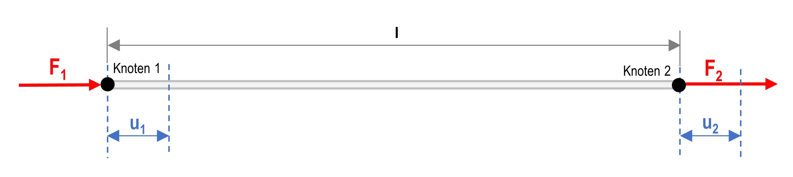

# Module 2 Stress Concentration

[{width=700px}](media/under_construction.png "Under Construction"){.glightbox}  

## Learning Objectives

??? note "FIXME: Define learning objectives"
    The **learning objectives** for this section still need to be formulated.  
    Suggested placeholder:

    * Understanding of the fundamental mathematical principles of the Finite Element Method  
    * Derivation and significance of the element stiffness matrix  
    * Relationship between forces, displacements, and stiffnesses in matrix form  
    * Application of simple analytical examples (1- and 2-element systems)  

## Mathematical Fundamentals of FEM

The FEM is a numerical method for the approximate solution of continuous field problems. This chapter explains the basic mathematical relationships of the method. Considering FEM as a design-supporting tool, detailed knowledge of simulation setup and evaluation plays an important role. Even more crucial, however, is the physical understanding of the underlying problem[@Gebhardt2018].

A complete description of a physical problem includes:

* the **geometry** defining the domain  
* the **field equations** within the domain  
* the **boundary conditions**[@Merkel2020]  

The following sections illustrate the procedure using simple examples.

---

### Calculation with One Element

A single bar element is subjected to two external forces. The forces _F₁_ and _F₂_ cause elongations _u₁_ and _u₂_. The bar has a length _l_. The nodes define the element boundaries and its degrees of freedom.

[{width=700px}](media/04_kerbwirkung/Stab-Element_1.png "Bar element"){.glightbox}  

#### Fundamental Finite Equation

\[
F = c \cdot \Delta u
\]

The total force _F_ is obtained as the product of the spring stiffness _c_ and the elongation \(\Delta u = u_1 - u_2\).  

According to Hooke’s law:

\[
\sigma = \varepsilon \cdot E \quad \text{and} \quad \varepsilon = \frac{\Delta l}{l}
\]

With \(\sigma_z = \frac{F_z}{A}\), the spring stiffness is:

\[
c = \frac{E \cdot A}{l}
\]

Hence: The product of the elastic modulus _E_ and cross-sectional area _A_ divided by the length _l_ gives the spring stiffness _c_.

#### Force Equilibrium

\[
\begin{aligned}
F_1 &= c \cdot (u_1 - u_2) = c \cdot u_1 - c \cdot u_2 \\
F_2 &= c \cdot (-u_1 + u_2) = -c \cdot u_1 + c \cdot u_2
\end{aligned}
\]

In matrix form:

$$
\begin{bmatrix}
F_1 \\[4pt]
F_2
\end{bmatrix}
=
c
\begin{bmatrix}
1 & -1 \\[4pt]
-1 & 1
\end{bmatrix}
\begin{bmatrix}
u_1 \\[4pt]
u_2
\end{bmatrix}
$$

For a fixed support at the left end, \(u_1 = 0\). The system simplifies to:

\[
F_2 = c \cdot u_2
\]

and therefore:

\[
u_2 = \frac{F_2}{c}
\]

---

### Calculation with Two Elements

The example is extended to two bar elements with one fixed support.

[{width=700px}](media/04_kerbwirkung/Stab-Element_2.png "Bar element"){.glightbox}  

Given:

* \(u_1 = 0\)
* \(c_1, c_2\)
* \(F_2 = 2F\)
* \(F_3 = -F\)

Find:

* \(F_1\) (reaction force)
* \(u_2, u_3\)

#### Force Vector

$$
\vec{f} =
\begin{bmatrix}
F_1 \\[4pt]
F_2 \\[4pt]
F_3
\end{bmatrix}
=
\begin{bmatrix}
F_1 \\[4pt]
2F \\[4pt]
- F
\end{bmatrix}
$$

#### Global Stiffness Matrix

The element stiffness matrix describes the stiffness of an element as a function of its length, cross-section, and material parameters. The global stiffness matrix is obtained as the sum of all element stiffness matrices:

\[
k = \sum_{i=1}^{z} k_i
\]

For two bars:

\[
k =
\begin{bmatrix}
c_1 & -c_1 & 0 \\[4pt]
-c_1 & c_1 + c_2 & -c_2 \\[4pt]
0 & -c_2 & c_2
\end{bmatrix}
\]

For identical stiffness values \(c_1 = c_2 = c\):

\[
k =
\begin{bmatrix}
c & -c & 0 \\[4pt]
-c & 2c & -c \\[4pt]
0 & -c & c
\end{bmatrix}
\]

#### Fundamental Equation in Vector Form

The fundamental equation in vector form is:

\[
\vec{f} = k \cdot \vec{d}
\]

The matrix–vector product of the displacement vector \(\vec{d}\) and the stiffness matrix \(k\) yields the force vector \(\vec{f}\). As in the first example, a force equilibrium is established, which is directly written in matrix form:

$$
\begin{bmatrix}
F_1 \\[4pt]
F_2 \\[4pt]
F_3
\end{bmatrix}
=
\begin{bmatrix}
c & -c & 0 \\[4pt]
-c & 2c & -c \\[4pt]
0 & -c & c
\end{bmatrix}
\cdot
\begin{bmatrix}
u_1 \\[4pt]
u_2 \\[4pt]
u_3
\end{bmatrix}
$$

As stated above, \(u_1 = 0\). Thus:

$$
\begin{bmatrix}
F_1 \\[4pt]
F_2 \\[4pt]
F_3
\end{bmatrix}
=
\begin{bmatrix}
\cancel{c} & \cancel{-c} & 0 \\[4pt]
\cancel{-c} & 2c & -c \\[4pt]
0 & -c & c
\end{bmatrix}
\cdot
\begin{bmatrix}
\cancel{u_1} \\[4pt]
u_2 \\[4pt]
u_3
\end{bmatrix}
$$

and therefore:

$$
\begin{bmatrix}
F_2 \\[4pt]
F_3
\end{bmatrix}
=
\begin{bmatrix}
2F \\[4pt]
- F
\end{bmatrix}
=
\begin{bmatrix}
2c & -c \\[4pt]
-c & c
\end{bmatrix}
\cdot
\begin{bmatrix}
u_2 \\[4pt]
u_3
\end{bmatrix}
$$

The matrix representation is then transformed into a system of linear equations, which can be solved by addition:

\[
\begin{aligned}
\text{I:} & \quad 2F = 2c \cdot u_2 - c \cdot u_3 \\[4pt]
\text{II:} & \quad -F = -c \cdot u_2 + c \cdot u_3
\end{aligned}
\]

Adding yields:

\[
u_2 = \frac{F}{c}, \quad u_3 = 0
\]

In vector form:

$$
\vec{d} =
\begin{bmatrix}
u_2 \\[4pt]
u_3
\end{bmatrix}
=
\frac{F}{c}
\cdot
\begin{bmatrix}
1 \\[4pt]
0
\end{bmatrix}.
$$

Substituting into the eliminated equation gives:

\[
F_1 =
\begin{bmatrix}
c & -c & 0
\end{bmatrix}
\cdot
\begin{bmatrix}
u_1 \\[4pt]
u_2 \\[4pt]
u_3
\end{bmatrix}
\]

and for the reaction force:

\[
F_1 = -c \cdot u_2 = -c \cdot \frac{F}{c}
\]

\[
F_1 = -F
\]

### Note on Practical Computation

The examples shown here are analytically solvable. In real applications, however, very large systems of equations arise (often several million nodes) that can only be solved approximately and iteratively. Established approximation methods include the **Ritz** and **Galerkin methods**[@Betten2003].

---

## Convergence and Divergence

### Convergence

The Finite Element Method (FEM) is an approximation technique in which a continuous physical system is represented by a finite number of elements. Within each element, the result quantity — such as displacement or temperature — is approximated by a shape function.

When strong gradients occur in the results, for example in regions of stress concentration, a sufficiently accurate representation can only be achieved if these regions are meshed finely enough. Local mesh refinement increases the accuracy of the calculation, and the result asymptotically approaches the physically correct value.

[{width=350px}](media/04_kerbwirkung/konvergenz.en.svg "Convergence behavior with increasing mesh refinement"){.glightbox}  
Image source based on[@Gebhardt2018]

Plotting the calculated stress against the mesh density yields a curve that approaches a limiting value. This approach is referred to as _convergence_. In ANSYS Workbench, convergence can be checked automatically by performing multiple solution steps with increasing mesh refinement until the results change only slightly (e.g. < 10%).

### Divergence

_Divergence_ occurs when the result does **not** approach a limiting value with increasing mesh refinement but instead increases without bound.

A typical example is a sharp notch with a theoretical notch radius of zero. In reality, no infinite stresses occur because real notches always have a small rounding and the material undergoes local plastic deformation. If these effects are not considered in the model, the calculated stress value increases continuously with increasing mesh density — the solution _diverges_.

[{width=350px}](media/04_kerbwirkung/divergenz.en.svg "Divergence"){.glightbox}  
Image source based on[@Gebhardt2018]

Such singular regions cannot be meaningfully evaluated. Instead, the evaluation should focus on physically meaningful areas, or the geometry should be modified with a fillet to restore a realistic stress state.

## Task: Stress Concentration  

For components with notches, stress concentration factors are available in strength analysis to determine the maximum stress in the notch root (keyword: stress concentration).  

* Use the FEM to calculate the stress concentration factors for the case shown below, see figure.  
* Compare the calculated stress concentration factors with the theoretical values.  
* The material is _structural steel_ according to the ANSYS material database.  
* Use radii for $r/b = 0.1$ to $0.5$ (see geometry below).  
* Ensure that the solution is convergent.

[{width=400}](media/04_kerbwirkung/kerbformzahl_aufgabenstellung.svg "Task: Stress concentration factor"){.glightbox}

The geometry files are:  

* [kerbformzahl_01.stp](media/04_kerbwirkung/kerbformzahl_01.stp)
* [kerbformzahl_02.stp](media/04_kerbwirkung/kerbformzahl_02.stp)  
* [kerbformzahl_03.stp](media/04_kerbwirkung/kerbformzahl_03.stp)
* [kerbformzahl_04.stp](media/04_kerbwirkung/kerbformzahl_04.stp)  
* [kerbformzahl_05.stp](media/04_kerbwirkung/kerbformzahl_05.stp)

## Theory: Stress Concentration  

Notches occur at cross-section changes, holes, grooves, or other geometric transitions. They cause a local **concentration of the stress flow**, meaning a **concentration of the force flow lines**, which leads to an **increase in local stress**.  

[{width=400px}](media/04_kerbwirkung/Kerbwirkung.en.svg "Stress flow and stress distribution in a notched and unnotched component"){.glightbox}
Image source[@Wittel2021]

In contrast to unnotched components, where the stress flow is uniform and the nominal stress is approximately constant across the cross-section, the presence of a notch disturbs the force flow. This disturbance causes stress peaks at the notch root, which are described by the **stress concentration factor** $\alpha_k$:[@Wittel2021]

\[
\alpha_k = \frac{\sigma_\text{max}}{\sigma_\text{n}}
\]

* $\alpha_k$ – stress concentration factor (dimensionless measure of stress increase)  
* $\sigma_k=\sigma_\text{max}$ – maximum stress at the notch root  
* $\sigma_\text{n}$ – **nominal stress at the notch root**, i.e., the nominal stress in the undisturbed notch cross-section  

[{width=200px}](media/04_kerbwirkung/Kerbwirkung_Bezeichnungen.svg "Definitions related to stress concentration"){.glightbox}
Image adapted from[@Altenbach2016]

The stress concentration factor $\alpha_k$ is a measure of the strength-reducing effect of the notch. In the elastic range, it depends only on the **notch geometry** and the **type of loading**. As the notch becomes sharper, $\alpha_k$ increases, and so does the local stress $\sigma_\text{max}$. Materials with high ductility show less sensitivity to notches, since plastic deformation can partially reduce stress peaks.

### Influence of the notch shape

The sharper the notch, the more the stress flow is concentrated at the notch root. This leads to higher stress peaks $\sigma_\text{max}$ and greater values of the stress concentration factor $\alpha_k$. A rounded notch, on the other hand, relaxes the force flow and reduces the local stress increase.

[{width=600px}](media/04_kerbwirkung/Kerbwirkung_Einfluss_Kerbform.svg "Influence of notch geometry on stress concentration"){.glightbox}
Image source[@Wittel2021]

### Charts for determining $\alpha_k$

The following diagrams show the dependence of the stress concentration factor $\alpha_k$ on the ratio of the notch radius $r$ to the component dimension ($b$, $d$) for different types of loading. As the ratio $r/b$ or $r/d$ decreases, $\alpha_k$ increases significantly, illustrating the influence of notch sharpness.  

[{width=600px}](media/04_kerbwirkung/01_kerbformzahlen_flachstab.png "Stress concentration factors for flat bars under tension"){.glightbox}
Image source[@Wittel2021]

[{width=600px}](media/04_kerbwirkung/02_kerbformzahlen_flachstab_abgesetzt.png "Stress concentration factors for stepped flat bars"){.glightbox}
Image source[@Wittel2021]

[{width=600px}](media/04_kerbwirkung/03_kerbformzahlen_rundstab_zug.png "Stress concentration factors for round bars under tension"){.glightbox}
Image source[@Wittel2021]

[{width=600px}](media/04_kerbwirkung/04_kerbformzahlen_rundstab_biegung.png "Stress concentration factors for round bars under bending"){.glightbox}
Image source[@Wittel2021]

[{width=600px}](media/04_kerbwirkung/05_kerbformzahlen_rundstab_torsion.png "Stress concentration factors for round bars under torsion"){.glightbox}
Image source[@Wittel2021]

## Implementation in ANSYS

### 1. Project Management and Geometry Import

### 2. Material Assignment

### 3. Mesh Generation

### 4. Boundary Conditions

### 5. Evaluation

## Discussion of Results

### Comparison with Analytical Solution

<!--  
Possibly to be placed after the mesh refinement section.
-->

### Mesh Refinement

<!--  
This section then discusses computation time, tabular representation,  
convergence, and reduction of computation time.
-->
