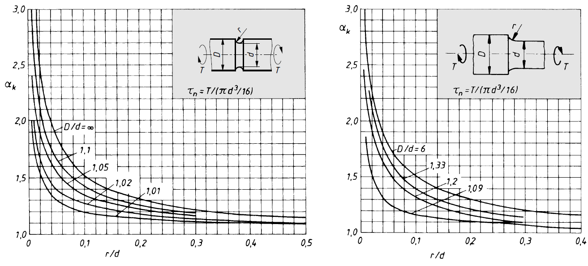
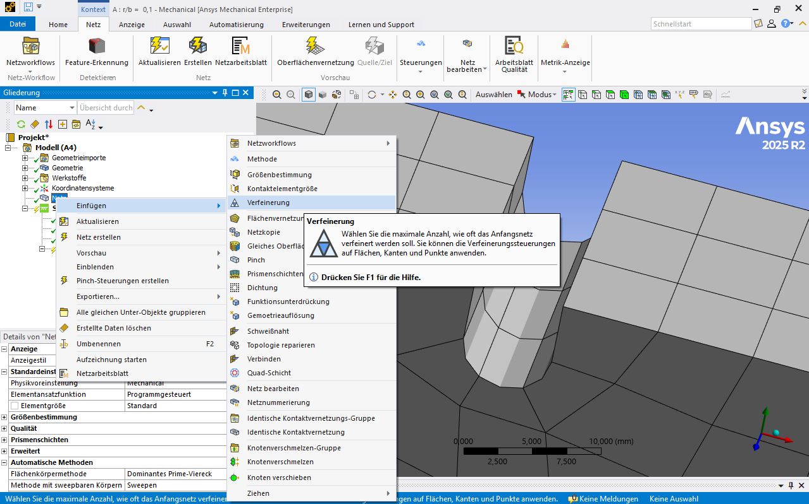
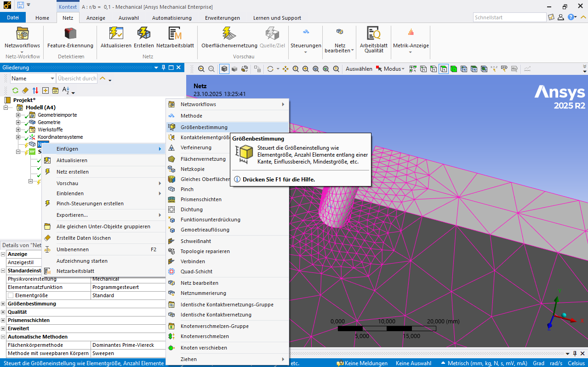

# Modul 2 Kerbwirkung

## Lernziele

Nach dem Durcharbeitung dieses Kapitels solltest du in der Lage sein,

* den Begriff **Kerbwirkung** zu erklären und die physikalischen Ursachen lokaler Spannungserhöhungen zu beschreiben,  
* den Zusammenhang zwischen **Kerbformzahl** und **Spannungsüberhöhung** zu erläutern,  
* typische **Geometrieformen mit Kerben** zu identifizieren und deren Einfluss auf den Kraftfluss zu interpretieren,  
* die **Kerbformzahl** mittels Finite-Elemente-Methode (FEM) für verschiedene Kerbradien zu bestimmen,  
* eine **Netzeinflussstudie** durchzuführen und zu bewerten, wann ein Ergebnis als **netzunabhängig** gilt,  
* die Berechnungsergebnisse kritisch zu analysieren und mit theoretischen Werten zu vergleichen,  
* geeignete **Verfeinerungsstrategien** (lokal, adaptiv) im FEM-Tool anzuwenden, um eine konvergente Lösung bei angemessener Rechenzeit zu erreichen.

## Mathematische Grundlagen zur FEM

Die FEM ist ein numerisches Verfahren zur näherungsweisen Lösung kontinuierlicher Feldprobleme. Dieses Kapitel erläutert die grundlegenden mathematischen Zusammenhänge der Methode. Betrachtet man die FEM als konstruktionsbegleitendes Werkzeug, spielt das Detailwissen zur Aufbereitung und Auswertung einer Simulation eine wichtige Rolle. Noch entscheidender ist jedoch das physikalische Verständnis des zugrunde liegenden Problems[@Gebhardt2018].

Zur vollständigen Beschreibung eines physikalischen Problems gehören:

* die **Geometrie** zur Definition des Gebiets  
* die **Feldgleichungen** im Gebiet  
* die **Randbedingungen**[@Merkel2020]  

Die folgenden Abschnitte zeigen das Vorgehen anhand einfacher Beispiele.

---

### Berechnung mit einem Element

Ein einzelnes Stab-Element wird durch zwei äußere Kräfte belastet. Es wirken die Kräfte _F₁_ und _F₂_, die Längenänderungen _u₁_ bzw. _u₂_ verursachen. Der Stab habe die Länge _l_. Die Knoten begrenzen das Element und definieren dessen Bewegungsmöglichkeiten, also die Knotenfreiheitsgrade.

[{width=700px}](media/04_kerbwirkung/Stab-Element_1.png "Stab-Element"){.glightbox}  

#### Finite Grundgleichung

\[
F = c \cdot \Delta u
\]

Die Gesamtkraft _F_ ergibt sich als Produkt aus der Federsteifigkeit _c_ und der Längenänderung \(\Delta u = u_1 - u_2\).  

Nach dem Hooke’schen Gesetz gilt:

\[
\sigma = \varepsilon \cdot E \quad \text{und} \quad \varepsilon = \frac{\Delta l}{l}
\]

Mit \(\sigma_z = \frac{F_z}{A}\) folgt für die Federsteifigkeit:

\[
c = \frac{E \cdot A}{l}
\]

Damit gilt: Das Produkt aus Elastizitätsmodul _E_ und Querschnittsfläche _A_ geteilt durch die Länge _l_ ergibt die Federsteifigkeit _c_.

#### Kräftegleichgewicht

\[
\begin{aligned}
F_1 &= c \cdot (u_1 - u_2) = c \cdot u_1 - c \cdot u_2 \\
F_2 &= c \cdot (-u_1 + u_2) = -c \cdot u_1 + c \cdot u_2
\end{aligned}
\]

In Matrixform:

$$
\begin{bmatrix}
F_1 \\[4pt]
F_2
\end{bmatrix}
=
c
\begin{bmatrix}
1 & -1 \\[4pt]
-1 & 1
\end{bmatrix}
\begin{bmatrix}
u_1 \\[4pt]
u_2
\end{bmatrix}
$$

Für eine feste Einspannung am linken Ende gilt \(u_1 = 0\). Damit vereinfacht sich das System zu:

\[
F_2 = c \cdot u_2
\]

und es folgt:

\[
u_2 = \frac{F_2}{c}
\]

---

### Berechnung mit zwei Elementen

Das Beispiel wird  auf zwei Stab-Elemente mit einer Einspannung erweitert.

[{width=700px}](media/04_kerbwirkung/Stab-Element_2.png "Stab-Element"){.glightbox}  

Gegeben seien:

* \(u_1 = 0\)
* \(c_1, c_2\)
* \(F_2 = 2F\)
* \(F_3 = -F\)

Gesucht sind:

* \(F_1\) (Lagerreaktion)
* \(u_2, u_3\)

#### Kräftematrix

$$
\vec{f} =
\begin{bmatrix}
F_1 \\[4pt]
F_2 \\[4pt]
F_3
\end{bmatrix}
=
\begin{bmatrix}
F_1 \\[4pt]
2F \\[4pt]
- F
\end{bmatrix}
$$

#### Gesamtsteifigkeitsmatrix

Die Elementsteifigkeitsmatrix beschreibt die Steifigkeit eines Elements in Abhängigkeit von Länge, Querschnitt und Materialparametern. Die Gesamtsteifigkeitsmatrix ergibt sich als Summe aller Elementsteifigkeitsmatrizen:

\[
k = \sum_{i=1}^{z} k_i
\]

Für zwei Stäbe:

\[
k =
\begin{bmatrix}
c_1 & -c_1 & 0 \\[4pt]
-c_1 & c_1 + c_2 & -c_2 \\[4pt]
0 & -c_2 & c_2
\end{bmatrix}
\]

Bei identischen Steifigkeiten \(c_1 = c_2 = c\):

\[
k =
\begin{bmatrix}
c & -c & 0 \\[4pt]
-c & 2c & -c \\[4pt]
0 & -c & c
\end{bmatrix}
\]

#### Grundgleichung in vektorieller Schreibweise

Die Grundgleichung in vektorieller Schreibweise lautet:

\[
\vec{f} = k \cdot \vec{d}
\]

Das Matrix-Vektor-Produkt aus dem Vektor \(\vec{d}\) (die Verschiebungen) und der Elementsteifigkeitsmatrix \(k\) (die Steifigkeiten) ergibt die Kräftematrix \(\vec{f}\). Analog zum ersten Beispiel wird auch hier ein Kräftegleichgewicht gebildet, das unmittelbar in die Matrixschreibweise überführt wird:

$$
\begin{bmatrix}
F_1 \\[4pt]
F_2 \\[4pt]
F_3
\end{bmatrix}
=
\begin{bmatrix}
c & -c & 0 \\[4pt]
-c & 2c & -c \\[4pt]
0 & -c & c
\end{bmatrix}
\cdot
\begin{bmatrix}
u_1 \\[4pt]
u_2 \\[4pt]
u_3
\end{bmatrix}
$$

Wie oben angegeben, wird \(u_1 = 0\) gesetzt. Es folgt:

$$
\begin{bmatrix}
F_1 \\[4pt]
F_2 \\[4pt]
F_3
\end{bmatrix}
=
\begin{bmatrix}
\cancel{c} & \cancel{-c} & 0 \\[4pt]
\cancel{-c} & 2c & -c \\[4pt]
0 & -c & c
\end{bmatrix}
\cdot
\begin{bmatrix}
\cancel{u_1} \\[4pt]
u_2 \\[4pt]
u_3
\end{bmatrix}
$$

und demnach:

$$
\begin{bmatrix}
F_2 \\[4pt]
F_3
\end{bmatrix}
=
\begin{bmatrix}
2F \\[4pt]
- F
\end{bmatrix}
=
\begin{bmatrix}
2c & -c \\[4pt]
-c & c
\end{bmatrix}
\cdot
\begin{bmatrix}
u_2 \\[4pt]
u_3
\end{bmatrix}
$$

Die Matrizen-Darstellung wird anschließend in ein lineares Gleichungssystem überführt, das mittels Additionsverfahren gelöst werden kann:

\[
\begin{aligned}
\text{I:} & \quad 2F = 2c \cdot u_2 - c \cdot u_3 \\[4pt]
\text{II:} & \quad -F = -c \cdot u_2 + c \cdot u_3
\end{aligned}
\]

Aus Addition folgt:

\[
u_2 = \frac{F}{c}, \quad u_3 = 0
\]

Überführt in die vektorielle Schreibweise ist

$$
\vec{d} =
\begin{bmatrix}
u_2 \\[4pt]
u_3
\end{bmatrix}
=
\frac{F}{c}
\cdot
\begin{bmatrix}
1 \\[4pt]
0
\end{bmatrix}.
$$

Durch Einsetzen in die eliminierte Gleichung

\[
F_1 =
\begin{bmatrix}
c & -c & 0
\end{bmatrix}
\cdot
\begin{bmatrix}
u_1 \\[4pt]
u_2 \\[4pt]
u_3
\end{bmatrix}
\]

und für die Lagerreaktionskraft:

\[
F_1 = -c \cdot u_2 = -c \cdot \frac{F}{c}
\]

\[
F_1 = -F
\]

### Hinweis zur praktischen Berechnung

Die hier gezeigten Beispiele sind analytisch lösbar. In realen Anwendungen entstehen jedoch sehr große Gleichungssysteme (oft mehrere Millionen Knoten), die nur näherungsweise und iterativ gelöst werden können. Etablierte Näherungsverfahren sind etwa die **Ritz-** und **Galerkin-Methoden**[@Betten2003].

---

## Konvergenz und Divergenz

### Konvergenz

Die Finite-Elemente-Methode (FEM) ist ein Näherungsverfahren, bei dem ein kontinuierliches physikalisches System durch eine endliche Anzahl von Elementen beschrieben wird. Innerhalb eines Elements wird die Ergebnisgröße, etwa Verschiebung oder Temperatur, durch eine Ansatzfunktion angenähert.

Treten starke Gradienten im Ergebnis auf, beispielsweise bei Spannungskonzentrationen, kann eine hinreichend genaue Abbildung nur erreicht werden, wenn die betroffenen Bereiche ausreichend fein vernetzt sind. Durch lokale Netzverfeinerungen steigt die Genauigkeit der Berechnung, und das Ergebnis nähert sich asymptotisch dem physikalisch korrekten Wert an.

[{width=350px}](media/04_kerbwirkung/konvergenz.svg "Konvergenzverlauf bei zunehmender Netzverfeinerung"){.glightbox}  
Bildquelle nach[@Gebhardt2018]

Zeichnet man die berechnete Spannung in Abhängigkeit von der Netzdichte, ergibt sich eine Kurve, die sich einem Grenzwert annähert. Diese Annäherung bezeichnet man als _Konvergenz_. In ANSYS Workbench kann Konvergenz automatisch überprüft werden, indem mehrere Berechnungsschritte mit zunehmender Netzfeinheit durchgeführt werden, bis sich das Ergebnis nur noch geringfügig (z. B. < 10 %) ändert.

### Divergenz

Von _Divergenz_ spricht man, wenn sich das Berechnungsergebnis mit zunehmender Netzverfeinerung **nicht** einem Grenzwert annähert, sondern stattdessen unbegrenzt ansteigt.

Ein typisches Beispiel ist eine scharfkantige Kerbe mit theoretischem Kerbradius = 0. In der Realität treten dort keine unendlichen Spannungen auf, da reale Kerben immer eine kleine Rundungen besitzen und das Material lokal plastifiziert. Werden diese Effekte im Modell jedoch nicht berücksichtigt, steigt der berechnete Spannungswert mit zunehmender Netzdichte weiter an – die Lösung _divergiert_.

[{width=350px}](media/04_kerbwirkung/divergenz.svg "Divergenz"){.glightbox}  
Bildquelle nach[@Gebhardt2018]

Solche singulären Bereiche können nicht sinnvoll ausgewertet werden. Stattdessen sollte die Auswertung auf physikalisch sinnvolle Regionen fokussiert oder durch Verrundung der Geometrie eine realistische Spannungssituation wiederhergestellt werden.

---

## Aufgabe Kerbwirkung  

Für Bauteile mit Kerben stehen in der Festigkeitsberechnung Kerbformzahlen zur Berechnung der maximalen Spannung im Kerbgrund zur Verfügung (Stichwort Spannungsüberhöhung im Kerbgrund).  

* Rechnen Sie mittels FEM die Kerbformzahlen für den unten gegebenen Fall nach, siehe Abbildung.  
* Gleichen Sie die ermittelten Kerbformzahlen mit der Theorie ab.
* Der Werkstoff sei _Baustahl_ gemäß ANSYS-Datenbank.  
* Verwenden Sie Radien für $r/b = 0{,}1 \text{ bis } 0{,}5$ (Geometrie siehe unten).  
* Achten Sie auf eine konvergierende Lösung.

[{width=400}](media/04_kerbwirkung/kerbformzahl_aufgabenstellung.svg "Aufgabenstellung Kerbformzahl"){.glightbox}

Die Geometrie ist  

* [kerbformzahl_01.stp](media/04_kerbwirkung/kerbformzahl_01.stp)
* [kerbformzahl_02.stp](media/04_kerbwirkung/kerbformzahl_02.stp)  
* [kerbformzahl_03.stp](media/04_kerbwirkung/kerbformzahl_03.stp)
* [kerbformzahl_04.stp](media/04_kerbwirkung/kerbformzahl_04.stp)  
* [kerbformzahl_05.stp](media/04_kerbwirkung/kerbformzahl_05.stp)

## Theorie Kerbwirkung

Kerben entstehen an Querschnittsänderungen, Bohrungen, Einstichen oder anderen geometrischen Übergängen. Sie führen zu einer lokalen **Kraftflussverdichtung**, das heißt zu einer **Verdichtung der Kraftflusslinien** und damit zu einer **Erhöhung der lokalen Spannung**.  

[{width=400px}](media/04_kerbwirkung/Kerbwirkung.svg "Kraftfluss und Spannungsverteilung im gekerbten und ungekerbten Bauteil"){.glightbox}
Bildquelle[@Wittel2021]

Im Gegensatz zu ungekerbten Bauteilen, in denen der Kraftfluss gleichmäßig verläuft und die Nennspannung über den Querschnitt annähernd konstant ist, wird der Kraftfluss durch die Kerbe gestört. Dadurch entstehen Spannungsspitzen im Kerbgrund, die durch die **Kerbformzahl** $\alpha_k$ beschrieben werden:[@Wittel2021]

\[
\alpha_k = \frac{\sigma_\text{max}}{\sigma_\text{n}}
\]

* $\alpha_k$ – Kerbformzahl (dimensionsloses Maß für die Spannungsüberhöhung)  
* $\sigma_k=\sigma_\text{max}$ – maximale Spannung im Kerbgrund  
* $\sigma_\text{n}$ – **nominelle Spannung im Kerbgrund**, Nennspannung im ungestörten Kerb-Querschnitt  

[{width=200px}](media/04_kerbwirkung/Kerbwirkung_Bezeichnungen.svg "Bezeichnungen bei Kerbwirkung"){.glightbox}
Bild in Anlehnung an[@Altenbach2016]

Die Kerbformzahl $\alpha_k$ ist ein Maß für die festigkeitsmindernde Wirkung der Kerbe. Sie hängt im elastischen Bereich ausschließlich von der **Kerbgeometrie** und der **Beanspruchungsart** ab. Mit zunehmender Kerbschärfe steigt $\alpha_k$ und somit auch die lokale Spannung $\sigma_\text{max}$. Werkstoffe mit hoher Duktilität zeigen eine geringere Empfindlichkeit gegenüber Kerben, da plastische Verformungen Spannungsspitzen teilweise abbauen können.

### Einfluss der Kerbform

Je spitzer eine Kerbe ausgeführt wird, desto stärker konzentriert sich der Kraftfluss im Kerbgrund. Dadurch entstehen höhere Spannungsspitzen $\sigma_{max}$ und größere Werte der Kerbformzahl $\alpha_k$. Eine Verrundung der Kerbe führt hingegen zu einer Entspannung des Kraftflusses und verringert die lokale Spannungsüberhöhung.

[{width=600px}](media/04_kerbwirkung/Kerbwirkung_Einfluss_Kerbform.svg "Einfluss der Kerbform auf die Spannungskonzentration"){.glightbox}
Bildquelle[@Wittel2021]

### Tabellen zur Bestimmung von $\alpha_k$

Die nachfolgenden Diagramme zeigen die Abhängigkeit der Kerbformzahl $\alpha_k$ vom Verhältnis der Kerbrundung $r$ zur Bauteilgröße ($b$, $d$) für unterschiedliche Belastungsarten. Mit abnehmendem Verhältnis $r/b$ bzw. $r/d$ steigt $\alpha_k$ stark an, was den Einfluss der Kerbschärfe verdeutlicht.  

[{width=600px}](media/04_kerbwirkung/01_kerbformzahlen_flachstab.png "Kerbformzahlen für Flachstäbe unter Zugbelastung"){.glightbox}
Bildquelle[@Wittel2021]

[{width=600px}](media/04_kerbwirkung/02_kerbformzahlen_flachstab_abgesetzt.png "Kerbformzahlen für abgesetzte Flachstäbe"){.glightbox}
Bildquelle[@Wittel2021]

[{width=600px}](media/04_kerbwirkung/03_kerbformzahlen_rundstab_zug.png "Kerbformzahlen für Rundstäbe unter Zugbelastung"){.glightbox}
Bildquelle[@Wittel2021]

[{width=600px}](media/04_kerbwirkung/04_kerbformzahlen_rundstab_biegung.png "Kerbformzahlen für Rundstäbe unter Biegung"){.glightbox}
Bildquelle[@Wittel2021]

[{width=600px}](media/04_kerbwirkung/05_kerbformzahlen_rundstab_torsion.png "Kerbformzahlen für Rundstäbe unter Torsion"){.glightbox}
Bildquelle[@Wittel2021]

## Umsetzung in ANSYS

### 1. Projektverwaltung und Geometrieimport

Für die Untersuchung der Kerbformzahlen werden fünf Geometrievarianten mit unterschiedlichen Kerbradien ($r/b = 0{,}1$ bis $0{,}5$) benötigt. Jede Variante kann in einem eigenen Projekt oder über ein gemeinsames Projekt mit mehreren Geometrieversionen verwaltet werden.  

[{width=750px}](media/04_kerbwirkung/06_Kerbwirkung_Projekt.png "Projektverwaltung und Geometrieimport in ANSYS Workbench"){.glightbox}  

**Vorgehensweise:**

* Die Geometrien werden im _Projekt Schema_ einzeln importiert oder nacheinander eingelesen. Dabei sollte die gleiche Materialdefinition verwendet werden, um vergleichbare Ergebnisse zu gewährleisten.  
* Ein gemeinsames Material kann über die _Technische Daten_-Datenbank verknüpft werden. Änderungen im Materialmodell wirken sich dann automatisch auf alle Varianten aus.  
* Um Redundanz zu vermeiden, kann das Grundmodell einmal vollständig aufgebaut und anschließend dupliziert werden. Danach wird lediglich die Geometrie getauscht (_Geometrie ersetzen_). So bleiben Randbedingungen, Netzdefinitionen und Auswertungen erhalten.  
* Wichtig ist, die Resultate jeder Variante eindeutig zu kennzeichnen (z. B. „r01“, „r02“ …). So lassen sich die Spannungsverteilungen und Kerbformzahlen später systematisch vergleichen.  

**Hinweis:**  
Beim Austausch einer Geometrie kann es zu Zuordnungsproblemen kommen, wenn Flächen oder Kanten im neuen Modell nicht exakt mit den ursprünglichen  übereinstimmen. In diesem Fall müssen die entsprechenden Bereiche in ANSYS neu definiert werden.

### 2. Materialzuweisung

Für diese Aufgabe ist keine manuelle Materialzuweisung erforderlich. ANSYS weist der importierten Geometrie automatisch das Standardmaterial _Baustahl_ zu.  

Es empfiehlt sich dennoch, die Materialeigenschaften in den _Technischen Daten_ zu überprüfen. Dabei sollte insbesondere kontrolliert werden, ob Elastizitätsmodul, Querkontraktionszahl und Streckgrenze mit den Werten der analytischen Berechnung übereinstimmen. Bei Bedarf kann das Materialmodell angepasst oder ein eigenes Material mit definierten Kennwerten angelegt werden.

### 3. Netzgenerierung

Zu Beginn sollte mit der automatischen _Standardvernetzung_ gearbeitet werden, um zu prüfen, ob die Geometrie überhaupt erfolgreich vernetzt werden kann. Eine erste visuelle Beurteilung des Netzes ist dabei hilfreich.  

Auffällig **große Elemente** oder **stark verzerrte Netzbereiche** deuten häufig auf problematische Geometrieübergänge hin und können zu ungenauen Ergebnissen führen.  

[{width=750px}](media/04_kerbwirkung/07_Kerbwirkung_Standardnetz.png "Standardvernetzung in ANSYS Mechanical"){.glightbox}  

### 4. Randbedingungen

Für die Simulation bietet sich eine Randbedingung ohne feste Einspannung an. Statt einer starren Lagerung wird die Kraft direkt auf eine verformbare Fläche aufgebracht. Dadurch kann das System ein realistisches Kräftegleichgewicht ausbilden und das lokale Spannungsfeld im Kerbgrund wird physikalisch korrekt erfasst.  

[{width=750px}](media/04_kerbwirkung/08_Kerbwirkung_Randbedingungen.png "Randbedingungen im Modell zur Bestimmung der Kerbformzahl"){.glightbox}  

**Empfohlene Einstellungen in ANSYS Mechanical:**  

* Verwendung einer _Kraft_ an beiden Seite  
* keine _Einspannung_, um unrealistische Spannungsspitzen zu vermeiden  

!!! question "Frage"
    Ist hier der Betrag der Kraft relevant?  
    Die analytische Lösung hilf das zu beantworten.  

??? success "Antwort"
    Nein. Für die Bestimmung der Kerbformzahl kürzt sich die aufgebrachte Kraft heraus. Entscheidend ist nur das Verhältnis zwischen lokaler Spannung im Kerbgrund und Nennspannung.

### 5. Analyseeinstellungen

In den _Analyseeinstellungen_ sollten die standardmäßigen Parameter zunächst beibehalten werden. Für lineare statische Analysen ist in der Regel keine zusätzliche Anpassung erforderlich.  

Besonderes Augenmerk gilt jedoch den sogenannten **schwachen Federn**. Diese müssen aktiviert werden, wenn das System keine eindeutige Lagerung besitzt. Sie verhindern numerische Instabilitäten, indem sie eine minimale Federsteifigkeit zu den Freiheitsgraden ohne Zwangsbedingungen hinzufügen.  

[{width=300px}](media/04_kerbwirkung/09_Kerbwirkung_Analyseeinstellungen.png "Analyseeinstellungen in ANSYS Mechanical"){.glightbox}  

**Hinweise:**  

* Die _schwachen Federn_ beeinflussen das physikalische Ergebnis nicht, solange das Modell korrekt gelagert ist.  
* Falls die Analyse dennoch instabil läuft oder kritische Fehlermeldungen zu „Starrkörperbewegungen“ erscheinen, sollte die Lagerung überprüft und ggf. minimal ergänzt werden.  
* Die Meldung, dass schwache Federn eingesetzt wurden, ist nicht als kritisch zu bewerten.  

### 6. Auswertung

Zur ersten Beurteilung werden die _Gesamtverformung_ und die _Vergleichsspannung_ betrachtet.  

## Netzeinfluss

### Motivation

Das Ergebnis einer Simulation hängt von der gewählten Netzgröße ab. Ziel einer Netzeinflussuntersuchung ist es, ein Ergebnis zu finden, das **vom Netz unabhängig** ist.  

Besonders in Bereichen mit **hohen Spannungsgradienten** – etwa hier im Kerbgrund – kann die lokale Elementgröße einen erheblichen Einfluss auf die berechneten Spannungen haben. Entscheidend ist dabei nicht der absolute Spannungswert, sondern die Stabilität des Ergebnisses bei zunehmender Netzverfeinerung.  

Mit steigender Netzfeinheit nimmt die Rechenzeit jedoch deutlich zu (wegen einem größeren zu lösenden Gleichungssystem). Ein gutes Netz zeichnet sich deshalb nicht durch maximale Feinheit, sondern durch einen **Kompromiss zwischen Ergebnisqualität und Rechenzeit** aus.

!!! note
    In der Finite-Elemente-Methode wird das kontinuierliche System durch eine endliche Zahl von Elementen beschrieben.  
    Nur wenn das Ergebnis bei weiterer Verfeinerung nahezu unverändert bleibt, gilt es als **netzunabhängig**.  
    Ziel ist ein effizientes Netz, das eine hohe Ergebnisqualität bei vertretbarer Rechenzeit liefert.

---

### Visuelle Beurteilung der Netzqualität

Die erste Einschätzung der Netzqualität erfolgt nach einer groben Berechnung über die reine **visuelle Analyse des Spannungsfeldes**. Dabei wird das Ergebnis im interessierenden Bereich, hier im Kerbgrund, betrachtet und der Verlauf der Vergleichsspannung bewertet.  

Ein feines Netz zeigt im Idealfall einen **diskreten Spannungsverlauf von Knoten zu Knoten**. Treten innerhalb eines Elements sichtbare Farbverläufe auf, deutet dies auf zu große Spannungsgradienten innerhalb des Elements und damit auf eine zu große Elementgröße hin.  

[{width=700px}](media/04_kerbwirkung/10_Kerbwirkung_Netzqualitaet_Farbverlauf.png "Beurteilung der Netzqualität durch den Farbverlauf"){.glightbox}  
Bildquelle[@Comsol2025]

Für eine differenzierte Beurteilung kann der Vergleich von **gemittelten** und **ungemittelten Spannungen** herangezogen werden. In der Standarddarstellung werden Spannungen in ANSYS zwischen den Elementen gemittelt, wodurch lokale Maxima geglättet erscheinen. Werden die Spannungen ohne Mittelung dargestellt, ist eine realistischere Einschätzung des tatsächlichen Spannungsverlaufs möglich. Ein deutlicher Unterschied zwischen beiden Darstellungen weist auf eine unzureichende Netzqualität hin.

[{width=300px}](media/04_kerbwirkung/11_Kerbwirkung_Ergebnis_Standardnetz.png "Ergebnis mit gemittelten Spannungen"){.glightbox}
[{width=300px}](media/04_kerbwirkung/12_Kerbwirkung_Ergebnis_Standardnetz_nicht_gemittelt.png "Ergebnis mit ungemittelten Spannungen"){.glightbox}

Numerische Kennwerte der Netzqualität, wie Seitenverhältnis oder Schiefwinkligkeit, werden an dieser Stelle bewusst **nicht** verwendet. Im Fokus steht zunächst die **visuelle Beurteilung anhand des Ergebnisfeldes**, um das physikalische Verständnis für den Einfluss des Netzes zu schulen.

!!! note
    Eine Beurteilung der Netzqualität ist erst nach einer ersten Berechnung sinnvoll.  
    Ein optisch gleichmäßiges Spannungsfeld ohne abrupte Farbwechsel weist in der Regel auf eine gute Netzqualität hin.

Das folgende Ergebnis zeigt die Vergleichsspannung im Kerbgrund für das Standardnetz. Das Netz ist in diesem Zustand **noch zu grob**, was sich an den deutlich sichtbaren **zwei großen Spannungsgradienten** innerhalb der Kerbe erkennen lässt. Die Farbverläufe weisen auf eine unzureichende Auflösung des lokalen Spannungsfeldes hin.

[{width=650px}](media/04_kerbwirkung/11_Kerbwirkung_Ergebnis_Standardnetz.png "Ergebnis mit Standardnetz – deutliche Spannungsgradienten in der Kerbe"){.glightbox}  

---

### Globale Netzverfeinerung

Die Auswirkung der globalen Elementgröße wird im Folgenden schrittweise untersucht. Zu diesem Zweck wird die Elementgröße im gesamten Bauteil zunächst über eine **globale Verfeinerung** reduziert. Dadurch verringert sich die Elementgröße gleichmäßig im gesamten Modell. Diese Verfeinerung wird wie gehabt über die Elementgröße in den _Details von "Netz"_ eingestellt.  

[{width=700px}](media/04_kerbwirkung/13_Kerbwirkung_GlobalFein_Netz.png "Global fein vernetztes Bauteil (Beispielansicht)"){.glightbox}

Maßgebliche Größen zur Beurteilung sind die maximale Spannung im Kerbgrund, die Anzahl der Knoten und Elemente sowie die Rechenzeit.  

<!-- markdownlint-disable MD033 -->

</extra>"
         },
         {
           "x": ["Standard","5 mm","3 mm","2 mm","1 mm","0,5 mm"],
           "y": [2519,6671,28370,86607,647596,4984682],
           "name": "Anzahl Knoten",
           "type": "scatter",
           "mode": "lines+markers",
           "yaxis": "y2",
           "text": ["2 519","6 671","28 370","86 607","647 596","4 984 682"],
           "hovertemplate": "%{text}<extra></extra>"
         },
         {
           "x": ["Standard","5 mm","3 mm","2 mm","1 mm","0,5 mm"],
           "y": [432,1264,6034,19340,152900,1211000],
           "name": "Anzahl Elemente",
           "type": "scatter",
           "mode": "lines+markers",
           "yaxis": "y2",
           "text": ["432","1 264","6 034","19 340","152 900","1 211 000"],
           "hovertemplate": "%{text}<extra></extra>"
         }
       ],
       "layout": {
         "title": "Netzgröße vs. maximale Spannung, Knoten- und Elementeanzahl",
         "xaxis": {"title": "Elementgröße"},
         "yaxis": {"title": "Max. Spannung (MPa)", "range": [2, 4.6]},
         "yaxis2": {"title": "Knoten / Elemente", "overlaying": "y", "side": "right"},
         "legend": {"x": 0.01, "y": 0.99},
         "hovermode": "x unified",
         "hoverlabel": {
           "bgcolor": "rgba(255,255,255,0.95)",
           "bordercolor": "rgba(0,0,0,0.2)",
           "font": {"color": "black"}
         }
       }
     }'>

<!-- markdownlint-enable MD033 -->

<!-- markdownlint-disable MD033 -->

</extra>"
         },
         {
           "x": ["Standard","5 mm","3 mm","2 mm","1 mm","0,5 mm"],
           "y": [18,17,19,24,66,461],
           "name": "Rechenzeit (s)",
           "type": "scatter",
           "mode": "lines+markers",
           "yaxis": "y2",
           "text": ["18 s","17 s","19 s","24 s","66 s","461 s"],
           "hovertemplate": "%{text}<extra></extra>"
         }
       ],
       "layout": {
         "title": "Netzgröße vs. maximale Spannung und Rechenzeit",
         "xaxis": {"title": "Elementgröße"},
         "yaxis": {"title": "Max. Spannung (MPa)", "range": [2, 4.6]},
         "yaxis2": {"title": "Rechenzeit (s)", "overlaying": "y", "side": "right"},
         "legend": {"x": 0.01, "y": 0.99},
         "hovermode": "x unified",
         "hoverlabel": {
           "bgcolor": "rgba(255,255,255,0.95)",
           "bordercolor": "rgba(0,0,0,0.2)",
           "font": {"color": "black"}
         }
       }
     }'>

<!-- markdownlint-enable MD033 -->

??? note "Tabelle der Netzvarianten und Messgrößen"
    | Elementgröße | $\sigma_\text{max}$ | $\Delta\sigma_\text{max}$ zum vorherigen Netz | Knoten | Elemente | Rechenzeit |
    |--------------:|------------------:|--------------------------------:|--------:|----------:|------------:|
    | Standard      | 3,7340 MPa        | 0 %                            | 2.519   | 432       | 18 s        |
    | 5 mm          | 4,0096 MPa        | +7,4 %                         | 6.671   | 1.264     | 17 s        |
    | 3 mm          | 4,2185 MPa        | +5,2 %                         | 28.370  | 6.034     | 19 s        |
    | 2 mm          | 4,4406 MPa        | +5,3 %                         | 86.607  | 19.340    | 24 s        |
    | 1 mm          | 4,2213 MPa        | –4,9 %                         | 647.596 | 152.900   | 66 s        |
    | 0,5 mm        | 4,2172 MPa        | –0,1 %                         | 4.984.682 | 1.211.000 | 461 s       |

Mit abnehmender Elementgröße steigt die Rechenzeit deutlich an, während sich das Ergebnis in der Regel einem stabilen Wert annähert. Dieser Verlauf kennzeichnet die typische **Konvergenz des Ergebnisses** mit zunehmender Netzfeinheit.  

Die absolute Rechenzeit ist dabei stark von der verfügbaren Hardware abhängig. Aussagekräftig ist daher nicht der absolute Zeitwert, sondern der relative Vergleich zwischen den Netzvarianten.

**Beurteilung** der globalen Verfeinerung

* Gleichmäßige Reduktion der Elementgröße im gesamten Modell  
* Deutliche Zunahme der Knoten- und Elementanzahl bei begrenztem Informationsgewinn  
* Signifikante Erhöhung der Rechenzeit, auch in Bereichen mit geringer Spannungsänderung  
* Für lokale Phänomene wie Kerbspannungen nur bedingt effizient  
* Sinnvoll als erster Schritt zur Kalibrierung des Netzeinflusses, jedoch nicht als Dauerstrategie

**Beurteile** den Farbverlaufs im Bereich hoher Gradienten - hier **Elementgröße 3 mm**

[{width=700px}](media/04_kerbwirkung/15_Kerbwirkung_Farbverlauf_Kerbe_3mm.png "Vergleichsspannung bei Elementgröße 3 mm"){.glightbox}

hier **Elementgröße 1 mm**

[{width=700px}](media/04_kerbwirkung/14_Kerbwirkung_Farbverlauf_Kerbe_1mm.png "Vergleichsspannung bei Elementgröße 1 mm"){.glightbox}

### Konvergenz des Ergebnisses

Die in den Plots dargestellten Werte zeigen, dass sich die maximale Vergleichsspannung mit zunehmender Netzverfeinerung um etwa **4,2 MPa** einpendelt. Dies weist auf ein **konvergierendes Verhalten** des Modells hin, da weitere Verfeinerungen keine signifikante Änderung des Ergebnisses mehr bewirken.

---

### Lokale Netzverfeinerung - Werkzeug _Verfeinerung_

Das Tool **Verfeinerung** dient zur lokalen Steuerung der Elementgröße. Es legt fest, wie oft das Anfangsnetz in einem bestimmten Bereich verfeinert werden soll. Diese Steuerung kann auf **Flächen**, **Kanten** oder **Punkte** angewendet werden und beeinflusst damit gezielt die Detaillierung des Netzes in relevanten Geometriebereichen.

[{width=700px}](media/04_kerbwirkung/16_Kerbwirkung_Verfeinerung.png "Verfeinerung in ANSYS Mechanical"){.glightbox}

**Aufruf:**

* Im Strukturbaum mit der rechten Maustaste auf _Netz_ klicken und _Einfügen → Verfeinerung_ wählen.  
* Alternativ über das Register _Netz_ in der Multifunktionsleiste das Symbol _Verfeinerung_ auswählen.  
* Ebenso kann direkt an einer Fläche, Kante oder einem Punkt per Rechtsklick _Einfügen → Verfeinerung_ ausgewählt werden.

**relevante Einstellungen im Detailfenster:**

* _Zuweisungsmethode:_ Auswahl der zu verfeinernden Geometrie (Flächen, Kanten oder Punkte) oder einer benannten Auswahl.  
* _Verfeinerung:_ Angabe, wie oft das Ausgangsnetz verfeinert werden soll. Der Standardwert ist **1**.  

Die Verfeinerung teilt vorhandene Elemente hierarchisch in kleinere Unterelemente auf, wobei die ursprüngliche Elementtopologie (z. B. Tetraeder, Hexaeder) erhalten bleibt. Die Verfeinerungsstufe gibt an, wie oft die Elemente unterteilt werden; bei _Refinement = 1_ entstehen beispielsweise acht kleinere Tetraederelemente. Die Methode basiert nicht auf einer absoluten Elementgröße, sondern auf relativen Teilungsverhältnissen, wodurch sich an den Übergängen ein gleichmäßiger Netzübergang ohne abrupte Sprünge ergibt.

[{width=700px}](media/04_kerbwirkung/16_Kerbwirkung_Verfeinerung_Netz.png "Verfeinerung des Netzes in ANSYS Mechanical"){.glightbox}

---

### Lokale Netzverfeinerung - Werkzeug _Elementgröße_ / _Größenbestimmung_

Das Tool **Größenbestimmung** dient zur gezielten Steuerung der **lokalen Elementgröße** in definierten Bereichen. Damit lassen sich kritische Geometriezonen – etwa Kerbradien, Bohrungen oder Übergänge – mit höherer Genauigkeit abbilden, ohne das gesamte Modell zu verfeinern.

[{width=700px}](media/04_kerbwirkung/17_Kerbwirkung_Elementgroesse.png "Größenbestimmung in ANSYS Mechanical"){.glightbox}

**Aufruf:**

* Im Strukturbaum mit der rechten Maustaste auf _Netz_ klicken und _Einfügen → Größenbestimmung_ wählen.  
* Alternativ über das Register _Netz_ in der Multifunktionsleiste das Symbol _Größenbestimmung_ auswählen.  
* Ebenso kann direkt an einer Fläche, Kante oder einem Körper per Rechtsklick _Einfügen → Größenbestimmung_ aufgerufen werden.

**relevante Einstellungen im Detailfenster:**

* _Geometrie:_ Auswahl der zu verfeinernden Geometrie (Körper, Flächen, Kanten, Punkte) oder einer benannten Auswahl.  
* _Typ - Elementgröße:_ Definiert die maximale Elementgröße innerhalb des gewählten Bereichs.  
* _Typ - Einflussbereich:_ Legt fest, wie weit die lokale Größensteuerung in benachbarte Bereiche übergeht.  
* _Volumen beeinflussen:_ Bestimmt, ob die Größensteuerung auch in das Volumen hineinwirkt. Ist diese Option aktiviert, werden angrenzende Volumenelemente in der Tiefe entsprechend der eingestellten Größe angepasst.  

**Funktionsweise:**

Das Tool _Größenbestimmung_ basiert auf einer **absoluten Elementgröße**, im Gegensatz zur relativen Unterteilung bei der _Verfeinerung_. ANSYS generiert automatisch **Übergangsbereiche** zwischen unterschiedlich feinen Zonen, um ein kompatibles Netz zu gewährleisten.  

!!! note
    Die Größenbestimmung ist das wichtigste Werkzeug zur gezielten lokalen Steuerung der Elementgröße.  
    Sie ermöglicht eine hohe Genauigkeit im Bereich der Kerbwirkung bei gleichzeitig kontrollierter Rechenzeit.

### Adaptive Vernetzung

Die **adaptive Vernetzung** passt die lokale Elementgröße automatisch an das Ergebnisfeld an. Dabei werden Bereiche mit hohen Spannungs- oder Dehnungsgradienten gezielt verfeinert, bis eine definierte Genauigkeit erreicht ist. Ziel ist ein **vom Netz unabhängiges Ergebnis** bei möglichst effizienter Elementverteilung.

**Vorgehensweise:**

* Zunächst wird eine Berechnung mit einem Standardnetz durchgeführt, um grob den Spannungsverlauf zu erfassen.  
* Über das Kontextmenü auf einer Lösung (z.B. Vergleichsspannung) im Strukturbaum (Rechtsklick → Konvergenz hinzufügen_) wird die adaptive Vernetzung aktiviert.  

[{width=700px}](media/04_kerbwirkung/18_Kerbwirkung_Adaptive_Vernetzung_Aktivierung.png "Aktivierung der adaptiven Vernetzung in ANSYS Mechanical"){.glightbox}  

Die Einstellungen der adaptiven Vernetzung legen den **Ergebnistyp** (hier _Maximum der Vergleichsspannung_) sowie die **zulässige prozentuale Änderung** zwischen zwei Verfeinerungsschritten fest.

[{width=700px}](media/04_kerbwirkung/19_Kerbwirkung_Adaptive_Vernetzung_einstellungen.png "Einstellungen der adaptiven Vernetzung in ANSYS Mechanical"){.glightbox}  

In den **Details von "Lösung"**  werden die **maximale Anzahl an Verfeinerungszyklen** und die **Verfeinerungstiefe** definiert.  

* Die _maximale Anzahl der Verfeinerungszyklen_ bestimmt, wie oft ANSYS das Netz automatisch nachverfeinern darf, bevor die Konvergenzprüfung beendet wird.  
* Die _Verfeinerungstiefe_ legt fest, in wie viele Unterelemente ein bestehendes Element während eines Zyklus aufgeteilt wird.  
* Eine größere Tiefe führt zu einer feineren, aber rechenintensiveren Vernetzung.  

[{width=300px}](media/04_kerbwirkung/20_Kerbwirkung_Adaptive_Vernetzung_Lösungseinstell.png "Einstellungen der adaptiven Vernetzung in der Lösungsdefinition"){.glightbox}  

!!! note "Faustformel zur adaptiven Vernetzung"
    Eine praxisgerechte Einstellung besteht aus einer _maximalen Anzahl der Verfeinerungszyklen_ von **5** und einer _Verfeinerungstiefe_ von **3**.  
    Damit sollte **konvergierende Lösung** erreicht werden.  
    Tritt dennoch keine Konvergenz ein, sollte das Ausgangsnetz verfeinert und das Modell auf **Divergenzen oder singuläre Stellen** überprüft werden.

??? note "Zusammenhang zum Tool _Verfeinerung_"
    Im Gegensatz zum Tool _Verfeinerung_ (lokale, manuell gesteuerte Unterteilung) erfolgt diese Aufteilung hier **automatisch**, basierend auf dem Ergebnisfeld der jeweiligen Analyse.  
    Beide Mechanismen verwenden jedoch denselben hierarchischen Ansatz zur Elementunterteilung – die adaptive Vernetzung steuert diesen Prozess lediglich iterativ und kriteriumsbasiert.  

ANSYS verfeinert anschließend automatisch die Bereiche mit **hoher Abweichung der Ergebnisgrößen**. Dieser Prozess wiederholt sich, bis die Abweichung zwischen zwei Verfeinerungsschritten kleiner als der festgelegte Toleranzwert (_zulässige Änderung_) ist oder die maximale Anzahl an Schritten erreicht wurde.

Der Konvergenzverlauf zeigt den Verlauf der maximalen Vergleichsspannung über mehrere Verfeinerungszyklen. Nach anfänglichen Schwankungen nähert sich das Ergebnis einem stabilen Wert an, was auf ein konvergierendes Verhalten hinweist.

[{width=700px}](media/04_kerbwirkung/21_Kerbwirkung_Adaptive_Vernetzung_Konvergenzverlauf.png "Konvergenzverlauf der adaptiven Vernetzung"){.glightbox}  

Das resultierende Netz zeigt eine gezielte lokale Verdichtung im Kerbgrund, während in weniger beanspruchten Bereichen eine grobe Vernetzung erhalten bleibt. Dadurch wird eine hohe Genauigkeit bei gleichzeitig reduzierter Rechenzeit erreicht.

[{width=700px}](media/04_kerbwirkung/22_Kerbwirkung_Adaptive_Vernetzung_Netz.png "Netz nach adaptiver Verfeinerung"){.glightbox}  

**Funktionsweise:**

* Die adaptive Vernetzung verwendet einen **Fehlerindikator**, der auf der Änderung der Dehnungsenergie oder der Spannungsgradienten basiert.  
* Elemente mit überdurchschnittlich hoher Abweichung werden in der nächsten Iteration verfeinert.  
* Bereiche mit stabilen Ergebnissen bleiben unverändert.  
* Damit wird die Netzdichte automatisch dort erhöht, wo sie physikalisch relevant ist.  

!!! note
    Die adaptive Vernetzung ist besonders effizient bei Modellen mit lokal stark unterschiedlichen Spannungsniveaus, wie z. B. bei Kerben, Bohrungen oder Kontaktstellen.  
    Sie reduziert die Rechenzeit gegenüber einer globalen Verfeinerung erheblich und liefert zugleich konvergente Ergebnisse.

---

### Adaptive Vernetzung eines fokussierten Ergebnisses

Ein **fokussiertes Ergebnis** bezeichnet in der Finite-Elemente-Analyse ein **gezielt ausgewähltes Teilergebnis**, das sich auf einen bestimmten Bereich oder eine bestimmte Ergebnisgröße bezieht.  

Beispiele sind:

* die _Vergleichsspannung_ auf einer bestimmten Fläche oder in einem ausgewählten Volumenkörper  
* die _Dehnung_ entlang einer definierten Linie  
* die _Verschiebung_ in einem einzelnen Knoten oder auf einer Kontaktfläche  

Im Gegensatz zu globalen Ergebnissen kann damit die adaptive Netzverfeinerung **nicht über das gesamte Modell**, sondern **nur in relevanten Bereichen** durchgeführt. Die Entscheidung, welcher Bereich fokussiert betrachtet wird, basiert in der Regel auf einer globalen Analyse.  

Das Prinzip der **adaptiven Vernetzung eines fokussierten Ergebnisses** ermöglicht es, eine **konvergierende Lösung** in einem definierten Teilbereich zu erreichen, selbst wenn in anderen Bereichen **Divergenzen** auftreten (z. B. an Einspannungen oder Punktlasten).

[{width=700px}](media/04_kerbwirkung/23_Kerbwirkung_Adaptive_Vernetzung_Fokusbereich.png "Beispiel eines fokussierten Ergebnisses: Vergleichsspannung auf definierter Fläche"){.glightbox}  

**Vorgehensweise:**

* Auswahl des **fokussierten Ergebnisses** als Kriterium für die Netzadaption  (z.B. Vergleichsspannung auf Fläche statt gesamter Körper)
* Einfügen eines Konvergenzkriteriums
* Festlegung der **zulässigen Abweichung** (z. B. Spannungsänderung < 5 % pro Iteration)  

Daraus folgt eine automatische **lokale Netzverfeinerung** ausschließlich im interessierenden Bereich, während Bereiche mit **nicht konvergierendem Verhalten** gezielt ausgeblendet werden.

[{width=700px}](media/04_kerbwirkung/24_Kerbwirkung_Adaptive_Vernetzung_Fokusergebnis.png "Adaptive Vernetzung eines fokussierten Ergebnisses – Prinzipdarstellung"){.glightbox}  
Bildquelle[@Wittel2021]

!!! note "Hinweis"
    Fokussierte Ergebnisse werden typischerweise bei **Kerben**, **Kontaktflächen**, **Bohrungen** oder **kritischen Spannungszonen** eingesetzt, um dort eine konvergente Lösung zu erzielen, ohne die Rechenzeit durch globale Verfeinerungen unnötig zu erhöhen.

**Vorteile:**

* gezielte Verfeinerung nur dort, wo sie physikalisch relevant ist  
* Vermeidung numerischer Probleme in divergenten Zonen  
* kürzere Rechenzeiten bei gleichbleibender lokaler Genauigkeit  

## Zusammenfassung der Netzeinflussstudie

Ziel einer Netzeinflussstudie ist es, ein Ergebnis zu erhalten, das _vom Netz unabhängig_ ist. Nur dann kann das Modell als numerisch stabil und physikalisch aussagekräftig gelten.

**Wesentliche Erkenntnisse:**

* Die berechneten Spannungen hängen stark von der Elementgröße ab, hier besonders bei hohen Spannungsgradienten im Kerbgrund.  
* Mit zunehmender Netzverfeinerung nähert sich das Ergebnis einem stabilen Wert an – das Modell zeigt **Konvergenz**.  
* Wird das Ergebnis bei weiterer Verfeinerung kaum noch verändert, gilt es als **netzunabhängig**.  

**Bewertungskriterien:**

* Relativer Unterschied der Zielgröße (z. B. $\sigma_\text{max}$) zwischen zwei Netzen kleiner 2 % bis 5 %  
* Gleichmäßiger Spannungsverlauf ohne abrupte Farbwechsel im interessierenden Bereich  
* Ähnliche Ergebnisse bei gemittelten und ungemittelten Spannungen  

**Praktische Konsequenz:**

* Nicht das feinste, sondern das **effizienteste Netz** liefert die besten Resultate  
* Ein zu grobes Netz verfälscht Spannungen, ein zu feines Netz verlängert die Rechenzeit  
* Ziel ist der **Kompromiss zwischen Genauigkeit und Aufwand**

## Diskussion der Ergebnisse

### Ergebnisse der FEM-Berechnung

Zur Auswertung wurde für jede Geometrievariante die maximale Vergleichsspannung im Kerbgrund mittels ANSYS bestimmt. Zur Berechnung der Kerbformzahl gilt:

\[
\alpha_k = \frac{\sigma_\text{max}}{\sigma_n}
\]

Die Nennspannung ergibt sich aus der aufgebrachten Zugkraft _F_ und dem belasteten Querschnitt:

\[
\sigma_n = \frac{F}{b \cdot t}
\]

Für die Berechnung wurde beispielhaft eine Zugkraft von **1000 N** verwendet. Da die Kerbformzahl ein **dimensionsloses Verhältnis** aus maximaler und Nennspannung ist, spielt der konkrete Wert von _F_ keine Rolle. Entscheidend ist das Verhältnis beider Spannungen.

| **$r/b$** | **$\sigma_\text{max}$** | **$\sigma_\text{n}$** | **$\alpha_k$** |
|:----------:|:-----------------------:|:---------------------:|:--------------:|
| 0,1 | 4,264 N/mm² | 1,25 N/mm² | 3,41 |
| 0,2 | 3,307 N/mm² | 1,25 N/mm² | 2,65 |
| 0,3 | 2,858 N/mm² | 1,25 N/mm² | 2,29 |
| 0,4 | 2,613 N/mm² | 1,25 N/mm² | 2,09 |
| 0,5 | 2,438 N/mm² | 1,25 N/mm² | 1,95 |

### Abgleich mit Kurve aus dem Tabellenbuch

Die theoretischen Werte der Kerbformzahl αₖ stammen aus dem Diagramm (siehe oben). Zum Vergleich sind nachfolgend die FEM-Ergebnisse gemeinsam mit den theoretischen Kurvenverläufen dargestellt.

<!-- markdownlint-disable MD033 -->

k = %{y:.2f}<extra></extra>"
         },
         {
           "x": [0.1, 0.2, 0.3, 0.4, 0.5],
           "y": [3.5, 2.7, 2.3, 2.1, 1.9],
           "name": "Theorie (nach Diagramm)",
           "type": "scatter",
           "mode": "lines",
           "line": {"dash": "dot"},
           "hovertemplate": "&alpha;k ≈ %{y:.2f}<extra></extra>"
         }
       ],
       "layout": {
         "title": "Vergleich der Kerbformzahl &alpha;k aus FEM und Theorie",
         "xaxis": {"title": "r/b"},
         "yaxis": {"title": "&alpha;k"},
         "hovermode": "x unified",
         "hoverlabel": {"bgcolor": "white", "font": {"color": "black"}, "bordercolor": "rgba(0,0,0,0)"},
         "separators": ".,"
       }
     }'>

<!-- markdownlint-enable MD033 -->

**Interpretation:**  
Die FEM-Ergebnisse zeigen denselben Verlauf wie die theoretischen Werte. Mit zunehmendem Kerbradius nimmt die Spannungskonzentration ab, wodurch die Kerbformzahl kleiner wird.  

## Quiz zur Selbstkontrolle  

<!-- markdownlint-disable MD033 -->
<?quiz?>
question: Was beschreibt die Kerbformzahl &alpha;k im elastischen Bereich?
answer: Das Produkt aus maximaler und nomineller Spannung.
answer-correct: Das Verhältnis der maximalen Spannung im Kerbgrund zur Nennspannung &sigma;n.
answer: Die Differenz zwischen lokaler und nomineller Spannung.
content:
<em>Hinweis:</em> Definition: \(\alpha_k = \sigma_\text{max} / \sigma_\text{n}\).
<?/quiz?>

<?quiz?>
question: Wie lautet die Nennspannung &sigma;n im auf Zug belasteten Rechteck-Querschnitt mit Breite b und Dicke t?
answer: \(\sigma_n = b \cdot t \cdot F\)
answer-correct: \(\sigma_n = \dfrac{F}{b \cdot t}\)
answer: \(\sigma_n = \dfrac{b + t}{F}\)
content:
<em>Tipp:</em> Kraft durch belastete Querschnittsfläche.
<?/quiz?>

<?quiz?>
question: Ein Stabelement mit Federsteifigkeit c ist links eingespannt (\(u_1=0\)) und rechts mit \(F\) belastet. Welche Beziehung gilt?
answer: \(u_2 = c \cdot F\)
answer-correct: \(F = c \cdot u_2\)
answer: \(F = \dfrac{u_2}{c}\)
content:
<em>Merke:</em> Lineare Federgleichung \(F = c \cdot \Delta u\).
<?/quiz?>

<?quiz?>
question: Wovon hängt die Federsteifigkeit c eines Stabelements ab?
answer: Nur von der Länge l.
answer-correct: Vom Elastizitätsmodul E, der Fläche A und der Länge l gemäß \(c=\dfrac{E \cdot A}{l}\).
answer: Nur von der Querkontraktionszahl &nu;.
content:
<strong>Merke:</strong> Größere Fläche oder höheres <em>E</em> erhöhen <em>c</em>, größere Länge verringert <em>c</em>.
<?/quiz?>

<?quiz?>
question: Ist der Betrag der angelegten Kraft F für die Bestimmung von &alpha;k relevant?
answer: Ja, &alpha;k ist proportional zu <em>F</em>.
answer-correct: Nein, <em>F</em> kürzt sich in \(\alpha_k = \sigma_\text{max}/\sigma_n\) heraus.
answer: Nur wenn <em>F</em> kleiner als 1 000 N ist.
content:
<em>Konsequenz:</em> Beliebige Lasten liefern identische &alpha;k.
<?/quiz?>

<?quiz?>
question: Wie ändert sich &alpha;k, wenn das Verhältnis r/b kleiner wird (schärfere Kerbe)?
answer: &alpha;k bleibt gleich.
answer-correct: &alpha;k nimmt zu.
answer: &alpha;k fällt gegen null.
content:
<em>Physik:</em> Schärfere Kerben verdichten den Kraftfluss stärker.
<?/quiz?>

<?quiz?>
question: Woran wird Konvergenz in der Netzeinflussstudie erkannt?
answer: Die Rechenzeit wird konstant.
answer-correct: Die Zielgröße nähert sich bei weiterer Verfeinerung einem stabilen Grenzwert.
answer: Die Knotenanzahl bleibt unverändert.
content:
<em>Praxisregel:</em> kleine prozentuale Änderung zwischen zwei Netzen.
<?/quiz?>

<?quiz?>
question: Was kennzeichnet Divergenz in diesem Kontext?
answer: Die Zielgröße bleibt konstant bei Verfeinerung.
answer-correct: Die Zielgröße steigt ohne Grenzwert an, z. B. bei scharfkantiger Kerbe.
answer: Die Zielgröße pendelt sich sofort ein.
content:
<em>Beispiel:</em> Theoretischer Kerbradius null ohne Plastizität.
<?/quiz?>

<?quiz?>
question: Warum wird eine Netzeinflussstudie durchgeführt?
answer: Um das Modell optisch schöner darzustellen.
answer-correct: Um sicherzustellen, dass das Simulationsergebnis unabhängig von der Elementgröße ist.
answer: Um die Rechenzeit zu verkürzen.
content:
<em>Begründung:</em> Nur ein netzunabhängiges Ergebnis gilt als numerisch stabil und physikalisch aussagekräftig.
<?/quiz?>

<?quiz?>
question: Was ist das Ziel einer Netzeinflussstudie?
answer: Das feinste mögliche Netz zu erzeugen.
answer-correct: Ein Netz zu finden, das einen Kompromiss zwischen Genauigkeit und Rechenzeit bietet.
answer: Möglichst viele Elemente im gesamten Modell zu erzeugen.
content:
<em>Hinweis:</em> Ein gutes Netz liefert stabile Ergebnisse bei minimalem Aufwand – nicht das feinste, sondern das effizienteste Netz ist optimal.
<?/quiz?>

<?quiz?>
question: Welcher visuelle Hinweis deutet auf eine zu grobe Vernetzung im Kerbgrund hin?
answer: Homogene Farbfelder ohne Sprung.
answer-correct: Deutliche Farbverläufe innerhalb einzelner Elemente bei hohen Gradienten.
answer: Identische Elementgröße überall.
content:
<em>Tipp:</em> Ungemittelte Spannungen zur Beurteilung heranziehen.
<?/quiz?>

<?quiz?>
question: Warum ist eine globale Verfeinerung für Kerbspannungen oft ineffizient?
answer: Weil ANSYS globale Verfeinerung nicht unterstützt.
answer-correct: Sie erhöht die Netzdichte auch in unkritischen Bereichen und verlängert die Rechenzeit ohne proportionalen Erkenntnisgewinn.
answer: Sie verschlechtert die Spannungsauflösung im Kerbgrund.
content:
<em>Alternative:</em> Lokale Größensteuerung oder adaptive Vernetzung.
<?/quiz?>

<?quiz?>
question: Wozu dienen schwache Federn in linearen statischen Analysen?
answer: Zur Erhöhung des Elastizitätsmoduls <em>E</em>.
answer-correct: Zur numerischen Stabilisierung bei unzureichender Lagerung, um Starrkörperbewegungen zu verhindern.
answer: Zur lokalen Netzverfeinerung an Kerben.
content:
<em>Hinweis:</em> Meldungen über schwache Federn sind nicht zwangsläufig kritisch.
<?/quiz?>

<?quiz?>
question: Was ist ein fokussiertes Ergebnis im Sinne der adaptiven Vernetzung?
answer: Ein globales Maximum der Gesamtverformung.
answer-correct: Ein gezielt ausgewähltes Teilergebnis auf Fläche, Linie oder Volumen, das die lokale Netzadaption steuert.
answer: Eine reine Materialkonstante.
content:
<em>Nutzen:</em> Lokale Konvergenz trotz divergenter Zonen an anderen Stellen erreichen.
<?/quiz?>
<!-- markdownlint-enable MD033 -->
