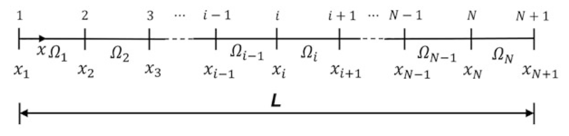
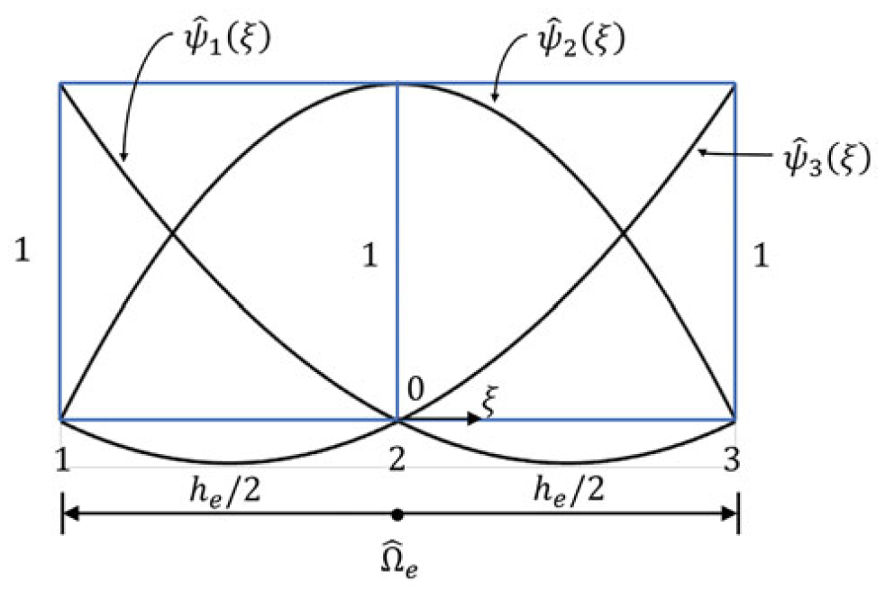
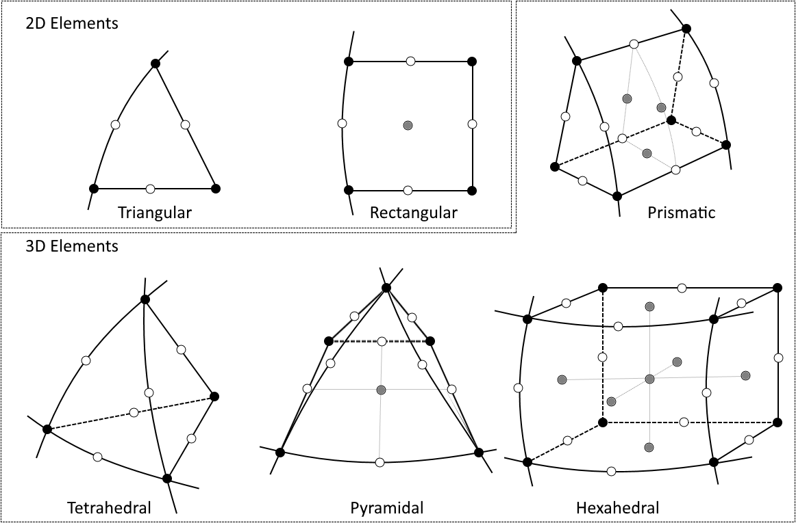
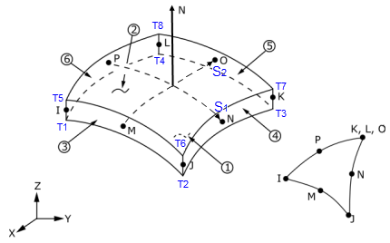

# Module 3 Element Types and Shape Functions

## Learning Objectives

Upon completion of this module, students will be able to:

* explain the influence of shape functions and element order (linear vs. quadratic) on the accuracy of an FEM result,  
* assess the relationship between mesh refinement, element distortion, and result quality,  
* explain the concept of convergence and perform an h-study (mesh refinement study),  
* interpret stress distributions critically and evaluate the effect of stress smoothing,  
* determine from FEM results when further mesh refinement or higher-order elements are required.

## Shape Functions (Theoretical Background according to Bielak[@Bielak2024])

In the previous chapter, the Finite Element Method was introduced in a simplified form, focusing on how complex structures can be approximated by a discrete number of elements connected through nodes.  

This module deepens the theoretical foundation on which the method is based. The focus is on the mathematical principles of discretization, the form of the shape functions, and the influence of element order on result accuracy and convergence. These relationships form the basis for correctly interpreting FEM results in physical terms and systematically evaluating the impact of mesh quality.

The FEM is based on the idea of dividing a continuous physical system into a finite number of small, simply describable subdomains. These subdomains are called **elements**, and the connection points between them are called **nodes**.  

Within each element, the physical behavior (e.g., displacement \(u\)) is not represented exactly but approximated by a simple mathematical function. This function is called the **shape function**.

---

### Discretization and Shape Functions

Instead of describing the entire component as a continuous body, each element is considered separately. For each element, the displacement between the nodes is approximated by a shape function.  

A one-dimensional bar is therefore divided into several **finite elements**, whose boundaries are defined by **nodes**. The following figure illustrates such a mesh consisting of \(N\) elements. The nodes are numbered along the bar axis, and the elements are denoted by \(\Omega_1, \Omega_2, \dots, \Omega_N\).

<!-- markdownlint-disable MD033 -->
 
<!-- markdownlint-enable MD033 -->

[{width=600px}](media/05_elementtypen_netz/01_FE_Discretizatio.png "Discretization of a bar into finite elements"){.glightbox}
Source[@Bielak2024]

!!! note "Explanation of element and node numbering"

    * Between two consecutive nodes \(x_i\) and \(x_{i+1}\), there is one element \(\Omega_i\).
    * The nodes are numbered sequentially along the bar axis – from \(x_1\) to \(x_{N+1}\).
    * The index \(i\) represents any arbitrary position within the mesh (e.g., \(i = 3\) for the third element).
    * In general: a mesh with \(N\) elements contains \(N + 1\) nodes.

---

Each node is assigned its own **shape function** \(\Phi_i(x)\), which is nonzero only in its immediate neighborhood and vanishes elsewhere. These functions are often referred to as **hat functions** because their shape resembles a roof profile.  

The total displacement \(u(x)\) is then given by:

\[
u(x) = \sum_{i=1}^{n} \Phi_i(x) \, u_i
\]

Each function \(\Phi_i(x)\) therefore describes the influence of node \(i\) on the overall displacement. At its own node, \(\Phi_i(x_i) = 1\), while at all other nodes, \(\Phi_i(x_j) = 0\).

<!-- markdownlint-disable MD033 -->
 
<!-- markdownlint-enable MD033 -->

[{width=600px}](media/05_elementtypen_netz/02_ShapeFunctions_Linear.png "Shape functions for several nodes of a bar"){.glightbox}
Source[@Bielak2024]

!!! note "Remarks on shape functions"
    * Each shape function \(\Phi_i(x)\) has only a **local influence** – it is active only within the directly adjacent elements and zero elsewhere.  
      Thus, each node affects only its immediate surroundings, leading to the sparse structure of the global system of equations.  

    * The term **hat function** refers exclusively to the shape of **linear shape functions**.  
      For quadratic or higher-order elements, the functions are curved; they satisfy the same conditions \(\Phi_i(x_i)=1\), \(\Phi_i(x_j)=0\), but no longer exhibit a simple roof-like form.

    * The superposition of all shape functions yields the approximated displacement distribution \(u(x)\) along the entire component.  
      Consequently, the originally continuous problem is reduced to a finite number of degrees of freedom – the nodal displacements \(u_i\).

---

### Linear Shape Functions (1D Elements)

The general approximation introduced in the previous section  

\[
u(x) = \sum_{i=1}^{n} \Phi_i(x)\,u_i
\]

applies to the entire system. Considering now **a single element** with **two nodes** located at \(x_1 = 0\) and \(x_2 = L\), the expression reduces to two local shape functions \(N_1(x)\) and \(N_2(x)\):

\[
u(x) = N_1(x)\,u_1 + N_2(x)\,u_2
\]

The task is to determine these functions \(N_i(x)\) such that they satisfy the interpolation conditions

\[
N_1(0)=1,\; N_1(L)=0, \qquad N_2(0)=0,\; N_2(L)=1
\]

Since the displacement between the nodes is assumed to vary linearly, the following linear relationship is assumed:

\[
u(x) = a + bx
\]

Applying the boundary conditions yields:

\[
u(0)=u_1,\quad u(L)=u_2 \;\Rightarrow\; u(x)=u_1+\frac{u_2-u_1}{L}\,x
\]

Comparing this expression with \(u(x)=N_1(x)u_1+N_2(x)u_2\) leads to the **linear shape functions**:

\[
N_1(x)=1-\frac{x}{L}, \qquad N_2(x)=\frac{x}{L}
\]

Differentiation with respect to the coordinate \(x\) gives the constant strain \(\varepsilon=\frac{du}{dx}\). Linear elements can therefore represent **only linear deformation distributions**.  
In regions with curved or highly varying behavior – for example near notches or contact zones – they provide only a coarse approximation. Higher accuracy in such areas is achieved through finer meshes or higher-order shape functions.

### Quadratic Shape Functions (1D Elements)

Quadratic elements have **three nodes** – two boundary nodes and one mid-node.  
In contrast to linear elements, the shape functions are now **quadratic**, allowing them to represent **curved deformations** within the element.

<!-- markdownlint-disable MD033 -->
 
<!-- markdownlint-enable MD033 -->

[{width=550px}](media/05_elementtypen_netz/03_ShapeFunctions_Quadratic.png "Quadratic shape functions of a 1D element"){.glightbox}
Source [@Bielak2024]

The figure shows the three **shape functions** \(\Phi_1(\xi)\), \(\Phi_2(\xi)\), and \(\Phi_3(\xi)\).  

* \(\Phi_1(\xi)\) and \(\Phi_3(\xi)\) pass through the end nodes and vanish at the other nodes.  
* \(\Phi_2(\xi)\) reaches its maximum at the mid-node and approaches zero at the ends.  

For convenience, the **normalized coordinate**

\[
\xi = \frac{x}{L}
\]

is often used so that the element lies within the interval \(0 \le \xi \le 1\). The three shape functions are:

\[
\begin{aligned}
\Phi_1(\xi) &= 1 - 3\xi + 2\xi^2, \\
\Phi_2(\xi) &= 4\xi(1 - \xi), \\
\Phi_3(\xi) &= 2\xi^2 - \xi
\end{aligned}
\]

Accordingly, the displacement within the element is given by:

\[
u(\xi) = \Phi_1(\xi)\,u_1 + \Phi_2(\xi)\,u_2 + \Phi_3(\xi)\,u_3
\]

Quadratic elements can represent both **linear and curved distributions** of displacement \(u(x)\) and stress \(\sigma(x)\). For the same mesh size, they yield significantly more accurate results than linear elements, but they are computationally more demanding due to the additional degrees of freedom per element.

---

### Influence of Element Order

When comparing linear and quadratic elements applied to the same component, the following observations can be made:

* Quadratic elements provide a better approximation of the stress and displacement distributions.  
* The convergence rate (approach to the exact solution) increases with the polynomial order of the shape functions.  
* For linear elements, the mesh size \(h\) must be reduced more significantly to achieve comparable accuracy.

The key differences between linear and quadratic elements are summarized in the following table:

| **Criterion** | **Linear Elements (p = 1)** | **Quadratic Elements (p = 2)** |
| :------------- | :--------------------------- | :----------------------------- |
| **Shape function** | straight line between nodes | curved, includes mid-node |
| **Deformation pattern** | linear, no curvature | curved, capable of representing nonlinear distributions |
| **Accuracy** | low, slow convergence | high, faster convergence |
| **Computational effort** | low | higher due to additional degrees of freedom |
| **Typical application** | simple geometries, homogeneous loads | regions with curvature, stress gradients, or contact zones |

---

## Convergence Behavior and Mesh Quality

The accuracy of an FEM solution depends on two factors: the **element size \(h\)** and the **shape function order \(p\)**.  

* \(h\) describes the characteristic size of an element (that is, the mesh density).  
* \(p\) denotes the polynomial order of the shape function (linear, quadratic, …).  

As the element size decreases and the polynomial order increases, the numerical solution approaches the exact solution. The remaining difference between the **exact (true)** and the **numerical (FEM)** solution is called the **error \(e\)**:

\[
e = u_\text{exact} - u_\text{FEM}
\]

Since the exact solution \(u_\text{exact}\) is usually unknown, the error is not determined directly but estimated by its **magnitude**. For many linear problems, its dependence on the element size can be described by a power function:

\[
\| e \| \approx C \, h^p
\]

Here:  

* \(C\) represents the combined **influence of geometry, material, and boundary conditions**,  
* \(h\) is the **characteristic element size**,  
* \(p\) is the **shape function order**,  
* \(\| e \|\) is a measure of the error, e.g., the **energy norm** or **\(L_2\)-norm**.

The smaller \(h\) and the larger \(p\), the smaller the error becomes.  

* If the element length \(h\) is halved, the error decreases by roughly **a factor of four** for **quadratic elements**, but only **by a factor of two** for **linear elements**.  
* A **convergence check (h-study)** verifies whether the result is independent of the mesh.

In ANSYS, such a study can be performed using different mesh densities. Typically, the **maximum stress or displacement** is plotted against the **number of elements** or the **element size**. A stable (converged) trend indicates that the result no longer depends on the mesh.

The following figure illustrates the relationship between error magnitude and mesh refinement. In double-logarithmic representation, the curves appear linear – their slope corresponds to the respective **order of convergence \(p\)**.

[{width=520px}](media/05_elementtypen_netz/05_Convergence_hp.png "Convergence diagram h-p"){.glightbox}
Source [@Bielak2024]

---

## Element Types in ANSYS

The principle of shape functions directly extends to higher dimensions. Regardless of whether a bar, surface, or solid body is analyzed, the basic idea remains the same: **shape functions** describe how displacements or other physical quantities vary between nodes.  

In finite element software, these mathematical functions are represented by specific **element types**. Depending on the dimension and the polynomial order, the **number of nodes** – and therefore the **accuracy of the approximation** – changes accordingly.

| Dimension | Example Elements (ANSYS) | Number of Nodes | Shape Function Order |
| :--------- | :----------------------- | :--------------- | :------------------- |
| **1D** | LINK180 | 2 / 3 | linear / quadratic |
| **2D** | PLANE182 / 183 | 4 / 8 | linear / quadratic |
| **3D** | SOLID185 / 186 | 8 / 20 | linear / quadratic |

The table shows typical **element types in ANSYS Mechanical**:  

* **LINK180** is a line-shaped 1D element used to model trusses or tension members.  
* **PLANE182** and **PLANE183** are 2D surface elements that can represent plane or axisymmetric structures.  
* **SOLID185** (linear) and **SOLID186** (quadratic) are 3D solid elements with **hexahedral shape**, commonly used for general solid mechanics applications.  

Thus, 1D elements consist of **line segments**, 2D elements represent **surfaces**, and 3D elements describe **volumes**. As the dimensionality increases, the number of **nodes and degrees of freedom** also increases – enhancing the potential for a more accurate and realistic description of the physical behavior.

[{width=600px}](media/05_elementtypen_netz/06_Elementtypen.png "2D and 3D element types"){.glightbox}
Source[@Comsol2025]

For each dimension, the **shape function order** can be modified. Linear means that physical quantities vary **linearly** between nodes. Quadratic and cubic elements include **mid-nodes**, allowing the shape within an element to become **curved** – a crucial advantage when modeling rounded or complex geometries.  

The following figure shows a **semicircular domain** discretized with different geometric approximation orders. The higher the order, the better the mesh conforms to the actual curvature: linear elements provide a rough approximation, while quadratic and cubic elements reproduce the contour much more smoothly. The blue points indicate the node positions.

[{width=700px}](media/05_elementtypen_netz/07_Elementtypen_COMSOL_OrderEffect.png "Influence of shape function order on geometric approximation"){.glightbox}
Source[@Comsol2025]

---

!!! note "Summary"
    The combination of **element type (1D–3D)** and **shape function order (linear–quadratic)** determines *how finely* and *how realistically* a physical phenomenon can be represented.  
    In practice, the element type is selected such that geometry and loading conditions are described as accurately as necessary, aiming for a **precise yet computationally efficient simulation**.

---

The selection of the appropriate element type depends on the geometry, loading mode, and relevant physics. The goal is always to achieve a physically consistent description with minimal computational effort. For example, *beam* and *shell* elements reduce dimensionality, *contact* and *cohesive elements* extend the physical scope, and *thermal* or *spring elements* couple additional disciplines.

??? note "Special Element Types"

    In addition to standard volume and surface elements, a wide range of specialized element types exists to efficiently capture particular physical or geometric effects. The following examples show typical representatives in *ANSYS Mechanical*.

    ---

    **Shell Elements**  
    * **SHELL181 / SHELL281:** thin-walled 2D elements with membrane and bending behavior.  
      Suitable for sheets, housings, pipes, and shell structures.  

    [{width=400px}](media/05_elementtypen_netz/09_Shell_Elements.png "Shell elements and curvature"){.glightbox}  
    Source[@Ansys2025]   

    ---

    **Contact Elements**  
    * **CONTA174 / TARGE170:** model friction, adhesion, and open/close behavior.  
      Important for press fits, bearings, and assembly states.  

    [{width=550px}](media/05_elementtypen_netz/11_Contact_Elements.svg "Contact elements"){.glightbox}  
    Source[@Ansys2025]  

    ---

    **Cohesive and Interface Elements**  
    * **INTER205:** modeling of adhesive joints, laminates, and delamination.  
      Allows progressive failure through damage laws.  

    ---

    **Spring, Bearing, and Auxiliary Elements**  
    [{width=500px}](media/05_elementtypen_netz/13_Spring_Elements.svg "Springs and bearings"){.glightbox}  
    Source[@Ansys2025]  

    * **COMBIN14:** linear spring/damper between nodes  
    * **MPC184:** kinematic coupling  
    * **MASS21:** concentrated mass  

    ---

    **Thermal Elements**  

    * **SOLID70 / SOLID90:** steady-state / transient heat conduction  
    * **SURF152:** surface heat transfer  

[{width=600px}](media/under_construction.png "Under Construction"){.glightbox}
