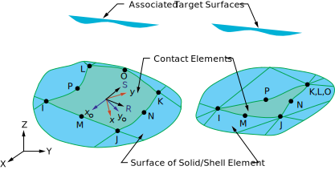

# Module 3 Element Types and Shape Functions

## Learning Objectives

Upon completion of this module, students will be able to:

* explain the influence of shape functions and element order (linear vs. quadratic) on the accuracy of an FEM result,  
* assess the relationship between mesh refinement, element distortion, and result quality,  
* explain the concept of convergence and perform an h-study (mesh refinement study),  
* interpret stress distributions critically and evaluate the effect of stress smoothing,  
* determine from FEM results when further mesh refinement or higher-order elements are required.

## Shape Functions (Theoretical Background according to Bielak[@Bielak2024])

In the previous chapter, the Finite Element Method was introduced in a simplified form, focusing on how complex structures can be approximated by a discrete number of elements connected through nodes.  

This module deepens the theoretical foundation on which the method is based. The focus is on the mathematical principles of discretization, the form of the shape functions, and the influence of element order on result accuracy and convergence. These relationships form the basis for correctly interpreting FEM results in physical terms and systematically evaluating the impact of mesh quality.

The FEM is based on the idea of dividing a continuous physical system into a finite number of small, simply describable subdomains. These subdomains are called **elements**, and the connection points between them are called **nodes**.  

Within each element, the physical behavior (e.g., displacement \(u\)) is not represented exactly but approximated by a simple mathematical function. This function is called the **shape function**.

---

### Discretization and Shape Functions

Instead of describing the entire component as a continuous body, each element is considered separately. For each element, the displacement between the nodes is approximated by a shape function.  

A one-dimensional bar is therefore divided into several **finite elements**, whose boundaries are defined by **nodes**. The following figure illustrates such a mesh consisting of \(N\) elements. The nodes are numbered along the bar axis, and the elements are denoted by \(\Omega_1, \Omega_2, \dots, \Omega_N\).

<!-- markdownlint-disable MD033 -->
 
<!-- markdownlint-enable MD033 -->

[{width=600px}](media/05_elementtypen_ansatzf/01_FE_Discretization.png "Discretization of a bar into finite elements"){.glightbox}
Source[@Bielak2024]

!!! note "Explanation of element and node numbering"

    * Between two consecutive nodes \(x_i\) and \(x_{i+1}\), there is one element \(\Omega_i\).
    * The nodes are numbered sequentially along the bar axis – from \(x_1\) to \(x_{N+1}\).
    * The index \(i\) represents any arbitrary position within the mesh (e.g., \(i = 3\) for the third element).
    * In general: a mesh with \(N\) elements contains \(N + 1\) nodes.

---

Each node is assigned its own **shape function** \(\Phi_i(x)\), which is nonzero only in its immediate neighborhood and vanishes elsewhere. These functions are often referred to as **hat functions** because their shape resembles a roof profile.  

The total displacement \(u(x)\) is then given by:

\[
u(x) = \sum_{i=1}^{n} \Phi_i(x) \, u_i
\]

Each function \(\Phi_i(x)\) therefore describes the influence of node \(i\) on the overall displacement. At its own node, \(\Phi_i(x_i) = 1\), while at all other nodes, \(\Phi_i(x_j) = 0\).

<!-- markdownlint-disable MD033 -->
 
<!-- markdownlint-enable MD033 -->

[{width=600px}](media/05_elementtypen_ansatzf/02_ShapeFunctions_Linear.png "Shape functions for several nodes of a bar"){.glightbox}
Source[@Bielak2024]

!!! note "Remarks on shape functions"
    * Each shape function \(\Phi_i(x)\) has only a **local influence** – it is active only within the directly adjacent elements and zero elsewhere.  
      Thus, each node affects only its immediate surroundings, leading to the sparse structure of the global system of equations.  

    * The term **hat function** refers exclusively to the shape of **linear shape functions**.  
      For quadratic or higher-order elements, the functions are curved; they satisfy the same conditions \(\Phi_i(x_i)=1\), \(\Phi_i(x_j)=0\), but no longer exhibit a simple roof-like form.

    * The superposition of all shape functions yields the approximated displacement distribution \(u(x)\) along the entire component.  
      Consequently, the originally continuous problem is reduced to a finite number of degrees of freedom – the nodal displacements \(u_i\).

---

### Linear Shape Functions (1D Elements)

The general approximation introduced in the previous section  

\[
u(x) = \sum_{i=1}^{n} \Phi_i(x)\,u_i
\]

applies to the entire system. Considering now **a single element** with **two nodes** located at \(x_1 = 0\) and \(x_2 = L\), the expression reduces to two local shape functions \(N_1(x)\) and \(N_2(x)\):

\[
u(x) = N_1(x)\,u_1 + N_2(x)\,u_2
\]

The task is to determine these functions \(N_i(x)\) such that they satisfy the interpolation conditions

\[
N_1(0)=1,\; N_1(L)=0, \qquad N_2(0)=0,\; N_2(L)=1
\]

Since the displacement between the nodes is assumed to vary linearly, the following linear relationship is assumed:

\[
u(x) = a + bx
\]

Applying the boundary conditions yields:

\[
u(0)=u_1,\quad u(L)=u_2 \;\Rightarrow\; u(x)=u_1+\frac{u_2-u_1}{L}\,x
\]

Comparing this expression with \(u(x)=N_1(x)u_1+N_2(x)u_2\) leads to the **linear shape functions**:

\[
N_1(x)=1-\frac{x}{L}, \qquad N_2(x)=\frac{x}{L}
\]

Differentiation with respect to the coordinate \(x\) gives the constant strain \(\varepsilon=\frac{du}{dx}\). Linear elements can therefore represent **only linear deformation distributions**.  
In regions with curved or highly varying behavior – for example near notches or contact zones – they provide only a coarse approximation. Higher accuracy in such areas is achieved through finer meshes or higher-order shape functions.

### Quadratic Shape Functions (1D Elements)

Quadratic elements have **three nodes** – two boundary nodes and one mid-node.  
In contrast to linear elements, the shape functions are now **quadratic**, allowing them to represent **curved deformations** within the element.

<!-- markdownlint-disable MD033 -->
 
<!-- markdownlint-enable MD033 -->

[{width=550px}](media/05_elementtypen_ansatzf/03_ShapeFunctions_Quadratic.png "Quadratic shape functions of a 1D element"){.glightbox}
Source [@Bielak2024]

The figure shows the three **shape functions** \(\Phi_1(\xi)\), \(\Phi_2(\xi)\), and \(\Phi_3(\xi)\).  

* \(\Phi_1(\xi)\) and \(\Phi_3(\xi)\) pass through the end nodes and vanish at the other nodes.  
* \(\Phi_2(\xi)\) reaches its maximum at the mid-node and approaches zero at the ends.  

For convenience, the **normalized coordinate**

\[
\xi = \frac{x}{L}
\]

is often used so that the element lies within the interval \(0 \le \xi \le 1\). The three shape functions are:

\[
\begin{aligned}
\Phi_1(\xi) &= 1 - 3\xi + 2\xi^2, \\
\Phi_2(\xi) &= 4\xi(1 - \xi), \\
\Phi_3(\xi) &= 2\xi^2 - \xi
\end{aligned}
\]

Accordingly, the displacement within the element is given by:

\[
u(\xi) = \Phi_1(\xi)\,u_1 + \Phi_2(\xi)\,u_2 + \Phi_3(\xi)\,u_3
\]

Quadratic elements can represent both **linear and curved distributions** of displacement \(u(x)\) and stress \(\sigma(x)\). For the same mesh size, they yield significantly more accurate results than linear elements, but they are computationally more demanding due to the additional degrees of freedom per element.

---

### Influence of Element Order

When comparing linear and quadratic elements applied to the same component, the following observations can be made:

* Quadratic elements provide a better approximation of the stress and displacement distributions.  
* The convergence rate (approach to the exact solution) increases with the polynomial order of the shape functions.  
* For linear elements, the mesh size \(h\) must be reduced more significantly to achieve comparable accuracy.

The key differences between linear and quadratic elements are summarized in the following table:

| **Criterion** | **Linear Elements (p = 1)** | **Quadratic Elements (p = 2)** |
| :------------- | :--------------------------- | :----------------------------- |
| **Shape function** | straight line between nodes | curved, includes mid-node |
| **Deformation pattern** | linear, no curvature | curved, capable of representing nonlinear distributions |
| **Accuracy** | low, slow convergence | high, faster convergence |
| **Computational effort** | low | higher due to additional degrees of freedom |
| **Typical application** | simple geometries, homogeneous loads | regions with curvature, stress gradients, or contact zones |

---

## Convergence Behavior and Mesh Quality

The accuracy of an FEM solution depends on two factors: the **element size \(h\)** and the **shape function order \(p\)**.  

* \(h\) describes the characteristic size of an element (that is, the mesh density).  
* \(p\) denotes the polynomial order of the shape function (linear, quadratic, …).  

As the element size decreases and the polynomial order increases, the numerical solution approaches the exact solution. The remaining difference between the **exact (true)** and the **numerical (FEM)** solution is called the **error \(e\)**:

\[
e = u_\text{exact} - u_\text{FEM}
\]

Since the exact solution \(u_\text{exact}\) is usually unknown, the error is not determined directly but estimated by its **magnitude**. For many linear problems, its dependence on the element size can be described by a power function:

\[
\| e \| \approx C \, h^p
\]

Here:  

* \(C\) represents the combined **influence of geometry, material, and boundary conditions**,  
* \(h\) is the **characteristic element size**,  
* \(p\) is the **shape function order**,  
* \(\| e \|\) is a measure of the error, e.g., the **energy norm** or **\(L_2\)-norm**.

The smaller \(h\) and the larger \(p\), the smaller the error becomes.  

* If the element length \(h\) is halved, the error decreases by roughly **a factor of four** for **quadratic elements**, but only **by a factor of two** for **linear elements**.  
* A **convergence check (h-study)** verifies whether the result is independent of the mesh.

In ANSYS, such a study can be performed using different mesh densities. Typically, the **maximum stress or displacement** is plotted against the **number of elements** or the **element size**. A stable (converged) trend indicates that the result no longer depends on the mesh.

The following figure illustrates the relationship between error magnitude and mesh refinement. In double-logarithmic representation, the curves appear linear – their slope corresponds to the respective **order of convergence \(p\)**.

[{width=520px}](media/05_elementtypen_ansatzf/05_Convergence_hp.png "Convergence diagram h-p"){.glightbox}
Source [@Bielak2024]

---

## Element Types in ANSYS

The principle of shape functions directly extends to higher dimensions. Regardless of whether a bar, surface, or solid body is analyzed, the basic idea remains the same: **shape functions** describe how displacements or other physical quantities vary between nodes.  

In finite element software, these mathematical functions are represented by specific **element types**. Depending on the dimension and the polynomial order, the **number of nodes** – and therefore the **accuracy of the approximation** – changes accordingly.

| Dimension | Example Elements (ANSYS) | Number of Nodes | Shape Function Order |
| :-------- | :------------------------ | :--------------- | :------------------- |
| **1D**    | LINK180                   | 2               | linear               |
| **1D**    | BEAM188 / BEAM189         | 2 / 3           | linear / quadratic   |
| **2D**    | PLANE182 / 183            | 4 / 8           | linear / quadratic   |
| **3D**    | SOLID185 / 186            | 8 / 20          | linear / quadratic   |

The table shows typical **element types in ANSYS Mechanical**:  

* **LINK180** is a line 1D element for axial tension/compression members (trusses, ties).  
* **BEAM188 / BEAM189** implement Timoshenko beam theory (bending); BEAM189 provides the quadratic 1D counterpart introduced in the theory section.  
* **PLANE182 / PLANE183** are 2D elements that can represent plane stress/strain or axisymmetric structures.  
* **SOLID185 / SOLID186** are 3D solid elements for general solid mechanics and support multiple topologies (e.g., hexahedra, tetrahedra), depending on the meshing strategy.

Thus, 1D elements consist of **line segments**, 2D elements represent **surfaces**, and 3D elements describe **volumes**. As the dimensionality increases, the number of **nodes and degrees of freedom** also increases – enhancing the potential for a more accurate and realistic description of the physical behavior.

[{width=600px}](media/05_elementtypen_ansatzf/06_Elementtypen.png "2D and 3D element types"){.glightbox}
Source[@Comsol2025]

For each dimension, the **shape function order** can be modified. Linear means that physical quantities vary **linearly** between nodes. Quadratic and cubic elements include **mid-nodes**, allowing the shape within an element to become **curved** – a crucial advantage when modeling rounded or complex geometries.  

The following figure shows a **semicircular domain** discretized with different geometric approximation orders. The higher the order, the better the mesh conforms to the actual curvature: linear elements provide a rough approximation, while quadratic and cubic elements reproduce the contour much more smoothly. The blue points indicate the node positions.

[{width=700px}](media/05_elementtypen_ansatzf/07_Elementtypen_COMSOL_OrderEffect.png "Influence of shape function order on geometric approximation"){.glightbox}
Source[@Comsol2025]

---

!!! note "Summary"
    The combination of **element type (1D–3D)** and **shape function order (linear–quadratic)** determines *how finely* and *how realistically* a physical phenomenon can be represented.  
    In practice, the element type is selected such that geometry and loading conditions are described as accurately as necessary, aiming for a **precise yet computationally efficient simulation**.

---

The selection of the appropriate element type depends on the geometry, loading mode, and relevant physics. The goal is always to achieve a physically consistent description with minimal computational effort. For example, *beam* and *shell* elements reduce dimensionality, *contact* and *cohesive elements* extend the physical scope, and *thermal* or *spring elements* couple additional disciplines.

??? note "Special Element Types"

    In addition to standard volume and surface elements, a wide range of specialized element types exists to efficiently capture particular physical or geometric effects. The following examples show typical representatives in *ANSYS Mechanical*.

    ---

    **Shell Elements**  
    * **SHELL181 / SHELL281:** thin-walled 2D elements with membrane and bending behavior.  
      Suitable for sheets, housings, pipes, and shell structures.  

    [{width=400px}](media/05_elementtypen_ansatzf/09_Shell_Elements.png "Shell elements and curvature"){.glightbox}  
    Source[@Ansys2025]   

    ---

    **Contact Elements**  
    * **CONTA174 / TARGE170:** model friction, adhesion, and open/close behavior.  
      Important for press fits, bearings, and assembly states.  

    [{width=550px}](media/05_elementtypen_ansatzf/11_Contact_Elements.svg "Contact elements"){.glightbox}  
    Source[@Ansys2025]  

    ---

    **Cohesive and Interface Elements**  
    * **INTER205:** modeling of adhesive joints, laminates, and delamination.  
      Allows progressive failure through damage laws.  

    ---

    **Spring, Bearing, and Auxiliary Elements**  
    [{width=500px}](media/05_elementtypen_ansatzf/13_Spring_Elements.svg "Springs and bearings"){.glightbox}  
    Source[@Ansys2025]  

    * **COMBIN14:** linear spring/damper between nodes  
    * **MPC184:** kinematic coupling  
    * **MASS21:** concentrated mass  

    ---

    **Thermal Elements**  

    * **SOLID70 / SOLID90:** steady-state / transient heat conduction  
    * **SURF152:** surface heat transfer  

## Task: Tension Bar with Varying Cross-Section

The objective is to investigate the influence of **element order** and **mesh resolution** on the result quality of an FEM simulation. The example used is a **tension bar with a circular transition** (according to Schier[@Schier2023]).  

Geometry and boundary conditions:  

* tapered round bar with circular transition  
* initial diameter \( D = 34.8\,\text{mm} \)  
* final diameter \( d = 8\,\text{mm} \)  
* transition length \( L = 50\,\text{mm} \)  
* transition radius \( R = 100\,\text{mm} \)  
* axial tensile force \( F = 10\,\text{kN} \)  
* material: *aluminum alloy* (from ANSYS library)  
* geometry file: [zugstab.stp](media/05_elementtypen_ansatzf/zugstab.stp)

[{width=600px}](media/05_elementtypen_ansatzf/zugstab.svg "Tension bar with circular transition according to Schier"){.glightbox}

**Perform the following tasks:**

* Generate several mesh variants with different **mesh resolutions**.  
* Compare the results for **linear** (SOLID185) and **quadratic** (SOLID186) solid elements.  
* Evaluate the **mesh quality** in the transition region.  
* Derive the **convergence behavior** from the results and discuss the influence of the shape functions.  
* Compare your results with the **analytical solution** (maximum stress and maximum displacement).

The goal is to compare **linear** and **quadratic solid elements** with gradually refined mesh resolutions and to evaluate the **mesh quality** in the transition zone.  
Special attention is given to the effect of the **shape functions** and the resulting **convergence behavior**.

## Analytical Solution

The analytical solution describes the relationship between **tensile force**, **cross-sectional area**, and **displacement** along the bar length. Based on linear elasticity:

\[
\sigma(x) = \frac{F}{A(x)}, \quad \varepsilon(x) = \frac{\sigma(x)}{E}, \quad \frac{du}{dx} = \varepsilon(x)
\]

Thus, the displacement \(u(x)\) results from integration along the bar length:

\[
u(x) = \int_0^x \frac{F}{E \, A(x)} \, dx
\]

For the tension bar with a circular transition, the cross-sectional area \(A(x)\) is approximately given by[@Schier2023]

\[
A(x) = 857 \, e^{-0.062x}
\]

where \(x\) is in mm and \(A(x)\) in mm². Integrating yields the displacement distribution:

\[
u(x) = \frac{F}{857 \, E \, 0.062} \left( e^{0.062x} - 1 \right)
\]

and the corresponding stress distribution:

\[
\sigma(x) = \frac{F}{A(x)} = \frac{F}{857} \, e^{0.062x}
\]

??? note "Explanation of the Approximation – Exact Circular Equation and Integration Effort"
    For a circular transition, the radius progression follows a circular arc defined by

    \[
    (x - x_c)^2 + \bigl(r(x) - r_c\bigr)^2 = R^2
    \quad\Rightarrow\quad
    A(x) = \pi \Bigl[r_c \mp \sqrt{R^2 - (x - x_c)^2}\Bigr]^2 .
    \]

    Here,  
    * \(R\): **transition radius**, i.e., the radius of the circular arc describing the cross-section transition,  
    * \(x_c\): **horizontal position** of the circle center,  
    * \(r_c\): **vertical position** of the circle center (refers to the bar radius).  

    The displacement can then be expressed as

    \[
    u(L)=\int_0^{L}\frac{F}{E\,A(x)}\,dx
    =\frac{F}{E\pi}\int_0^{L}\frac{dx}{\Bigl[r_c \mp \sqrt{R^2-(x-x_c)^2}\Bigr]^2}\, .
    \]

    This integral is **difficult to solve analytically** because it requires trigonometric substitutions and boundary adjustments.  
    Therefore, an **exponential approximation** \(A(x)=857\,e^{-0.062x}\) is used here.  
    This greatly simplifies the integration without significantly altering the physical behavior.

**Input parameters:**

* Tensile force \( F = 10{,}000\,\text{N} \)  
* Elastic modulus of aluminum \( E = 70{,}000\,\text{MPa} \)  
* Bar length \( L = 50\,\text{mm} \)

Thus, the maximum displacement at the free end is:

\[
u(L) = \frac{10{,}000}{857 \cdot 70{,}000 \cdot 0.062} \left( e^{0.062 \cdot 50} - 1 \right)
\]

\[
u(L) \approx 0.057\,\text{mm}
\]

The maximum stress in the smallest cross-section with \( A_\text{min} = 50.3\,\text{mm}^2 \) is:

\[
\sigma_\text{max} = \frac{F}{A_\text{min}} = \frac{10{,}000}{50.3} \approx 199\,\text{MPa}
\]

!!! Note "Continuous vs. Discrete Description"
    The analytical solution describes the **continuous distribution** of displacement along the bar length.  
    In the finite element method, the same relationship is **discretized** by dividing the bar into subdomains.  
    Within each element, the displacement field is approximated by shape functions, and the integration is performed locally.  
    With sufficiently fine mesh resolution, the FEM result converges toward the analytical solution.

## Implementation in ANSYS

### Project Management and Geometry Import

First, create a new *Static Structural* (or *Static Mechanical*) analysis in *Workbench*.  

In *Geometry*, right-click and select *Import Geometry → Browse* to import the file [zugstab.stp](media/05_elementtypen_ansatzf/zugstab.stp).  

### Material Assignment

The material management in *ANSYS Workbench* is used to select and review material properties that will later be applied in the analysis. It can be accessed from the project tree under *Engineering Data* (open by double-clicking) and is structured into several clearly organized sections:

[{width=700px}](media/05_elementtypen_ansatzf/14_technische_daten.en.png "Material selection in Engineering Data"){.glightbox}

* **Material Overview (center/top):**  
  Displays the materials currently available in the project.  
  By default, only *Structural Steel* is included.  
  A new material can be created here if needed.  

* **Toolbox (left):**  
  Contains available material categories such as *Strength*, *Thermal*, *Viscoelastic*, or *Fatigue*.  
  Individual properties can be added to the active material by double-clicking.  

* **Property Area (bottom):**  
  Shows the properties of the currently selected material.  
  Each row contains a name, a numeric value, and a unit.  
  Density, elastic modulus, Poisson’s ratio, or yield strength can be reviewed and adjusted here.  

* **Property Area (left):**  
  Displays the properties of the selected material in graphical form.  

To access additional materials, open the central material database via the *Engineering Data Sources* tab.  

[{width=700px}](media/05_elementtypen_ansatzf/15_Quelle_technische_Daten.en.png "Engineering Data Sources"){.glightbox}

* **Top/Middle Area:** Selection of available data sources (e.g., *General Materials* or *ANSYS GRANTA*).  
* **Middle/Middle Area:** Displays the materials in the chosen database.  
  The desired material can be added to the current project using the yellow *plus sign*, or alternatively via right-click.  
* **Bottom/Middle Area:** Displays material properties with corresponding values and units.  

Among the standard materials, an *Aluminum Alloy* can be found with the following data:  

| Property | Symbol | Value |
| :----------- | :------ | :---- |
| Elastic Modulus | \( E \) | 70 000 N/mm² |
| Poisson’s Ratio | \( \nu \) | 0.33 |
| Density | \( \rho \) | 2.7 kg/dm³ |

[{width=700px}](media/05_elementtypen_ansatzf/16_Auswahl_Aluminiumlegierung.en.png "Aluminum alloy selection"){.glightbox}

After adding the desired material from the database, return to the *Project Overview* (tab *Project*). Then double-click on *Model* to open the setup in the mechanical editor.  

In the *Geometry* section of the tree, check whether the body has been correctly implemented. The selected material can then be assigned to the part via the *Material* field in the *Details* window.  

[{width=700px}](media/05_elementtypen_ansatzf/17_material_zuweisung.en.png "Material assignment in the geometry section of the tree"){.glightbox}

In the project overview, the *Material* entry lists all materials currently available in the project, including the added *Aluminum Alloy*.  

[{width=700px}](media/05_elementtypen_ansatzf/18_materialien_im_projekt.en.png "Materials in the project under Material"){.glightbox}

### Mesh Generation

Initially, the standard mesh is used to evaluate the base case without modification.  
Refinements, quality metrics, and the h-study are addressed separately in the section *Element/Order/Mesh Influence*.

**Quick visual check only**  
After generating the standard mesh, inspect the element distribution in the model:  

* Is the element size appropriate for the geometry and problem definition?  
* Are transition zones sufficiently refined and free of visible distortions?  
* At this stage, only a rough plausibility check is required – no detailed quality evaluation.

The detailed quality assessment and mesh refinements will follow later in the section [Influence of Element Order and Mesh Density](#influence-of-element-order-and-mesh-density).

---

### Boundary Conditions

Boundary conditions are defined according to the problem statement:

* **Left end face:** deformable *remote displacement* (instead of a fixed support)  
* **Right end face:** axial tensile load \( F = 10{,}0\,\text{kN} \)

---

### Analysis Settings

In the first step, no specific adjustments are required; the *program-controlled default settings* are sufficient for an initial linear elastic analysis.

---

### Evaluation

The following result types are recommended for an initial assessment:  

* *Total deformation*  
* *Displacement component* in the x-direction \(u_x\)  
* *Equivalent stress* (von Mises)  
* *Normal stress \(\sigma_{xx}(x)\)*  

**Note:** The inserted result items can also be renamed.  

<!-- markdownlint-disable MD033 -->
 
<!-- markdownlint-enable MD033 -->

[{width=300px}](media/05_elementtypen_ansatzf/19_Auswertungen.en.png "Evaluation of displacement and stress"){.glightbox}

**Creating a Path for Evaluation**  

Create a *Path Result* for \(u_x(x)\) and \(\sigma_{xx}(x)\):

* Add *Normal Stress*  
* In the *Details* section, click *Geometry* and select the edge (use the selection filter)  
* Pay attention to the coordinate direction — here x is relevant, \(\sigma_{xx}(x)\)  
* Rename the result  
* Repeat the same for a *Displacement Component* for \(u_x(x)\)

This path will later be used for quantitative evaluation and comparison of the results along the component length. Even for a curved outer surface, a path is useful since it visualizes the stress distribution along the critical contour.

[{width=700px}](media/05_elementtypen_ansatzf/20_Ergebnis_Pfad.en.png "Path evaluation in the results section"){.glightbox}

[{width=800px}](media/05_elementtypen_ansatzf/21_Ergebnis_Pfad_Verschiebung.en.png "Path evaluation of displacement \(u_x(x)\)"){.glightbox}

**Important:** both results must then be converted into a path result (*right-click* → *Convert to Path Result*). Two entries *Construction Geometry* with paths will be created. The results then show the respective quantity along the selected curve.  

[{width=300px}](media/05_elementtypen_ansatzf/22_Pfad_Konstruktionsgeom.en.png "Path along the construction geometry"){.glightbox}

---

## Influence of Element Order and Mesh Density

### Motivation of the Mesh Influence Study (h-Study) and p-Comparison

The objective is to examine how **mesh size \(h\)** and **element order \(p\)** affect the accuracy of FEM results. Smaller elements capture geometry and stress gradients more precisely, while higher-order elements better represent curved distributions within an element.  

Both parameters directly influence the **displacement at the free end** and the **stresses in the transition area**. The study aims to show how the results approach the analytical solution with increasing refinement and higher element order.

Guiding questions:

* How does \(u(L)\) change when the element size \(h\) is reduced?  
* How do linear and quadratic elements differ in the stress distribution along the path for the same mesh density?  
* From which resolution onward is the result practically mesh-independent (\(p=1\) vs. \(p=2\))?

### Initial Results Along the Path

For all variants, the same result quantities are evaluated along the **path**. The standard mesh serves as the reference for the subsequent h-study and p-comparison.

The following quantities are investigated:

* **Displacement component \(u_x(x)\)** – shows the elongation of the part along the bar axis and serves as a comparison to the analytical solution.  
* **Normal stress \(\sigma_{xx}(x)\)** – describes the local stress distribution in the transition area and is particularly sensitive to mesh size and element order.

The figures below show the results of the standard mesh along the defined path.

[{width=800px}](media/05_elementtypen_ansatzf/23_Auswertung_Pfad_Verschiebung.en.png "Path evaluation of displacement \(u_x(x)\)"){.glightbox}

[{width=800px}](media/05_elementtypen_ansatzf/24_Auswertung_Pfad_Spannung.en.png "Path evaluation of normal stress \(\sigma_{xx}(x)\)"){.glightbox}

### Mesh Refinement (h-Study)

In the next step, the **element size is systematically reduced** to study the influence of mesh resolution on displacement and stress. All other settings remain unchanged.

Procedure:

* Gradually reduce the global **element size \(h\)**.  
* Recompute the analysis after each meshing step.  
* Read out the path results for \(u_x(x)\) and \(\sigma_{xx}(x)\).  

The aim is to identify from which mesh size onward the results **no longer change significantly**, so that **mesh independence** is reached.

The following table shows example results \(u_x(x)\) for different global mesh sizes along the path (14 mm, 10 mm, 6 mm and 4 mm). The number of rows corresponds to the number of elements or nodes along the path.  

??? Note "Path results displacement"
    | Mesh **14 mm** |   | Mesh **10 mm** |   | Mesh **6 mm** |   | Mesh **4 mm** |   |
    | :---: | :---: | :---: | :---: | :---: | :---: | :---: | :---: |
    | Length / mm | Displacement / mm | Length / mm | Displacement / mm | Length / mm | Displacement / mm | Length / mm | Displacement / mm |
    | 0,00 | 0,0588 | 0,00 | 0,0604 | 0,00 | 0,0604 | 0,00 | 0,0605 |
    | 6,54 | 0,0414 | 4,36 | 0,0483 | 2,91 | 0,0523 | 1,87 | 0,0552 |
    | 13,09 | 0,0275 | 8,73 | 0,0372 | 5,82 | 0,0445 | 3,74 | 0,0501 |
    | 19,63 | 0,0174 | 13,09 | 0,0278 | 8,73 | 0,0372 | 5,61 | 0,0450 |
    | 26,18 | 0,0107 | 17,45 | 0,0204 | 11,64 | 0,0308 | 7,48 | 0,0402 |
    | 32,72 | 0,0063 | 21,82 | 0,0147 | 14,54 | 0,0252 | 9,35 | 0,0358 |
    | 39,26 | 0,0032 | 26,18 | 0,0105 | 17,45 | 0,0204 | 11,22 | 0,0316 |
    | 45,80 | 0,0005 | 30,54 | 0,0074 | 20,36 | 0,0165 | 13,09 | 0,0278 |
    | 52,35 | −0,0021 | 34,90 | 0,0051 | 23,27 | 0,0132 | 14,96 | 0,0244 |
    |  |  | 39,27 | 0,0033 | 26,18 | 0,0105 | 16,83 | 0,0214 |
    |  |  | 43,63 | 0,0016 | 29,09 | 0,0084 | 18,70 | 0,0186 |
    |  |  | 47,99 | −0,0006 | 31,99 | 0,0066 | 20,57 | 0,0162 |
    |  |  | 52,36 | −0,0035 | 34,91 | 0,0051 | 22,44 | 0,0141 |
    |  |  |  |  | 37,82 | 0,0038 | 24,31 | 0,0122 |
    |  |  |  |  | 40,72 | 0,0027 | 26,18 | 0,0105 |
    |  |  |  |  | 43,63 | 0,0015 | 28,05 | 0,0091 |
    |  |  |  |  | 46,54 | 0,0003 | 29,92 | 0,0078 |
    |  |  |  |  | 49,45 | −0,0014 | 31,79 | 0,0067 |
    |  |  |  |  | 52,36 | −0,0036 | 33,66 | 0,0057 |
    |  |  |  |  |  |  | 35,53 | 0,0048 |
    |  |  |  |  |  |  | 37,40 | 0,0040 |
    |  |  |  |  |  |  | 39,27 | 0,0032 |
    |  |  |  |  |  |  | 41,14 | 0,0025 |
    |  |  |  |  |  |  | 43,01 | 0,0017 |
    |  |  |  |  |  |  | 44,88 | 0,0010 |
    |  |  |  |  |  |  | 46,75 | 0,0001 |
    |  |  |  |  |  |  | 48,62 | −0,0008 |
    |  |  |  |  |  |  | 50,49 | −0,0020 |
    |  |  |  |  |  |  | 52,36 | −0,0034 |

<!-- markdownlint-disable MD033 -->

uₓ = %{y} mm<extra></extra>"
         },
         {
           "x": [0.00,4.36,8.73,13.09,17.45,21.82,26.18,30.54,34.90,39.27,43.63,47.99,52.36],
           "y": [0.0604,0.0483,0.0372,0.0278,0.0204,0.0147,0.0105,0.0074,0.0051,0.0033,0.0016,-0.0006,-0.0035],
           "name": "Mesh 10 mm",
           "type": "scatter",
           "mode": "lines+markers",
           "hovertemplate": "x = %{x} mm uₓ = %{y} mm<extra></extra>"
         },
         {
           "x": [0.00,2.91,5.82,8.73,11.64,14.54,17.45,20.36,23.27,26.18,29.09,31.99,34.91,37.82,40.72,43.63,46.54,49.45,52.36],
           "y": [0.0604,0.0523,0.0445,0.0372,0.0308,0.0252,0.0204,0.0165,0.0132,0.0105,0.0084,0.0066,0.0051,0.0038,0.0027,0.0015,0.0003,-0.0014,-0.0036],
           "name": "Mesh 6 mm",
           "type": "scatter",
           "mode": "lines+markers",
           "hovertemplate": "x = %{x} mm uₓ = %{y} mm<extra></extra>"
         },
         {
           "x": [0.00,1.87,3.74,5.61,7.48,9.35,11.22,13.09,14.96,16.83,18.70,20.57,22.44,24.31,26.18,28.05,29.92,31.79,33.66,35.53,37.40,39.27,41.14,43.01,44.88,46.75,48.62,50.49,52.36],
           "y": [0.0605,0.0552,0.0501,0.0450,0.0402,0.0358,0.0316,0.0278,0.0244,0.0214,0.0186,0.0162,0.0141,0.0122,0.0105,0.0091,0.0078,0.0067,0.0057,0.0048,0.0040,0.0032,0.0025,0.0017,0.0010,0.0001,-0.0008,-0.0020,-0.0034],
           "name": "Mesh 4 mm",
           "type": "scatter",
           "mode": "lines+markers",
           "hovertemplate": "x = %{x} mm uₓ = %{y} mm<extra></extra>"
         }
       ],
       "layout": {
         "title": {"text": "Displacement along the path"},
         "xaxis": {"title": "Length x / mm"},
         "yaxis": {"title": "Displacement uₓ / mm"},
         "hovermode": "x unified",
         "hoverlabel": {
           "bgcolor": "white",
           "font": {"color": "black"},
           "bordercolor": "rgba(0,0,0,0)"
         },
         "legend": {"x": 1, "y": 1, "xanchor": "right", "yanchor": "top"}
       }
     }'>

<!-- markdownlint-enable MD033 -->

??? Note "Path results stress"
    | Mesh **14 mm** |   | Mesh **10 mm** |   | Mesh **6 mm** |   | Mesh **4 mm** |   |
    | :---: | :---: | :---: | :---: | :---: | :---: | :---: | :---: |
    | Length / mm | Normal stress / MPa | Length / mm | Normal stress / MPa | Length / mm | Normal stress / MPa | Length / mm | Normal stress / MPa |
    | 0,00 | 206,03 | 0,00 | 204,80 | 0,00 | 201,70 | 0,00 | 200,08 |
    | 6,54 | 163,92 | 4,36 | 187,37 | 2,91 | 194,67 | 1,87 | 197,91 |
    | 13,09 | 121,82 | 8,73 | 169,94 | 5,82 | 187,64 | 3,74 | 195,74 |
    | 19,63 | 88,58 | 13,09 | 135,69 | 8,73 | 166,85 | 5,61 | 185,97 |
    | 26,18 | 55,34 | 17,45 | 101,45 | 11,64 | 146,07 | 7,48 | 176,20 |
    | 32,72 | 41,45 | 21,82 | 77,18 | 14,54 | 124,11 | 9,35 | 162,68 |
    | 39,26 | 27,55 | 26,18 | 52,92 | 17,45 | 102,15 | 11,22 | 149,16 |
    | 45,80 | 18,45 | 30,54 | 40,86 | 20,36 | 84,69 | 13,09 | 134,84 |
    | 52,35 | 9,36 | 34,90 | 28,80 | 23,27 | 67,22 | 14,96 | 120,52 |
    |  |  | 39,27 | 25,70 | 26,18 | 55,27 | 16,83 | 107,36 |
    |  |  | 43,63 | 22,60 | 29,09 | 43,31 | 18,70 | 94,21 |
    |  |  | 47,99 | 17,59 | 31,99 | 36,33 | 20,57 | 83,13 |
    |  |  | 52,36 | 12,58 | 34,91 | 29,35 | 22,44 | 72,06 |
    |  |  |  |  | 37,82 | 26,37 | 24,31 | 63,26 |
    |  |  |  |  | 40,72 | 23,39 | 26,18 | 54,46 |
    |  |  |  |  | 43,63 | 22,56 | 28,05 | 47,83 |
    |  |  |  |  | 46,54 | 21,72 | 29,92 | 41,19 |
    |  |  |  |  | 49,45 | 17,17 | 31,79 | 36,56 |
    |  |  |  |  | 52,36 | 12,62 | 33,66 | 31,93 |

<!-- markdownlint-disable MD033 -->

σₓₓ = %{text}<extra></extra>"
         },
         {
           "x": [0.00,4.36,8.73,13.09,17.45,21.82,26.18,30.54,34.90,39.27,43.63,47.99,52.36],
           "y": [204.80,187.37,169.94,135.69,101.45,77.18,52.92,40.86,28.80,25.70,22.60,17.59,12.58],
           "name": "Mesh 10 mm",
           "type": "scatter",
           "mode": "lines+markers",
           "text": ["204,80 MPa","187,37 MPa","169,94 MPa","135,69 MPa","101,45 MPa","77,18 MPa","52,92 MPa","40,86 MPa","28,80 MPa","25,70 MPa","22,60 MPa","17,59 MPa","12,58 MPa"],
           "hovertemplate": "x = %{x} mm σₓₓ = %{text}<extra></extra>"
         },
         {
           "x": [0.00,2.91,5.82,8.73,11.64,14.54,17.45,20.36,23.27,26.18,29.09,31.99,34.91,37.82,40.72,43.63,46.54,49.45,52.36],
           "y": [201.70,194.67,187.64,166.85,146.07,124.11,102.15,84.69,67.22,55.27,43.31,36.33,29.35,26.37,23.39,22.56,21.72,17.17,12.62],
           "name": "Mesh 6 mm",
           "type": "scatter",
           "mode": "lines+markers",
           "text": ["201,70 MPa","194,67 MPa","187,64 MPa","166,85 MPa","146,07 MPa","124,11 MPa","102,15 MPa","84,69 MPa","67,22 MPa","55,27 MPa","43,31 MPa","36,33 MPa","29,35 MPa","26,37 MPa","23,39 MPa","22,56 MPa","21,72 MPa","17,17 MPa","12,62 MPa"],
           "hovertemplate": "x = %{x} mm σₓₓ = %{text}<extra></extra>"
         },
         {
           "x": [0.00,1.87,3.74,5.61,7.48,9.35,11.22,13.09,14.96,16.83,18.70,20.57,22.44,24.31,26.18,28.05,29.92,31.79,33.66],
           "y": [200.08,197.91,195.74,185.97,176.20,162.68,149.16,134.84,120.52,107.36,94.21,83.13,72.06,63.26,54.46,47.83,41.19,36.56,31.93],
           "name": "Mesh 4 mm",
           "type": "scatter",
           "mode": "lines+markers",
           "text": ["200,08 MPa","197,91 MPa","195,74 MPa","185,97 MPa","176,20 MPa","162,68 MPa","149,16 MPa","134,84 MPa","120,52 MPa","107,36 MPa","94,21 MPa","83,13 MPa","72,06 MPa","63,26 MPa","54,46 MPa","47,83 MPa","41,19 MPa","36,56 MPa","31,93 MPa"],
           "hovertemplate": "x = %{x} mm σₓₓ = %{text}<extra></extra>"
         }
       ],
       "layout": {
         "title": {"text": "Normal stress along the path"},
         "xaxis": {"title": "Length x / mm"},
         "yaxis": {"title": "Normal stress σₓₓ / MPa", "rangemode": "tozero"},
         "hovermode": "x unified",
         "hoverlabel": {
           "bgcolor": "white",
           "font": {"color": "black"},
           "bordercolor": "rgba(0,0,0,0)"
         },
         "legend": {"x": 1, "y": 1, "xanchor": "right", "yanchor": "top"}
       }
     }'>

<!-- markdownlint-enable MD033 -->

To assess mesh independence, the maximum values of displacement \(u_x(x)\) and normal stress \(\sigma_{xx}(x)\) are compared for different mesh sizes. The evaluation shows how strongly both quantities change with increasing mesh refinement and from which element size convergence is achieved.

| Mesh size | Max. displacement \(u_{x,\text{max}}\) | Max. normal stress \(σ_{xx,\text{max}}\) |
| :--------- | :-----------------------------------------: | :---------------------------------------------: |
| 14 mm | 0,05884 mm | 206,0 MPa |
| 10 mm | 0,060411 mm | 204,8 MPa |
| 6 mm | 0,060449 mm | 201,7 MPa |
| 4 mm | 0,060459 mm | 200,1 MPa |
| 2 mm | 0,060463 mm | 199,12 MPa |
| 1 mm | 0,060464 mm | 198,91 MPa |
| 0,5 mm | 0,060466 mm | 198,92 MPa |

<!-- markdownlint-disable MD033 -->

Max. displacement = %{text}<extra></extra>"
         },
         {
           "x": ["14 mm","10 mm","6 mm","4 mm","2 mm","1 mm","0,5 mm"],
           "y": [206.0,204.8,201.7,200.1,199.12,198.91,198.92],
           "name": "Max. normal stress",
           "type": "scatter",
           "mode": "lines+markers",
           "yaxis": "y2",
           "text": ["206,0 MPa","204,8 MPa","201,7 MPa","200,1 MPa","199,12 MPa","198,91 MPa","198,92 MPa"],
           "hovertemplate": "Mesh size = %{x} Max. normal stress = %{text}<extra></extra>"
         }
       ],
       "layout": {
         "title": {"text": "Influence of mesh size on displacement and stress"},
         "xaxis": {"title": "Mesh size"},
         "yaxis": {"title": "Max. displacement (mm)", "side": "left"},
         "yaxis2": {
           "title": "Max. normal stress (MPa)",
           "overlaying": "y",
           "side": "right"
         },
         "legend": {"x": 0.95, "y": 0.5, "xanchor": "right", "yanchor": "middle", "bgcolor": "rgba(255,255,255,0.6)"},
         "hovermode": "x unified",
         "hoverlabel": {"bgcolor": "white", "font": {"color": "black"}, "bordercolor": "rgba(0,0,0,0)"}
       }
     }'>

<!-- markdownlint-enable MD033 -->

---

### Influence of Element Order (p-Comparison)

The p-study investigates the influence of **element order** at constant mesh size \(h\). **Linear** \((p = 1)\) and **quadratic** \((p = 2)\) elements are compared. Higher orders allow a more accurate representation of curved distributions within an element but increase computational cost. It is expected that **displacement \(u_x(x)\)** and **normal stress \(\sigma_{xx}(x)\)** are smoother and closer to the reference solution for \(p = 2\), while computation time increases.

In ANSYS, **SOLID185** is used as a linear and **SOLID186** as a quadratic element.

#### Setting the element order in ANSYS (starting with *Linear*)

* In the *Details of “Mesh”* section, change the parameter *Element Order* from *Program Controlled* to *Linear*.  
* Alternatively, insert a local mesh method via *Insert → Method* and explicitly set *Element Order* to *Linear* there.  
* Then regenerate the mesh via *Update*.  

[{width=700px}](media/05_elementtypen_ansatzf/25_Elementordnung_linear.en.png "Element order in ANSYS: set element order to Linear"){.glightbox}

---

#### Results linear vs. quadratic shape function at identical element size

??? Note "Path results linear/quadratic shape function"
    | **6 mm linear** |   |   | **6 mm quadratic** |   |   |
    | :---: | :---: | :---: | :---: | :---: | :---: |
    | Length in mm | Displacement in mm | Normal stress in MPa | Length in mm | Displacement in mm | Normal stress in MPa |
    | 0,000 | 6,29E−02 | 204,95 | 0,000 | 6,04E−02 | 201,70 |
    | 5,817 | 4,61E−02 | 190,22 | 2,909 | 5,23E−02 | 194,67 |
    | 11,634 | 3,17E−02 | 153,22 | 5,818 | 4,45E−02 | 187,64 |
    | 17,451 | 2,09E−02 | 110,68 | 8,727 | 3,72E−02 | 166,85 |
    | 23,268 | 1,34E−02 | 74,97 | 11,635 | 3,08E−02 | 146,07 |
    | 29,085 | 8,42E−03 | 49,58 | 14,544 | 2,52E−02 | 124,11 |
    | 34,902 | 5,07E−03 | 34,24 | 17,453 | 2,04E−02 | 102,15 |
    | 40,719 | 2,59E−03 | 26,64 | 20,362 | 1,65E−02 | 84,69 |
    | 46,536 | 2,07E−04 | 19,88 | 23,271 | 1,32E−02 | 67,22 |
    | 52,353 | −2,23E−03 | 15,15 | 26,179 | 1,05E−02 | 55,27 |
    |   |   |   | 29,088 | 8,36E−03 | 43,31 |
    |   |   |   | 31,997 | 6,58E−03 | 36,33 |
    |   |   |   | 34,906 | 5,11E−03 | 29,35 |
    |   |   |   | 37,815 | 3,83E−03 | 26,37 |
    |   |   |   | 40,723 | 2,66E−03 | 23,39 |
    |   |   |   | 43,632 | 1,50E−03 | 22,56 |
    |   |   |   | 46,541 | 2,88E−04 | 21,72 |
    |   |   |   | 49,450 | −1,39E−03 | 17,17 |
    |   |   |   | 52,359 | −3,56E−03 | 12,62 |

<!-- markdownlint-disable MD033 -->

uₓ = %{y:.5f} mm<extra></extra>"
         },
         {
           "x": [0.000,2.9088,5.8176,8.7265,11.635,14.544,17.453,20.362,23.271,26.179,29.088,31.997,34.906,37.815,40.723,43.632,46.541,49.450,52.359],
           "y": [0.0604,0.0523,0.0445,0.0372,0.0308,0.0252,0.0204,0.0165,0.0132,0.0105,0.00836,0.00658,0.00511,0.00383,0.00266,0.00150,0.000288,-0.00139,-0.00356],
           "name": "6 mm quadratic",
           "type": "scatter",
           "mode": "lines+markers",
           "hovertemplate": "x = %{x} mm uₓ = %{y:.5f} mm<extra></extra>"
         }
       ],
       "layout": {
         "title": {"text": "Displacement along the path (6 mm mesh)"},
         "xaxis": {"title": "Length x / mm"},
         "yaxis": {"title": "Displacement uₓ / mm"},
         "hovermode": "x unified",
         "hoverlabel": {
           "bgcolor": "white",
           "font": {"color": "black"},
           "bordercolor": "rgba(0,0,0,0)"
         },
         "legend": {"x": 1, "y": 1, "xanchor": "right", "yanchor": "top"}
       }
     }'>

σₓₓ = %{y:.2f} MPa<extra></extra>"
         },
         {
           "x": [0.000,2.9088,5.8176,8.7265,11.635,14.544,17.453,20.362,23.271,26.179,29.088,31.997,34.906,37.815,40.723,43.632,46.541,49.450,52.359],
           "y": [201.70,194.67,187.64,166.85,146.07,124.11,102.15,84.69,67.22,55.27,43.31,36.33,29.35,26.37,23.39,22.56,21.72,17.17,12.62],
           "name": "6 mm quadratic",
           "type": "scatter",
           "mode": "lines+markers",
           "hovertemplate": "x = %{x} mm σₓₓ = %{y:.2f} MPa<extra></extra>"
         }
       ],
       "layout": {
         "title": {"text": "Normal stress along the path (6 mm mesh)"},
         "xaxis": {"title": "Length x / mm"},
         "yaxis": {"title": "Normal stress σₓₓ / MPa"},
         "hovermode": "x unified",
         "hoverlabel": {
           "bgcolor": "white",
           "font": {"color": "black"},
           "bordercolor": "rgba(0,0,0,0)"
         },
         "legend": {"x": 1, "y": 1, "xanchor": "right", "yanchor": "top"}
       }
     }'>

<!-- markdownlint-enable MD033 -->

| Shape function | Max. displacement \(u_{x,\text{max}}\) | Max. normal stress \(σ_{xx,\text{max}}\) |
| :--------- | :-----------------------------------------: | :---------------------------------------------: |
| linear | 0,062854 mm | 204,95 MPa |
| quadratic | 0,060449 mm | 201,7 MPa |

---

### Summary of the influence study

* Objective: assess the influence of mesh size \(h\) and element order \(p\) on \(u_x(x)\) and \(\sigma_{xx}(x)\) along a path  
* Result h-study: \(u_x\) converges quickly, \(\sigma_{xx}\) responds more strongly to refinement; at fine meshes, changes are small  
* Result p-comparison: quadratic elements provide smoother curves and smaller deviation from the reference solution; linear elements slightly overestimate displacement and stress  
* Practice: for global displacements, a moderately refined linear mesh is sufficient; for local stresses, a finer mesh with quadratic elements is recommended  

---

## Mesh Quality

!!! warning "FIXME: extend section mesh quality"
    Planned additions for future revision:

    * Presentation of typical **mesh quality metrics** in ANSYS (*Element Quality*, *Aspect Ratio*, *Skewness*, *Jacobian Ratio*)  
    * Example screenshots from *Details of “Mesh” → Quality*  
    * Notes on interpretation of the colour scale and threshold values  
    * Influence of poor quality on stress and displacement distributions  
    * Short comparison of automatic versus manually optimised meshing  
    * Optionally add a **Plotly representation** to visualise quality metrics along a path or component region  
    * Demonstration of distorted elements and their impact on stress distribution.  

## Quiz for Self-Assessment  

<!-- markdownlint-disable MD033 -->

<?quiz?>
question: Which parameter in FEM describes the typical length of an element?
answer: Element type
answer-correct: Mesh size \(h\)
answer: Element order \(p\)
content:
<em>Note:</em> The mesh size \(h\) defines the characteristic element length and determines the resolution of the mesh.
<?/quiz?>

<?quiz?>
question: What does the parameter \(p\) stand for in the finite element method?
answer-correct: Polynomial order of the shape function
answer: Element size
answer: Material parameter
content:
<em>Note:</em> \(p\) indicates the order of the shape function (linear, quadratic, cubic …).
<?/quiz?>

<?quiz?>
question: How do linear and quadratic elements differ in the shape of their functions?
answer: Linear: curved, Quadratic: straight
answer: No difference in shape
answer-correct: Linear: straight, Quadratic: curved
content:
<em>Note:</em> Quadratic elements have mid-nodes and can represent curvature.
<?/quiz?>

<?quiz?>
question: Which statement correctly describes convergence behaviour?
answer: The larger \(h\) and the smaller \(p\), the more accurate the result.
answer: The result is independent of \(h\) and \(p\).
answer-correct: With smaller \(h\) and higher \(p\), the FEM solution approaches the exact solution.
content:
<em>Note:</em> Convergence describes the approach of the numerical solution to the exact one with finer meshes or higher order.
<?/quiz?>

<?quiz?>
question: Which ANSYS element is linear and 3D?
answer-correct: SOLID185
answer: SOLID186
answer: BEAM189
content:
<em>Note:</em> SOLID185 is a linear 3D solid element; SOLID186 is quadratic.
<?/quiz?>

<?quiz?>
question: What does the shape function \(\Phi_i(x)\) describe?
answer: The material properties at the node
answer: The load at node \(i\)
answer-correct: The influence of node \(i\) on the total displacement
content:
<em>Note:</em> Shape functions link the nodal displacements to the overall deformation.
<?/quiz?>

<?quiz?>
question: How many nodes does a quadratic 1D element have?
answer: 2
answer-correct: 3
answer: 4
content:
<em>Note:</em> Quadratic 1D elements have one mid-node in addition to the two end nodes.
<?/quiz?>

<?quiz?>
question: Why are quadratic elements more accurate?
answer: They are smaller.
answer: They have fewer degrees of freedom.
answer-correct: They can represent curved deformations within an element.
content:
<em>Note:</em> Additional nodes and higher polynomial order enable better approximation of stress and displacement distributions.
<?/quiz?>

<?quiz?>
question: What does “mesh-independent result” mean?
answer: Mesh size has a large influence on the result.
answer: Mesh refinement causes divergence.
answer-correct: Further mesh refinement changes the result only slightly.
content:
<em>Note:</em> Mesh independence is achieved when results no longer change significantly with smaller \(h\).
<?/quiz?>

<?quiz?>
question: What is the advantage of higher element order at constant mesh size?
answer-correct: More accurate approximation without further mesh refinement
answer: Lower computational cost
answer: Easier meshing
content:
<em>Note:</em> Higher polynomial order can capture geometric effects even with a coarser mesh.
<?/quiz?>

<?quiz?>
question: What is the objective of an h-study?
answer: Determining the elastic modulus
answer-correct: Investigating mesh dependence and identifying convergence
answer: Reducing computation time
content:
<em>Note:</em> In an h-study, the mesh is gradually refined to assess the stability of the results.
<?/quiz?>

<?quiz?>
question: When is the use of quadratic elements particularly useful?
answer-correct: For curved geometries or high stress gradients
answer: Only for linear deformations
answer: For homogeneous stress distributions
content:
<em>Note:</em> Quadratic elements are particularly advantageous for local effects or curved geometries.
<?/quiz?>

<!-- markdownlint-enable MD033 -->
