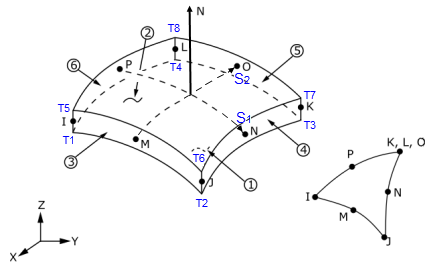
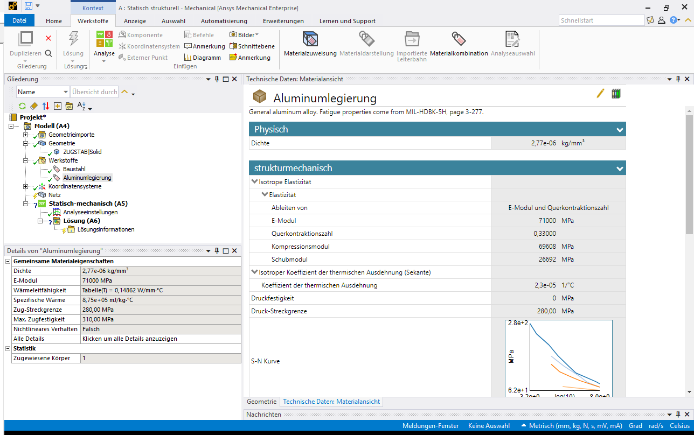

# Modul 3 Elementtypen und Ansatzfunktionen

## Lernziele

Nach Abschluss dieses Moduls können die Studierenden:

* den Einfluss der Ansatzfunktionen und der Elementordnung (linear vs. quadratisch) auf die Genauigkeit eines FEM-Ergebnisses erläutern,  
* den Zusammenhang zwischen Netzverfeinerung, Elementverzerrung und Ergebnisqualität bewerten,  
* den Begriff der Konvergenz besser erklären und eine h-Studie (Netzeinflussstudie) durchführen,  
* aus FEM-Ergebnissen ableiten, wann weitere Netzverfeinerung oder höhere Ansatzordnung erforderlich ist.

## Ansatzfunktion (Theoretischer Hintergrund nach Bielak[@Bielak2024])

Im vorherigen Kapitel wurde die Finite-Elemente-Methode in vereinfachter Form eingeführt. Dabei stand im Vordergrund, wie komplexe Bauteile durch eine diskrete Anzahl von Elementen angenähert und über Knotenpunkte miteinander verbunden werden.  

In diesem Modul wird die theoretische Grundlage vertieft, auf der diese Methode basiert. Im Mittelpunkt stehen die mathematischen Prinzipien der Diskretisierung, die Form der Ansatzfunktionen  sowie der Einfluss der Elementordnung auf die Genauigkeit und Konvergenz des Ergebnisses. Diese Zusammenhänge bilden das Fundament, um die späteren FEM-Ergebnisse physikalisch korrekt zu interpretieren und den Einfluss der Netzqualität systematisch zu bewerten.

FEM beruht auf der Idee, ein kontinuierliches physikalisches System in eine endliche Anzahl kleiner, einfach beschreibbarer Teilbereiche zu zerlegen. Diese Teilbereiche werden als **Elemente** bezeichnet. Die Verbindungspunkte zwischen ihnen heißen **Knoten**.  

Innerhalb jedes Elements wird das physikalische Verhalten (z. B. die Verschiebung \(u\)) nicht exakt, sondern durch eine einfache mathematische Funktion beschrieben. Diese Funktion wird als **Ansatzfunktion** bezeichnet.

---

### Diskretisierung und Ansatzfunktion

Statt das gesamte Bauteil kontinuierlich zu beschreiben, wird jedes Element einzeln betrachtet. Für jedes Element gilt: Die Verschiebung zwischen den Knoten wird durch eine Ansatzfunktion angenähert.  

Ein eindimensionaler Stab wird dazu in mehrere **Finite Elemente** zerlegt, deren Grenzen durch **Knotenpunkte** festgelegt sind. Die folgende Abbildung zeigt ein solches Netz aus \(N\) Elementen. Die Knoten sind entlang der Stabachse nummeriert, die Elemente werden mit \(\Omega_1, \Omega_2, \dots, \Omega_N\) bezeichnet.

<!-- markdownlint-disable MD033 -->
 
<!-- markdownlint-enable MD033 -->

[{width=600px}](media/05_elementtypen_ansatzf/01_FE_Discretization.png "Diskretisierung eines Stabes in Finite Elemente"){.glightbox}
Bildquelle[@Bielak2024]

!!! note "Erläuterung zur Element- und Knotennummerierung"

    * Zwischen zwei aufeinanderfolgenden Knoten \(x_i\) und \(x_{i+1}\) liegt jeweils ein Element \(\Omega_i\).
    * Die Knoten sind entlang der Stabachse fortlaufend nummeriert – von \(x_1\) bis \(x_{N+1}\).
    * Der Index \(i\) steht stellvertretend für eine beliebige Position im Netz (z. B. \(i = 3\) für das dritte Element).
    * Insgesamt gilt: Ein Netz mit \(N\) Elementen besitzt \(N + 1\) Knoten.

---

Jeder Knoten erhält eine eigene **Ansatzfunktion** \(\Phi_i(x)\), die im direkten Nachbarbereich ungleich null ist und außerhalb davon verschwindet. Diese Funktionen werden häufig auch als **Hutfunktionen** bezeichnet, da ihr Verlauf an die Form eines Daches erinnert.  

Für die Gesamtlösung \(u(x)\) gilt:

\[
u(x) = \sum_{i=1}^{n} \Phi_i(x) \, u_i
\]

Jede Funktion \(\Phi_i(x)\) beschreibt also den Einfluss des Knotens \(i\) auf die Gesamtverschiebung. Am eigenen Knoten gilt \(\Phi_i(x_i) = 1\), an allen anderen Knoten \(\Phi_i(x_j) = 0\).

<!-- markdownlint-disable MD033 -->
 
<!-- markdownlint-enable MD033 -->

[{width=600px}](media/05_elementtypen_ansatzf/02_ShapeFunctions_Linear.png "Ansatzfunktionen für mehrere Knoten eines Stabes"){.glightbox}
Bildquelle[@Bielak2024]

!!! note "Erläuterungen zu den Ansatzfunktionen"
    * Jede Ansatzfunktion \(\Phi_i(x)\) besitzt nur eine **lokale Tragweite** – sie ist nur in den direkt angrenzenden Elementen aktiv und außerhalb dieses Bereichs null.  
      Dadurch beeinflusst jeder Knoten nur seine unmittelbare Umgebung, was zur sparsamen Struktur der globalen Gleichungen führt.  

    * Der Begriff **Hutfunktion** beschreibt ausschließlich die Form der **linearen Ansatzfunktionen**.  
      Bei quadratischen oder höheren Elementen sind die Funktionen gekrümmt; sie erfüllen dieselben Bedingungen \(\Phi_i(x_i)=1\), \(\Phi_i(x_j)=0\), besitzen aber keine einfache Dachform mehr.

    * Die Überlagerung aller Ansatzfunktionen ergibt die angenäherte Verschiebungsverteilung \(u(x)\) entlang des gesamten Bauteils.  
      Damit wird das ursprünglich kontinuierliche Problem auf eine endliche Zahl von Freiheitsgraden – die Verschiebungen \(u_i\) an den Knoten – reduziert.

---

### Lineare Ansatzfunktionen (1D-Elemente)

Die im vorherigen Abschnitt eingeführte allgemeine Näherung  

\[
u(x) = \sum_{i=1}^{n} \Phi_i(x)\,u_i
\]

gilt für das gesamte System. Betrachtet man nun **ein einzelnes Element** mit **zwei Knoten** an den Positionen \(x_1 = 0\) und \(x_2 = L\), so reduziert sich der Ausdruck auf zwei lokale Ansatzfunktionen \(N_1(x)\) und \(N_2(x)\):

\[
u(x) = N_1(x)\,u_1 + N_2(x)\,u_2
\]

Die Aufgabe besteht nun darin, diese \(N_i(x)\) so zu bestimmen, dass sie die Interpolationsbedingungen

\[
N_1(0)=1,\; N_1(L)=0, \qquad N_2(0)=0,\; N_2(L)=1
\]

erfüllen. Da die Verschiebung zwischen den Knoten linear verlaufen soll, wird angenommen:

\[
u(x) = a + bx
\]

Einsetzen der Randbedingungen liefert:

\[
u(0)=u_1,\quad u(L)=u_2 \;\Rightarrow\; u(x)=u_1+\frac{u_2-u_1}{L}\,x
\]

Vergleicht man diesen Ausdruck mit \(u(x)=N_1(x)u_1+N_2(x)u_2\), so ergeben sich die **linearen Ansatzfunktionen**:

\[
N_1(x)=1-\frac{x}{L}, \qquad N_2(x)=\frac{x}{L}
\]

Die Ableitung nach der Koordinate \(x\) ergibt die konstante Dehnung \(\varepsilon=\frac{du}{dx}\). Lineare Elemente können daher **nur lineare Verformungsverläufe** abbilden.  
Bei gekrümmten oder stark veränderlichen Verläufen – etwa in der Nähe von Kerben oder Kontaktzonen – liefern sie nur eine grobe Näherung. Eine höhere Genauigkeit wird dort durch feinere Netze oder höhergradige Ansatzfunktionen erreicht.

### Quadratische Ansatzfunktionen (1D-Elemente)

Quadratische Elemente besitzen **drei Knoten** – zwei Randknoten und einen Mittenknoten.  
Im Gegensatz zu linearen Elementen verlaufen die Ansatzfunktionen nun **quadratisch** und können dadurch auch **gekrümmte Verformungen** innerhalb des Elements abbilden.

<!-- markdownlint-disable MD033 -->
 
<!-- markdownlint-enable MD033 -->

[{width=550px}](media/05_elementtypen_ansatzf/03_ShapeFunctions_Quadratic.png "Quadratische Ansatzfunktionen eines 1D-Elements"){.glightbox}
Bildquelle [@Bielak2024]

In der Abbildung sind die drei **Formfunktionen** \(\Phi_1(\xi)\), \(\Phi_2(\xi)\) und \(\Phi_3(\xi)\) dargestellt.  

* \(\Phi_1(\xi)\) und \(\Phi_3(\xi)\) verlaufen jeweils durch die Randknoten und verschwinden an den anderen Knoten.  
* \(\Phi_2(\xi)\) besitzt ihr Maximum im Mittenknoten und geht an den Rändern gegen null.  

Zur Beschreibung wird häufig die **normierte Koordinate**

\[
\xi = \frac{x}{L}
\]

verwendet, sodass das Element im Intervall \(0 \le \xi \le 1\) liegt. Die drei Ansatzfunktionen lauten:

\[
\begin{aligned}
\Phi_1(\xi) &= 1 - 3\xi + 2\xi^2, \\
\Phi_2(\xi) &= 4\xi(1 - \xi), \\
\Phi_3(\xi) &= 2\xi^2 - \xi
\end{aligned}
\]

Damit ergibt sich die Verschiebung innerhalb des Elements zu:

\[
u(\xi) = \Phi_1(\xi)\,u_1 + \Phi_2(\xi)\,u_2 + \Phi_3(\xi)\,u_3
\]

Quadratische Elemente können sowohl **lineare als auch gekrümmte Verläufe** der Verschiebung \(u(x)\) und der Spannung \(\sigma(x)\) darstellen. Bei gleicher Netzgröße liefern sie deutlich genauere Ergebnisse als lineare Elemente, sind jedoch aufgrund der zusätzlichen Freiheitsgrade pro Element rechenintensiver.

---

### Einfluss der Elementordnung

Vergleicht man lineare und quadratische Elemente am gleichen Bauteil, so zeigt sich:

* Quadratische Elemente approximieren den Spannungs- und Verschiebungsverlauf besser.  
* Die Konvergenzgeschwindigkeit (Annäherung an die exakte Lösung) steigt mit der Ansatzordnung.  
* Bei linearen Elementen muss die Netzgröße \(h\) stärker verringert werden, um vergleichbare Genauigkeit zu erreichen.

Die wichtigsten Unterschiede zwischen linearen und quadratischen Elementen sind in der folgenden Übersicht zusammengefasst:

| **Kriterium** | **Lineare Elemente (p = 1)** | **Quadratische Elemente (p = 2)** |
| :------------- | :---------------------------- | :-------------------------------- |
| **Ansatzfunktion** | geradlinig zwischen den Knoten | gekrümmt, Mittenknoten vorhanden |
| **Verformungsverlauf** | linear, keine Krümmung | gekrümmt, auch nichtlineare Verläufe abbildbar |
| **Genauigkeit** | gering, konvergiert langsam | hoch, schnellere Konvergenz |
| **Rechenaufwand** | gering | höher durch zusätzliche Freiheitsgrade |
| **Einsatzgebiet** | einfache Geometrien, homogene Belastungen | Bereiche mit Krümmung, Spannungsgradienten oder Kontaktzonen |

---

## Konvergenzverhalten und Netzqualität

Die Genauigkeit einer FEM-Lösung hängt von zwei Faktoren ab: der **Elementgröße \(h\)** und der **Ansatzordnung \(p\)**.  

* \(h\) beschreibt die charakteristische Länge eines Elements (also die Netzauflösung).  
* \(p\) steht für die Polynomordnung der Ansatzfunktion (linear, quadratisch, …).  

Mit abnehmender Elementgröße und höherer Ansatzordnung nähert sich die numerische Lösung der exakten Lösung an. Der verbleibende Unterschied zwischen der **exakten (wahren)** und der **numerischen (FEM-)Lösung** wird als **Fehler \(e\)** bezeichnet:

\[
e = u_\text{exakt} - u_\text{FEM}
\]

Da die exakte Lösung \(u_\text{exakt}\) meist unbekannt ist, wird der Fehler nicht direkt, sondern **über seine Größenordnung** abgeschätzt. Für viele lineare Probleme lässt sich sein Verlauf mit der Elementgröße durch eine Potenzfunktion beschreiben:

\[
\| e \| \approx C \, h^p
\]

Hierbei gilt:  

* \(C\) fasst den **Einfluss von Geometrie, Material und Randbedingungen** zusammen,  
* \(h\) steht für die **charakteristische Elementgröße**,  
* \(p\) beschreibt die **Ansatzordnung**,  
* \(\| e \|\) ist eine Maßzahl für den Fehler, z. B. die **Energie- oder \(L_2\)-Norm**.

Je kleiner \(h\) und je größer \(p\), desto kleiner wird der Fehler.  

* Wird die Elementlänge \(h\) halbiert, reduziert sich der Fehler bei **quadratischen Elementen** etwa **viermal**, bei **linearen** nur **zweimal**.  
* Eine **Konvergenzprüfung (h-Studie)** überprüft, ob das Ergebnis unabhängig vom Netz ist.

In ANSYS kann eine solche Untersuchung mit verschiedenen Netzgrößen durchgeführt werden. Typischerweise wird dabei die **maximale Spannung oder Verschiebung** gegen die **Elementanzahl** oder die **Elementgröße** aufgetragen. Ein stabiler (konvergenter) Verlauf zeigt, dass das Ergebnis nicht mehr vom Netz abhängt.

Die folgende Abbildung zeigt beispielhaft den Zusammenhang zwischen Fehlermaß und Netzverfeinerung. In doppeltlogarithmischer Darstellung erscheinen die Kurven linear – ihre Steigung entspricht der jeweiligen **Konvergenzordnung \(p\)**.

[{width=520px}](media/05_elementtypen_ansatzf/05_Convergence_hp.png "Konvergenzdiagramm h-p"){.glightbox}
Bildquelle [@Bielak2024]

---

## Elementtypen in ANSYS

Das Prinzip der Ansatzfunktionen überträgt sich direkt auf höhere Dimensionen. Unabhängig davon, ob ein Stab, eine Fläche oder ein Volumenkörper analysiert wird – die Grundidee bleibt dieselbe: **Ansatzfunktionen** beschreiben, wie sich Verschiebungen oder andere physikalische Größen zwischen den Knotenpunkten verhalten.  

In der Finite-Elemente-Software werden diese mathematischen Funktionen über konkrete **Elementtypen** abgebildet. Je nach Dimension und Ansatzordnung ändert sich dabei die **Anzahl der Knoten** und damit die **Genauigkeit der Approximation**.

| Dimension | Beispiel-Elemente (ANSYS) | Knotenanzahl | Ansatzordnung |
| :--------- | :------------------------ | :------------ | :-------------- |
| **1D** | LINK180 | 2 | linear |
| **1D**    | BEAM188 / BEAM189         | 2 / 3        | linear / quadratisch |
| **2D** | PLANE182 / 183 | 4 / 8 | linear / quadratisch |
| **3D** | SOLID185 / 186 | 8 / 20 | linear / quadratisch |

Die Tabelle zeigt typische **Elementtypen aus ANSYS Mechanical**:  

* **LINK180** ist ein linienförmiges 1D-Element für Zug-/Druckstäbe (Zugglieder).  
* **BEAM188 / BEAM189** bilden Biegung nach Timoshenko ab und stellen den direkten Bezug zu quadratischen 1D-Ansätzen her.  
* **PLANE182** und **PLANE183** sind 2D-Flächenelemente, die ebene oder rotationssymmetrische Strukturen abbilden können.  
* **SOLID185** (linear) und **SOLID186** (quadratisch) sind 3D-Volumenelemente für den allgemeinen Festkörperzustand und unterstützen mehrere Topologien (z. B. Hexaeder, Tetraeder), abhängig von der Netzstrategie.

1D-Elemente bestehen somit aus **Liniensegmenten**, 2D-Elemente bilden **Flächen** ab, und 3D-Elemente beschreiben **Volumina**. Mit zunehmender Dimension steigt die Zahl der **Knotenpunkte und Freiheitsgrade** – und damit das Potenzial für eine genauere und realistischere Beschreibung des physikalischen Verhaltens.

[{width=600px}](media/05_elementtypen_ansatzf/06_Elementtypen.png "2D- und 3D-Elementtypen"){.glightbox}
Bildquelle[@Comsol2025]

Bei jeder Dimension kann zusätzlich die **Ansatzordnung** verändert werden. Linear bedeutet, dass die physikalischen Größen zwischen den Knoten **geradlinig** verlaufen. Quadratische und kubische Elemente besitzen **Mittenknoten**, wodurch sich die Form innerhalb eines Elements **gekrümmt** darstellen lässt – ein entscheidender Vorteil bei runden oder komplexen Geometrien.  

Die folgende Abbildung zeigt ein **halbkreisförmiges Gebiet**, das mit unterschiedlichen geometrischen Ansatzordnungen diskretisiert wurde. Je höher die Ordnung, desto besser folgt die Netzgeometrie der tatsächlichen Rundung: lineare Elemente bilden den Kreis nur grob ab, während quadratische und kubische Elemente die Kontur deutlich glatter wiedergeben. Die blauen Punkte kennzeichnen die Knotenpositionen.

[{width=700px}](media/05_elementtypen_ansatzf/07_Elementtypen_COMSOL_OrderEffect.png "Einfluss der Ansatzordnung auf die Geometrie-Approximation"){.glightbox}
Bildquelle[@Comsol2025]

---
!!! Note "Zusammenfassung"
    Die Kombination aus **Elementtyp (1D–3D)** und **Ansatzordnung (linear–quadratisch)** bestimmt also, *wie fein* und *wie realistisch* ein physikalischer Zusammenhang abgebildet werden kann.  
    In der Praxis wählt man den Elementtyp so, dass die Geometrie und der Belastungszustand bestmöglich beschrieben werden, mit dem Ziel, eine **präzise, aber numerisch effiziente Simulation** zu erreichen.

---

Die Wahl des passenden Elementtyps richtet sich nach Geometrie, Belastungsart und relevanter Physik. Ziel ist stets, mit minimalem Rechenaufwand eine physikalisch konsistente Beschreibung zu erreichen. Zum Beispiel reduzieren *Balken* und *Schalen* Dimensionen, *Kontakt-* und *Cohesive-Elemente* erweitern den physikalischen Geltungsbereich, *thermische* und *Feder-Elemente* koppeln zusätzliche Disziplinen.

??? note "Spezial-Elemente"

    Neben den Standard-Volumen- und Flächenelementen existiert eine Vielzahl spezialisierter Elementtypen, die bestimmte physikalische oder geometrische Besonderheiten effizient abbilden. Die folgenden Beispiele zeigen typische Vertreter in *ANSYS Mechanical*.

    ---

    **Schalenelemente**  
    * **SHELL181 / SHELL281:** dünnwandige 2D-Elemente mit Membran- und Biegeverhalten.  
      Geeignet für Bleche, Gehäuse, Rohre und Schalenstrukturen. 

    [{width=400px}](media/05_elementtypen_ansatzf/09_Shell_Elements.png "Schalenelemente und Krümmung"){.glightbox}  
    Bildquelle[@Ansys2025]   

    ---

    **Kontaktelelemente**  
    * **CONTA174 / TARGE170:** modellieren Reibung, Haftung, Öffnen / Schließen.  
      Wichtig für Presssitze, Lagerungen und Montagezustände.  

    [{width=550px}](media/05_elementtypen_ansatzf/11_Contact_Elements.svg "Kontaktelelemente"){.glightbox}  
    Bildquelle[@Ansys2025]  

    ---

    **Cohesive- und Interface-Elemente**  
    * **INTER205:** Modellierung von Klebverbindungen, Laminaten, Delamination.  
      Erlaubt schrittweises Versagen durch Schädigungsgesetze.  

    ---

    **Feder-, Lager- und Zusatz-Elemente**  
    [{width=500px}](media/05_elementtypen_ansatzf/13_Spring_Elements.svg "Federn und Lager"){.glightbox}  
    Bildquelle[@Ansys2025]  

    * **COMBIN14:** lineare Feder / Dämpfer zwischen Knoten  
    * **MPC184:** kinematische Kopplungen  
    * **MASS21:** konzentrierte Masse  

    ---

    **Thermische Elemente**  

    * **SOLID70 / SOLID90:** stationäre / transiente Wärmeleitung  
    * **SURF152:** Wärmeaustausch über Oberflächen  

## Aufgabenstellung Zugstab mit Querschnittsänderung

Untersucht wird der Einfluss der **Elementordnung** und der **Netzauflösung** auf die Ergebnisqualität einer FEM-Berechnung. Als Beispiel dient der **Zugstab mit kreisförmigem Übergang** (nach Schier[@Schier2023]).  

Geometrie und Randbedingungen:  

* verjüngter Rundstab mit kreisförmigem Übergang  
* Anfangsdurchmesser \( D = 34{,}8\,\text{mm} \)  
* Enddurchmesser \( d = 8\,\text{mm} \)  
* Übergangslänge \( L = 50\,\text{mm} \)  
* Übergangsradius \( R = 100\,\text{mm} \)  
* axiale Zugkraft \( F = 10\,\text{kN} \)  
* Material: *Aluminiumlegierung* (aus ANSYS-Bibliothek)  
* Geometriedatei: [zugstab.stp](media/05_elementtypen_ansatzf/zugstab.stp)

[{width=600px}](media/05_elementtypen_ansatzf/zugstab.svg "Zugstab mit kreisförmigem Übergang nach Schier"){.glightbox}

**Bearbeiten Sie folgende Punkte:**

* Erzeugen Sie mehrere Netzvarianten mit unterschiedlicher **Netzauflösung**.  
* Vergleichen Sie die Ergebnisse für **lineare** (SOLID185) und **quadratische** (SOLID186) Volumenelemente.  
* Bewerten Sie die **Netzqualität** im Übergangsbereich.  
* Leiten Sie aus den Ergebnissen das **Konvergenzverhalten** ab und diskutieren Sie den Einfluss der Ansatzfunktionen.  
* Vergleichen Sie Ihre Ergebnisse mit der **analytischen Lösung** (maximale Spannung und maximale Verschiebung).

Ziel ist der Vergleich von **linearen** und **quadratischen Volumenelementen** bei schrittweiser Verfeinerung der Netzauflösung sowie die Bewertung der **Netzqualität** im Übergangsbereich.  
Besonderes Augenmerk liegt auf der Wirkung der **Ansatzfunktionen** und dem daraus resultierenden **Konvergenzverhalten**.

## Analytische Lösung

Die analytische Lösung beschreibt den Zusammenhang zwischen **Zugkraft**, **Querschnittsfläche** und **Verschiebung** entlang der Stablänge. Ausgehend von der linearen Elastizität gilt:

\[
\sigma(x) = \frac{F}{A(x)}, \quad \varepsilon(x) = \frac{\sigma(x)}{E}, \quad \frac{du}{dx} = \varepsilon(x)
\]

Damit ergibt sich die Verschiebung \(u(x)\) aus der Integration über die Stablänge:

\[
u(x) = \int_0^x \frac{F}{E \, A(x)} \, dx
\]

Für den Zugstab mit kreisförmigem Übergang wird die Querschnittsfläche \(A(x)\) näherungsweise beschrieben[@Schier2023]

\[
A(x) = 857 \, e^{-0{,}062x}
\]

mit \(x\) in mm und \(A(x)\) in mm². Durch Integration ergibt sich die Verschiebungsverteilung:

\[
u(x) = \frac{F}{857 \, E \, 0{,}062} \left( e^{0{,}062x} - 1 \right)
\]

und damit die ortsabhängige Spannung:

\[
\sigma(x) = \frac{F}{A(x)} = \frac{F}{857} \, e^{0{,}062x}
\]

??? note "Erläuterung zur Näherung – exakte Kreisgleichung und Integrationsaufwand"
    Für einen kreisförmigen Übergang ergibt sich der Radiusverlauf als Kreisbogen mit

    \[
    (x - x_c)^2 + \bigl(r(x) - r_c\bigr)^2 = R^2
    \quad\Rightarrow\quad
    A(x) = \pi \Bigl[r_c \mp \sqrt{R^2 - (x - x_c)^2}\Bigr]^2 .
    \]

    Dabei bezeichnet  
    * \(R\): den **Übergangsradius**, also den Radius des Kreisbogens, der den Querschnittsübergang beschreibt,  
    * \(x_c\): die **horizontale Lage** des Kreismittelpunkts,  
    * \(r_c\): die **vertikale Lage** des Kreismittelpunkts (bezieht sich auf den Radius des Stabs).  

    Die Verschiebung ergibt sich zu

    \[
    u(L)=\int_0^{L}\frac{F}{E\,A(x)}\,dx
    =\frac{F}{E\pi}\int_0^{L}\frac{dx}{\Bigl[r_c \mp \sqrt{R^2-(x-x_c)^2}\Bigr]^2}\, .
    \]

    Dieses Integral ist analytisch **nur schwer lösbar**, da trigonometrische Substitutionen und Randwertanpassungen erforderlich sind.  
    Hier wird deshalb eine **exponentielle Näherung** \(A(x)=857\,e^{-0{,}062x}\) verwendet.  
    Sie vereinfacht die Integration erheblich, ohne den physikalischen Verlauf wesentlich zu verändern.

**Eingesetzte Werte:**

* Zugkraft \( F = 10\,000\,\text{N} \)  
* Elastizitätsmodul Aluminium \( E = 70\,000\,\text{MPa} \)  
* Stablänge \( L = 50\,\text{mm} \)

Damit ergibt sich die maximale Verschiebung am freien Ende:

\[
u(L) = \frac{10\,000}{857 \cdot 70\,000 \cdot 0{,}062} \left( e^{0{,}062 \cdot 50} - 1 \right)
\]

\[
u(L) \approx 0{,}057\,\text{mm}
\]

Die maximale Spannung im kleinsten Querschnitt mit \( A_\text{min} = 50{,}3\,\text{mm}^2 \) beträgt:

\[
\sigma_\text{max} = \frac{F}{A_\text{min}} = \frac{10\,000}{50{,}3} \approx 199\,\text{MPa}
\]

!!! Note "Kontinuierliche vs. diskrete Beschreibung"
    Die analytische Lösung beschreibt den **kontinuierlichen Verlauf** der Verschiebung entlang der Stablänge. In der Finite-Elemente-Methode wird derselbe Zusammenhang **diskretisiert**, indem der Stab in Teilbereiche zerlegt wird. Innerhalb jedes Elements erfolgt die Approximation des Verschiebungsverlaufs über Ansatzfunktionen, sodass die Integration über das Gebiet schrittweise (lokal) erfolgt. Bei hinreichend feiner Netzauflösung konvergiert das FEM-Ergebnis gegen die analytische Lösung.

## Umsetzung in ANSYS

### Projektverwaltung und Geometrieimport

Zunächst in *Workbench* eine neue *statisch strukturelle* (bzw. *statisch mechanische*) Analyse anlegen.  

In *Geometrie* über *Rechtsklick → Geometrie importieren → Durchsuchen* die Datei [zugstab.stp](media/05_elementtypen_ansatzf/zugstab.stp) importieren.  

### Materialzuweisung

Die Materialverwaltung in *ANSYS Workbench* dient zur Auswahl und Prüfung der Werkstoffeigenschaften, die später in der Analyse verwendet werden. Sie ist über den Projektbaum unter *Technische Daten* (per Doppelklick öffnen) erreichbar und besteht aus mehreren Bereichen mit klarer Struktur:

[{width=700px}](media/05_elementtypen_ansatzf/14_technische_daten.png "Materialauswahl in Technische Daten"){.glightbox}

* **Materialübersicht (Mitte/oben):**  
  Zeigt die im aktuellen Projekt verfügbaren Materialien an.  
  Standardmäßig ist nur *Baustahl* enthalten.  
  Hier könnte ein neues Material angelegt werden.  

* **Toolbox (links):**  
  Enthält die verfügbaren Materialkategorien, z. B. *Festigkeit*, *Thermisch*, *Viskoelastisch* oder *Lebensdauer*.  
  Die einzelnen Eigenschaften können per Doppelklick dem aktiven Material hinzugefügt werden.

* **Eigenschaftenbereich (unten):**  
  Zeigt die Kennwerte des aktuell ausgewählten Materials.  
  Jede Zeile enthält eine Bezeichnung, einen Zahlenwert und eine Einheit.  
  Hier können Dichte, Elastizitätsmodul, Querkontraktionszahl oder Streckgrenzen geprüft und angepasst werden.
  
* **Eigenschaftenbereich (links):**  
  Zeigt die Kennwerte des aktuell ausgewählten Materials in Form von Grafiken.  

Um auf weitere Materialien zuzugreifen, kann über den Reiter *Quellen für Technische Daten* die zentrale Materialdatenbank geöffnet werden.  

[{width=700px}](media/05_elementtypen_ansatzf/15_Quelle_technische_Daten.png "Quelle für Technische Daten"){.glightbox}

* **Bereich oben/mittig:** Auswahl der verfügbaren Datenquellen (z. B. *Standardmaterialien* oder *ANSYS GRANTA*).  
* **Bereich Mitte/mittig:** Anzeige der Materialien in der gewählten Datenbank.  
  Über das gelbe *Pluszeichen* lässt sich das gewünschte Material in das aktuelle Projekt übernehmen. Alternativ: per Rechtsklick.  
* **Bereich unten/mittig:** Darstellung der Materialeigenschaften mit Werten und Einheiten.  

Hier ist unter anderem in den Standardmaterialien eine *Aluminiumlegierung* zu finden, die folgende Daten besitzt.  

| Eigenschaft | Symbol | Wert |
| :----------- | :------ | :---- |
| Elastizitätsmodul | \( E \) | 70 000 N/mm² |
| Querkontraktionszahl | \( \nu \) | 0,33 |
| Dichte | \( \rho \) | 2,7 kg/dm³ |

[{width=700px}](media/05_elementtypen_ansatzf/16_Auswahl_Aluminiumlegierung.png "Auswahl Aluminiumlegierung"){.glightbox}

Nach dem Hinzufügen des gewünschten Materials aus der Datenbank zurück in die *Projektübersicht* wechseln (Reiter *Projekt*). Dort per Doppelklick auf *Modell* wechseln, um das Setup im mechanischen Editor zu öffnen.  

Im Abschnitt *Geometrie* des Strukturbaums lässt sich  prüfen, ob der Körper korrekt erkannt wurde. Dort kann dem Bauteil das zuvor gewählte Material zugewiesen werden. Die Zuweisung erfolgt über das Feld *Material* im *Details*-Fenster.

[{width=700px}](media/05_elementtypen_ansatzf/17_material_zuweisung.png "Materialzuweisung im Strukturbaum unter Geometrie"){.glightbox}

In der Projektübersicht werden unter *Material* alle aktuell im Projekt verfügbaren Werkstoffe angezeigt, einschließlich der hinzugefügten *Aluminiumlegierung*.

[{width=700px}](media/05_elementtypen_ansatzf/18_materialien_im_projekt.png "Materialien im Projekt unter Material"){.glightbox}

### Netzgenerierung

Zunächst wird mit dem Standardnetz gearbeitet, um die Ausgangssituation unverändert zu bewerten.  
Verfeinerungen, Qualitätsmetriken und die h-Studie folgen getrennt im Abschnitt *Element/Ansatz/Netzeinfluss*.

**Kurzprüfung nur visuell**  
Nach dem Erzeugen des Standardnetzes die Elementverteilung im Modell prüfen:  

* Ist die Elementgröße der Geometrie und Problemstellung angemessen?  
* Sind Übergangsbereiche ausreichend aufgelöst und ohne sichtbare Verzerrungen dargestellt?  
* Wichtig ist an dieser Stelle nur eine grobe Plausibilitätskontrolle – keine detaillierte Qualitätsauswertung.

Die detaillierte Qualitätsauswertung sowie Netzverfeinerungen folgen später im Abschnitt [Einfluss von Elementordnung und Netzauflösung](#einfluss-von-elementordnung-und-netzauflosung).

---

### Randbedingungen

Randbedingungen werden entsprechend der Aufgabenstellung definiert:

* **Linke Stirnfläche:** verformbare *externe Verschiebung* (anstelle einer starren Einspannung)  
* **Rechte Stirnfläche:** axiale Zugkraft \( F = 10{,}0\,\text{kN} \)

---

### Analyseeinstellungen

Im ersten Schritt sind keine speziellen Anpassungen erforderlich; die *programmgesteuerten Standardeinstellungen* reichen für eine erste lineare elastische Berechnung aus.

---

### Auswertung

Folgende Auswertungen bieten sich für eine erste Beurteilung an:  

* *Gesamtverformung*  
* *Verschiebungskomponente* in x-Richtung \(u_x\)  
* *Vergleichsspannung* (von Mises)  
* *Normalspannung \(\sigma_{xx}(x)\)*  

**Hinweis:** Die eingefügten Ergebnisse können auch umbenannt werden.  

<!-- markdownlint-disable MD033 -->
 
<!-- markdownlint-enable MD033 -->

[{width=300px}](media/05_elementtypen_ansatzf/19_Auswertungen.png "Auswertung der Verschiebung und Spannung"){.glightbox}

**Anlegen eines Auswerte-Pfades**  

*Pfadergebnis* für \(u_x(x)\) und \(\sigma_{xx}(x)\) erzeugen:

* *Normalspannung* anlegen
* In den Details *Geometrie* anklicken, Kante auswählen (Auswahlfilter verwenden)  
* Koordinaten-Richtung beachten, hier ist x relevant, \(\sigma_{xx}(x)\)  
* Ergebnis umbenennen
* gleiches für eine *Verschiebungskomponente* für \(u_x(x)\)

Dieser Pfad dient später zur quantitativen Auswertung und zum Vergleich der Ergebnisse entlang der Bauteillänge. Auch bei einer gekrümmten Außenfläche ist ein Pfad sinnvoll, da er den Spannungsverlauf entlang der kritischen Kontur sichtbar macht.

[{width=700px}](media/05_elementtypen_ansatzf/20_Ergebnis_Pfad.png "Pfadauswertung im Ergebnisbereich"){.glightbox}

[{width=800px}](media/05_elementtypen_ansatzf/21_Ergebnis_Pfad_Verschiebung.png "Pfadauswertung der Verschiebung \(u_x(x)\)"){.glightbox}

**Wichtig:** beide Ergebnisse müssen im Anschluss in ein Pfadergebnis umgewandelt werden (*rechte Maustaste* -> *In Pfadergebnis umwandeln*). Es entstehen zwei Einträge *Konstruktionsgeometrie* mit Pfaden. Die Ergebnisse zeigen dann das jeweilige Ergebnis entlang der gewählten Kurve.  

[{width=300px}](media/05_elementtypen_ansatzf/22_Pfad_Konstruktionsgeom.png "Pfadverlauf auf der Konstruktionsgeometrie"){.glightbox}

---

## Einfluss von Elementordnung und Netzauflösung

### Motivation der Netzeinflussstudie (h-Studie) und des p-Vergleichs

Untersucht wird, wie **Netzgröße \(h\)** und **Ansatzordnung \(p\)** die Genauigkeit der FEM-Ergebnisse beeinflussen. Kleinere Elemente erfassen Geometrie und Spannungsgradienten feiner, höhere Ansatzordnungen bilden gekrümmte Verläufe innerhalb eines Elements besser ab.  

Beides wirkt direkt auf **Verschiebung am freien Ende** und **Spannungen im Übergangsbereich**. Die Studie soll zeigen, wie sich die Ergebnisse mit zunehmender Verfeinerung und höherer Ordnung der analytischen Lösung annähern.

Leitfragen:

* Wie ändert sich \(u(L)\) bei verkleinerter Elementgröße \(h\)?  
* Wie unterscheiden sich lineare und quadratische Elemente bei gleicher Netzauflösung im Spannungsverlauf entlang des Pfades?  
* Ab welcher Auflösung ist das Ergebnis praktisch netzunabhängig (\(p=1\) vs. \(p=2\))?

### Erste Ergebnisse entlang des Pfades

Für alle Varianten werden dieselben Ergebnisgrößen entlang des **Pfades** ausgewertet. Das Standardnetz dient dabei als Referenz für die anschließende h-Studie und den p-Vergleich.

Untersucht werden:

* **Verschiebungskomponente \(u_x(x)\)** – zeigt die Dehnung des Bauteils entlang der Stabachse und dient als Vergleichsgröße zur analytischen Lösung.  
* **Normalspannung \(\sigma_{xx}(x)\)** – beschreibt den lokalen Spannungsverlauf im Übergangsbereich und reagiert besonders empfindlich auf Netzgröße und Ansatzordnung.

Die folgenden Abbildungen zeigen die Ergebnisse des Standardnetzes entlang des definierten Pfades.

[{width=800px}](media/05_elementtypen_ansatzf/23_Auswertung_Pfad_Verschiebung.png "Pfadauswertung der Verschiebung \(u_x(x)\)"){.glightbox}

[{width=800px}](media/05_elementtypen_ansatzf/24_Auswertung_Pfad_Spannung.png "Pfadauswertung der Normalspannung \(\sigma_{xx}(x)\)"){.glightbox}

### Netzverfeinerung (h-Studie)

Im nächsten Schritt wird die **Elementgröße systematisch verringert**, um den Einfluss der Netzauflösung auf Verschiebung und Spannung zu untersuchen. Alle übrigen Einstellungen bleiben unverändert.

Vorgehen:

* **Elementgröße \(h\)** global schrittweise reduzieren.  
* Nach jeder Vernetzung die Analyse neu berechnen.  
* Auslesen der Pfadergebnisse für \(u_x(x)\) und \(\sigma_{xx}(x)\).  

Ziel ist zu erkennen, ab welcher Netzgröße sich die Ergebnisse **nicht mehr wesentlich ändern** – also eine **Netzunabhängigkeit** erreicht ist.

Folgende Tabelle zeigt exemplarisch Ergebnisse \(u_x(x)\) für unterschiedliche globale Netzgrößen entlang des Pfades (14 mm, 10 mm, 6 mm und 4 mm). Die Anzahl der Zeilen ergibt sich aus der Anzahl Elemente bzw. Knoten auf dem Pfad.  

??? Note "Ergebnisse Pfad Verschiebung"
    | Netz **14 mm** |   | Netz **10 mm** |   | Netz **6 mm** |   | Netz **4 mm** |   |
    | :---: | :---: | :---: | :---: | :---: | :---: | :---: | :---: |
    | Länge / mm | Verschiebung / mm | Länge / mm | Verschiebung / mm | Länge / mm | Verschiebung / mm | Länge / mm | Verschiebung / mm |
    | 0,00 | 0,0588 | 0,00 | 0,0604 | 0,00 | 0,0604 | 0,00 | 0,0605 |
    | 6,54 | 0,0414 | 4,36 | 0,0483 | 2,91 | 0,0523 | 1,87 | 0,0552 |
    | 13,09 | 0,0275 | 8,73 | 0,0372 | 5,82 | 0,0445 | 3,74 | 0,0501 |
    | 19,63 | 0,0174 | 13,09 | 0,0278 | 8,73 | 0,0372 | 5,61 | 0,0450 |
    | 26,18 | 0,0107 | 17,45 | 0,0204 | 11,64 | 0,0308 | 7,48 | 0,0402 |
    | 32,72 | 0,0063 | 21,82 | 0,0147 | 14,54 | 0,0252 | 9,35 | 0,0358 |
    | 39,26 | 0,0032 | 26,18 | 0,0105 | 17,45 | 0,0204 | 11,22 | 0,0316 |
    | 45,80 | 0,0005 | 30,54 | 0,0074 | 20,36 | 0,0165 | 13,09 | 0,0278 |
    | 52,35 | −0,0021 | 34,90 | 0,0051 | 23,27 | 0,0132 | 14,96 | 0,0244 |
    |  |  | 39,27 | 0,0033 | 26,18 | 0,0105 | 16,83 | 0,0214 |
    |  |  | 43,63 | 0,0016 | 29,09 | 0,0084 | 18,70 | 0,0186 |
    |  |  | 47,99 | −0,0006 | 31,99 | 0,0066 | 20,57 | 0,0162 |
    |  |  | 52,36 | −0,0035 | 34,91 | 0,0051 | 22,44 | 0,0141 |
    |  |  |  |  | 37,82 | 0,0038 | 24,31 | 0,0122 |
    |  |  |  |  | 40,72 | 0,0027 | 26,18 | 0,0105 |
    |  |  |  |  | 43,63 | 0,0015 | 28,05 | 0,0091 |
    |  |  |  |  | 46,54 | 0,0003 | 29,92 | 0,0078 |
    |  |  |  |  | 49,45 | −0,0014 | 31,79 | 0,0067 |
    |  |  |  |  | 52,36 | −0,0036 | 33,66 | 0,0057 |
    |  |  |  |  |  |  | 35,53 | 0,0048 |
    |  |  |  |  |  |  | 37,40 | 0,0040 |
    |  |  |  |  |  |  | 39,27 | 0,0032 |
    |  |  |  |  |  |  | 41,14 | 0,0025 |
    |  |  |  |  |  |  | 43,01 | 0,0017 |
    |  |  |  |  |  |  | 44,88 | 0,0010 |
    |  |  |  |  |  |  | 46,75 | 0,0001 |
    |  |  |  |  |  |  | 48,62 | −0,0008 |
    |  |  |  |  |  |  | 50,49 | −0,0020 |
    |  |  |  |  |  |  | 52,36 | −0,0034 |

<!-- markdownlint-disable MD033 -->

uₓ = %{y} mm<extra></extra>"
         },
         {
           "x": [0.00,4.36,8.73,13.09,17.45,21.82,26.18,30.54,34.90,39.27,43.63,47.99,52.36],
           "y": [0.0604,0.0483,0.0372,0.0278,0.0204,0.0147,0.0105,0.0074,0.0051,0.0033,0.0016,-0.0006,-0.0035],
           "name": "Netz 10 mm",
           "type": "scatter",
           "mode": "lines+markers",
           "hovertemplate": "x = %{x} mm uₓ = %{y} mm<extra></extra>"
         },
         {
           "x": [0.00,2.91,5.82,8.73,11.64,14.54,17.45,20.36,23.27,26.18,29.09,31.99,34.91,37.82,40.72,43.63,46.54,49.45,52.36],
           "y": [0.0604,0.0523,0.0445,0.0372,0.0308,0.0252,0.0204,0.0165,0.0132,0.0105,0.0084,0.0066,0.0051,0.0038,0.0027,0.0015,0.0003,-0.0014,-0.0036],
           "name": "Netz 6 mm",
           "type": "scatter",
           "mode": "lines+markers",
           "hovertemplate": "x = %{x} mm uₓ = %{y} mm<extra></extra>"
         },
         {
           "x": [0.00,1.87,3.74,5.61,7.48,9.35,11.22,13.09,14.96,16.83,18.70,20.57,22.44,24.31,26.18,28.05,29.92,31.79,33.66,35.53,37.40,39.27,41.14,43.01,44.88,46.75,48.62,50.49,52.36],
           "y": [0.0605,0.0552,0.0501,0.0450,0.0402,0.0358,0.0316,0.0278,0.0244,0.0214,0.0186,0.0162,0.0141,0.0122,0.0105,0.0091,0.0078,0.0067,0.0057,0.0048,0.0040,0.0032,0.0025,0.0017,0.0010,0.0001,-0.0008,-0.0020,-0.0034],
           "name": "Netz 4 mm",
           "type": "scatter",
           "mode": "lines+markers",
           "hovertemplate": "x = %{x} mm uₓ = %{y} mm<extra></extra>"
         }
       ],
       "layout": {
         "title": {"text": "Verschiebungsverlauf entlang des Pfades"},
         "xaxis": {"title": "Länge x / mm"},
         "yaxis": {"title": "Verschiebung uₓ / mm"},
         "hovermode": "x unified",
         "hoverlabel": {
           "bgcolor": "white",
           "font": {"color": "black"},
           "bordercolor": "rgba(0,0,0,0)"
         },
         "legend": {"x": 1, "y": 1, "xanchor": "right", "yanchor": "top"}
       }
     }'>

<!-- markdownlint-enable MD033 -->

??? Note "Ergebnisse Pfad Spannung"
    | Netz **14 mm** |   | Netz **10 mm** |   | Netz **6 mm** |   | Netz **4 mm** |   |
    | :---: | :---: | :---: | :---: | :---: | :---: | :---: | :---: |
    | Länge / mm | Normalspannung / MPa | Länge / mm | Normalspannung / MPa | Länge / mm | Normalspannung / MPa | Länge / mm | Normalspannung / MPa |
    | 0,00 | 206,03 | 0,00 | 204,80 | 0,00 | 201,70 | 0,00 | 200,08 |
    | 6,54 | 163,92 | 4,36 | 187,37 | 2,91 | 194,67 | 1,87 | 197,91 |
    | 13,09 | 121,82 | 8,73 | 169,94 | 5,82 | 187,64 | 3,74 | 195,74 |
    | 19,63 | 88,58 | 13,09 | 135,69 | 8,73 | 166,85 | 5,61 | 185,97 |
    | 26,18 | 55,34 | 17,45 | 101,45 | 11,64 | 146,07 | 7,48 | 176,20 |
    | 32,72 | 41,45 | 21,82 | 77,18 | 14,54 | 124,11 | 9,35 | 162,68 |
    | 39,26 | 27,55 | 26,18 | 52,92 | 17,45 | 102,15 | 11,22 | 149,16 |
    | 45,80 | 18,45 | 30,54 | 40,86 | 20,36 | 84,69 | 13,09 | 134,84 |
    | 52,35 | 9,36 | 34,90 | 28,80 | 23,27 | 67,22 | 14,96 | 120,52 |
    |  |  | 39,27 | 25,70 | 26,18 | 55,27 | 16,83 | 107,36 |
    |  |  | 43,63 | 22,60 | 29,09 | 43,31 | 18,70 | 94,21 |
    |  |  | 47,99 | 17,59 | 31,99 | 36,33 | 20,57 | 83,13 |
    |  |  | 52,36 | 12,58 | 34,91 | 29,35 | 22,44 | 72,06 |
    |  |  |  |  | 37,82 | 26,37 | 24,31 | 63,26 |
    |  |  |  |  | 40,72 | 23,39 | 26,18 | 54,46 |
    |  |  |  |  | 43,63 | 22,56 | 28,05 | 47,83 |
    |  |  |  |  | 46,54 | 21,72 | 29,92 | 41,19 |
    |  |  |  |  | 49,45 | 17,17 | 31,79 | 36,56 |
    |  |  |  |  | 52,36 | 12,62 | 33,66 | 31,93 |

<!-- markdownlint-disable MD033 -->

σₓₓ = %{text}<extra></extra>"
         },
         {
           "x": [0.00,4.36,8.73,13.09,17.45,21.82,26.18,30.54,34.90,39.27,43.63,47.99,52.36],
           "y": [204.80,187.37,169.94,135.69,101.45,77.18,52.92,40.86,28.80,25.70,22.60,17.59,12.58],
           "name": "Netz 10 mm",
           "type": "scatter",
           "mode": "lines+markers",
           "text": ["204,80 MPa","187,37 MPa","169,94 MPa","135,69 MPa","101,45 MPa","77,18 MPa","52,92 MPa","40,86 MPa","28,80 MPa","25,70 MPa","22,60 MPa","17,59 MPa","12,58 MPa"],
           "hovertemplate": "x = %{x} mm σₓₓ = %{text}<extra></extra>"
         },
         {
           "x": [0.00,2.91,5.82,8.73,11.64,14.54,17.45,20.36,23.27,26.18,29.09,31.99,34.91,37.82,40.72,43.63,46.54,49.45,52.36],
           "y": [201.70,194.67,187.64,166.85,146.07,124.11,102.15,84.69,67.22,55.27,43.31,36.33,29.35,26.37,23.39,22.56,21.72,17.17,12.62],
           "name": "Netz 6 mm",
           "type": "scatter",
           "mode": "lines+markers",
           "text": ["201,70 MPa","194,67 MPa","187,64 MPa","166,85 MPa","146,07 MPa","124,11 MPa","102,15 MPa","84,69 MPa","67,22 MPa","55,27 MPa","43,31 MPa","36,33 MPa","29,35 MPa","26,37 MPa","23,39 MPa","22,56 MPa","21,72 MPa","17,17 MPa","12,62 MPa"],
           "hovertemplate": "x = %{x} mm σₓₓ = %{text}<extra></extra>"
         },
         {
           "x": [0.00,1.87,3.74,5.61,7.48,9.35,11.22,13.09,14.96,16.83,18.70,20.57,22.44,24.31,26.18,28.05,29.92,31.79,33.66],
           "y": [200.08,197.91,195.74,185.97,176.20,162.68,149.16,134.84,120.52,107.36,94.21,83.13,72.06,63.26,54.46,47.83,41.19,36.56,31.93],
           "name": "Netz 4 mm",
           "type": "scatter",
           "mode": "lines+markers",
           "text": ["200,08 MPa","197,91 MPa","195,74 MPa","185,97 MPa","176,20 MPa","162,68 MPa","149,16 MPa","134,84 MPa","120,52 MPa","107,36 MPa","94,21 MPa","83,13 MPa","72,06 MPa","63,26 MPa","54,46 MPa","47,83 MPa","41,19 MPa","36,56 MPa","31,93 MPa"],
           "hovertemplate": "x = %{x} mm σₓₓ = %{text}<extra></extra>"
         }
       ],
       "layout": {
         "title": {"text": "Normalspannung entlang des Pfades"},
         "xaxis": {"title": "Länge x / mm"},
         "yaxis": {"title": "Normalspannung σₓₓ / MPa", "rangemode": "tozero"},
         "hovermode": "x unified",
         "hoverlabel": {
           "bgcolor": "white",
           "font": {"color": "black"},
           "bordercolor": "rgba(0,0,0,0)"
         },
         "legend": {"x": 1, "y": 1, "xanchor": "right", "yanchor": "top"}
       }
     }'>

<!-- markdownlint-enable MD033 -->

Zur Beurteilung der Netzunabhängigkeit werden die maximalen Werte der Verschiebung \(u_x(x)\) und der Normalspannung \(\sigma_{xx}(x)\) für verschiedene Netzgrößen gegenübergestellt. Die Auswertung zeigt, wie stark sich beide Größen mit zunehmender Netzverfeinerung ändern und ab welcher Elementgröße eine Konvergenz erreicht ist.

| Netzgröße | Max. Verschiebung \(u_{x,\text{max}}\) | Max. Normalspannung \(σ_{xx,\text{max}}\) |
| :--------- | :-----------------------------------------: | :---------------------------------------------: |
| 14 mm | 0,05884 mm | 206,0 MPa |
| 10 mm | 0,060411 mm | 204,8 MPa |
| 6 mm | 0,060449 mm | 201,7 MPa |
| 4 mm | 0,060459 mm | 200,1 MPa |
| 2 mm | 0,060463 mm |  199,12 MPa |
| 1 mm | 0,060464 mm | 198,91 MPa |
| 0,5 mm | 0,060466 mm | 198,92 MPa |

<!-- markdownlint-disable MD033 -->

Max. Verschiebung = %{text}<extra></extra>"
         },
         {
           "x": ["14 mm","10 mm","6 mm","4 mm","2 mm","1 mm","0,5 mm"],
           "y": [206.0,204.8,201.7,200.1,199.12,198.91,198.92],
           "name": "Max. Normalspannung",
           "type": "scatter",
           "mode": "lines+markers",
           "yaxis": "y2",
           "text": ["206,0 MPa","204,8 MPa","201,7 MPa","200,1 MPa","199,12 MPa","198,91 MPa","198,92 MPa"],
           "hovertemplate": "Netzgröße = %{x} Max. Normalspannung = %{text}<extra></extra>"
         }
       ],
       "layout": {
         "title": {"text": "Einfluss der Netzgröße auf Verschiebung und Spannung"},
         "xaxis": {"title": "Netzgröße"},
         "yaxis": {"title": "Max. Verschiebung (mm)", "side": "left"},
         "yaxis2": {
           "title": "Max. Normalspannung (MPa)",
           "overlaying": "y",
           "side": "right"
         },
         "legend": {"x": 0.95, "y": 0.5, "xanchor": "right", "yanchor": "middle", "bgcolor": "rgba(255,255,255,0.6)"},
         "hovermode": "x unified",
         "hoverlabel": {"bgcolor": "white", "font": {"color": "black"}, "bordercolor": "rgba(0,0,0,0)"}
       }
     }'>

<!-- markdownlint-enable MD033 -->

---

### Einfluss der Elementordnung (p-Vergleich)

Die p-Studie untersucht den Einfluss der **Ansatzordnung** bei konstanter Netzgröße \(h\). Verglichen werden **lineare** \((p = 1)\) und **quadratische** \((p = 2)\) Elemente. Höhere Ordnungen ermöglichen eine genauere Abbildung gekrümmter Verläufe innerhalb eines Elements, führen jedoch zu einem höheren Rechenaufwand. Erwartet wird, dass **Verschiebung \(u_x(x)\)** und **Normalspannung \(\sigma_{xx}(x)\)** bei \(p = 2\) glatter verlaufen und der Referenzlösung näherkommen, während die Rechenzeit steigt.

In ANSYS werden hierfür **SOLID185** als lineare und **SOLID186** als quadratische Elemente verwendet.

#### Einstellung der Ansatzordnung in ANSYS (Start mit *Linear*)

* Im Bereich *Details von „Netz“* den Parameter *Elementordnung* von *Programmgesteuert* auf *Linear* umstellen.  
* Alternativ kann über *Einfügen → Methode* eine lokale Netzmethode hinzugefügt und dort die *Elementordnung* gezielt auf *Linear* gesetzt werden.  
* Das Netz anschließend über *Aktualisieren* neu erzeugen.  

[{width=700px}](media/05_elementtypen_ansatzf/25_Elementordnung_linear.png "Ansatzordnung in ANSYS: Elementordnung auf Linear stellen"){.glightbox}

---

#### Ergebnisse linear vs. quadratische Ansatzfunktion bei gleicher Elementgröße

??? Note "Ergebnisse Pfade lineare/quadratische Ansatzfunktion"
    | **6 mm linear** |   |   | **6 mm quadratisch** |   |   |
    | :---: | :---: | :---: | :---: | :---: | :---: |
    | Länge in mm | Verschiebung in mm | Normalspannung in MPa | Länge in mm | Verschiebung in mm | Normalspannung in MPa |
    | 0,000 | 6,29E−02 | 204,95 | 0,000 | 6,04E−02 | 201,70 |
    | 5,817 | 4,61E−02 | 190,22 | 2,909 | 5,23E−02 | 194,67 |
    | 11,634 | 3,17E−02 | 153,22 | 5,818 | 4,45E−02 | 187,64 |
    | 17,451 | 2,09E−02 | 110,68 | 8,727 | 3,72E−02 | 166,85 |
    | 23,268 | 1,34E−02 | 74,97 | 11,635 | 3,08E−02 | 146,07 |
    | 29,085 | 8,42E−03 | 49,58 | 14,544 | 2,52E−02 | 124,11 |
    | 34,902 | 5,07E−03 | 34,24 | 17,453 | 2,04E−02 | 102,15 |
    | 40,719 | 2,59E−03 | 26,64 | 20,362 | 1,65E−02 | 84,69 |
    | 46,536 | 2,07E−04 | 19,88 | 23,271 | 1,32E−02 | 67,22 |
    | 52,353 | −2,23E−03 | 15,15 | 26,179 | 1,05E−02 | 55,27 |
    |   |   |   | 29,088 | 8,36E−03 | 43,31 |
    |   |   |   | 31,997 | 6,58E−03 | 36,33 |
    |   |   |   | 34,906 | 5,11E−03 | 29,35 |
    |   |   |   | 37,815 | 3,83E−03 | 26,37 |
    |   |   |   | 40,723 | 2,66E−03 | 23,39 |
    |   |   |   | 43,632 | 1,50E−03 | 22,56 |
    |   |   |   | 46,541 | 2,88E−04 | 21,72 |
    |   |   |   | 49,450 | −1,39E−03 | 17,17 |
    |   |   |   | 52,359 | −3,56E−03 | 12,62 |

<!-- markdownlint-disable MD033 -->

uₓ = %{y:.5f} mm<extra></extra>"
         },
         {
           "x": [0.000,2.9088,5.8176,8.7265,11.635,14.544,17.453,20.362,23.271,26.179,29.088,31.997,34.906,37.815,40.723,43.632,46.541,49.450,52.359],
           "y": [0.0604,0.0523,0.0445,0.0372,0.0308,0.0252,0.0204,0.0165,0.0132,0.0105,0.00836,0.00658,0.00511,0.00383,0.00266,0.00150,0.000288,-0.00139,-0.00356],
           "name": "6 mm quadratisch",
           "type": "scatter",
           "mode": "lines+markers",
           "hovertemplate": "x = %{x} mm uₓ = %{y:.5f} mm<extra></extra>"
         }
       ],
       "layout": {
         "title": {"text": "Verschiebung entlang des Pfades (6 mm Netz)"},
         "xaxis": {"title": "Länge x / mm"},
         "yaxis": {"title": "Verschiebung uₓ / mm"},
         "hovermode": "x unified",
         "hoverlabel": {
           "bgcolor": "white",
           "font": {"color": "black"},
           "bordercolor": "rgba(0,0,0,0)"
         },
         "legend": {"x": 1, "y": 1, "xanchor": "right", "yanchor": "top"}
       }
     }'>

σₓₓ = %{y:.2f} MPa<extra></extra>"
         },
         {
           "x": [0.000,2.9088,5.8176,8.7265,11.635,14.544,17.453,20.362,23.271,26.179,29.088,31.997,34.906,37.815,40.723,43.632,46.541,49.450,52.359],
           "y": [201.70,194.67,187.64,166.85,146.07,124.11,102.15,84.69,67.22,55.27,43.31,36.33,29.35,26.37,23.39,22.56,21.72,17.17,12.62],
           "name": "6 mm quadratisch",
           "type": "scatter",
           "mode": "lines+markers",
           "hovertemplate": "x = %{x} mm σₓₓ = %{y:.2f} MPa<extra></extra>"
         }
       ],
       "layout": {
         "title": {"text": "Normalspannung entlang des Pfades (6 mm Netz)"},
         "xaxis": {"title": "Länge x / mm"},
         "yaxis": {"title": "Normalspannung σₓₓ / MPa"},
         "hovermode": "x unified",
         "hoverlabel": {
           "bgcolor": "white",
           "font": {"color": "black"},
           "bordercolor": "rgba(0,0,0,0)"
         },
         "legend": {"x": 1, "y": 1, "xanchor": "right", "yanchor": "top"}
       }
     }'>

<!-- markdownlint-enable MD033 -->

| Ansatzfunktion | Max. Verschiebung \(u_{x,\text{max}}\) | Max. Normalspannung \(σ_{xx,\text{max}}\) |
| :--------- | :-----------------------------------------: | :---------------------------------------------: |
| linear | 0,062854 mm | 204,95 MPa |
| quadratisch | 0,060449 mm | 201,7 MPa |

---

### Zusammenfassung Einfluss-Studie

[{width=600px}](media/under_construction.png "Under Construction"){.glightbox}

---

## (Netzqualität)

## Quiz

<!--
Demonstration verzerrter Elemente und ihrer Auswirkung auf Spannungsverteilung.  
Abbildung mit Lightbox-Zoom und Quellenangabe.

-->

