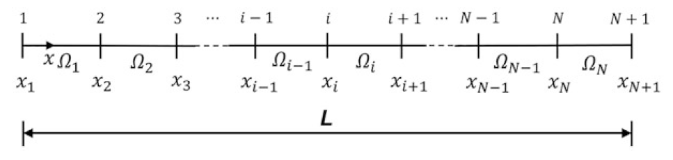

# Modul 3 Elementtypen und Netzqualität

[{width=600px}](media/under_construction.png "Under Construction"){.glightbox}

## Lernziele

Nach Abschluss dieses Moduls können die Studierenden:

* den Einfluss der Ansatzfunktionen und der Elementordnung (linear vs. quadratisch) auf die Genauigkeit eines FEM-Ergebnisses erläutern,  
* den Zusammenhang zwischen Netzverfeinerung, Elementverzerrung und Ergebnisqualität bewerten,  
* den Begriff der Konvergenz besser erklären und eine h-Studie (Netzeinflussstudie) durchführen,  
* Spannungsverteilungen kritisch interpretieren und den Einfluss der Spannungs­glättung einschätzen,  
* aus FEM-Ergebnissen ableiten, wann weitere Netzverfeinerung oder höhere Ansatzordnung erforderlich ist.

## Vertiefung der theoretischen Grundlagen

Im vorherigen Kapitel wurde die Finite-Elemente-Methode in vereinfachter Form eingeführt. Dabei stand im Vordergrund, wie komplexe Bauteile durch eine diskrete Anzahl von Elementen angenähert und über Knotenpunkte miteinander verbunden werden.  

In diesem Modul wird die theoretische Grundlage vertieft, auf der diese Methode basiert. Im Mittelpunkt stehen die mathematischen Prinzipien der Diskretisierung, die Form der Ansatzfunktionen  sowie der Einfluss der Elementordnung auf die Genauigkeit und Konvergenz des Ergebnisses. Diese Zusammenhänge bilden das Fundament, um die späteren FEM-Ergebnisse physikalisch korrekt zu interpretieren und den Einfluss der Netzqualität systematisch zu bewerten.

## Theoretischer Hintergrund (nach Bielak[@Bielak2024])

Zur Erinnerung: Die Finite-Elemente-Methode (FEM) beruht auf der Idee, ein kontinuierliches physikalisches System – etwa einen belasteten Stab oder eine Temperaturverteilung – in eine endliche Anzahl kleiner, einfach beschreibbarer Teilbereiche zu zerlegen.  
Diese Teilbereiche werden als **Elemente** bezeichnet. Die Verbindungspunkte zwischen ihnen heißen **Knoten**.  

Innerhalb jedes Elements wird das physikalische Verhalten (z. B. die Verschiebung \(u\)) nicht exakt, sondern durch eine einfache mathematische Funktion beschrieben. Diese Funktion wird als **Ansatzfunktion** bezeichnet.

---

### 1. Diskretisierung und Ansatzfunktion

Statt das gesamte Bauteil kontinuierlich zu beschreiben, wird jedes Element einzeln betrachtet. Für jedes Element gilt: Die Verschiebung zwischen den Knoten wird durch eine Ansatzfunktion angenähert.  

Ein eindimensionaler Stab wird dazu in mehrere **Finite Elemente** zerlegt, deren Grenzen durch **Knotenpunkte** festgelegt sind. Die folgende Abbildung zeigt ein solches Netz aus \(N\) Elementen. Die Knoten sind entlang der Stabachse nummeriert, die Elemente werden mit \(\Omega_1, \Omega_2, \dots, \Omega_N\) bezeichnet.

<!-- markdownlint-disable MD033 -->
 
<!-- markdownlint-enable MD033 -->

[{width=600px}](media/05_elementtypen_netz/01_FE_Discretizatio.png "Diskretisierung eines Stabes in Finite Elemente"){.glightbox}
Bildquelle[@Bielak2024]

!!! note "Erläuterung zur Element- und Knotennummerierung"

    * Zwischen zwei aufeinanderfolgenden Knoten \(x_i\) und \(x_{i+1}\) liegt jeweils ein Element \(\Omega_i\).
    * Die Knoten sind entlang der Stabachse fortlaufend nummeriert – von \(x_1\) bis \(x_{N+1}\).
    * Der Index \(i\) steht stellvertretend für eine beliebige Position im Netz (z. B. \(i = 3\) für das dritte Element).
    * Insgesamt gilt: Ein Netz mit \(N\) Elementen besitzt \(N + 1\) Knoten.

---

Jeder Knoten erhält eine eigene **Ansatzfunktion** \(\Phi_i(x)\), die im direkten Nachbarbereich ungleich null ist und außerhalb davon verschwindet. Diese Funktionen werden häufig auch als **Hutfunktionen** bezeichnet, da ihr Verlauf an die Form eines Daches erinnert.  

Für die Gesamtlösung \(u(x)\) gilt:

\[
u(x) = \sum_{i=1}^{n} \Phi_i(x) \, u_i
\]

Jede Funktion \(\Phi_i(x)\) beschreibt also den Einfluss des Knotens \(i\) auf die Gesamtverschiebung. Am eigenen Knoten gilt \(\Phi_i(x_i) = 1\), an allen anderen Knoten \(\Phi_i(x_j) = 0\).

<!-- markdownlint-disable MD033 -->
 
<!-- markdownlint-enable MD033 -->

[{width=600px}](media/05_elementtypen_netz/02_ShapeFunctions_Linear.png "Ansatzfunktionen für mehrere Knoten eines Stabes"){.glightbox}
Bildquelle[@Bielak2024]

!!! note "Erläuterungen zu den Ansatzfunktionen"
    * Jede Ansatzfunktion \(\Phi_i(x)\) besitzt nur eine **lokale Tragweite** – sie ist nur in den direkt angrenzenden Elementen aktiv und außerhalb dieses Bereichs null.  
      Dadurch beeinflusst jeder Knoten nur seine unmittelbare Umgebung, was zur sparsamen Struktur der globalen Gleichungen führt.  

    * Der Begriff **Hutfunktion** beschreibt ausschließlich die Form der **linearen Ansatzfunktionen**.  
      Bei quadratischen oder höheren Elementen sind die Funktionen gekrümmt; sie erfüllen dieselben Bedingungen \(\Phi_i(x_i)=1\), \(\Phi_i(x_j)=0\), besitzen aber keine einfache Dachform mehr.

    * Die Überlagerung aller Ansatzfunktionen ergibt die angenäherte Verschiebungsverteilung \(u(x)\) entlang des gesamten Bauteils.  
      Damit wird das ursprünglich kontinuierliche Problem auf eine endliche Zahl von Freiheitsgraden – die Verschiebungen \(u_i\) an den Knoten – reduziert.

---

### 2. Lineare Ansatzfunktionen (1D-Elemente)

Die im vorherigen Abschnitt eingeführte allgemeine Näherung  

\[
u(x) = \sum_{i=1}^{n} \Phi_i(x)\,u_i
\]

gilt für das gesamte System. Betrachtet man nun **ein einzelnes Element** mit **zwei Knoten** an den Positionen \(x_1 = 0\) und \(x_2 = L\), so reduziert sich der Ausdruck auf zwei lokale Ansatzfunktionen \(N_1(x)\) und \(N_2(x)\):

\[
u(x) = N_1(x)\,u_1 + N_2(x)\,u_2
\]

Die Aufgabe besteht nun darin, diese \(N_i(x)\) so zu bestimmen, dass sie die Interpolationsbedingungen

\[
N_1(0)=1,\; N_1(L)=0, \qquad N_2(0)=0,\; N_2(L)=1
\]

erfüllen. Da die Verschiebung zwischen den Knoten linear verlaufen soll, wird angenommen:

\[
u(x) = a + bx
\]

Einsetzen der Randbedingungen liefert:

\[
u(0)=u_1,\quad u(L)=u_2 \;\Rightarrow\; u(x)=u_1+\frac{u_2-u_1}{L}\,x
\]

Vergleicht man diesen Ausdruck mit \(u(x)=N_1(x)u_1+N_2(x)u_2\), so ergeben sich die **linearen Ansatzfunktionen**:

\[
N_1(x)=1-\frac{x}{L}, \qquad N_2(x)=\frac{x}{L}
\]

Die Ableitung nach der Koordinate \(x\) ergibt die konstante Dehnung \(\varepsilon=\frac{du}{dx}\). Lineare Elemente können daher **nur lineare Verformungsverläufe** abbilden.  
Bei gekrümmten oder stark veränderlichen Verläufen – etwa in der Nähe von Kerben oder Kontaktzonen – liefern sie nur eine grobe Näherung. Eine höhere Genauigkeit wird dort durch feinere Netze oder höhergradige Ansatzfunktionen erreicht.

### 3. Quadratische Ansatzfunktionen (1D-Elemente)

Quadratische Elemente besitzen **drei Knoten** – zwei Randknoten und einen Mittenknoten.  
Im Gegensatz zu linearen Elementen verlaufen die Ansatzfunktionen nun **quadratisch** und können dadurch auch **gekrümmte Verformungen** innerhalb des Elements abbilden.

<!-- markdownlint-disable MD033 -->
 
<!-- markdownlint-enable MD033 -->

[{width=550px}](media/05_elementtypen_netz/03_ShapeFunctions_Quadratic.png "Quadratische Ansatzfunktionen eines 1D-Elements"){.glightbox}
Bildquelle [@Bielak2024]

In der Abbildung sind die drei **Formfunktionen** \(\Phi_1(\xi)\), \(\Phi_2(\xi)\) und \(\Phi_3(\xi)\) dargestellt.  

* \(\Phi_1(\xi)\) und \(\Phi_3(\xi)\) verlaufen jeweils durch die Randknoten und verschwinden an den anderen Knoten.  
* \(\Phi_2(\xi)\) besitzt ihr Maximum im Mittenknoten und geht an den Rändern gegen null.  

Zur Beschreibung wird häufig die **normierte Koordinate**

\[
\xi = \frac{x}{L}
\]

verwendet, sodass das Element im Intervall \(0 \le \xi \le 1\) liegt.  
Die drei Ansatzfunktionen lauten:

\[
\begin{aligned}
\Phi_1(\xi) &= 1 - 3\xi + 2\xi^2, \\
\Phi_2(\xi) &= 4\xi(1 - \xi), \\
\Phi_3(\xi) &= 2\xi^2 - \xi
\end{aligned}
\]

Damit ergibt sich die Verschiebung innerhalb des Elements zu:

\[
u(\xi) = \Phi_1(\xi)\,u_1 + \Phi_2(\xi)\,u_2 + \Phi_3(\xi)\,u_3
\]

Quadratische Elemente können sowohl **lineare als auch gekrümmte Verläufe** der Verschiebung \(u(x)\) und der Spannung \(\sigma(x)\) darstellen.  
Bei gleicher Netzgröße liefern sie deutlich genauere Ergebnisse als lineare Elemente, sind jedoch aufgrund der zusätzlichen Freiheitsgrade pro Element rechenintensiver.

<!--
### 4. Einfluss der Elementordnung

Vergleicht man lineare und quadratische Elemente am gleichen Bauteil, so zeigt sich:

* Quadratische Elemente approximieren den Spannungs- und Verschiebungsverlauf besser.  
* Die Konvergenzgeschwindigkeit (Annäherung an die exakte Lösung) steigt mit der Ansatzordnung.  
* Bei linearen Elementen muss die Netzgröße \(h\) stärker verringert werden, um vergleichbare Genauigkeit zu erreichen.

[{width=500px}](media/05_elementtypen_netz/04_Linear_vs_Quadratic.png "Vergleich linear/quadratisch"){.glightbox}

Bildquelle [@Bielak2024, Fig. 2.11]

---

### 5. Konvergenzverhalten und Netzqualität

Die Qualität einer FEM-Lösung hängt sowohl von der **Elementgröße \(h\)** als auch von der **Elementordnung \(p\)** ab.  
Für viele lineare Probleme gilt näherungsweise:

\[
\| e \| \propto h^p
\]

Das bedeutet:  

* halbiert man die Elementlänge \(h\), reduziert sich der Fehler bei quadratischen Elementen etwa **viermal**, bei linearen nur **zweimal**.  
* Eine Konvergenzprüfung (h-Studie) ist daher entscheidend, um Netzunabhängigkeit sicherzustellen.

[{width=520px}](media/05_elementtypen_netz/05_Convergence_hp.png "Konvergenzdiagramm h-p"){.glightbox}

Bildquelle [@Bielak2024, Fig. 2.17]

---

### 6. Ausblick: Elementtypen in ANSYS

Das Prinzip der Ansatzfunktionen überträgt sich auf höhere Dimensionen:

| Dimension | Beispiel-Elemente (ANSYS) | Knotenanzahl | Ansatzordnung |
| :--------- | :------------------------ | :------------ | :-------------- |
| **1D** | LINK180 | 2 / 3 | linear / quadratisch |
| **2D** | PLANE182 / 183 | 4 / 8 | linear / quadratisch |
| **3D** | SOLID185 / 186 | 8 / 20 | linear / quadratisch |

In allen Fällen bleibt die mathematische Struktur gleich:  
Shape-Functions interpolieren die Knotenwerte im Element.  
Quadratische Elemente besitzen Mittenknoten, wodurch gekrümmte Geometrien und Spannungsfelder besser approximiert werden können.

[{width=600px}](media/05_elementtypen_netz/06_Elementtypen_Uebersicht.png "Übersicht Elementtypen 1D–3D"){.glightbox}

Eigene Darstellung nach [@Bielak2024]

---

### 7. Kernaussagen

* Die Genauigkeit einer FEM-Analyse hängt wesentlich von **Elementordnung** und **Netzqualität** ab.  
* Lineare Elemente liefern grobe Näherungen mit konstantem Spannungsverlauf.  
* Quadratische Elemente erfassen Krümmungen realistischer und konvergieren schneller.  
* Eine Konvergenzstudie (h-Studie) ist erforderlich, um Netzabhängigkeit zu prüfen.  
* Gekrümmte Geometrien erfordern meist quadratische oder isoparametrische Elemente.

---

Quellen: [@Bielak2024]

<!--

## 1. Kernkonzepte (Conceptual Overview)

### 1.1 Diskretisierung und Ansatzfunktion

Die Finite-Elemente-Methode approximiert die kontinuierliche Verschiebungsverteilung \(u(x)\) durch eine Kombination sogenannter *shape functions* \(N_i(x)\):

\[
u(x) \approx \sum_{i=1}^{n} N_i(x) \, u_i
\]

Die Wahl der Ansatzfunktion bestimmt die **Ordnung des Elements**:

* **Linear (first order):** einfache, lineare Formfunktionen → günstiger, aber ungenauer.  
* **Quadratisch (second order):** Mittenknoten → gekrümmte Geometrien und nichtlineare Spannungsverläufe darstellbar.  

Quadratische Elemente benötigen mehr Rechenzeit, liefern aber deutlich stabilere Ergebnisse bei gleichen Netzabständen.

nach Bielak (2020), *The Finite Element Method – A Primer*, Kapitel 3

---

### 1.2 Konvergenz und Fehler

Die FEM liefert eine Näherung \(u_h\), deren Genauigkeit vom **Diskretisierungsfehler** abhängt:

\[
e = u - u_h
\]

Ziel jeder Netz- oder Ordnungsstudie ist es, den Fehler zu minimieren.  
Zwei Strategien sind möglich:

* **h-Verfeinerung:** kleinere Elemente → dichteres Netz.  
* **p-Verfeinerung:** höhere Ansatzordnung → komplexere Formfunktionen.

Der Fehler nimmt typischerweise mit \(h^p\) ab, wobei \(p\) die Ordnung der Ansatzfunktion ist.  
In der Praxis wird die Konvergenz überprüft, indem Ergebnisse (z. B. σmax) gegen die Elementgröße aufgetragen werden.

---

### 1.3 Netzqualität

Ein feines Netz garantiert keine Genauigkeit, wenn die Elementform ungünstig ist.  
Wichtige Qualitätskriterien:

* **Aspektverhältnis:** Verhältnis längster zu kürzester Kante → sollte nahe 1 liegen.  
* **Verzerrung:** Vermeidung stark verzogener Tetraeder oder schmaler Keile.  
* **Übergänge:** gleichmäßige Übergänge zwischen feinen und groben Bereichen.

Verzerrte Elemente führen oft zu unphysikalischen Spannungsverteilungen oder instabilen Konvergenzverläufen.

---

### 1.4 Spannungs­glättung und Ergebnisdarstellung

Spannungen werden in der FEM an Integrationspunkten berechnet (Gauss-Punkte).  
Zur Visualisierung auf Knotenebene werden Mittelwerte gebildet (*averaged nodal stress*).  

Das verbessert die Lesbarkeit der Ergebnisse, ersetzt aber keine numerische Prüfung der Konvergenz.  
Ein scheinbar „ruhiges“ Spannungsbild kann trügerisch sein, wenn das Netz zu grob oder verzerrt ist.

---

## 2. Guided Example – Influence of Element Type

Ein axially loaded bar with varying cross-section is analysed analytically and with FEM.

1. Define geometry and material:  
   \(L = 100\,\text{mm}, E = 210\,\text{GPa}, A(x) = 50 - 0.4x\,\text{mm}^2\)
2. Compute the analytical displacement \(u(x)\) and stress \(\sigma(x)\).
3. Model the same bar in ANSYS with:
   * linear elements (SOLID185)  
   * quadratic elements (SOLID186)
4. Compare σmax and umax for different mesh densities.

Optional: perform an h-study to verify convergence.

based on Bielak (2020) and Madenci & Guven (2015)

---

## 3. Interpretation and Discussion

* Quadratic elements converge faster and better reproduce the analytical stress distribution.  
* Linear elements require finer meshes to reach similar accuracy.  
* Mesh refinement should be concentrated in regions with high stress gradients.  
* Smoothing affects visualization but not numerical accuracy.  
* The optimal model balances **accuracy vs. computational cost**.

---

## 4. Key Takeaways

* Accuracy depends on both **element order** and **mesh quality**.  
* Converged results are independent of further mesh refinement.  
* Quadratic elements often provide a better accuracy–cost ratio.  
* Always verify convergence before interpreting stress results.

---

## Quellen

* Bielak, J. (2020). *The Finite Element Method – A Primer*. Springer.  
* Madenci, E., & Guven, I. (2015). *The Finite Element Method and Applications in Engineering Using ANSYS*. Springer.  
* Gebhardt, C. (2021). *Praxisbuch FEM mit ANSYS Workbench*. Hanser.

---

wie geht's weiter:
  - Modul 4 Krafteinleitung: 06_krafteinleitung.md
  - Modul 5 Symmetrie: 07_symmetrie.md
  - Modul 6 Modalanalyse: 08_modalanalyse.md
  - Modul 7 Thermo-Mechanik: 09_thermomechanik.md
  - Modul 8 Sensoren I (Beschl.): 10_sensor_beschl.md
  - Modul 9 Sensoren II (Druck): 11_sensor_druck.md
  - Modul 10 Kontakt: 12_kontakt.md
  - Modul 11 Ausblick: 13_ausblick.md

  | Modul | Titel | Kerninhalt |
| :----: | :---- | :---------- |
| **03** | **Elementtypen & Netzqualität** | Vergleich linearer und quadratischer Volumenelemente (SOLID185/186), Einfluss der Ansatzfunktionen auf Genauigkeit und Konvergenz, Netzgüte, Spannungs­glättung, einfache h-Studie. |
| **04** | **Krafteinleitung & Spannungsüberhöhungen** | Analyse unrealistischer Punkt- und Linienlasten, Divergenzen an Kanten, Einführung realer Flächenlasten, Sekantenschnitt und Übergangsradien zur Entschärfung, Spannungsverteilung im Lastbereich. |
| **05** | **Symmetrie & Modellreduktion** | Nutzung von Symmetrieebenen zur Reduktion von Rechenzeit, korrekte Definition der Symmetrierandbedingungen, Fehlerquellen bei falscher Orientierung, Anwendung am Zugstab oder Flansch. |
| **06** | **Modalanalyse – vom Balken zur Baugruppe** | Einführung in die Eigenfrequenzanalyse: theoretischer Hintergrund, Eigenformen und -frequenzen, Einfluss von Lagerung, Material und Geometrie; Beispiel: Balken und einfache Baugruppe (z. B. Welle). |
| **07** | **Thermo-mechanische Kopplung** | Temperaturfeld → thermische Dehnung → mechanische Spannung, Vergleich isotherm vs. thermisch belastet, Einfluss von Materialparametern (α, E), Beispiel: Platte mit Temperaturgradient. Alternativ Wärme aus Reibung (Bremse) |
| **8** | **Sensoren I – Beschleunigungssensor** | Simulation eines Masse-Feder-Systems, statisches Äquivalent einer Beschleunigung, Bestimmung der Durchbiegung und Eigenfrequenz, Funktionsnachweis als FEM-basiertes Messprinzip. |
| **9** | **Sensoren II – Drucksensor / Membran** | Modellierung einer dünnen Platte unter Flächenlast, Berechnung der Durchbiegung und Vergleichsspannung, Herleitung einer Sensorkennlinie (Druck → Verformung), Einfluss der Membrandicke. |
| **10** | **Kontakt & Baugruppen** | Grundlagen der Kontaktmodellierung (bonded, frictionless, frictional), Reibungseinfluss auf Spannungsverteilung, Anwendung an Flansch- oder Bolzenverbindungen, Netz- und Konvergenzaspekte. |
| **11 (optional)** | **Moderne FEM / Ausblick** | Neue Entwicklungen: additive und generative Strukturen, vereinfachte Reduced-Order-Modelle, KI-gestützte Approximation physikalischer Modelle, Konzept des Digital Twin. |

-->