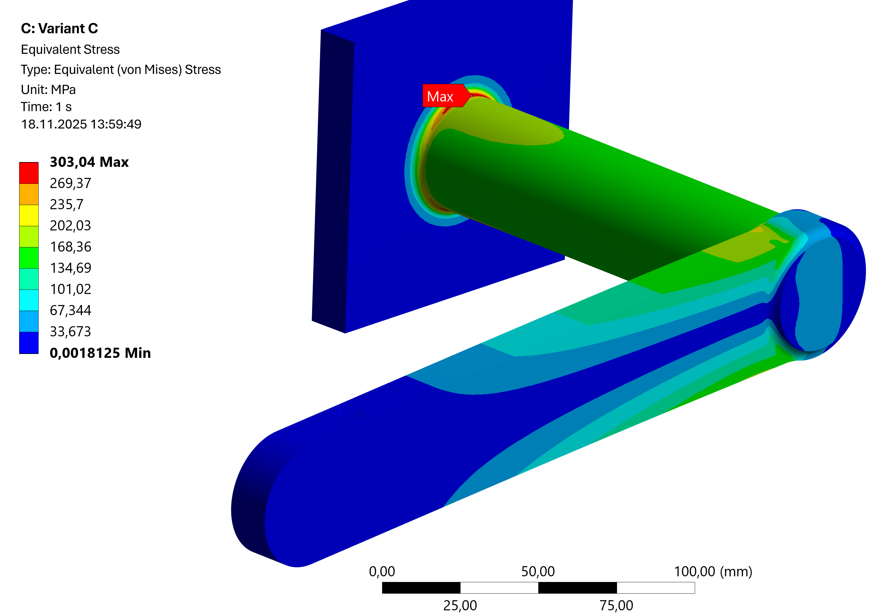

# Module 04 - Load Application and Stress Concentration

## Learning objectives

After completing this module, students will be able to:

* identify typical causes of numerical stress concentrations,  
* explain the difference between physically and numerically induced stress peaks,  
* avoid nonphysical point or line loads,  
* apply suitable measures to mitigate stress singularities,  
* assess the importance of load application for result quality.

## Task: Torsion bar

In the simulation of a torsion bar with a lever arm, the **application of the external force** on the lever arm is analysed.

[{width=500px}](media/06_krafteinleitung/01_Torsionsstab.png "Torsion bar with lever arm"){.glightbox}

* cylindrical torsion bar with lever arm  
* length \( L = 152.4 \, \text{mm} \)  
* diameter \( d = 38.1 \, \text{mm} \)  
* lever arm \( H = 203.2 \, \text{mm} \)  
* notch form factor \( \alpha_k = 1.59 \) (transition between cylindrical bar and fixed support)  
* force \( F = 4.45 \, \text{kN} \)  
* one side fully fixed to a wall  
* material: structural steel according to the ANSYS material database with modified **Young’s modulus** of 210,000 MPa.  

Examine the following variants of load application at the lever arm:

* Geometry variant A [Torsionsstab_A.stp](media/06_krafteinleitung/Torsionsstab_A.stp)  
* Geometry variant B [Torsionsstab_B.stp](media/06_krafteinleitung/Torsionsstab_B.stp)  
* Geometry variant C [Torsionsstab_C.stp](media/06_krafteinleitung/Torsionsstab_C.stp)

Work through the following points:

* Determine an **analytical solution** for the maximum stress. Where is the critical cross section?  
* Compute the maximum von Mises stress in ANSYS.  
* Ensure that the result is independent of the mesh.  
* Achieve a converging solution.  
* Discuss how a load application problem can arise and how it can be described in FEM terms.

## Theoretical background (according to Spura[@Spura2019])

The force \(F\) acts on the lever arm with an eccentricity relative to the bar axis. This simultaneously generates:

* a bending moment \(M_{\text{B}}\) due to the perpendicular distance between force and bar axis  
* a torsional moment \(M_{\text{T}}\) due to the effective lever arm around the bar axis  
* a shear force \(F_Q\), whose shear stress contribution is small compared to bending and torsion and is neglected here  

The underlying model follows **Euler Bernoulli beam theory**. It is assumed that the beam is shear stiff, the cross section remains plane during deformation, and warping does not occur.

### Bending and unsymmetrical bending

For torsion bars with eccentric load application, bending may occur in addition to torsion.

#### Straight bending

If the force acts in a single plane, **straight bending** occurs. For circular cross sections:

\[
\sigma_{\text{B}} = \frac{M}{W_b}
\]

with bending moment \(M = F \cdot l\) and section modulus

\[
W_b = \frac{\pi d^3}{32}
\]

The normal stress varies linearly across the cross section. The neutral axis remains horizontal and passes through the centroid.

---

#### Unsymmetrical Bending

For the **present task only straight bending is relevant**. Unsymmetrical bending is shown for completeness.

??? note "Unsymmetrical bending (additional information)"
    If the force does not act in a single principal plane, unsymmetrical bending occurs. For symmetric sections such as a full circular cross section, the principal axes coincide with the coordinate axes \(y\) and \(z\). This is the special case of unsymmetrical bending about principal axes.

    The total bending moment consists of two components about these perpendicular axes:

    \[
    M_y,\quad M_z
    \]

    The resulting bending stress in the outer fiber is obtained through superposition:

    \[
    \sigma_{\text{B}} = \frac{M_y\,z}{I_y} + \frac{M_z\,y}{I_z}
    \]

    The analytical calculation thus describes the normal stress resulting from combined bending in the circular section. For symmetric sections, unsymmetrical bending results from superposing straight bending about \(y\) and \(z\). The resulting zero stress line lies at an angle within the section.

    [{width=700px}](media/06_krafteinleitung/02_schiefe_Biegung.png "Unsymmetrical bending: superposition about y and z resulting in \(\sigma_x(y,z)\)"){.glightbox}
    Image source[@Spura2019]

### Torsion

The torsional moment \(M_{\text{T}}\) generates shear stresses in the cross section:

\[
\tau_{\text{T}} = \frac{M_{\text{T}}\,r}{I_\text{p}}
\]

with radius \(r\) and polar moment of inertia \(I_\text{p}\) of the full circle:

\[
I_\text{p} = \frac{\pi r^4}{2}
\]

### Equivalent stress under combined loading

For strength assessment, bending stress \(\sigma_{\text{B}}\) and shear stress due to torsion \(\tau_{\text{T}}\) are combined into an **equivalent stress**, for example according to von Mises:

\[
\sigma_{\text{v}} = \sqrt{\sigma_{\text{B}}^{2} + 3\,\tau_{\text{T}}^{2}}
\]

The analytical calculation gives a simple reference value for the maximum expected equivalent stress in the bar.  
The FEM additionally determines the local stress distribution, which strongly depends on **how the force \(F\) is applied into the model at the lever arm**.

---

## Implementation in ANSYS

### 1. Project management and geometry import

For examining the variants, using a separate system for each geometry is recommended. The engineering data source can be linked so that changes (e.g., to the Young’s modulus) are automatically propagated to all systems.  
A practical workflow is to first **set up and solve one variant completely**, then duplicate it in the project schematic, link the engineering data, and replace the geometry. This way, many model settings are reused and do not have to be recreated. A final verification of all boundary conditions is still required.

[{width=800px}](media/06_krafteinleitung/03_Torsionsstab_Projekt.en.png "Project setup with three variants in ANSYS Workbench"){.glightbox}

### 2. Material assignment

The material is **structural steel** from the ANSYS material library. The adjustment of the **Young’s modulus** is made in the project’s *Engineering Data*.  
If the material is modified **before** creating the systems, the new value is automatically applied to all systems.

If the modification is made **afterwards**, each system must be updated using the **green refresh arrow** in the project schematic (see figure above).

!!! note "Note"
    Further information on material definition and data properties can be found in the section [**Element types and shape functions – Material assignment**](../05_elementtypen_ansatzf/#materialzuweisung).

### 3. Mesh generation

First, a **default mesh** is generated. The quality can be assessed visually.

[{width=350px}](media/06_krafteinleitung/04_Torsionsstab_Standardnetz.png "Standard mesh of the torsion bar in ANSYS"){.glightbox}

??? question "How would you assess this mesh?"
    The displayed mesh is clearly too coarse.  
    The geometry is insufficiently resolved, and the faceting is clearly visible, especially at transitions and rounded sections.  
    For a reliable stress analysis, a finer mesh is required.

### 4. Boundary conditions

The boundary conditions consist of a **fixed support** on the wall surface and an **external force** at the end of the lever arm, as described in the task.  
The direction of the force determines the superposition of bending and torsion.

### 5. Analysis settings

The **default settings** of the static analysis are sufficient.  
No adjustments are required as long as the analysis remains linear elastic.

### 6. Evaluation

According to the task description, the **von Mises equivalent stress** is evaluated first.

## Discussion of results

### Comparison with analytical solution

The following box contains the analytical solution. First, compute the **nominal** equivalent stress of a smooth solid bar. Then use the **notch form factor \(\alpha_k = 1.59\)** given in the task to estimate the **local maximum equivalent stress** in the transition region.

**Notes:**  

* The shear stress contribution due to shear force is neglected here.  
* There is **no unsymmetrical bending** in the sense of superposition of two orthogonal bending moments, but a combination of **pure bending** and **pure torsion**.  
* The **notch form factor \(\alpha_k\)** is applied after determining the nominal equivalent stress.

??? note "Calculation of \(\sigma_\text{v,nom}\) and \(\sigma_\text{v,max}\)"

    **Given:**

    $$
    F = 4.45\,\text{kN}, \quad 
    L = 152.4\,\text{mm}, \quad 
    H = 203.2\,\text{mm}, \quad 
    d = 38.1\,\text{mm}, \quad
    \alpha_k = 1.59
    $$

    **Moments:**

    $$
    M_\text{B} = F \cdot L = 678,180\,\text{Nmm}
    $$

    $$
    M_\text{T} = F \cdot H = 904,240\,\text{Nmm}
    $$

    **Section properties (solid circular section):**

    \[
    r = \frac{d}{2} = 19.05\,\text{mm}, \qquad
    W_\text{B} = \frac{\pi d^3}{32} = 5,429,687\,\text{mm}^3, \qquad
    I_\text{p} = \frac{\pi d^4}{32} = 206,871,087\,\text{mm}^4
    \]

    **Nominal stresses:**

    $$
    \sigma_\text{B} 
      = \frac{M_\text{B}}{W_\text{B}}
      = \frac{678,180}{5,429,687}
      = 124.90\,\text{N/mm}^2
    $$

    $$
    \tau_\text{T} 
      = \frac{M_\text{T}\,r}{I_\text{p}}
      = \frac{904,240 \cdot 19.05}{206,871,087}
      = 83.27\,\text{N/mm}^2
    $$

    **Nominal equivalent stress:**

    $$
    \sigma_\text{v,nom}
      = \sqrt{\sigma_\text{B}^2 + 3\,\tau_\text{T}^2}
      = \sqrt{(124.90)^2 + 3 \cdot (83.27)^2}
      = 190.79\,\text{N/mm}^2
    $$

    **Local equivalent stress with notch:**

    \[
    \sigma_\text{v,max}
      = \alpha_k \,\sigma_\text{v,nom}
      = 1.59 \cdot 190.79
      = 303.36\,\text{N/mm}^2
    \]

The following table shows the analytical results, the FEM results, and the resulting relative deviation:

\[
\text{Deviation} = \frac{\text{FEM} - \text{Analytical}}{\text{Analytical}} \times 100
\]

| Quantity                                   | Analytical solution | FEM result   | Deviation |
|--------------------------------------------|---------------------|-------------|-----------|
| maximum equivalent stress with notch \(\sigma_\mathrm{v,max}\) | 303.36 MPa         | 303.04 MPa | −0.11 %   |

The simulation shows a maximum **equivalent stress** (von Mises) in the region of the highest loading of the bar. The maximum stress is **303.04 MPa** and occurs at the transition from lever arm to bar, where bending and torsion act simultaneously.

[{width=600px}](media/06_krafteinleitung/05_Torsionsstab_Vergleichsspannung.en.png "Torsion bar – maximum equivalent stress"){.glightbox}

---

### Influence of load application

The way the load is applied determines the local loading and therefore directly affects the validity of the FEM simulation. Changes in how the load is applied lead to significantly different stress distributions and convergence behaviour.

#### **Variant A**

For this geometry, no surface exists through which the force can be applied in a way that allows the lever to act. A physically meaningful boundary condition cannot be formulated. The problem cannot be solved in this form and therefore yields no usable FEM results.

---

#### **Variant B**

In this variant, the force is applied through a very small contact surface raised above the lever. This creates very high local stresses and a pronounced notch effect. With increasing mesh refinement, the stress maxima continue to increase and the stress distribution does not converge. The results are therefore unsuitable for a reliable structural strength assessment.

<!-- markdownlint-disable MD033 -->

v",
           "type": "scatter",
           "mode": "lines+markers",
           "yaxis": "y1",
           "hovertemplate": "Solution %{x} σv = %{y} MPa<extra></extra>"
         },
         {
           "x": [1, 2, 3, 4, 5],
           "y": [85218, 255408, 663171, 1074384, 1519585],
           "name": "Nodes",
           "type": "scatter",
           "mode": "lines+markers",
           "yaxis": "y2",
           "hovertemplate": "Solution %{x} Nodes = %{y}<extra></extra>"
         },
         {
           "x": [1, 2, 3, 4, 5],
           "y": [48886, 165578, 458381, 756071, 1078741],
           "name": "Elements",
           "type": "scatter",
           "mode": "lines+markers",
           "yaxis": "y2",
           "hovertemplate": "Solution %{x} Elements = %{y}<extra></extra>"
         }
       ],
       "layout": {
         "title": {"text": "Convergence behaviour – Variant B"},
         "xaxis": {"title": "Solution number", "dtick": 1},

         "yaxis": {
           "title": "Equivalent stress (MPa)",
           "side": "left"
         },

         "yaxis2": {
           "title": "Nodes / Elements",
           "overlaying": "y",
           "side": "right",
           "showgrid": false
         },

         "hovermode": "x unified",
         "hoverlabel": {
           "bgcolor": "white",
           "font": {"color": "black"},
           "bordercolor": "rgba(0,0,0,0)"
         },

         "legend": {
           "x": 0,
           "y": 1,
           "xanchor": "left",
           "yanchor": "top"
         }
       }
     }'>

<!-- markdownlint-enable MD033 -->

The high stress peak occurs directly at the small contact surface where the force is applied. Because the entire load is concentrated on a sharply limited area, extremely steep stress gradients arise, which cannot be resolved numerically. The result diverges with mesh refinement.

[{width=750px}](media/06_krafteinleitung/06a_Torsionsstab_nicht_konv_Spannung.en.png "Variant B – non converging equivalent stress"){.glightbox}

The detailed view shows the maximum stress directly at the load application surface. The entire load is concentrated in a sharply defined region, resulting in an artificial notch effect and non physical stress peaks.

[{width=750px}](media/06_krafteinleitung/06b_Torsionsstab_nicht_konv_Spannung.en.png "Variant B – detailed view of the load application area"){.glightbox}

---

#### **Variant C**

In this variant, the load is applied through a defined surface created by a secant cut plane in the CAD model. This allows the load to be transferred into the lever arm without additional notch effects. The resulting stress distributions are stable and show clear convergence behaviour.

<!-- markdownlint-disable MD033 -->

v",
           "type": "scatter",
           "mode": "lines+markers",
           "yaxis": "y1",
           "hovertemplate": "Solution %{x} σv = %{y} MPa<extra></extra>"
         },
         {
           "x": [1, 2, 3],
           "y": [85533, 245546, 434902],
           "name": "Nodes",
           "type": "scatter",
           "mode": "lines+markers",
           "yaxis": "y2",
           "hovertemplate": "Solution %{x} Nodes = %{y}<extra></extra>"
         },
         {
           "x": [1, 2, 3],
           "y": [49154, 158569, 292824],
           "name": "Elements",
           "type": "scatter",
           "mode": "lines+markers",
           "yaxis": "y2",
           "hovertemplate": "Solution %{x} Elements = %{y}<extra></extra>"
         }
       ],
       "layout": {
         "title": {"text": "Convergence behaviour – Variant C"},
         "xaxis": {"title": "Solution number", "dtick": 1},

         "yaxis": {
           "title": "Equivalent stress (MPa)",
           "side": "left"
         },

         "yaxis2": {
           "title": "Nodes / Elements",
           "overlaying": "y",
           "side": "right",
           "showgrid": false
         },

         "hovermode": "x unified",
         "hoverlabel": {
           "bgcolor": "white",
           "font": {"color": "black"},
           "bordercolor": "rgba(0,0,0,0)"
         },

         "legend": {
           "x": 0,
           "y": 1,
           "xanchor": "left",
           "yanchor": "top"
         }
       }
     }'>

<!-- markdownlint-enable MD033 -->

The surface for load application is created here using a **secant cut** in the CAD model. This enables **notch free load transfer**.

[{width=750px}](media/06_krafteinleitung/07_Torsionsstab_Sekantenschnitt.png "Geometry – Variant C"){.glightbox}

The semicircular cut defines the shape of the load surface. Through rotation, a geometry is created that does not introduce local notches.

[{width=450px}](media/06_krafteinleitung/08_Torsionsstab_Sekantenschnitt_CAD.png "CAD sketch – secant cut"){.glightbox}

In contrast to load application in Variant B, **no stress peaks** occur, and the result **converges** with mesh refinement in the critical cross section.

[{width=750px}](media/06_krafteinleitung/09_Torsionsstab_Sekantenschnitt_Spannung.en.png "Equivalent stress – Variant C"){.glightbox}

## Load application via nodes

The external load can alternatively be applied to **one or several nodes**.  
The selection is made using the *selection filter* for **nodes** in the toolbar, as shown in the figure.

[{width=900px}](media/06_krafteinleitung/10_Torsionsstab_Knotenkraft.en.png "Torsion bar – load application via nodal force"){.glightbox}

Applying the load to **a single node** is possible in principle, but it comes with several disadvantages:

* The exact geometric position of the node must be specified via a *coordinate system* and the **components** in the selection table. This is comparatively time-consuming.
* The position of the selected node is **mesh dependent** and changes with every remeshing step.
* The resulting stress concentration appears **very locally** (often at only one or very few nodes).  

[{width=900px}](media/06_krafteinleitung/11_Torsionsstab_Knotenkraft_Spannung.en.png "Torsion bar – local stress concentration due to nodal force"){.glightbox}

* The **convergence criterion** cannot be used for such assignments.  
  ANSYS outputs the following message:

[{width=500px}](media/06_krafteinleitung/11_Torsionsstab_Knotenkraft_Fehler.en.png "Torsion bar – message regarding convergence criterion"){.glightbox}

## Summary

One of the most common sources of error in FEM is **idealised load application**. Loads that are distributed across surfaces in reality are often applied as point or line loads in the model. This leads to **singularities** at edges or points.

Typical causes:

* point load on a surface → σ → ∞  
* line load or sharp edge transition  
* abrupt cross-section change without a fillet  
* insufficient contact area between components  

In such cases, the FEM solution does not converge: With every mesh refinement, the local stress continues to increase.

Physically correct load transfer is achieved through:

* **surface loads** instead of point loads,  
* **fillets or chamfers** instead of sharp edges,  
* **secant cut** (smooth geometrical transition),  
* **elastic pads or end plates** to distribute the load.

## Further notes

??? question "Why was the Young’s modulus adjusted?"
    For stress analysis, the Young’s modulus does not play a role.  
    In linear elastic models, the Young’s modulus only affects the deformations, not the resulting von Mises stresses.  
    The observed differences in the stress field therefore result solely from the type of load application. The modification of the Young’s modulus is purely didactic in this context.

??? note "Note on element order"
    Whether **linear or quadratic elements** were used can be identified in several places in the *solution information*.  
    In the example shown, the element type **SOLID187** is used, which is a quadratic 3D element.

    [{width=900px}](media/06_krafteinleitung/12_Torsionsstab_Elementtypen.en.png "Solution information – element type SOLID187"){.glightbox}

??? note "Alternative to load application: exclude the critical zone"
    Instead of modelling the load application in full detail, the local zone can be excluded.  
    In this case, a shortened model is analysed that contains only the fixed support.  
    This allows a focused and numerically stable result at the support without having to include the singularity at the load application point.

## Quiz for Self-Assessment

<!-- markdownlint-disable MD033 -->

<?quiz?>
question: Which statement best describes the main objective of this module?
answer: The calculation of plastic deformations under arbitrary load cases
answer: The optimisation of computation time using coarse meshes
answer-correct: Understanding how the type of load application leads to stress concentrations and convergence problems in FEM
content:
<em>Note:</em> The focus lies on the relationship between idealised load application, numerical singularities, and the significance of FEM results.
<?/quiz?>

<?quiz?>
question: Which combination of load types occurs in the torsion bar with lever arm according to the task?
answer: Pure bending without torsion
answer-correct: Combination of bending and torsion that jointly contribute to the equivalent stress
answer: Pure torsion without bending
content:
<em>Note:</em> The equivalent stress results from the superposition of bending and torsion.
<?/quiz?>

<?quiz?>
question: What is the role of the notch form factor \(\alpha_k = 1.59\) in the analytical calculation?
answer: It describes the mesh refinement in the notch region
answer-correct: It increases the nominal equivalent stress to obtain a local maximum equivalent stress
answer: It reduces the nominal equivalent stress to increase safety
content:
<em>Note:</em> The notch form factor is applied after calculating the nominal stress.
<?/quiz?>

<?quiz?>
question: Why is geometry variant A unsuitable?
answer-correct: There is no suitable surface for load application
answer: The geometry does not have a circular cross section
answer: Only nonlinear elements can be used
content:
<em>Note:</em> Without a load surface, no physical boundary condition can be formulated.
<?/quiz?>

<?quiz?>
question: How do the stresses behave in geometry variant B when the mesh is refined?
answer: The stresses remain unchanged regardless of the mesh
answer-correct: The stress maxima continue to increase and do not converge
answer: The stresses decrease and stabilise
content:
<em>Note:</em> The small contact area causes a numerical singularity.
<?/quiz?>

<?quiz?>
question: What characterises geometry variant C?
answer: Neglecting bending in the analytical comparison
answer-correct: A planar, low-notch load application via a secant cut with good convergence behaviour
answer: A point-like load introduction with small contact areas
content:
<em>Note:</em> The planar load transfer prevents artificial stress peaks.
<?/quiz?>

<?quiz?>
question: Which statement about load application through a single node is correct?
answer-correct: It creates highly localised stress peaks and prevents meaningful convergence assessment
answer: It best represents the real loading
answer: It facilitates automatic convergence checking
content:
<em>Note:</em> Nodal forces create numerical singularities.
<?/quiz?>

<?quiz?>
question: Which statement about the Young’s modulus \(E\) is correct in linear elastic analysis?
answer: Increasing \(E\) always reduces the stresses
answer-correct: Changing \(E\) affects the deformations but not the equivalent stresses
answer: Reducing \(E\) makes the model non-linear
content:
<em>Note:</em> Stresses depend on load and geometry, not on \(E\).
<?/quiz?>

<?quiz?>
question: How can numerical singularities in load application be avoided?
answer: By removing all fillets
answer: By applying large point loads to single nodes
answer-correct: By using surface loads and geometrically smooth transitions for load distribution
content:
<em>Note:</em> Realistic load distribution improves physical accuracy and convergence.
<?/quiz?>

<!-- markdownlint-enable MD033 -->
