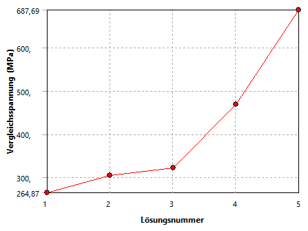
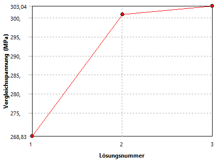

# Modul 04 – Krafteinleitung und Spannungsüberhöhung

## Lernziele

Nach Abschluss dieses Moduls können die Studierenden:

* typische Ursachen numerischer Spannungsüberhöhungen erkennen,  
* den Unterschied zwischen physikalisch und numerisch bedingten Spannungsspitzen erklären,  
* nicht-physikalische Punkt- oder Linienlasten vermeiden,  
* geeignete Maßnahmen zur Entschärfung von Spannungssingularitäten anwenden,
* die Bedeutung der Krafteinleitung für die Ergebnisgüte einschätzen.

## Aufgabenstellung Torsionsstab

Bei der Simulation eines Torsionsstabs mit Hebelarm soll die **Einleitung der äußeren Kraft** am Hebelarm untersucht werden.  

[{width=500px}](media/06_krafteinleitung/01_Torsionsstab.png "Torsionsstab mit Hebelarm"){.glightbox}

* zylindrischer Torsionsstab mit Hebelarm
* Länge \( L  = 152{,}4 \, \text{mm} \)  
* Durchmesser \( d = 38{,}1 \, \text{mm} \)  
* Hebelarm \( H = 203{,}2 \, \text{mm} \)  
* Kerbformzahl $\alpha_k = 1,59$ (Übergang zylindrischer Stab und Einspannung)
* Kraft \( F = 4{,}45 \, \text{kN} \)  
* eine Seite vollständig an einer Wand fixiert
* Material Baustahl gemäß ANSYS-Datenbank mit geändertem **E-Modul** auf 210.000 Mpa.  

Untersuchen Sie die folgenden Varianten der Krafteinleitung am Hebelarm:  

* Geometrie Variante A [Torsionsstab_A.stp](media/06_krafteinleitung/Torsionsstab_A.stp)
* Geometrie Variante B [Torsionsstab_B.stp](media/06_krafteinleitung/Torsionsstab_B.stp)
* Geometrie Variante C [Torsionsstab_C.stp](media/06_krafteinleitung/Torsionsstab_C.stp)

Bearbeiten Sie folgende Punkte:

* Ermitteln Sie eine **analytische Lösung** für die maximale Spannung. Wo ist der kritische Querschnitt?
* Berechnen Sie in ANSYS die maximale Vergleichsspannung.  
* Achten Sie auf ein von der Vernetzung unabhängiges Ergebnis.  
* Führen Sie eine konvergierende Lösung herbei.  
* Diskutieren Sie, wie ein Krafteinleitungsproblem entstehen kann und wie es sich im FEM-Sinne beschreiben lässt.  

## Theoretischer Hintergrund (nach Spura[@Spura2019])

Die Kraft \(F\) greift am Hebelarm exzentrisch zur Stabachse an. Dadurch entstehen gleichzeitig:

* ein Biegemoment \(M_{\text{B}}\) durch den senkrechten Abstand der Kraft zur Stabachse  
* ein Torsionsmoment \(M_{\text{T}}\) durch den wirksamen Hebelarm um die Stabachse  
* eine Querkraft \(F_Q\), deren Schubspannungsanteil im Vergleich zu Biegung und Torsion klein ist und hier vernachlässigt wird  

Das zugrunde liegende Modell folgt der **Euler-Bernoulli-Balkentheorie**. Es wird angenommen, dass der Balken schubstarr ist, der Querschnitt während der Verformung eben bleibt und keine Verwölbung auftritt.

### Biegung und schiefe Biegung

Wirkt die Kraft nicht nur in einer Hauptebene, entsteht **schiefe Biegung**. Für symmetrische Querschnitte (wie hier beim Vollkreis) fallen die Hauptachsen mit den Koordinatenachsen \(y\) und \(z\) zusammen. Es handelt sich somit um den **Sonderfall der schiefen Biegung um Hauptachsen**.  

Das gesamte Biegemoment setzt sich aus zwei Anteilen um diese senkrechten Achsen zusammen:

\[
M_y,\quad M_z
\]

Die resultierende Biegespannung im Randfaserpunkt ergibt sich aus der Überlagerung:

\[
\sigma_{\text{B}} = \frac{M_y\,z}{I_y} + \frac{M_z\,y}{I_z}
\]

Die analytische Berechnung beschreibt damit die Normalspannung infolge kombinierter Biegung im Kreisquerschnitt. Im vorliegenden Fall sind \(M_y\) und \(M_z\) durch die Lage und Richtung der Kraft \(F\) bestimmt und bleiben im gesamten Stababschnitt konstant.

**Schiefe Biegung im Hauptachsensystem**  
Im symmetrischen Querschnitt ergibt sich die schiefe Biegung aus der Überlagerung der geraden Biegungen um *y* und *z*; die resultierende Normalspannung \(\sigma_x(y,z)\) verläuft linear, und die Spannungsnulllinie liegt schräg im Querschnitt, wie in a) und b) zu c) gezeigt.

[{width=700px}](media/06_krafteinleitung/02_schiefe_Biegung.png "Schiefe Biegung: Superposition um y und z zu resultierender \(\sigma_x(y,z)\)"){.glightbox}
Bildquelle[@Spura2019]

### Torsion

Durch das Torsionsmoment \(M_{\text{T}}\) entstehen Schubspannungen im Querschnitt:

\[
\tau_{\text{T}} = \frac{M_{\text{T}}\,r}{I_\text{p}}
\]

mit Radius \(r\) und polarem Flächenträgheitsmoment \(I_\text{p}\) des Vollkreises:

\[
I_\text{p} = \frac{\pi r^4}{2}
\]

### Vergleichsspannung bei kombinierter Beanspruchung

Für die Festigkeitsbewertung werden Biegespannung \(\sigma_{\text{B}}\) und Schubspannung infolge Torsion \(\tau_{\text{T}}\) zu einer **Vergleichsspannung** zusammengefasst, zum Beispiel nach von Mises:

\[
\sigma_{\text{v}} = \sqrt{\sigma_{\text{B}}^{2} + 3\,\tau_{\text{T}}^{2}}
\]

Die analytische Berechnung liefert damit einen einfachen Referenzwert für die maximal zu erwartende Vergleichsspannung im Stab.  
Die FEM ermittelt zusätzlich die örtliche Spannungsverteilung, die stark davon abhängt, **wie die Kraft \(F\) am Hebelarm in das Modell eingeleitet wird**.

---

## Umsetzung in ANSYS

### 1. Projektverwaltung und Geometrieimport

Für die Untersuchung der Varianten ist ein separates System pro Geometrie sinnvoll. Die technische Datenquelle kann verknüpft werden, sodass Änderungen (z. B. am E-Modul) automatisch in alle Systeme übernommen werden.  
Zweckmäßig ist es, zunächst **eine Variante vollständig einzurichten und zu berechnen**, anschließend über *Duplizieren* in der Projektübersicht zu kopieren, die technischen Daten zu verknüpfen und danach die Geometrie auszutauschen. So können viele Einstellungen im Modell übernommen werden und müssen nicht neu erstellt werden. Eine abschließende Überprüfung aller Randbedingungen bleibt jedoch erforderlich.

[{width=700px}](media/06_krafteinleitung/03_Torsionsstab_Projekt.png "Projektaufbau mit drei Varianten in ANSYS Workbench"){.glightbox}

### 2. Materialzuweisung

Das Material ist standardmäßig **Baustahl** aus der ANSYS-Materialdatenbank. Die Anpassung des **E-Moduls** erfolgt in den *Technischen Daten* des Projekts.  
Wird das Material **vor** der Systemerstellung geändert, wird der neue Wert automatisch in jedes System übernommen.  

Erfolgt die Änderung **nachträglich**, muss das jeweilige System über den **grünen Aktualisierungspfeil** in der Projektoberfläche aktualisiert werden (siehe Abbildung oben).

!!! note "Hinweis"
    Weitere Informationen zur Materialdefinition und zu den Dateneigenschaften finden sich im Abschnitt [**Elementtypen und Ansatzfunktionen – Materialzuweisung**](../05_elementtypen_ansatzf/#materialzuweisung).

### 3. Netzgenerierung

Zunächst wird ein **Standardnetz** erzeugt. Die Qualität kann visuell beurteilt werden.

[{width=350px}](media/06_krafteinleitung/04_Torsionsstab_Standardnetz.png "Standardnetz des Torsionsstabs in ANSYS"){.glightbox}

??? question "Wie fällt die Beurteilung dieses Netzes aus?"
    Das dargestellte Netz ist deutlich zu grob.  
    Die Geometrie ist nur unzureichend aufgelöst, insbesondere an Übergängen und Rundungen sind die Facetten klar sichtbar.  
    Für eine belastbare Spannungsanalyse wäre daher eine feinere Vernetzung erforderlich.

### 4. Randbedingungen

Die Randbedingungen bestehen aus einer **festen Einspannung** an der Wandfläche und einer **äußeren Kraft** am Ende des Hebelarms, wie in der Aufgabenstellung dargestellt.  
Die Richtung der Kraft bestimmt die Überlagerung von Biegung und Torsion.

### 5. Analyseeinstellungen

Die **Standard-Einstellungen** der statischen Analyse sind ausreichend.  
Es sind keine Anpassungen erforderlich, solange es sich um eine lineare elastische Berechnung handelt.

### 6. Auswertung

Gemäß Aufgabenstellung wird zunächst die **Vergleichsspannung nach von Mises** ausgewertet.  

## Diskussion der Ergebnisse

### Vergleich mit analytischer Lösung

Die Simulation zeigt eine maximale **Vergleichsspannung** (von Mises) im Bereich der höchsten Beanspruchung des Stabs. Die maximale Spannung beträgt **303,04 MPa** und tritt im Übergang vom Hebelarm zum Stab auf, wo Biegung und Torsion überlagert wirken.

[{width=600px}](media/06_krafteinleitung/05_Torsionsstab_Vergleichsspannung.png "Torsionsstab – maximale Vergleichsspannung"){.glightbox}

Die folgende Box enthält die analytische Lösung. Berechnen Sie zunächst die **nominelle** Vergleichsspannung eines glatten Vollstabs. Anschließend wird die in der Aufgabenstellung angegebene **Kerbformzahl \(\alpha_k = 1{,}59\)** verwendet, um die **lokale maximale Vergleichsspannung** im Übergangsbereich abzuschätzen.

**Hinweise:**  

* Der Schubspannungsanteil infolge Querkraft wird hier vernachlässigt.  
* Es liegt **keine schiefe Biegung** im Sinne der Überlagerung zweier orthogonaler Biegungen vor, sondern eine Kombination aus **reiner Biegung** und **reiner Torsion**.  
* Die **Kerbformzahl \(\alpha_k\)** wird nach der Ermittlung der nominellen Vergleichsspannung berücksichtigt.

??? note "Berechnung von \(\sigma_\text{v,nom}\) und \(\sigma_\text{v,max}\)"

    **Gegeben:**

    $$
    F = 4{,}45\,\text{kN}, \quad 
    L = 152{,}4\,\text{mm}, \quad 
    H = 203{,}2\,\text{mm}, \quad 
    d = 38{,}1\,\text{mm}, \quad
    \alpha_k = 1{,}59
    $$

    **Momente:**

    $$
    M_\text{B} = F \cdot L = 678{.}180\,\text{Nmm}
    $$

    $$
    M_\text{T} = F \cdot H = 904{.}240\,\text{Nmm}
    $$

    **Querschnittsgrößen (Vollkreis):**

    \[
    r = \frac{d}{2} = 19{,}05\,\text{mm}, \qquad
    W_\text{B} = \frac{\pi d^3}{32} = 5{.}429{,}687\,\text{mm}^3, \qquad
    I_\text{p} = \frac{\pi d^4}{32} = 206{.}871{,}087\,\text{mm}^4
    \]

    **Nominelle Spannungen:**

    $$
    \sigma_\text{B} 
      = \frac{M_\text{B}}{W_\text{B}}
      = \frac{678{.}180}{5{.}429{,}687}
      = 124{,}90\,\text{N/mm}^2
    $$

    $$
    \tau_\text{T} 
      = \frac{M_\text{T}\,r}{I_\text{p}}
      = \frac{904{.}240 \cdot 19{,}05}{206{.}871{,}087}
      = 83{,}27\,\text{N/mm}^2
    $$

    **Nominelle Vergleichsspannung:**

    $$
    \sigma_\text{v,nom}
      = \sqrt{\sigma_\text{B}^2 + 3\,\tau_\text{T}^2}
      = \sqrt{(124{,}90)^2 + 3 \cdot (83{,}27)^2}
      = 190{,}79\,\text{N/mm}^2
    $$

    **Lokale Vergleichsspannung mit Kerbe:**

    \[
    \sigma_\text{v,max}
      = \alpha_k \,\sigma_\text{v,nom}
      = 1{,}59 \cdot 190{,}79
      = 303{,}36\,\text{N/mm}^2
    \]

Die folgende Tabelle zeigt die analytischen Ergebnisse, die FEM-Ergebnisse sowie die daraus berechnete prozentuale Abweichung:

\[
\text{Abweichung} = \frac{\text{FEM} - \text{Analytisch}}{\text{Analytisch}} \times 100
\]

| Größe                                      | Analytische Lösung | FEM-Ergebnis | Abweichung |
|--------------------------------------------|--------------------|--------------|------------|
| maximale Vergleichsspannung mit Kerbe \(\sigma_\mathrm{v,max}\) | 303,36 MPa        | 303,04 MPa  | −0,11 %    |

### Einfluss der Krafteinleitung

Die Art der Krafteinleitung bestimmt die lokale Beanspruchung und beeinflusst somit direkt die Aussagekraft der FEM Simulation. Änderungen in der Lastanbindung führen zu deutlich unterschiedlichen Spannungsverteilungen und Konvergenzverhalten.

#### **Variante A**

Bei dieser Geometrie ist keine Fläche vorhanden, über die die Kraft so eingeleitet werden kann, dass der Hebel wirksam wird. Eine physikalisch sinnvolle Randbedingung lässt sich damit nicht formulieren. Das Problem ist in dieser Form nicht berechenbar und liefert folglich keine verwertbaren FEM Ergebnisse.

#### **Variante B**

Bei dieser Variante wird die Kraft eine sehr kleine Kontaktfläche eingeleitet, die vom Hebel erhaben angebracht ist. Dadurch entstehen lokal sehr hohe Spannungen und eine ausgeprägte Kerbwirkung. Mit zunehmender Netzverfeinerung steigen die Spannungsmaxima weiter an, der Spannungsverlauf konvergiert nicht. Die Ergebnisse sind daher für eine belastbare Bewertung der Bauteilfestigkeit ungeeignet.

[{width=400px}](media/06_krafteinleitung/06_Torsionsstab_nicht_konvergierend.png "Variante B mit nicht konvergierendem Spannungsverlauf"){.glightbox}

!!! danger "FIXME"
    Spannungsüberhöhung bei der Fläche zeigen

#### **Variante C**

Bei dieser Variante erfolgt die Krafteinleitung über eine definierte Fläche mittels Sekantenschnitt. Die Last wird dadurch realistisch in den Hebelarm eingeleitet und verteilt sich gleichmäßiger über den Querschnitt. Die resultierenden Spannungsverläufe sind stabil und zeigen ein deutliches Konvergenzverhalten.

[{width=400px}](media/06_krafteinleitung/07_Torsionsstab_konvergierend.png "Konvergentes Ergebnis bei flächiger Krafteinleitung"){.glightbox}

!!! danger "FIXME"
    Erläuterungen und Ansichten zum Sekantenschnitt

## Krafteinleitung über Knoten

[{width=600px}](media/under_construction.png "Under Construction"){.glightbox}  

<!-- 
Das ist die komplizierte Variante für den Schluss mit Koordinatensystem und knotengenauer Einleitung bei Variante A. Führt aber zu gleichen Problemen.  
-->

## Zusammenfassung und weiterführende Hinweise

<!-- 
Eine der häufigsten Fehlerquellen in der FEM ist die **idealisierte Krafteinleitung**.  
Lasten, die in der Realität über Flächen verteilt werden, werden im Modell häufig als Punkt- oder Linienlasten angegeben.  
Dadurch entstehen an Kanten oder Punkten **Singularitäten** – mathematisch divergente Spannungen.

Typische Ursachen:

* Punktlast auf Fläche → σ → ∞  
* Linienlast oder scharfer Kantenübergang  
* abrupte Querschnittsänderung ohne Radius  
* zu kleine Kontaktfläche zwischen Bauteilen  

Die FEM zeigt in solchen Fällen keine Konvergenz:  
Bei jeder Netzverfeinerung steigt die lokale Spannung weiter an.

Lösung: realistische Krafteinleitung

Physikalisch korrekte Lastübertragung durch:

* **Flächenlast** statt Punktlast,  
* **Übergangsradien oder Fasen** statt scharfer Kanten,  
* **Sekantenschnitt** (sanfter Geometrieübergang),  
* **elastische Zwischenlage oder Endplatte** zur Kraftverteilung.

!!! note "FIXME"
    Wozu haben wir überhaupt das E-Modul geändert?

!!! note "Hinweis"
    Ob mit **linearen oder quadratischen Elementen** gerechnet wurde, lässt sich in den *Details* des *Mesh*-Objekts unter *Element Order* prüfen.  
    Für die Spannungsanalyse in glatten Bereichen sind quadratische Elemente empfehlenswert.

-->

## Quiz zur Selbstkontrolle
