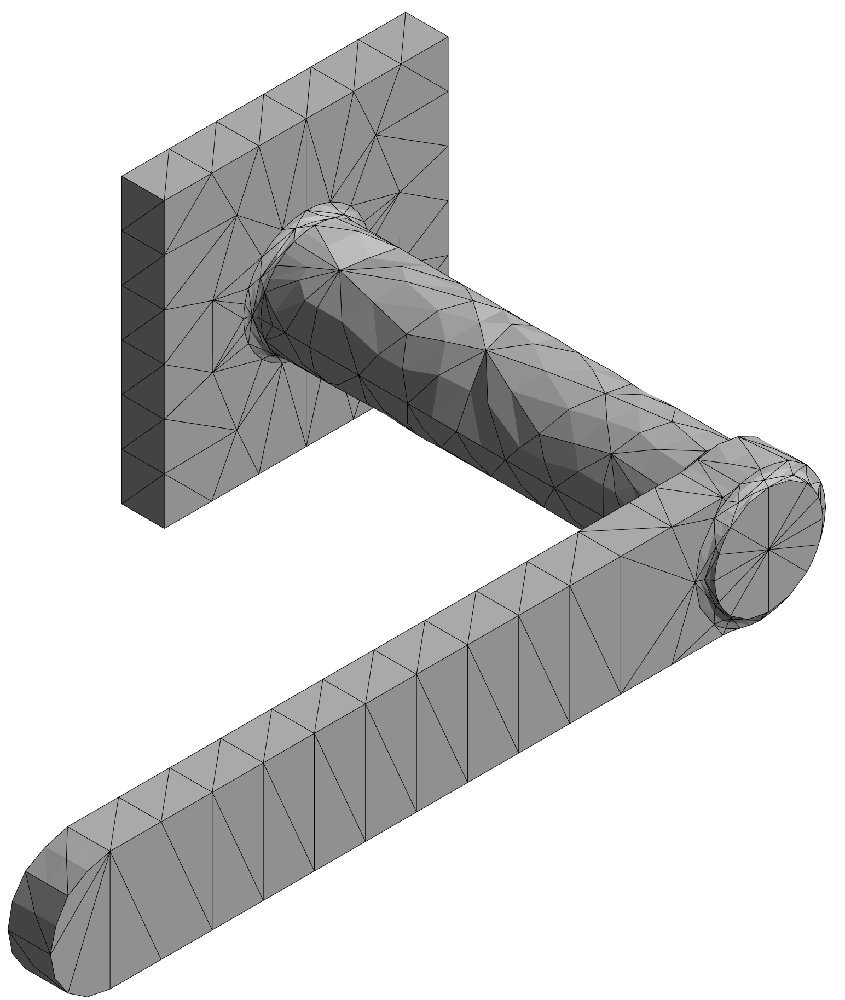
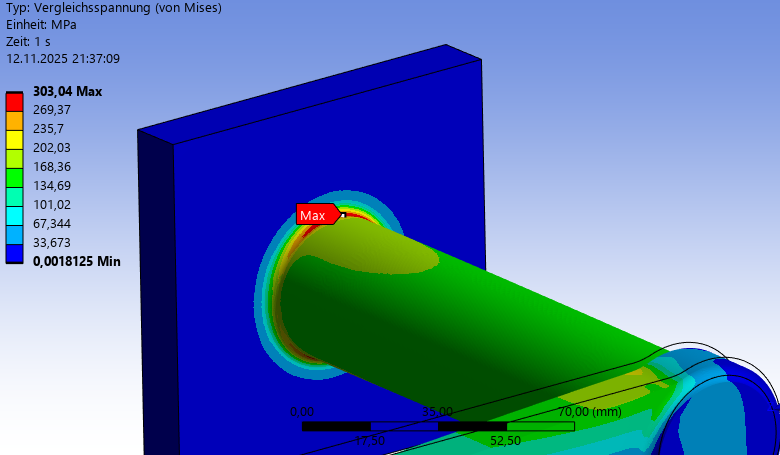
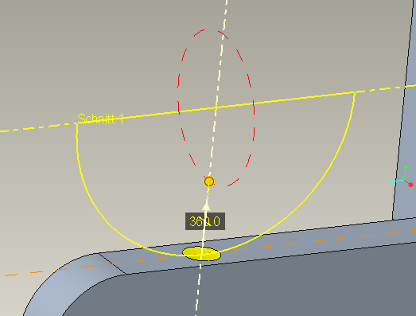
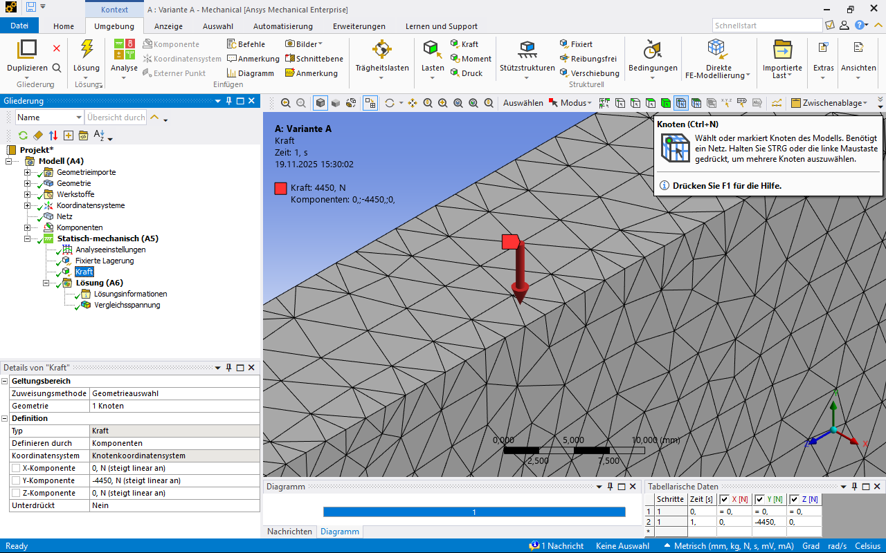
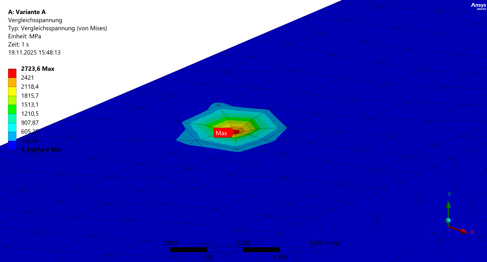
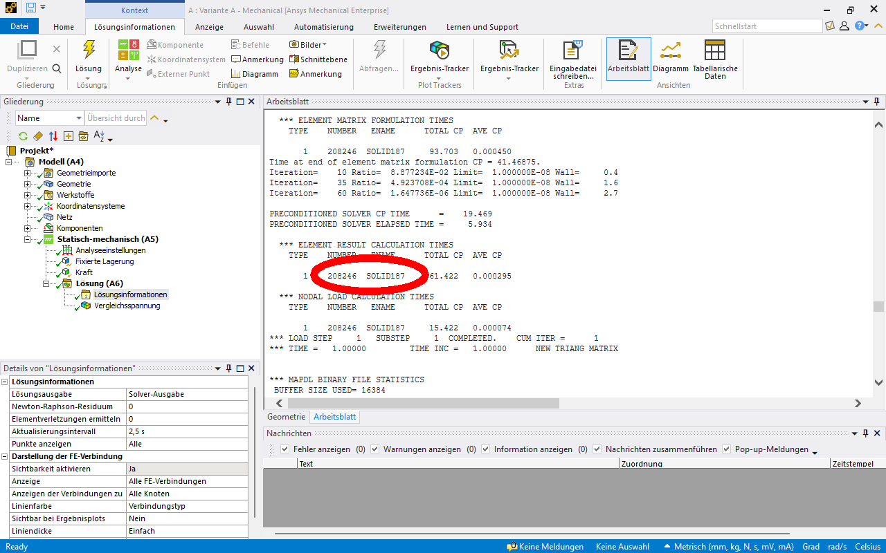

# Modul 04 – Krafteinleitung und Spannungsüberhöhung

## Lernziele

Nach Abschluss dieses Moduls können die Studierenden:

* typische Ursachen numerischer Spannungsüberhöhungen erkennen,  
* den Unterschied zwischen physikalisch und numerisch bedingten Spannungsspitzen erklären,  
* nicht-physikalische Punkt- oder Linienlasten vermeiden,  
* geeignete Maßnahmen zur Entschärfung von Spannungssingularitäten anwenden,
* die Bedeutung der Krafteinleitung für die Ergebnisgüte einschätzen.

## Aufgabenstellung Torsionsstab

Bei der Simulation eines Torsionsstabs mit Hebelarm soll die **Einleitung der äußeren Kraft** am Hebelarm untersucht werden.  

[{width=500px}](media/06_krafteinleitung/01_Torsionsstab.png "Torsionsstab mit Hebelarm"){.glightbox}

* zylindrischer Torsionsstab mit Hebelarm
* Länge \( L  = 152{,}4 \, \text{mm} \)  
* Durchmesser \( d = 38{,}1 \, \text{mm} \)  
* Hebelarm \( H = 203{,}2 \, \text{mm} \)  
* Kerbformzahl $\alpha_k = 1,59$ (Übergang zylindrischer Stab und Einspannung)
* Kraft \( F = 4{,}45 \, \text{kN} \)  
* eine Seite vollständig an einer Wand fixiert
* Material Baustahl gemäß ANSYS-Datenbank mit geändertem **E-Modul** auf 210.000 MPa.  

Untersuchen Sie die folgenden Varianten der Krafteinleitung am Hebelarm:  

* Geometrie Variante A [Torsionsstab_A.stp](media/06_krafteinleitung/Torsionsstab_A.stp)
* Geometrie Variante B [Torsionsstab_B.stp](media/06_krafteinleitung/Torsionsstab_B.stp)
* Geometrie Variante C [Torsionsstab_C.stp](media/06_krafteinleitung/Torsionsstab_C.stp)

Bearbeiten Sie folgende Punkte:

* Ermitteln Sie eine **analytische Lösung** für die maximale Spannung. Wo ist der kritische Querschnitt?
* Berechnen Sie in ANSYS die maximale Vergleichsspannung.  
* Achten Sie auf ein von der Vernetzung unabhängiges Ergebnis.  
* Führen Sie eine konvergierende Lösung herbei.  
* Diskutieren Sie, wie ein Krafteinleitungsproblem entstehen kann und wie es sich im FEM-Sinne beschreiben lässt.  

## Theoretischer Hintergrund (nach Spura[@Spura2019])

Die Kraft \(F\) greift am Hebelarm exzentrisch zur Stabachse an. Dadurch entstehen gleichzeitig:

* ein Biegemoment \(M_{\text{B}}\) durch den senkrechten Abstand der Kraft zur Stabachse  
* ein Torsionsmoment \(M_{\text{T}}\) durch den wirksamen Hebelarm um die Stabachse  
* eine Querkraft \(F_Q\), deren Schubspannungsanteil im Vergleich zu Biegung und Torsion klein ist und hier vernachlässigt wird  

Das zugrunde liegende Modell folgt der **Euler-Bernoulli-Balkentheorie**. Es wird angenommen, dass der Balken schubstarr ist, der Querschnitt während der Verformung eben bleibt und keine Verwölbung auftritt.

### Biegung und schiefe Biegung

Bei Torsionsstäben mit exzentrischer Krafteinleitung kann neben der Torsion auch Biegung auftreten.  

#### Gerade Biegung

Wirkt die Kraft in einer einzigen Ebene, entsteht **gerade Biegung**. Für den Vollkreisquerschnitt gilt:

\[
\sigma_{\text{B}} = \frac{M}{W_b}
\]

mit dem Biegemoment \(M = F \cdot l\) und dem Widerstandsmoment

\[
W_b = \frac{\pi d^3}{32}
\]

Die Normalspannung verläuft über den Querschnitt linear. Die neutrale Faser bleibt horizontal und verläuft durch die Querschnittsmitte.

---

#### Schiefe Biegung

Für die **vorliegende Aufgabe ist ausschließlich die gerade Biegung relevant**. Schiefe Biegung wird nur ergänzend dargestellt.

??? note "Schiefe Biegung (ergänzende Information)"
    Wirkt die Kraft nicht nur in einer Hauptebene, entsteht schiefe Biegung. Für symmetrische Querschnitte wie beim Vollkreis fallen die Hauptachsen mit den Koordinatenachsen \(y\) und \(z\) zusammen. Es handelt sich somit um den Sonderfall der schiefen Biegung um Hauptachsen.

    Das gesamte Biegemoment setzt sich aus zwei Anteilen um diese senkrechten Achsen zusammen:

    \[
    M_y,\quad M_z
    \]

    Die resultierende Biegespannung im Randfaserpunkt ergibt sich aus der Überlagerung:

    \[
    \sigma_{\text{B}} = \frac{M_y\,z}{I_y} + \frac{M_z\,y}{I_z}
    \]

    Die analytische Berechnung beschreibt damit die Normalspannung infolge kombinierter Biegung im Kreisquerschnitt. Für symmetrische Querschnitte ergibt sich die schiefe Biegung aus der Überlagerung der geraden Biegungen um \(y\) und \(z\). Die resultierende Spannungsnulllinie liegt schräg im Querschnitt.

    [{width=700px}](media/06_krafteinleitung/02_schiefe_Biegung.png "Schiefe Biegung: Superposition um y und z zu resultierender \(\sigma_x(y,z)\)"){.glightbox}
    Bildquelle[@Spura2019]

### Torsion

Durch das Torsionsmoment \(M_{\text{T}}\) entstehen Schubspannungen im Querschnitt:

\[
\tau_{\text{T}} = \frac{M_{\text{T}}\,r}{I_\text{p}}
\]

mit Radius \(r\) und polarem Flächenträgheitsmoment \(I_\text{p}\) des Vollkreises:

\[
I_\text{p} = \frac{\pi r^4}{2}
\]

### Vergleichsspannung bei kombinierter Beanspruchung

Für die Festigkeitsbewertung werden Biegespannung \(\sigma_{\text{B}}\) und Schubspannung infolge Torsion \(\tau_{\text{T}}\) zu einer **Vergleichsspannung** zusammengefasst, zum Beispiel nach von Mises:

\[
\sigma_{\text{v}} = \sqrt{\sigma_{\text{B}}^{2} + 3\,\tau_{\text{T}}^{2}}
\]

Die analytische Berechnung liefert damit einen einfachen Referenzwert für die maximal zu erwartende Vergleichsspannung im Stab.  
Die FEM ermittelt zusätzlich die örtliche Spannungsverteilung, die stark davon abhängt, **wie die Kraft \(F\) am Hebelarm in das Modell eingeleitet wird**.

---

## Umsetzung in ANSYS

### 1. Projektverwaltung und Geometrieimport

Für die Untersuchung der Varianten ist ein separates System pro Geometrie sinnvoll. Die technische Datenquelle kann verknüpft werden, sodass Änderungen (z. B. am E-Modul) automatisch in alle Systeme übernommen werden.  
Zweckmäßig ist es, zunächst **eine Variante vollständig einzurichten und zu berechnen**, anschließend über *Duplizieren* in der Projektübersicht zu kopieren, die technischen Daten zu verknüpfen und danach die Geometrie auszutauschen. So können viele Einstellungen im Modell übernommen werden und müssen nicht neu erstellt werden. Eine abschließende Überprüfung aller Randbedingungen bleibt jedoch erforderlich.

[{width=800px}](media/06_krafteinleitung/03_Torsionsstab_Projekt.png "Projektaufbau mit drei Varianten in ANSYS Workbench"){.glightbox}

### 2. Materialzuweisung

Das Material ist standardmäßig **Baustahl** aus der ANSYS-Materialdatenbank. Die Anpassung des **E-Moduls** erfolgt in den *Technischen Daten* des Projekts.  
Wird das Material **vor** der Systemerstellung geändert, wird der neue Wert automatisch in jedes System übernommen.  

Erfolgt die Änderung **nachträglich**, muss das jeweilige System über den **grünen Aktualisierungspfeil** in der Projektoberfläche aktualisiert werden (siehe Abbildung oben).

!!! note "Hinweis"
    Weitere Informationen zur Materialdefinition und zu den Dateneigenschaften finden sich im Abschnitt [**Elementtypen und Ansatzfunktionen – Materialzuweisung**](../05_elementtypen_ansatzf/#materialzuweisung).

### 3. Netzgenerierung

Zunächst wird ein **Standardnetz** erzeugt. Die Qualität kann visuell beurteilt werden.

[{width=350px}](media/06_krafteinleitung/04_Torsionsstab_Standardnetz.png "Standardnetz des Torsionsstabs in ANSYS"){.glightbox}

??? question "Wie fällt die Beurteilung dieses Netzes aus?"
    Das dargestellte Netz ist deutlich zu grob.  
    Die Geometrie ist nur unzureichend aufgelöst, insbesondere an Übergängen und Rundungen sind die Facetten klar sichtbar.  
    Für eine belastbare Spannungsanalyse wäre daher eine feinere Vernetzung erforderlich.

### 4. Randbedingungen

Die Randbedingungen bestehen aus einer **festen Einspannung** an der Wandfläche und einer **äußeren Kraft** am Ende des Hebelarms, wie in der Aufgabenstellung dargestellt.  
Die Richtung der Kraft bestimmt die Überlagerung von Biegung und Torsion.

### 5. Analyseeinstellungen

Die **Standard-Einstellungen** der statischen Analyse sind ausreichend.  
Es sind keine Anpassungen erforderlich, solange es sich um eine lineare elastische Berechnung handelt.

### 6. Auswertung

Gemäß Aufgabenstellung wird zunächst die **Vergleichsspannung nach von Mises** ausgewertet.  

## Diskussion der Ergebnisse

### Vergleich mit analytischer Lösung

Die folgende Box enthält die analytische Lösung. Berechnen Sie zunächst die **nominelle** Vergleichsspannung eines glatten Vollstabs. Anschließend wird die in der Aufgabenstellung angegebene **Kerbformzahl \(\alpha_k = 1{,}59\)** verwendet, um die **lokale maximale Vergleichsspannung** im Übergangsbereich abzuschätzen.

**Hinweise:**  

* Der Schubspannungsanteil infolge Querkraft wird hier vernachlässigt.  
* Es liegt **keine schiefe Biegung** im Sinne der Überlagerung zweier orthogonaler Biegungen vor, sondern eine Kombination aus **reiner Biegung** und **reiner Torsion**.  
* Die **Kerbformzahl \(\alpha_k\)** wird nach der Ermittlung der nominellen Vergleichsspannung berücksichtigt.

??? note "Berechnung von \(\sigma_\text{v,nom}\) und \(\sigma_\text{v,max}\)"

    **Gegeben:**

    $$
    F = 4{,}45\,\text{kN}, \quad 
    L = 152{,}4\,\text{mm}, \quad 
    H = 203{,}2\,\text{mm}, \quad 
    d = 38{,}1\,\text{mm}, \quad
    \alpha_k = 1{,}59
    $$

    **Momente:**

    $$
    M_\text{B} = F \cdot L = 678{.}180\,\text{Nmm}
    $$

    $$
    M_\text{T} = F \cdot H = 904{.}240\,\text{Nmm}
    $$

    **Querschnittsgrößen (Vollkreis):**

    \[
    r = \frac{d}{2} = 19{,}05\,\text{mm}, \qquad
    W_\text{B} = \frac{\pi d^3}{32} = 5{.}429{,}687\,\text{mm}^3, \qquad
    I_\text{p} = \frac{\pi d^4}{32} = 206{.}871{,}087\,\text{mm}^4
    \]

    **Nominelle Spannungen:**

    $$
    \sigma_\text{B} 
      = \frac{M_\text{B}}{W_\text{B}}
      = \frac{678{.}180}{5{.}429{,}687}
      = 124{,}90\,\text{N/mm}^2
    $$

    $$
    \tau_\text{T} 
      = \frac{M_\text{T}\,r}{I_\text{p}}
      = \frac{904{.}240 \cdot 19{,}05}{206{.}871{,}087}
      = 83{,}27\,\text{N/mm}^2
    $$

    **Nominelle Vergleichsspannung:**

    $$
    \sigma_\text{v,nom}
      = \sqrt{\sigma_\text{B}^2 + 3\,\tau_\text{T}^2}
      = \sqrt{(124{,}90)^2 + 3 \cdot (83{,}27)^2}
      = 190{,}79\,\text{N/mm}^2
    $$

    **Lokale Vergleichsspannung mit Kerbe:**

    \[
    \sigma_\text{v,max}
      = \alpha_k \,\sigma_\text{v,nom}
      = 1{,}59 \cdot 190{,}79
      = 303{,}36\,\text{N/mm}^2
    \]

Die folgende Tabelle zeigt die analytischen Ergebnisse, die FEM-Ergebnisse sowie die daraus berechnete prozentuale Abweichung:

\[
\text{Abweichung} = \frac{\text{FEM} - \text{Analytisch}}{\text{Analytisch}} \times 100
\]

| Größe                                      | Analytische Lösung | FEM-Ergebnis | Abweichung |
|--------------------------------------------|--------------------|--------------|------------|
| maximale Vergleichsspannung mit Kerbe \(\sigma_\mathrm{v,max}\) | 303,36 MPa        | 303,04 MPa  | −0,11 %    |

Die Simulation zeigt eine maximale **Vergleichsspannung** (von Mises) im Bereich der höchsten Beanspruchung des Stabs. Die maximale Spannung beträgt **303,04 MPa** und tritt im Übergang vom Hebelarm zum Stab auf, wo Biegung und Torsion überlagert wirken.

[{width=600px}](media/06_krafteinleitung/05_Torsionsstab_Vergleichsspannung.png "Torsionsstab – maximale Vergleichsspannung"){.glightbox}

---

### Einfluss der Krafteinleitung

Die Art der Krafteinleitung bestimmt die lokale Beanspruchung und beeinflusst somit direkt die Aussagekraft der FEM-Simulation. Änderungen in der Lastanbindung führen zu deutlich unterschiedlichen Spannungsverteilungen und Konvergenzverhalten.

#### **Variante A**

Bei dieser Geometrie ist keine Fläche vorhanden, über die die Kraft so eingeleitet werden kann, dass der Hebel wirksam wird. Eine physikalisch sinnvolle Randbedingung lässt sich damit nicht formulieren. Das Problem ist in dieser Form nicht berechenbar und liefert folglich keine verwertbaren FEM Ergebnisse.

---

#### **Variante B**

Bei dieser Variante wird die Kraft über eine sehr kleine Kontaktfläche eingeleitet, die vom Hebel erhaben angebracht ist. Dadurch entstehen lokal sehr hohe Spannungen und eine ausgeprägte Kerbwirkung. Mit zunehmender Netzverfeinerung steigen die Spannungsmaxima weiter an, der Spannungsverlauf konvergiert nicht. Die Ergebnisse sind daher für eine belastbare Bewertung der Bauteilfestigkeit ungeeignet.

<!-- markdownlint-disable MD033 -->

v",
           "type": "scatter",
           "mode": "lines+markers",
           "yaxis": "y1",
           "hovertemplate": "Lösung %{x} σv = %{y} MPa<extra></extra>"
         },
         {
           "x": [1, 2, 3, 4, 5],
           "y": [85218, 255408, 663171, 1074384, 1519585],
           "name": "Knoten",
           "type": "scatter",
           "mode": "lines+markers",
           "yaxis": "y2",
           "hovertemplate": "Lösung %{x} Knoten = %{y}<extra></extra>"
         },
         {
           "x": [1, 2, 3, 4, 5],
           "y": [48886, 165578, 458381, 756071, 1078741],
           "name": "Elemente",
           "type": "scatter",
           "mode": "lines+markers",
           "yaxis": "y2",
           "hovertemplate": "Lösung %{x} Elemente = %{y}<extra></extra>"
         }
       ],
       "layout": {
         "title": {"text": "Konvergenzverhalten – Variante B"},
         "xaxis": {"title": "Lösungsnummer", "dtick": 1},

         "yaxis": {
           "title": "Vergleichsspannung (MPa)",
           "side": "left"
         },

         "yaxis2": {
           "title": "Knoten / Elemente",
           "overlaying": "y",
           "side": "right",
           "showgrid": false
         },

         "hovermode": "x unified",
         "hoverlabel": {
           "bgcolor": "white",
           "font": {"color": "black"},
           "bordercolor": "rgba(0,0,0,0)"
         },

         "legend": {
           "x": 0,
           "y": 1,
           "xanchor": "left",
           "yanchor": "top"
         }
       }
     }'>

<!-- markdownlint-enable MD033 -->

Die hohe Spannungsspitze tritt direkt an der Kontaktstelle der Kraftanbringung auf einer kleinen Fläche auf. Durch diese kleine Fläche entstehen extrem steile Spannungsgradienten, die numerisch nicht sauber aufgelöst werden können. Das Ergebnis divergiert bei Netzverfeinerung.

[{width=750px}](media/06_krafteinleitung/06a_Torsionsstab_nicht_konv_Spannung.png "Variante B – nicht konvergierende Vergleichsspannung"){.glightbox}

Die Detailansicht zeigt die maximale Spannung direkt an der Krafteinleitungsfläche. Hier konzentriert sich die gesamte Last auf einen scharf begrenzten Bereich, was zu einer künstlichen Kerbwirkung und nicht physikalischen Spannungsspitzen führt.

[{width=750px}](media/06_krafteinleitung/06b_Torsionsstab_nicht_konv_Spannung.png "Variante B – Detailansicht der Lastfläche"){.glightbox}

---

#### **Variante C**

Bei dieser Variante erfolgt die Krafteinleitung über eine definierte Fläche mittels Sekantenschnitt. Die Last wird dadurch ohne zusätzliche Kerbwirkung in den Hebelarm eingeleitet. Die resultierenden Spannungsverläufe sind stabil und zeigen ein deutliches Konvergenzverhalten.

<!-- markdownlint-disable MD033 -->

v",
           "type": "scatter",
           "mode": "lines+markers",
           "yaxis": "y1",
           "hovertemplate": "Lösung %{x} σv = %{y} MPa<extra></extra>"
         },
         {
           "x": [1, 2, 3],
           "y": [85533, 245546, 434902],
           "name": "Knoten",
           "type": "scatter",
           "mode": "lines+markers",
           "yaxis": "y2",
           "hovertemplate": "Lösung %{x} Knoten = %{y}<extra></extra>"
         },
         {
           "x": [1, 2, 3],
           "y": [49154, 158569, 292824],
           "name": "Elemente",
           "type": "scatter",
           "mode": "lines+markers",
           "yaxis": "y2",
           "hovertemplate": "Lösung %{x} Elemente = %{y}<extra></extra>"
         }
       ],
       "layout": {
         "title": {"text": "Konvergenzverhalten – Variante C"},
         "xaxis": {"title": "Lösungsnummer", "dtick": 1},

         "yaxis": {
           "title": "Vergleichsspannung (MPa)",
           "side": "left"
         },

         "yaxis2": {
           "title": "Knoten / Elemente",
           "overlaying": "y",
           "side": "right",
           "showgrid": false
         },

         "hovermode": "x unified",
         "hoverlabel": {
           "bgcolor": "white",
           "font": {"color": "black"},
           "bordercolor": "rgba(0,0,0,0)"
         },

         "legend": {
           "x": 0,
           "y": 1,
           "xanchor": "left",
           "yanchor": "top"
         }
       }
     }'>

<!-- markdownlint-enable MD033 -->

Die Fläche zur Krafteinleitung entsteht hier aus einem **Sekantenschnitt** im CAD. Dadurch wird eine **kerbfreie Lastübertragung** ermöglicht.

[{width=750px}](media/06_krafteinleitung/07_Torsionsstab_Sekantenschnitt.png "Geometrie – Variante C"){.glightbox}

Der Halbkreis-Ausschnitt definiert die Form der Lastfläche. Durch die Rotation entsteht eine Geometrie, die keine lokalen Kerben erzeugt.  

[{width=450px}](media/06_krafteinleitung/08_Torsionsstab_Sekantenschnitt_CAD.png "CAD-Skizze – Sekantenschnitt"){.glightbox}

Im Gegensatz zur Krafteinleitung in Variante B treten **keine Spannungsspitzen** auf, und das Ergebnis **konvergiert** bei Netzverfeinerung im kritischen Querschnitt.  

[{width=750px}](media/06_krafteinleitung/09_Torsionsstab_Sekantenschnitt_Spannung.png "Vergleichsspannung – Variante C"){.glightbox}

## Krafteinleitung über Knoten

Die Kraft kann alternativ über **einen oder mehrere Knoten** eingeleitet werden. Die Auswahl erfolgt über den *Auswahlfilter* für **Knoten** in der Symbolleiste, wie in der Abbildung dargestellt.

[{width=900px}](media/06_krafteinleitung/10_Torsionsstab_Knotenkraft.png "Torsionsstab – Krafteinleitung über Knotenlast"){.glightbox}

Die Krafteinleitung über **einen einzelnen Knoten** ist grundsätzlich möglich, bringt jedoch mehrere Nachteile mit sich:

* Die genaue geometrische Position des Knotens muss über ein *Koordinatensystem* und die **Komponenten** in der Auswahltabelle bestimmt werden. Dies ist vergleichsweise aufwendig.
* Die Position des ausgewählten Knotens ist **vom Netz abhängig** und ändert sich bei jeder Neuvernetzung.
* Die resultierende Spannungsüberhöhung tritt **sehr lokal** auf (oft nur an einem oder wenigen Knoten).  

[{width=900px}](media/06_krafteinleitung/11_Torsionsstab_Knotenkraft_Spannung.png "Torsionsstab – lokale Spannungsüberhöhung durch Knotenkraft"){.glightbox}

* Das **Konvergenzkriterium** kann für solche Zuordnungen nicht verwendet werden.  
  ANSYS gibt folgende Meldung aus:

[{width=500px}](media/06_krafteinleitung/11_Torsionsstab_Knotenkraft_Fehler.png "Torsionsstab – Meldung zum Konvergenzkriterium"){.glightbox}

## Zusammenfassung

Eine der häufigsten Fehlerquellen in der FEM ist die **idealisierte Krafteinleitung**. Lasten, die in der Realität über Flächen verteilt werden, werden im Modell häufig als Punkt- oder Linienlasten angegeben. Dadurch entstehen an Kanten oder Punkten **Singularitäten**.

Typische Ursachen:

* Punktlast auf Fläche → σ → ∞  
* Linienlast oder scharfer Kantenübergang  
* abrupte Querschnittsänderung ohne Radius  
* zu kleine Kontaktfläche zwischen Bauteilen  

Die FEM zeigt in solchen Fällen keine Konvergenz: Bei jeder Netzverfeinerung steigt die lokale Spannung weiter an.

Physikalisch korrekte Lastübertragung durch:

* **Flächenlast** statt Punktlast,  
* **Übergangsradien oder Fasen** statt scharfer Kanten,  
* **Sekantenschnitt** (sanfter Geometrieübergang),  
* **elastische Zwischenlage oder Endplatte** zur Kraftverteilung.

## Weiterführende Hinweise

??? question "Warum wurde das E-Modul angepasst?"
    Für die Analyse der Spannungen spielt das Elastizitätsmodul keine Rolle.  
    In linearen elastischen Modellen beeinflusst das E-Modul ausschließlich die Verformungen, nicht jedoch die entstehenden Vergleichsspannungen.  
    Die beobachteten Unterschiede im Spannungsfeld resultieren daher allein aus der Art der Krafteinleitung. Die Änderung des E-Moduls ist hier rein didaktisch begründet.  

??? note "Hinweis zur Elementordnung"
    Ob mit **linearen oder quadratischen Elementen** gerechnet wurde, lässt sich an mehreren Stellen in den *Lösungsinformationen* erkennen. Im gezeigten Beispiel wird der Elementtyp **SOLID187** verwendet, also ein quadratisches 3D-Element.

    [{width=900px}](media/06_krafteinleitung/12_Torsionsstab_Elementtypen.png "Lösungsinformationen – verwendeter Elementtyp SOLID187"){.glightbox}

??? note "Alternative zur Krafteinleitung: kritische Zone ausklammern"
    Statt die Krafteinleitung im detaillierten Modell mit abzubilden, kann die lokale Zone auch ausgeklammert werden. In diesem Fall wird ein verkürztes Modell betrachtet, das ausschließlich die Einspannung enthält.  
    Dadurch lässt sich ein fokussiertes und numerisch stabiles Ergebnis an der Einspannung erzielen, ohne die Singularität an der Laststelle mitzuberechnen.

## Quiz zur Selbstkontrolle

<!-- markdownlint-disable MD033 -->

<?quiz?>
question: Welche Aussage beschreibt das Hauptziel dieses Moduls am besten?
answer: Die Berechnung von plastischen Verformungen bei beliebigen Lastfällen
answer: Die Optimierung der Rechenzeit durch grobe Netze
answer-correct: Das Verständnis, wie die Art der Krafteinleitung zu Spannungsüberhöhungen und Konvergenzproblemen in der FEM führt
content:
<em>Hinweis:</em> Im Mittelpunkt steht der Zusammenhang zwischen idealisierter Krafteinleitung, numerischen Singularitäten und der Aussagekraft der FEM Ergebnisse.
<?/quiz?>

<?quiz?>
question: Welche Beanspruchungskombination tritt beim Torsionsstab mit Hebelarm laut Aufgabenstellung auf?
answer: Reine Biegung ohne Torsion
answer-correct: Kombination aus Biegung und Torsion, die gemeinsam zur Vergleichsspannung beitragen
answer: Reine Torsion ohne Biegung
content:
<em>Hinweis:</em> Die Vergleichsspannung entsteht aus der Überlagerung von Biegung und Torsion.
<?/quiz?>

<?quiz?>
question: Welche Rolle spielt die Kerbformzahl \(\alpha_k = 1{,}59\) in der analytischen Berechnung?
answer: Sie beschreibt die Netzfeinheit im Kerbbereich
answer-correct: Sie erhöht die nominelle Vergleichsspannung zu einer lokalen maximalen Vergleichsspannung
answer: Sie reduziert die nominelle Vergleichsspannung zur Erhöhung der Sicherheit
content:
<em>Hinweis:</em> Die Kerbformzahl wird nach der Berechnung der nominellen Spannung angewendet.
<?/quiz?>

<?quiz?>
question: Warum ist Geometrie-Variante A ungeeignet?
answer-correct: Es existiert keine geeignete Fläche zur Krafteinleitung
answer: Die Geometrie besitzt keinen Kreisquerschnitt
answer: Es können nur nichtlineare Elemente verwendet werden
content:
<em>Hinweis:</em> Ohne Lastfläche lässt sich keine physikalische Randbedingung formulieren.
<?/quiz?>

<?quiz?>
question: Wie verhalten sich die Spannungen in Geometrie-Variante B bei Netzverfeinerung?
answer: Die Spannungen bleiben unabhängig vom Netz unverändert
answer-correct: Die Spannungsmaxima steigen weiter an und konvergieren nicht
answer: Die Spannungen sinken ab und stabilisieren sich
content:
<em>Hinweis:</em> Die kleine Kontaktfläche verursacht eine numerische Singularität.
<?/quiz?>

<?quiz?>
question: Wodurch zeichnet sich Geometrie-Variante C aus?
answer: Durch die Vernachlässigung der Biegung im analytischen Vergleich
answer-correct: Durch eine flächige, kerbarme Krafteinleitung über einen Sekantenschnitt mit gutem Konvergenzverhalten
answer: Durch eine punktförmige Kraftanbringung mit kleinen Kontaktflächen
content:
<em>Hinweis:</em> Die flächige Lastübertragung verhindert künstliche Spannungsspitzen.
<?/quiz?>

<?quiz?>
question: Welche Aussage zur Krafteinleitung über einen einzelnen Knoten ist korrekt?
answer-correct: Sie erzeugt sehr lokale Spannungsspitzen und verhindert sinnvolle Konvergenzbewertung
answer: Sie bildet die reale Belastung am besten ab
answer: Sie erleichtert die automatische Konvergenzprüfung
content:
<em>Hinweis:</em> Knotenkraft erzeugt numerische Singularitäten.
<?/quiz?>

<?quiz?>
question: Welche Aussage zum Elastizitätsmodul \(E\) trifft in der linearen elastischen Analyse zu?
answer: Eine Erhöhung von \(E\) reduziert immer die Spannungen
answer-correct: Eine Änderung von \(E\) beeinflusst die Verformungen, nicht jedoch die Vergleichsspannungen
answer: Eine Verringerung von \(E\) macht das Modell nicht mehr linear
content:
<em>Hinweis:</em> Spannungen hängen dort von Last und Geometrie ab, nicht von \(E\).
<?/quiz?>

<?quiz?>
question: Wie lassen sich numerische Singularitäten bei der Krafteinleitung vermeiden?
answer: Durch Entfernen aller Übergangsradien
answer: Durch große Punktlasten an einzelnen Knoten
answer-correct: Durch Flächenlasten und geometrisch sanfte Übergänge zur Lastverteilung
content:
<em>Hinweis:</em> Realistische Lastverteilung verbessert die physikalische Abbildung und Konvergenz.
<?/quiz?>

<!-- markdownlint-enable MD033 -->

