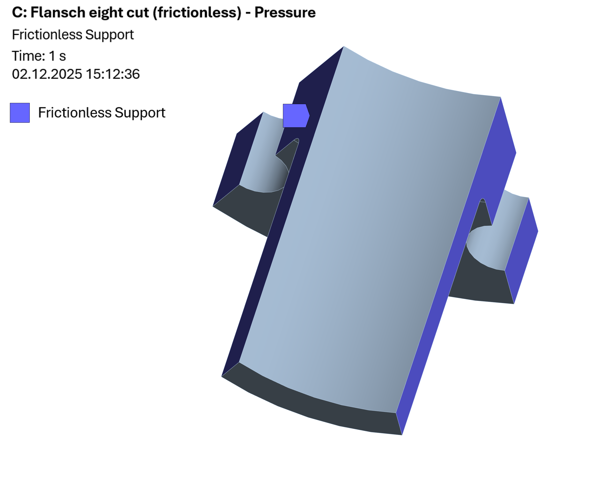
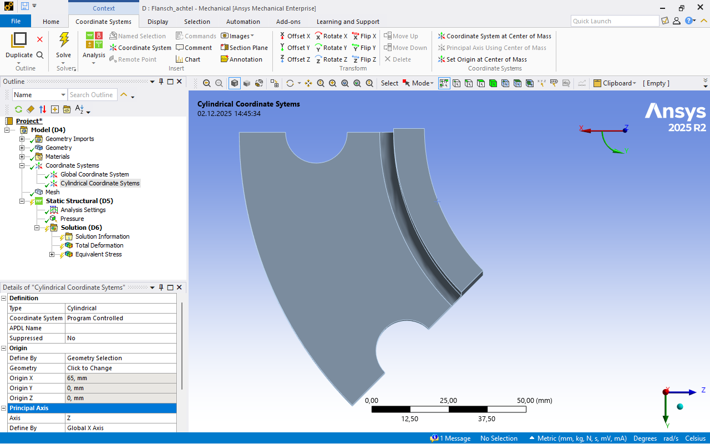
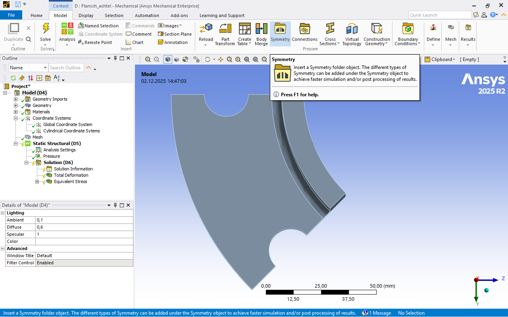
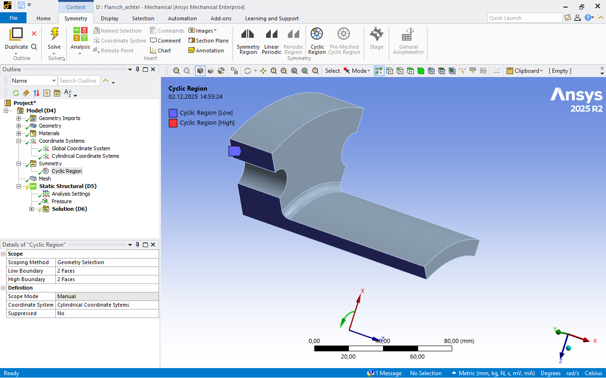

# Module 05 – Symmetry and Model Reduction

## Learning Objectives

After completing this module, students will be able to:

* identify symmetry properties of a component and apply them correctly  
* define symmetry in ANSYS and formulate suitable boundary conditions  
* avoid typical errors caused by incorrectly oriented symmetry boundary conditions  
* clearly distinguish pressure vs. force  
* use frictionless supports or cyclic symmetry to reduce computation time  
* significantly reduce computation time without compromising the validity of the results  

## Task Definition: Flange

The flange shown in the figure shall be analysed with respect to maximum stress and maximum deformation. Computation time shall be minimised by suitable exploitation of symmetry. The solution must be mesh independent and show clean convergence behaviour.

* Case A: internal pressure of 200 bar  
* Case B: tensile force of 100 kN (applied to the end faces of the flange)

[{width=800px}](media/07_symmetrie/flansch.svg "Flange"){.glightbox}

The provided flange geometry and its reduced variants (half model, quarter model, eighth model) shall be used.

**Geometry:**

* [flansch_voll.stp](media/07_symmetrie/flansch_voll.stp)  
* [flansch_halb.stp](media/07_symmetrie/flansch_halb.stp)  
* [flansch_viertel.stp](media/07_symmetrie/flansch_viertel.stp)  
* [flansch_achtel.stp](media/07_symmetrie/flansch_achtel.stp)

**Material (to be created):** *FlangeSteel450*

* Density \(\rho = 7,850 \,\text{kg/m}^3\)
* Young’s modulus \(E = 215,000 \,\text{MPa}\)
* Poisson’s ratio \(\nu = 0.30\)
* Yield strength \(R_\text{e} = 450 \,\text{MPa}\)

## Theoretical Background

The use of symmetry in numerical analysis allows a reduction of the geometric model, the degrees of freedom, and thus the computation time. The validity of a reduced model requires that **geometry**, **loads**, **boundary conditions**, and **material** all possess suitable symmetry properties. Only if all conditions are fulfilled simultaneously is the reduced model equivalent to the full model.

### Symmetry Conditions

The use of symmetry is one of the most effective strategies for reducing model size in FEM. The prerequisite is that the **physical behaviour of the full model** can be completely described by a **suitably reduced submodel**.

For the application of symmetry, four conditions must be fulfilled simultaneously:

* **Geometric symmetry**  
  The component geometry must be divisible by one or more planes or axes such that the remaining subdomains are identical.  
  Typical examples include half, quarter, or eighth models as well as axial or cyclic symmetry.

* **Material symmetry**  
  The material behaviour must be identical in all symmetrically represented subdomains.  
  For isotropic materials, this condition is automatically fulfilled.

* **Load symmetry**  
  Loads must act consistently in all subdomains generated by symmetry.  
  A surface based pressure usually fulfils this automatically, whereas a single force is only symmetric if it is correctly distributed over the considered portion of the model.

* **Boundary condition symmetry**  
  Boundary conditions must be equivalent in the corresponding symmetric regions.  
  Different supports in two subdomains would violate symmetry.

If all four conditions are satisfied, a suitable segment of the component can be analysed instead of the full model. The corresponding symmetry boundary condition restrains displacement normal to the symmetry plane while allowing motion in tangential directions.

This leads to a significant reduction in degrees of freedom and thus computation time, without degrading the quality or validity of the results.

---

### Typical Symmetry Properties

Depending on component geometry and loading, different forms of symmetry occur in engineering practice. The following symmetry types are among the most common and each enables substantial model reduction.

* **Planar symmetry planes (XY, XZ, YZ)**  
  Planar symmetry occurs when a component can be divided into identical subdomains by one or more vertical or horizontal planes. These include the classical XY, XZ, and YZ planes. Typical examples are symmetric flanges, tension rods with a central cross section, plates with a central hole, or thin components whose top and bottom sides are identical.

* **Axial symmetry**  
  Rotational symmetry about an axis: all cross sections have the same shape.  
  Typical examples include cylinders, pressure vessels, sealing surfaces, discs, and many flange base bodies.

* **Cyclic symmetry**  
  The component consists of repeating segments that are arranged periodically around an axis.  
  Typical examples include bolt circles in flanges, impellers, turbine discs, or wheels with identical spokes.

---

### Pressure and Force in Partial Models

#### Pressure

Pressure \(p\) always acts **normal to the loaded surface** and is oriented along the local surface normal. Since \(p\) is a **surface based load**, its value remains unchanged in reduced models.  
The resulting force \(F\) is obtained only by multiplication with the effective area \(A\):

\[
F = p \cdot A
\]

#### Force

A force \(F\) is an **integral load** acting over an entire area. If only part of the component is modelled, the effective area is reduced.  
Therefore, the force in the reduced model \(F_r\) must be scaled accordingly. The scaling factor \(\alpha\) describes the proportion of the partial model relative to the full model:

\[
F_r = \alpha F, \qquad \alpha = \frac{\text{partial model}}{\text{full model}}
\]

Typical scalings:

* Quarter model: \(\alpha = \frac{1}{4}\)  
* Eighth model: \(\alpha = \frac{1}{8}\)  
* Half model: \(\alpha = \frac{1}{2}\)

In this way, the resulting **surface pressure \( \sigma = F/A \)** and thus the physical load state remain correct.

---

## Implementation in ANSYS

### 1. Project Management and Geometry Import

!!! note "Project Management Note"
    The same notes apply as described here: [**Module Load Application – Project Management**](06_krafteinleitung.en.md#1-project-management-and-geometry-import)

### 2. Material Assignment

A new material must be created. This is done in the **material overview (centre/top)** of the engineering data available in the current project.

!!! note "Note"
    Further information on material definition and data properties can be found in the section [**Element Types and Shape Functions – Material Assignment**](05_elementtypen_ansatzf.en.md#material-assignment).

**Material name:** *FlangeSteel450*

* Density \(\rho = 7,850 \,\text{kg/m}^3\)
* Young’s modulus \(E = 215,000 \,\text{MPa}\)
* Poisson’s ratio \(\nu = 0.30\)
* Yield strength \(R_\text{e} = 450 \,\text{MPa}\)

### 3. Mesh Generation

No additional specifications are required; mesh generation follows the established procedure.

* **Visually check** the generated mesh for quality and plausibility  
* Perform a **mesh sensitivity study** to verify result stability

For comparability of computation time and result quality, it is advisable to analyse all models (full model and cut variants) using the same mesh. This mesh must, of course, provide mesh independent results.

### 4. Boundary Conditions

#### Force and Pressure

Pressure and force are to be applied on the surfaces specified above. Note that the two load types do not act simultaneously in this task.

If no explicit support is present, **weak springs** must be activated in the *analysis settings* to ensure that the equation system is uniquely solvable.

??? note "Note on pressure units"
    **1 bar = 0.1 MPa**

#### Symmetry using *frictionless supports*

A frictionless support prevents displacement in the normal direction. The boundary condition is:

\[
u \cdot n = 0
\]

with  

* \(u\): displacement vector  
* \(n\): unit normal vector  
* \(u \cdot n\): displacement component normal to the surface

Tangential displacements remain permitted:

\[
u_t \ne 0
\]

where \(u_t\) denotes the tangential displacement component.

A frictionless support generates no shear forces and prevents constraint effects due to friction. Typical applications include:

* radial supports  
* component guidance  
* use in symmetry based model reduction

Frictionless supports are particularly suitable in this task, as they can be applied on all cut surfaces according to the figure. This can be done on one or multiple cut surfaces without affecting result quality.

<!-- markdownlint-disable MD033 -->
 
<!-- markdownlint-enable MD033 -->

[{width=600px}](media/07_symmetrie/01_schnittflaechen_reibungsfrei.en.png "Frictionless supports on cut surfaces"){.glightbox}

---

#### Symmetry using *cyclic symmetry*

With cyclic symmetry, a component is divided into identical sectors that can be exactly superimposed by a rotation through a fixed angle. Thus, computation of **a single sector** is sufficient, provided that the four general symmetry conditions (geometry, material, loads, boundary conditions) are fulfilled.

Cyclic symmetry couples the boundary faces of this sector such that their displacements differ **only by a defined rotation** when transitioning to the next sector. In practice, this means:

* The two boundary faces of the sector are kinematically coupled.  
* The displacement of a point on one face corresponds to the displacement of the associated point on the other face, rotated by the sector angle.  
* The model therefore behaves as if all sectors were present.

Typical advantages:

* drastically reduced model size  
* significantly reduced computation time  
* improved numerical stability  
* suitable for rotating machinery, discs, gears, turbine rotors, or brake discs

For implementation, a suitable coordinate system is required. In this example, a **cylindrical coordinate system** is used, whose circumferential direction corresponds to that of the flange. The coordinate system is created in the structure tree under *Coordinate Systems*.

Points to note:

* A **cylindrical surface** must be selected for creation.  
* New coordinate systems are always created **at the centre of the selected surface** in all directions.  
* Under *Type*, switch from **Cartesian** to **Cylindrical**.  
* The direction of the cylindrical coordinates may need adjustment.  
* Settings of the cylindrical coordinates are defined in the *Details* of the new coordinate system.  
* A **clear naming** of the coordinate system is very helpful.

[{width=900px}](media/07_symmetrie/02_zylinderkoordinatensystem.en.png "Create cylindrical coordinate system for cyclic symmetry"){.glightbox}

[{width=900px}](media/07_symmetrie/02_zylinderkoordinatensystem_details.en.png "Create cylindrical coordinate system for cyclic symmetry, details"){.glightbox}

!!! note "Global coordinate system note"
    The **global coordinate system cannot be modified**, as it is defined in the CAD model.

Subsequently, a *Symmetry* object is added in the structure tree. To do this, select *Model* in the structure tree and choose *Symmetry* from the *Prepare* menu. This creates a new *Symmetry* object in the structure tree.

[{width=900px}](media/07_symmetrie/03_symmetrie_strukturbaum.en.png "Insert symmetry object in structure tree"){.glightbox}

Within this symmetry object, a *Cyclic Region* is inserted via the context menu of the symmetry object (*Insert* → *Cyclic Region*).

[{width=900px}](media/07_symmetrie/04_zyklischer_bereich_einfuegen.en.png "Insert cyclic region under symmetry"){.glightbox}

In the *Cyclic Region* object, the cut surfaces and the previously defined cylindrical coordinate system are assigned. The two cut surfaces are defined as *Lower Boundary* and *Upper Boundary*, and the cylindrical coordinate system is selected as the *Coordinate System*.

[{width=900px}](media/07_symmetrie/05_zyklischer_bereich_details.en.png "Settings in cyclic region: cut surfaces and coordinate system"){.glightbox}

Cyclic symmetry can be implemented on one or multiple cut surfaces. As long as the geometry is correctly described sector by sector and the cyclic region is defined consistently, the specific subdivision of cut surfaces in the model does not affect the physical result.

!!! note "Surface selection note"
    If a surface is split at the sector boundary, **all sub surfaces** must be selected.

### 5. Analysis Settings

In the analysis settings, **weak springs** must be activated so that the equation system remains uniquely solvable even without explicit supports. No further adjustments of default settings are required.

### 6. Postprocessing

Evaluation is carried out using **total deformation** and **von Mises stress**.

!!! note "Note"
    For comparability of different model variants, a numerical convergence criterion is not useful here, as it complicates direct comparison. Nevertheless, it is essential to ensure that a **mesh independent result** is achieved. Critical regions may be manually refined if required.

---

## Discussion of Results

The results are presented exemplarily for the following parameters:

* frictionless support for symmetry utilisation  
* global mesh size of 2 mm  
* pressure load according to the task definition

At this mesh size, the influence of meshing is negligibly small, so that the differences arise exclusively from model reduction.

| Cut            | max. stress | max. deformation | number of nodes | number of elements | computation time |
|----------------|-------------|------------------|-----------------|--------------------|------------------|
| Full           | 155.82 MPa  | 0.0477 mm        | 374,495         | 221,036            | 60 s             |
| Half           | 155.81 MPa  | 0.0475 mm        | 186,336         | 108,995            | 32 s             |
| Quarter        | 155.96 MPa  | 0.0464 mm        | 94,112          | 54,956             | 25 s             |
| Eighth         | 155.81 MPa  | 0.0460 mm        | 46,599          | 26,940             | 20 s             |

The size of the considered cut shows only a very small influence on **deformation** and **maximum stress**.

<!-- markdownlint-disable MD033 -->

Max. deformation = %{text}<extra></extra>"
         },
         {
           "x": ["Full","Half","Quarter","Eighth"],
           "y": [155.82,155.81,155.96,155.81],
           "name": "Max. stress",
           "type": "scatter",
           "mode": "lines+markers",
           "yaxis": "y2",
           "text": ["155.82 MPa","155.81 MPa","155.96 MPa","155.81 MPa"],
           "hovertemplate": "Cut = %{x} Max. stress = %{text}<extra></extra>"
         }
       ],
       "layout": {
         "title": {"text": "Influence of model reduction on stress and deformation"},
         "xaxis": {"title": "Cut"},
         "yaxis": {
           "title": "Max. deformation (mm)",
           "side": "left",
           "range": [0, 0.05]
         },
         "yaxis2": {
           "title": "Max. stress (MPa)",
           "overlaying": "y",
           "side": "right",
           "range": [0, 160]
         },
         "legend": {
           "x": 0.95,
           "y": 0.5,
           "xanchor": "right",
           "yanchor": "middle",
           "bgcolor": "rgba(255,255,255,0.6)"
         },
         "hovermode": "x unified",
         "hoverlabel": {
           "bgcolor": "white",
           "font": {"color": "black"},
           "bordercolor": "rgba(0,0,0,0)"
         }
       }
     }'>

<!-- markdownlint-enable MD033 -->

**Computation time** and **model size**, measured by number of nodes and elements, decrease significantly with increasing model reduction.

<!-- markdownlint-disable MD033 -->

Nodes = %{text}<extra></extra>"
         },
         {
           "x": ["Full","Half","Quarter","Eighth"],
           "y": [221036,108995,54956,26940],
           "name": "Number of elements",
           "type": "scatter",
           "mode": "lines+markers",
           "yaxis": "y",
           "text": ["221,036","108,995","54,956","26,940"],
           "hovertemplate": "Cut = %{x} Elements = %{text}<extra></extra>"
         },
         {
           "x": ["Full","Half","Quarter","Eighth"],
           "y": [60,32,25,20],
           "name": "Computation time",
           "type": "scatter",
           "mode": "lines+markers",
           "yaxis": "y2",
           "text": ["60 s","32 s","25 s","20 s"],
           "hovertemplate": "Cut = %{x} Computation time = %{text}<extra></extra>"
         }
       ],
       "layout": {
         "title": {"text": "Model reduction: nodes, elements, and computation time"},
         "xaxis": {"title": "Cut"},
         "yaxis": {
           "title": "Nodes / Elements",
           "side": "left",
           "range": [0, 400000]
         },
         "yaxis2": {
           "title": "Computation time (s)",
           "overlaying": "y",
           "side": "right",
           "range": [0, 70]
         },
         "legend": {
           "x": 0.95,
           "y": 0.5,
           "xanchor": "right",
           "yanchor": "middle",
           "bgcolor": "rgba(255,255,255,0.6)"
         },
         "hovermode": "x unified",
         "hoverlabel": {
           "bgcolor": "white",
           "font": {"color": "black"},
           "bordercolor": "rgba(0,0,0,0)"
         }
       }
     }'>

<!-- markdownlint-enable MD033 -->

## Summary

* Symmetry enables significant reduction of model size and computation time  
* Symmetric geometry, materials, loads, and boundary conditions are required  
* Pressure remains unchanged, forces must be scaled in partial models  
* Frictionless supports correctly represent symmetry conditions  
* Cyclic symmetry couples sector boundary faces via a rotation angle  
* Mesh independence is essential for a valid comparison of reduced models  

## Further Aspects

!!! warning "FIXME: Extension of further aspects section"
    Presentation of results for cyclic symmetry  
    Use of the features **Symmetry Region** and **Linear Periodic**  
    Exercise to implement 2D, CAD data available and see peer teaching, exercises/Symmetry_2D

## Self Check Quiz

<!-- markdownlint-disable MD033 -->

<?quiz?>
question: What is the main advantage of using symmetry in FEM?
answer: It increases model stiffness and reduces stresses
answer-correct: It reduces model size and thus computation time without loss of validity
answer: It eliminates the need for mesh generation
content:
<em>Note:</em> Symmetry reduces the degrees of freedom of the model, making the analysis more efficient.
<?/quiz?>

<?quiz?>
question: Which symmetry forms typically occur in technical components?
answer-correct: Planar, axial, and cyclic symmetry
answer: Only planar symmetry
answer: Only axial and mirror symmetry
content:
<em>Note:</em> Many components exhibit combinations of planar, axial, or cyclic symmetries.
<?/quiz?>

<?quiz?>
question: Which combination of properties must be fulfilled for a reduced symmetry model to be physically equivalent to the full model?
answer: Geometry and loading
answer: Material and boundary conditions
answer-correct: Geometry, material, loads, and boundary conditions
content:
<em>Note:</em> Only if geometry, material, loads, and boundary conditions share the same symmetry properties may a partial model fully replace the full model.
<?/quiz?>

<?quiz?>
question: How does model reduction affect the implementation of pressure and force in a partial model?
answer-correct: Pressure remains unchanged, the force is scaled with the proportion of the partial model relative to the full model
answer: Pressure and force remain unchanged because both are surface based loads
answer: Pressure must be scaled, the force remains unchanged
content:
<em>Note:</em> Pressure is a surface based load and remains unchanged in partial models, whereas a resulting force is an integral quantity and must be scaled with the surface proportion.
<?/quiz?>

<?quiz?>
question: Which statement best describes the effect of a frictionless support on a cut surface?
answer: It restrains all displacement components and allows only rotations
answer: It restrains only tangential displacements while the normal displacement remains free
answer-correct: It restrains displacement normal to the surface and allows tangential displacements
content:
<em>Note:</em> Mathematically, \(u \cdot n = 0\): the displacement component normal to the surface is suppressed, while tangential motion remains possible.
<?/quiz?>

<?quiz?>
question: Which advantage typically results from using cyclic symmetry for a flange with a bolt circle?
answer: Only the loads are reduced while the number of degrees of freedom remains unchanged
answer-correct: Model size decreases significantly while result validity is preserved
answer: Boundary conditions can be chosen arbitrarily as long as the geometry is cyclic
content:
<em>Note:</em> By computing a single sector, degrees of freedom and computation time are strongly reduced; with correctly defined cyclic coupling, physical results remain representative of the full model.
<?/quiz?>

<?quiz?>
question: Why should weak springs be activated in the analysis settings if no explicit support is present?
answer: To increase the natural frequencies of the flange
answer-correct: To ensure that the equation system is uniquely solvable even without supports
answer: To reduce the influence of the material FlangeSteel450
content:
<em>Note:</em> Weak springs prevent free rigid body motion and ensure that the equation system has a unique solution without significantly affecting deformation levels.
<?/quiz?>

<!-- markdownlint-enable MD033 -->
