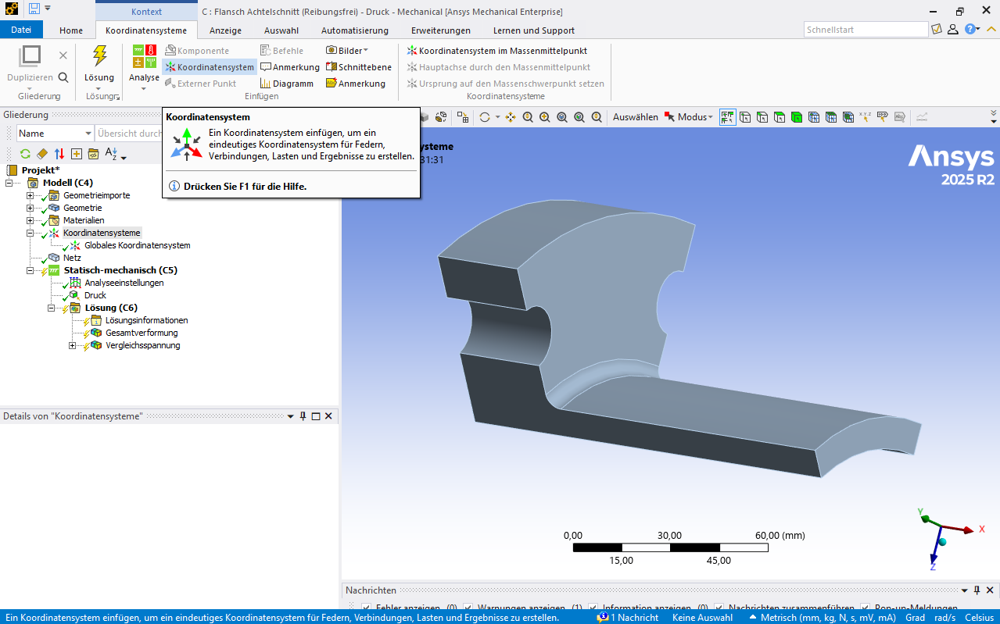
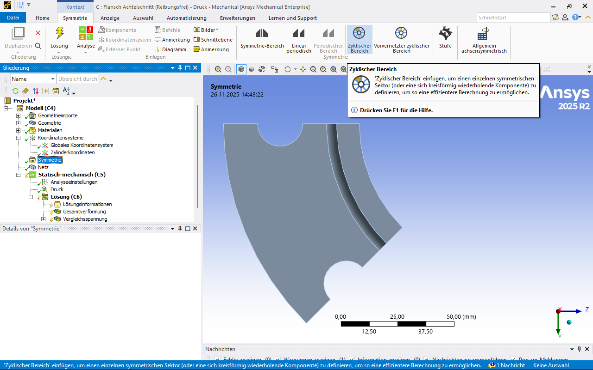

# Modul 05 – Symmetrie und Modellreduktion

## Lernziele

Nach Abschluss dieses Moduls können die Studierenden:

* Symmetrieeigenschaften eines Bauteils erkennen und korrekt anwenden  
* Symmetrie in ANSYS definieren und geeignete Randbedingungen formulieren  
* typische Fehler bei falsch orientierten Symmetrierandbedingungen vermeiden  
* Druck vs. Kraft sauber unterscheiden  
* reibungsfreie Lager oder zyklische Symmetrie zur Reduktion der Rechenzeit einsetzen  
* die Rechenzeit signifikant reduzieren, ohne die Aussagekraft der Ergebnisse zu beeinträchtigen  

## Aufgabenstellung Flansch

Der in Abbildung dargestellte Flansch soll auf maximale Spannung und maximale Verformung untersucht werden. Die Rechenzeit soll durch geeignete Symmetrieausnutzung minimiert werden. Die Lösung muss netzunabhängig sein und ein sauberes Konvergenzverhalten zeigen.

* Fall A: Innendruck von 200 bar  
* Fall B: Zugkraft von 100 kN (aufgebracht an den Stirnflächen des Flansches)

[{width=800px}](media/07_symmetrie/flansch.svg "Flansch"){.glightbox}

Verwendet wird die bereitgestellte Geometrie des Flansches sowie deren reduzierte Varianten (Halbschnitt, Viertelschnitt, Achtelschnitt).

**Geometrie:**

* [flansch\_voll.stp](media/07_symmetrie/flansch_voll.stp)  
* [flansch\_halb.stp](media/07_symmetrie/flansch_halb.stp)  
* [flansch\_viertel.stp](media/07_symmetrie/flansch_viertel.stp)  
* [flansch\_achtel.stp](media/07_symmetrie/flansch_achtel.stp)

**Material (neu anzulegen):** *Flanschstahl450*

* Dichte \(\rho = 7.850 \,\text{kg/m}^3\)
* Elastizitätsmodul \(E = 215.000 \,\text{MPa}\)
* Querkontraktionszahl \(\nu = 0,30\)
* Streckgrenze \(R_\text{e} = 450 \,\text{MPa}\)

## Theoretischer Hintergrund

Die Nutzung von Symmetrie in der numerischen Analyse ermöglicht eine Reduktion des geometrischen Modells, der Freiheitsgrade und damit der Rechenzeit. Die Gültigkeit einer Modellreduktion setzt voraus, dass **Geometrie**, **Belastung**, **Randbedingungen** und **Material** geeignete Symmetrieeigenschaften besitzen. Nur wenn alle Bedingungen gleichzeitig erfüllt sind, ist das reduzierte Modell äquivalent zum Vollmodell.

### Symmetriebedingungen

Die Nutzung von Symmetrie gehört zu den wirkungsvollsten Strategien zur Reduktion der Modellgröße in der FEM. Voraussetzung ist, dass das **physikalische Verhalten des Vollmodells** durch ein **geeignet reduziertes Teilmodell** vollständig beschrieben werden kann.  

Für die Anwendung von Symmetrie müssen vier Bedingungen gleichzeitig erfüllt sein:

* **Geometrische Symmetrie**  
  Die Bauteilgeometrie muss durch eine oder mehrere Ebenen beziehungsweise Achsen so teilbar sein, dass die verbleibenden Teilbereiche zueinander identisch sind.  
  Typische Beispiele sind Modelle mit Halbierung, Viertelung oder Achtelung sowie axiale oder zyklische Symmetrie.

* **Materialsymmetrie**  
  Das Materialverhalten muss in allen symmetrisch abgebildeten Teilbereichen identisch sein.  
  Für isotrope Werkstoffe ist diese Bedingung automatisch erfüllt.

* **Lastsymmetrie**  
  Belastungen müssen in allen durch Symmetrie erzeugten Teilbereichen konsistent wirken.  
  Ein flächenbezogener Druck erfüllt dies meist automatisch, eine einzelne Kraft wirkt dagegen nur dann symmetrisch, wenn sie korrekt auf den jeweilig berücksichtigten Modellanteil aufgeteilt wird.

* **Randbedingungssymmetrie**  
  Randbedingungen müssen in den durch Symmetrie entsprechenden Bereichen gleichwertig sein.  
  Unterschiedliche Lagerungen in zwei Teilbereichen würden die Symmetrie verletzen.

Sind alle vier Bedingungen erfüllt, kann anstelle des Vollmodells ein geeigneter Ausschnitt des Bauteils berechnet werden. Die zugehörige Symmetrierandbedingung sperrt die Verschiebung normal zur Symmetrieebene und erlaubt Bewegungen in ihren tangentialen Richtungen.

Dies führt zu einer erheblichen Reduktion der Freiheitsgrade und damit der Rechenzeit, ohne dass die Qualität oder Aussagekraft der Ergebnisse leidet.

---

### Typische Symmetrieeigenschaften

In der Technik treten je nach Bauteilgeometrie und Belastung unterschiedliche Formen von Symmetrie auf. Die folgenden Symmetriearten zählen zu den häufigsten und ermöglichen jeweils eine deutliche Reduktion des Modells.

* **Planare Symmetrieebenen (XY, XZ, YZ)**  
  Planare Symmetrie tritt auf, wenn ein Bauteil durch eine oder mehrere senkrechte oder waagrechte Ebenen in identische Teilbereiche zerlegt werden kann. Dazu gehören die klassischen Ebenen XY, XZ und YZ. Typische Beispiele sind symmetrische Flansche, Zugstäbe mit mittigem Querschnitt, Platten mit zentralem Loch oder dünne Bauteile, deren Ober- und Unterseite identisch aufgebaut sind.

* **axiale Symmetrie**  
  Rotationssymmetrie um eine Achse: Alle Querschnitte besitzen die gleiche Form.  
  Typische Beispiele: Zylinder, Druckbehälter, Dichtflächen, Scheiben und viele Flanschgrundkörper.

* **zyklische Symmetrie**  
  Das Bauteil besteht aus wiederholenden Segmenten, die sich periodisch um eine Achse anordnen.  
  Typische Beispiele: Lochkreise in Flanschen, Laufräder, Turbinenscheiben oder Felgen mit identischen Speichen.

---

### Druck und Kraft bei Teilmodellen

#### Druck

Druck \(p\) wirkt stets **senkrecht zur belasteten Fläche** und orientiert sich entlang der lokalen Flächennormalen. Da \(p\) eine **flächenbezogene Last** ist, bleibt der Wert auch bei reduzierten Modellen unverändert.  
Die daraus resultierende Kraft \(F\) ergibt sich erst durch Multiplikation mit der wirksamen Fläche \(A\):

\[
F = p \cdot A
\]

#### Kraft

Eine Kraft \(F\) ist eine **integrale Last**, die über eine gesamte Fläche wirkt. Wird nur ein Teil des Bauteils modelliert, reduziert sich die wirksame Fläche.  
Daher muss die Kraft im reduzierten Modell \(F_r\) entsprechend skaliert werden. Der Skalierungsfaktor \(\alpha\) beschreibt den Anteil des berechneten Teilmodells am Vollmodell:

\[
F_r = \alpha F, \qquad \alpha = \frac{\text{Teilmodell}}{\text{Gesamtmodell}}
\]

Typische Skalierungen:

* Viertelmodell: \(\alpha = \frac{1}{4}\)  
* Achtelmodell: \(\alpha = \frac{1}{8}\)  
* Halbmodell: \(\alpha = \frac{1}{2}\)

Auf diese Weise bleibt die resultierende **Flächenpressung \( \sigma = F/A \)** und damit der physikalische Lastzustand korrekt erhalten.

---

## Umsetzung in ANSYS

### 1. Projektverwaltung und Geometrieimport

!!! note "Hinweis Projektverwaltung"
    Es gelten die gleichen Hinweise wie hier: [**Modul Krafteinleitung - Projektverwaltung**](06_krafteinleitung.md#1-projektverwaltung-und-geometrieimport)

### 2. Materialzuweisung

Hier muss ein Material neu angelegt werden. Dies geschieht in der **Materialübersicht (Mitte/oben)** der im aktuellen Projekt verfügbaren technischen Daten.  

!!! note "Hinweis"
    Weitere Informationen zur Materialdefinition und zu den Dateneigenschaften finden sich im Abschnitt [**Elementtypen und Ansatzfunktionen – Materialzuweisung**](05_elementtypen_ansatzf.md#materialzuweisung).

**Materialname:** *Flanschstahl450*

* Dichte \(\rho = 7.850 \,\text{kg/m}^3\)
* Elastizitätsmodul \(E = 215.000 \,\text{MPa}\)
* Querkontraktionszahl \(\nu = 0,30\)
* Streckgrenze \(R_\text{e} = 450 \,\text{MPa}\)

### 3. Netzgenerierung

Es sind keine zusätzlichen Angaben erforderlich; die Netzgenerierung erfolgt nach dem etablierten Vorgehen.

* Das erzeugte Netz **visuell auf Qualität und Plausibilität prüfen**  
* Eine **Netzeinflussstudie** durchführen, um die Ergebnisstabilität zu verifizieren

Zur Vergleichbarkeit von Rechenzeit und Ergebnisqualität bietet es sich an, alle Modelle (Vollmodell und Schnittvarianten) mit dem gleichen Netz zu untersuchen. Dieses Netz muss selbstverständlich ein vom Netz unabhängiges Ergebnis liefern.

### 4. Randbedingungen

#### Kraft und Druck

Druck und Kraft sind auf den oben angegebenen Flächen zu implementieren. Zu beachten ist, dass beide Lastarten in dieser Aufgabenstellung nicht gleichzeitig wirken.  

Bei fehlender Einspannung sind in den *Analyseeinstellungen* die *schwachen Federn* zu aktivieren, damit das Gleichungssystem eindeutig lösbar wird.  

??? note "Hinweis zur Einheit des Drucks"
    **1 bar = 0,1 MPa**

#### Symmetrie mittels *reibungsfreier Lager*

Ein reibungsfreies Lager verhindert Verschiebung in Normalrichtung. Die Randbedingung lautet:

\[
u \cdot n = 0
\]

mit  

* \(u\): Verschiebungsvektor  
* \(n\): Einheitsnormalvektor  
* \(u \cdot n\): Komponente der Verschiebung senkrecht zur Fläche

Tangentiale Verschiebungen bleiben zulässig:

\[
u_t \ne 0
\]

wobei \(u_t\) die tangentiale Verschiebungskomponente bezeichnet.

Ein reibungsfreies Lager erzeugt keine Querkräfte und verhindert Zwängungen durch Reibung. Typische Anwendungen:

* radiale Abstützungen  
* Bauteilführung  
* Ergänzung bei Symmetrie zur Modellreduktion

Reibungsfreie Lager bieten sich in dieser Aufgabe besonders an, da sie auf sämtlichen Schnittflächen entsprechend der Abbildung angebracht werden können. Dies kann an einer einzelnen oder an mehreren Schnittflächen erfolgen, ohne die Ergebnisqualität zu beeinflussen.

<!-- markdownlint-disable MD033 -->
 
<!-- markdownlint-enable MD033 -->

[{width=600px}](media/07_symmetrie/01_schnittflaechen_reibungsfrei.png "Reibungsfreie Lager auf Schnittflächen"){.glightbox}

---

#### Symmetrie mittels *zyklischer Symmetrie*

Bei zyklischer Symmetrie wird ein Bauteil in identische Sektoren unterteilt, die sich durch eine Drehung um einen festen Winkel exakt überlagern. Dadurch genügt die Berechnung **eines einzigen Sektors**, wenn die vier allgemeinen Symmetriebedingungen (Geometrie, Material, Lasten, Randbedingungen) erfüllt sind.

Die zyklische Symmetrie verknüpft die Randflächen dieses Sektors so, dass sich ihre Verschiebungen beim Übergang zum nächsten Sektor **nur um eine definierte Rotation unterscheiden**. Für die praktische Anwendung bedeutet dies:

* Die beiden Begrenzungsflächen des Sektors werden kinematisch miteinander gekoppelt.  
* Die Verschiebung eines Punkts auf der einen Fläche entspricht der Verschiebung des zugehörigen Punkts auf der anderen Fläche, nur um den Sektorwinkel gedreht.  
* Das Modell verhält sich damit so, als wären alle Sektoren vorhanden.

Typische Vorteile:

* drastisch reduzierte Modellgröße
* deutlich geringere Rechenzeit  
* verbesserte numerische Stabilität  
* geeignet für rotierende Maschinen, Scheiben, Zahnräder, Turbinenlaufräder oder Bremsscheiben

Für die Umsetzung wird zunächst ein geeignetes Koordinatensystem benötigt. In diesem Beispiel wird ein **Zylinderkoordinatensystem** verwendet, dessen Umfangsrichtung mit der Umfangsrichtung des Flansches übereinstimmt. Das Koordinatensystem wird im Strukturbaum unter *Koordinatensysteme* angelegt.

Dabei ist zu beachten:

* Für die Erstellung muss eine **Zylinderfläche** ausgewählt werden.  
* Neue Koordinatensysteme entstehen immer **im Zentrum der ausgewählten Fläche** in allen Richtungen.  
* Unter *Typ* muss von **kartesisch** auf **zylindrisch** umgeschaltet werden.  
* Die Richtung der Zylinderkoordinate muss gegebenenfalls angepasst werden.  
* Die Einstellungen der Zylinderkoordinate werden in den *Details* des neuen Koordinatensystems vorgenommen.  
* Eine **eindeutige Benennung** des Koordinatensystems ist sehr hilfreich.

[{width=900px}](media/07_symmetrie/02_zylinderkoordinatensystem.png "Zylinderkoordinatensystem für zyklische Symmetrie anlegen"){.glightbox}

[{width=900px}](media/07_symmetrie/02_zylinderkoordinatensystem_details.png "Zylinderkoordinatensystem für zyklische Symmetrie anlegen, Details"){.glightbox}

!!! note "Hinweis globales Koordinatensystem"
    Das **globale Koordinatensystem kann nicht verändert** werden, da es im CAD festgelegt ist.

Anschliessend wird im Strukturbaum ein Objekt *Symmetrie* hinzugefügt. Dazu im Strukturbaum das *Modell* markieren und im Menü *Vorbereiten* den Eintrag *Symmetrie* auswählen. Dadurch entsteht im Strukturbaum ein neues Objekt *Symmetrie*.

[{width=900px}](media/07_symmetrie/03_symmetrie_strukturbaum.png "Symmetrieobjekt im Strukturbaum einfügen"){.glightbox}

Innerhalb dieses Symmetrieobjekts wird ein *Zyklischer Bereich* eingefügt. Dies erfolgt über das Kontextmenü des Symmetrieobjekts (*Einfügen* → *Zyklischer Bereich*).

[{width=900px}](media/07_symmetrie/04_zyklischer_bereich_einfuegen.png "Zyklischen Bereich unter Symmetrie einfügen"){.glightbox}

Im Objekt *Zyklischer Bereich* werden anschliessend die Schnittflächen und das zuvor definierte Zylinderkoordinatensystem zugewiesen. Die beiden Schnittflächen werden als *Untere Grenze* und *Obere Grenze* definiert, als *Koordinatensystem* ist das Zylinderkoordinatensystem auszuwählen.

[{width=900px}](media/07_symmetrie/05_zyklischer_bereich_details.png "Einstellungen im zyklischen Bereich: Schnittflächen und Koordinatensystem"){.glightbox}

Die zyklische Symmetrie kann an einer einzelnen oder an mehreren Schnittflächen implementiert werden. Solange die Geometrie korrekt sektorenweise beschrieben ist und der zyklische Bereich konsistent definiert ist, wirkt sich die konkrete Aufteilung der Schnittflächen im Modell nicht auf das physikalische Ergebnis aus.

!!! note "Hinweis Flächenauswahl"
    Bei einer geteilten Fläche als Sektorgrenze müssen **alle Teilflächen** ausgewählt werden.

### 5. Analyseeinstellungen

In den Analyseeinstellungen sind die **schwachen Federn** zu aktivieren, damit das Gleichungssystem auch bei fehlender Einspannung eindeutig lösbar bleibt. Weitere Anpassungen der Standardeinstellungen sind nicht erforderlich.

### 6. Auswertung

Die Auswertung erfolgt über die **Gesamtverformung** und die **von Mises Spannung**.

!!! note "Hinweis"
    Zur Vergleichbarkeit der verschiedenen Modellvarianten ist ein numerisches Konvergenzkriterium hier nicht zielführend, da es den direkten Vergleich erschwert. Dennoch ist unbedingt darauf zu achten, dass ein **netzunabhängiges Ergebnis** erreicht wird. Die kritischen Bereiche könnten manuell verfeinert werden, falls erforderlich.  

---

## Diskussion der Ergebnisse

Hier werden exemplarisch für folgende Parameter die Ergebnisse vorgestellt:

* Reibungsfreie Lagerung zur Nutzung der Symmetrie  
* globale Netzgröße von 2 mm  
* Druckbelastung gemäß Aufgabenstellung

Bei dieser Netzgröße ist der Einfluss der Vernetzung vernachlässigbar klein, sodass die Unterschiede ausschließlich aus der Modellreduktion entstehen.

| Schnitt        | max. Spannung | max. Verformung  | Anzahl Knoten | Anzahl Elemente | Rechenzeit |
|----------------|--------------------|---------------------|----------------|------------------|------------|
| Voll           |      155,82 MPa    |      0,0477 mm      |     374495    |     221036        |     60 s       |
| Halbschnitt    |      155,81 MPa   |      0,0475 mm       |     186336    |     108995        |     32 s       |
| Viertelschnitt |      155,96 MPa     |      0,0464 mm     |      94112     |      54956      |      25 s      |
| Achtelschnitt  |       155,81 MPa   |       0,0460 mm   |      46599       |    26940       |     20 s       |

Die Größe des betrachteten Schnitts zeigt nur einen sehr kleinen Einfluss auf die **Verformung** und die **maximale Spannung**.

<!-- markdownlint-disable MD033 -->

Max. Verformung = %{text}<extra></extra>"
         },
         {
           "x": ["Voll","Halbschnitt","Viertelschnitt","Achtelschnitt"],
           "y": [155.82,155.81,155.96,155.81],
           "name": "Max. Spannung",
           "type": "scatter",
           "mode": "lines+markers",
           "yaxis": "y2",
           "text": ["155.82 MPa","155.81 MPa","155.96 MPa","155.81 MPa"],
           "hovertemplate": "Schnitt = %{x} Max. Spannung = %{text}<extra></extra>"
         }
       ],
       "layout": {
         "title": {"text": "Einfluss der Modellreduktion auf Spannung und Verformung"},
         "xaxis": {"title": "Schnitt"},
         "yaxis": {
           "title": "Max. Verformung (mm)",
           "side": "left",
           "range": [0, 0.05]
         },
         "yaxis2": {
           "title": "Max. Spannung (MPa)",
           "overlaying": "y",
           "side": "right",
           "range": [0, 160]
         },
         "legend": {
           "x": 0.95,
           "y": 0.5,
           "xanchor": "right",
           "yanchor": "middle",
           "bgcolor": "rgba(255,255,255,0.6)"
         },
         "hovermode": "x unified",
         "hoverlabel": {
           "bgcolor": "white",
           "font": {"color": "black"},
           "bordercolor": "rgba(0,0,0,0)"
         }
       }
     }'>

<!-- markdownlint-enable MD033 -->

Die **Rechenzeit** und die **Modellgröße** gemessen über die Anzahl der Knoten und Elemente nehmen mit zunehmender Reduktion des Modells deutlich ab.

<!-- markdownlint-disable MD033 -->

Knoten = %{text}<extra></extra>"
         },
         {
           "x": ["Voll","Halbschnitt","Viertelschnitt","Achtelschnitt"],
           "y": [221036,108995,54956,26940],
           "name": "Anzahl Elemente",
           "type": "scatter",
           "mode": "lines+markers",
           "yaxis": "y",
           "text": ["221.036","108.995","54.956","26.940"],
           "hovertemplate": "Schnitt = %{x} Elemente = %{text}<extra></extra>"
         },
         {
           "x": ["Voll","Halbschnitt","Viertelschnitt","Achtelschnitt"],
           "y": [60,32,25,20],
           "name": "Rechenzeit",
           "type": "scatter",
           "mode": "lines+markers",
           "yaxis": "y2",
           "text": ["60 s","32 s","25 s","20 s"],
           "hovertemplate": "Schnitt = %{x} Rechenzeit = %{text}<extra></extra>"
         }
       ],
       "layout": {
         "title": {"text": "Modellreduktion: Knoten, Elemente und Rechenzeit"},
         "xaxis": {"title": "Schnitt"},
         "yaxis": {
           "title": "Knoten / Elemente",
           "side": "left",
           "range": [0, 400000]
         },
         "yaxis2": {
           "title": "Rechenzeit (s)",
           "overlaying": "y",
           "side": "right",
           "range": [0, 70]
         },
         "legend": {
           "x": 0.95,
           "y": 0.5,
           "xanchor": "right",
           "yanchor": "middle",
           "bgcolor": "rgba(255,255,255,0.6)"
         },
         "hovermode": "x unified",
         "hoverlabel": {
           "bgcolor": "white",
           "font": {"color": "black"},
           "bordercolor": "rgba(0,0,0,0)"
         }
       }
     }'>

<!-- markdownlint-enable MD033 -->

## Zusammenfassung

* Symmetrie ermöglicht eine deutliche Reduktion der Modellgröße und Rechenzeit  
* Voraussetzung sind symmetrische Geometrie, Materialien, Lasten und Randbedingungen  
* Druck bleibt unverändert, Kräfte müssen im Teilmodell skaliert werden  
* Reibungsfreie Lager bilden Symmetriebedingungen korrekt ab  
* Zyklische Symmetrie koppelt Sektorrandflächen über einen Drehwinkel  
* Netzunabhängigkeit ist zentral für einen validen Vergleich der reduzierten Modelle  

## Weiterführende Aspekte

!!! warning "FIXME: Erweiterung Abschnitt Weiterführende Aspekte"
    Darstellung von Ergebnissen bei zyklischer Symmetrie  
    Nutzen der Features **Symmetrie-Bereich** und **Linear Periodisch**
    Übung zu 2D implementieren, CAD Daten liegen vor und siehe peer-teaching, Übungen/Symmetrie_2D

## Quiz zur Selbstkontrolle

<!-- markdownlint-disable MD033 -->

<?quiz?>
question: Was ist der Hauptvorteil der Nutzung von Symmetrie in der FEM?
answer: Es erhöht die Steifigkeit des Modells und reduziert Spannungen
answer-correct: Es reduziert die Modellgröße und damit die Rechenzeit ohne Verlust an Aussagekraft
answer: Es macht eine Netzgenerierung überflüssig
content:
<em>Hinweis:</em> Symmetrie reduziert die Freiheitsgrade des Modells, wodurch die Analyse effizienter wird.
<?/quiz?>

<?quiz?>
question: Welche Symmetrieformen treten bei technischen Bauteilen typischerweise auf?
answer-correct: Planare, axiale und zyklische Symmetrie
answer: Nur planare Symmetrie
answer: Nur axiale und spiegelnde Symmetrie
content:
<em>Hinweis:</em> Viele Bauteile weisen Kombinationen aus planaren, axialen oder zyklischen Symmetrien auf.
<?/quiz?>

<?quiz?>
question: Welche Kombination von Eigenschaften muss erfüllt sein, damit ein reduziertes Symmetriemodell physikalisch gleichwertig zum Vollmodell ist?
answer: Geometrie und Belastung
answer: Material und Randbedingungen
answer-correct: Geometrie, Material, Lasten und Randbedingungen
content:
<em>Hinweis:</em> Nur wenn Geometrie, Material, Lasten und Randbedingungen die gleichen Symmetrieeigenschaften besitzen, darf ein Teilmodell das Vollmodell vollständig ersetzen.
<?/quiz?>

<?quiz?>
question: Wie wirkt sich die Modellreduktion auf die Umsetzung von Druck und Kraft im Teilmodell aus?
answer-correct: Der Druck bleibt unverändert, die Kraft wird mit dem Anteil des Teilmodells am Vollmodell skaliert
answer: Druck und Kraft bleiben unverändert, da beide flächenbezogene Lasten sind
answer: Der Druck muss skaliert werden, die Kraft bleibt unverändert
content:
<em>Hinweis:</em> Druck ist eine flächenbezogene Last und bleibt bei Teilmodellen gleich, eine resultierende Kraft ist eine integrale Grösse und muss mit dem Flächenanteil skaliert werden.
<?/quiz?>

<?quiz?>
question: Welche Aussage beschreibt die Wirkung eines reibungsfreien Lagers auf einer Schnittfläche am treffendsten?
answer: Es sperrt alle Verschiebungskomponenten und erlaubt nur Drehungen
answer: Es sperrt nur tangentiale Verschiebungen, die normale Verschiebung bleibt frei
answer-correct: Es sperrt die Verschiebung normal zur Fläche und lässt tangentiale Verschiebungen zu
content:
<em>Hinweis:</em> Mathematisch gilt \(u \cdot n = 0\): Die Komponente der Verschiebung senkrecht zur Fläche wird unterdrückt, die Bewegung in tangentialer Richtung bleibt möglich.
<?/quiz?>

<?quiz?>
question: Welcher Vorteil ergibt sich typischerweise aus der Verwendung zyklischer Symmetrie beim Flansch mit Lochkreis?
answer: Nur die Lasten werden reduziert, die Anzahl der Freiheitsgrade bleibt gleich
answer-correct: Die Modellgrösse sinkt deutlich, während die Aussagekraft der Ergebnisse erhalten bleibt
answer: Die Randbedingungen können beliebig gewählt werden, solange die Geometrie zyklisch ist
content:
<em>Hinweis:</em> Durch die Berechnung eines einzigen Sektors werden Freiheitsgrade und Rechenzeit stark reduziert, bei korrekt definierter zyklischer Kopplung bleiben die physikalischen Ergebnisse repräsentativ für das Vollmodell.
<?/quiz?>

<?quiz?>
question: Weshalb sollen in den Analyseeinstellungen schwache Federn aktiviert werden, wenn keine explizite Einspannung vorhanden ist?
answer: Um die Eigenfrequenzen des Flansches zu erhöhen
answer-correct: Um das Gleichungssystem auch ohne Einspannung eindeutig lösbar zu machen
answer: Um den Einfluss des Materials Flanschstahl450 zu reduzieren
content:
<em>Hinweis:</em> Schwache Federn verhindern freie Starrkörperbewegung und stellen sicher, dass das Gleichungssystem eine eindeutige Lösung besitzt, ohne das Verformungsniveau wesentlich zu beeinflussen.
<?/quiz?>

<!-- markdownlint-enable MD033 -->
