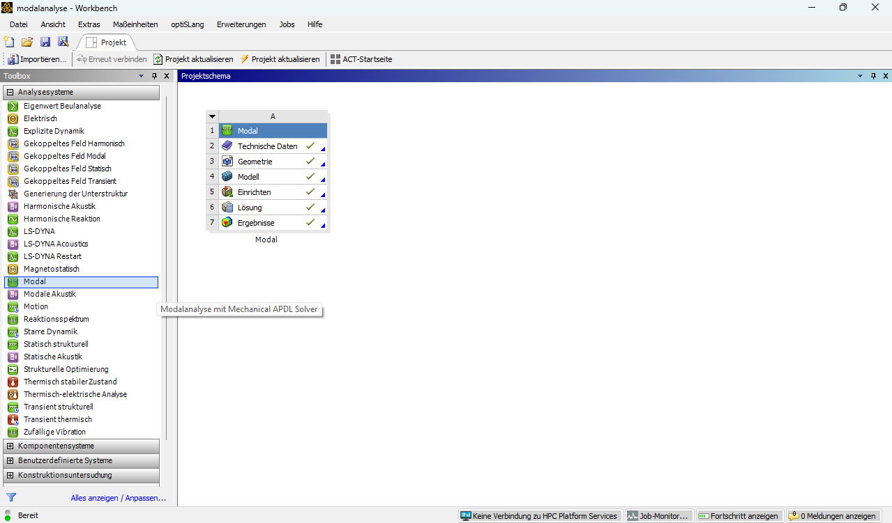

# Modul 06 – Modalanalyse

## Lernziele

In diesem Modul werden folgende Inhalte und Kompetenzen vermittelt:

* Bedeutung von Eigenfrequenzen und Eigenformen für Bauteile und Baugruppen
* Herleitung grundlegender Zusammenhänge aus einfachen Feder Masse Systemen
* Einfluss der Einspannung und der Massenverteilung auf das Eigenschwingungsverhalten
* Umsetzung einer Modalanalyse in ANSYS Mechanical
* Interpretation und Bewertung von Modenformen
* Übertragung auf komplexere Baugruppen mit starren und verformbaren Teilen

## Motivation und zentrale Fragestellungen

Schwingungen treten in technischen Systemen in vielfältiger Form auf. Bereits einfache Beobachtungen zeigen, dass Strukturen nicht beliebig schwingen, sondern charakteristische, systemabhängige Muster ausbilden. Diese Muster entstehen nicht zufällig, sondern entsprechen dem Eigenschwingverhalten des jeweiligen Systems.  

Die folgenden Filmsequenzen verdeutlichen typische Situationen, in denen sich dieses Eigenverhalten unmittelbar beobachten lässt. Die Beispiele reichen von alltäglichen Objekten bis hin zu technischen Bearbeitungsprozessen und dienen als Ausgangspunkt für die Analyse der zugrunde liegenden Mechanismen.

### Schwingung einer Straßenlaterne

<!-- markdownlint-disable MD033 -->
<video controls width="700">
  <source src="../media/08_modalanalyse/lampe.mp4" type="video/mp4">
  Ihr Browser kann dieses Video nicht wiedergeben.
</video>
<!-- markdownlint-enable MD033 -->

??? question "Was lässt sich in dieser Filmsequenz erkennen?"

    * Die Lampe führt eine freie Schwingung aus.  
    * Die Bewegung konzentriert sich in einer charakteristischen Form, die einer Eigenform des Systems entspricht.  
    * Dass die Laterne in dieser Form schwingt, liegt daran, dass der Wind Anregungsanteile enthält, die die Eigenfrequenz des Systems treffen.

---

### Schwingung einer Tischplatte

<!-- markdownlint-disable MD033 -->
<video controls width="700">
  <source src="../media/08_modalanalyse/tisch.mp4" type="video/mp4">
  Ihr Browser kann dieses Video nicht wiedergeben.
</video>

??? question "Welche Phänomene treten hier auf?"

    * Die Tischplatte ist im Gestell offenbar sehr weich gelagert; bereits geringe Kräfte können zu einer Verdrehung des gesamten Aufbaus führen.  
    * Nach dem Loslassen führt die Platte eine freie Schwingung aus, was auf eine Kombination aus geringer Steifigkeit des Untergestells und relativ hoher Masse der Platte hinweist.  
    * Ein solcher Aufbau ist strukturdynamisch ungünstig: geringe Gestellsteifigkeit in Kombination mit großer Plattenmasse führt zu ausgeprägtem Eigenschwingverhalten.  

---

### Resonanz eines Brückensystems (Tacoma Narrows Bridge)

<!-- markdownlint-disable MD033 -->
<iframe  
    width="700"  
    height="394"  
    src="https://www.youtube-nocookie.com/embed/XggxeuFDaDU?cc_load_policy=0&cc_lang_pref=en&hl=en"  
    title="Tacoma Narrows Bridge Collapse"
    frameborder="0"  
    allow="accelerometer; autoplay; clipboard-write; encrypted-media; gyroscope; picture-in-picture"  
    allowfullscreen
    playsinline>
</iframe>
<!-- markdownlint-enable MD033 -->

??? question "Welche strukturdynamischen Effekte sind sichtbar?"

    * Die Brücke zeigt eine ausgeprägte Torsionsmode mit großer Auslenkung; die Eigenform dominiert das gesamte Systemverhalten deutlich.  
    * Die starke Zunahme der Schwingungsamplitude weist auf einen Resonanzzustand hin, der in eine **Resonanzkatastrophe** übergeht.  
    * Die aerodynamische Anregung entsteht durch Strömungsabriss und periodische Wirbelablösungen, die Anregungsanteile im Bereich einer Eigenfrequenz der Brücke erzeugen.  
    * Die Kopplung zwischen Strömung und Struktur führt zu einer selbsterregten Schwingung, sodass die Bewegung nicht durch äußere periodische Lasten, sondern durch das System selbst aufrechterhalten wird.  
    * Moderne Brücken werden aerodynamisch günstiger ausgeführt, um solche Effekte durch optimierte Profile, Versteifungen und geänderte Bauformen zu vermeiden.  
    * Weitere Informationen hier: [https://wsdot.wa.gov/TNBhistory/](https://wsdot.wa.gov/TNBhistory/)

---

### Vibrationen beim Fräsen

<!-- markdownlint-disable MD033 -->
<iframe  
    width="700"  
    height="394"  
    src="https://www.youtube-nocookie.com/embed/__yQcF4G7tM?start=37&end=105&cc_load_policy=0&cc_lang_pref=en&hl=en"  
    title="Machining vibration example"
    frameborder="0"  
    allow="accelerometer; autoplay; clipboard-write; encrypted-media; gyroscope; picture-in-picture"  
    allowfullscreen
    playsinline>
</iframe>
<!-- markdownlint-enable MD033 -->

??? question "Welche Hinweise auf Eigenfrequenzen liefert diese Bearbeitung?"

    * Das Werkzeug beginnt zu schwingen, sobald die Schnittbedingungen eine dynamisch instabile Konfiguration erzeugen. Diese liegt vor, wenn die Rückkopplung zwischen Werkzeugbewegung und Spanbildungsprozess Schwingungen verstärkt statt dämpft.  
    * Die entstehende Rattermarke ist ein direktes Abbild der Werkzeugschwingung und zeigt die dominierende Eigenform des Systems.  
    * Das Gesamtsystem Werkzeug–Spindel–Werkstück weist eine oder mehrere charakteristische Eigenfrequenzen auf, in deren Nähe das Schwingungsverhalten besonders ausgeprägt ist.  
    * Dynamische Instabilität entsteht, wenn die Prozessanregung Anteile im Bereich einer Eigenfrequenz enthält und die Systemdämpfung nicht ausreicht, um die Schwingung zu reduzieren.  
    * In der Filmsequenz ist eine aktive Schwingungsreduzierung sichtbar. Deren Wirkung zeigt sich darin, dass die Schwingungsamplitude zeitweise deutlich reduziert wird, da der Dämpfer dem System aktiv Energie entzieht und somit das Eigenschwingverhalten beeinflusst.  

---

### Schwingungen eines Maschinenunterbaus

<!-- markdownlint-disable MD033 -->
<video controls width="700">
  <source src="../media/08_modalanalyse/unterbau.mp4" type="video/mp4">
  Ihr Browser unterstützt das Abspielen von Videos nicht.
</video>
<!-- markdownlint-enable MD033 -->

??? question "Welche strukturdynamischen Aspekte treten hier hervor?"

    * Das Video zeigt eine Zusammenfassung zahlreicher Eigenformen eines Maschinenunterbaus, wie sie in einer FEM-Modalanalyse berechnet werden.  
    * Die dargestellten Moden decken einen breiten Frequenzbereich ab und verdeutlichen, dass technische Systeme viele charakteristische Eigenformen besitzen, die sich lokal oder global ausprägen können.  
    * Die sichtbaren Schwingungsmuster werden durch die Verteilung von Masse und Steifigkeit bestimmt.
    * Niedrigfrequente Eigenformen betreffen oft den gesamten Aufbau, während höherfrequente Moden lokal konzentrierte Verformungen aufweisen.  
    * Die Vielzahl möglicher Eigenformen erklärt, warum bereits geringe Anregungen – wie im vorherigen Video des Fräsprozesses – bestimmte Moden aktivieren und damit unerwünschte Schwingungen verursachen können.  

---

### Zwischenfazit

Die gezeigten Beispiele machen deutlich, dass technische Systeme nicht beliebig schwingen, sondern ausgeprägte Eigenformen besitzen, die in charakteristischen Frequenzbereichen auftreten.  

Diese Beobachtungen führen zu grundlegenden Fragestellungen:

* Welche Eigenschaften eines Systems bestimmen sein Schwingungsverhalten?  
* Warum treten Schwingungen nur in bestimmten Frequenzbereichen verstärkt auf?  
* Welche physikalischen Parameter steuern Lage und Form der Eigenmoden?  
* Wie prägen Eigenformen das Verhalten komplexer Bauteile und Baugruppen?
* Wie unterscheiden sich Einmassensysteme von kontinuierlichen Strukturen?  

Zur systematischen Analyse dieser Fragestellungen wird schrittweise vom einfachen dynamischen Modell zum komplexen technischen Bauteil übergegangen. Der Einstieg erfolgt über den Einmassenschwinger, bevor Balken, Platten, Wellen und Baugruppen untersucht werden.

---

## Theoretischer Hintergrund

### Grundbegriffe

Technische Schwingungen lassen sich durch wenige grundlegende Größen beschreiben.  

[{width=100px}](media/08_modalanalyse/Animated-mass-spring.gif "Feder Masse Animation"){.glightbox}
Bildquelle[@wikipedia2025]

* **Auslenkung**  
  Zeitabhängige Abweichung einer Größe (z. B. Lage) vom Gleichgewichtszustand.  

* **Periode** \(T\)  
  Zeitspanne, nach der sich ein periodischer Vorgang wiederholt.  

* **Frequenz** \(f\) und **Kreisfrequenz** \(\omega\)  
  \(f = \frac{1}{T}\)  
  \(\omega = 2 \pi f\)  

* **Amplitude** \(A\)  
  Maximale Auslenkung aus dem Gleichgewicht.  

Diese Größen bilden die Basis für die Beschreibung mechanischer Schwingungen.  

---

### Ungedämpfte Schwingung eines Einmassenschwingers

Ein großes Spektrum technischer Schwingungsprobleme lässt sich im Kern auf das lineare Feder–Masse–System zurückführen.

[{width=300px}](media/08_modalanalyse/feder_masse.png "Feder Masse System"){.glightbox}
Bildquelle[@Eichler2023]  

Die Auslenkung aus der Ruhelage wird durch \(y(t)\) beschrieben. Die rücktreibende Kraft ist proportional zur Auslenkung, jedoch entgegengesetzt gerichtet:

\[
F = -\,c\,y(t)
\]

Die Größe \(c\) ist die Federkonstante (Einheit: N/m bzw. N/mm).

#### Kräfteansatz und Bewegungsgleichung

Nach dem zweiten Newtonschen Gesetz führt die resultierende Kraft zu einer Beschleunigung:

\[
F = m\,\ddot{y}(t)
\]

Gleichsetzen beider Ausdrücke ergibt:

\[
m\,\ddot{y}(t) = -\,c\,y(t)
\]

oder in Standardform:

\[
\ddot{y}(t) + \frac{c}{m}\,y(t) = 0
\]

Hierbei handelt es sich um **lineare, homogene Differentialgleichung zweiter Ordnung** mit konstanten Koeffizienten.

---

#### Harmonischer Lösungsansatz

Eine Lösung der Form

\[
y(t) = \hat{y}\,\cos(\omega_0 t + \varphi_0)
\]

wird eingesetzt. Die Ableitungen lauten:

\[
\dot{y}(t) = -\,\hat{y}\,\omega_0 \sin(\omega_0 t + \varphi_0)
\]

\[
\ddot{y}(t) = -\,\hat{y}\,\omega_0^{2} \cos(\omega_0 t + \varphi_0)
\]

Einsetzen in die Bewegungsgleichung führt auf:

\[
-\,\hat{y}\,\omega_0^{2} \cos(\omega_0 t + \varphi_0) + \frac{c}{m}\,\hat{y}\,\cos(\omega_0 t + \varphi_0) = 0
\]

Daraus folgt die charakteristische Beziehung:

\[
\omega_0^{2} = \frac{c}{m}
\qquad\Longrightarrow\qquad
\omega_0 = \sqrt{\frac{c}{m}}
\]

Dies ist die **Eigenkreisfrequenz** des Systems.

---

#### Eigenfrequenz und Schwingungsdauer

Aus der Kreisfrequenz ergibt sich die Eigenfrequenz:

\[
f_0 = \frac{\omega_0}{2\pi}
\]

Die dazugehörige Periodendauer lautet:

\[
T_0 = \frac{1}{f_0} = \frac{2\pi}{\omega_0}
\]

Die Schwingung ist also eine **Systemeigenschaft**, bestimmt ausschließlich durch Masse und Federkonstante. Die Anfangsbedingungen beeinflussen lediglich Amplitude \(\hat{y}\) und Phase \(\varphi_0\).

#### Darstellung der Schwingung im Zeit- und Frequenzbereich

Die Eigenschaften der Lösung des Einmassenschwingers lassen sich anschaulich sowohl im Zeitbereich als auch im Frequenzbereich darstellen. Im Zeitbereich werden Auslenkung \(y(t)\), Amplitude \(\hat{y}\), Periodendauer \(T_0\) und Startphase \(\varphi_0\) sichtbar. Im Frequenzbereich zeigt sich idealisiert nur eine Frequenzkomponente bei der Eigenfrequenz \(f_0\) bzw. \(\omega_0\).  

**Zeitbereich:** Harmonische Schwingung mit markierten Kenngrößen  

[{width=500px}](media/08_modalanalyse/harmonische_schwingung_zeitbereich.svg "Harmonische Schwingung (Zeitbereich)"){.glightbox}
Bildquelle[@kitmath2025]

Diese Darstellung zeigt, wie Amplitude, Periodendauer und Startphase die Form der Zeitfunktion bestimmen.

**Frequenzbereich:** Darstellung der Eigenfrequenz

[{width=500px}](media/08_modalanalyse/harmonische_schwingung_frequenzbereich.svg "Harmonische Schwingung (Frequenzbereich)"){.glightbox}
Bildquelle[@physikbuch2025]

Das zugehörige Spektrum zeigt idealerweise nur eine einzige Frequenzkomponente bei der Eigenfrequenz.

---

### Gedämpfte Schwingung

Reale technische Systeme verlieren Schwingungsenergie durch Reibung, Luftwiderstand oder Materialdämpfung. Die Dämpfung wird durch eine Proportionalität zur Geschwindigkeit modelliert:  

\[
m \ddot{x} + k \dot{x} + D x = 0
\]

Es werden folgende Fälle unterschieden:  

* schwach gedämpfte Schwingung (periodisches Verhalten, langsames Abklingen)  
* kritische Dämpfung (Grenzfall, schnellster Abklingvorgang ohne Schwingung)  
* starke Dämpfung (keine periodische Bewegung)  

Die gedämpfte Eigenkreisfrequenz lautet:  

\[
\omega_\mathrm{d} = \sqrt{\omega_0^2 - \left(\frac{k}{2m}\right)^2}
\]

[{width=350px}](media/08_modalanalyse/gedaempfte_schwingung.png "Gedämpfte Schwingungen"){.glightbox}
Bildquelle[@Eichler2023]  

---

### Erzwungene Schwingung und Resonanz

Wirkt auf das System eine zeitabhängige äußere Kraft  

\[
F(t) = F_0 \sin(\omega t)
\]

so stellt sich ein stationärer Schwingungszustand ein. Die Amplitude der Antwortschwingung hängt von der Anregungsfrequenz \(\omega\) ab und zeigt ein Maximum, wenn \(\omega\) in der Nähe der Eigenkreisfrequenz \(\omega_0\) liegt. Dieses Verhalten wird als Resonanz bezeichnet.  

!!! danger "FIXME"
    Abbildung Betriebsbereich über-/unterkritisch hinzu

<!--
[{width=650px}](media/08_modalanalyse/resonanz.png "Resonanzkurve"){.glightbox}
Bildquelle[]  
-->

---

### Überlagerung und Schwebung

Ein technisches System kann mehrere Schwingungsanteile gleichzeitig enthalten. Sie Überlagerung zweier harmonischer Schwingungen mit leicht unterschiedlicher Frequenz führt zur Schwebung, einem alternierenden Verstärken und Abschwächen der Gesamtamplitude.  

Die Überlagerung zweier Schwingungen schreiben als:  

\[
x(t) = A_1 \sin(\omega_1 t) + A_2 \sin(\omega_2 t)
\]

Die Schwebungsfrequenz ergibt sich zu:  

\[
f_\mathrm{s} = \lvert f_1 - f_2 \rvert
\]

Dieses Konzept bildet somit den Übergang zur Vorstellung einer Vielzahl von Eigenformen in realen Strukturen.  

[{width=650px}](media/08_modalanalyse/ueberlagerung.svg "Überlagerung von Schwingungen"){.glightbox}
Bildquelle[@physikbuch2025].  

---

### Von der eindimensionalen Schwingung zur Modalanalyse

Eigenschwingungen treten nicht nur in eindimensionalen Systemen auf, sondern überall dort, wo Kontinua wie Luftsäulen, Saiten, Balken, Membranen oder Platten Schwingungen ausbilden. Diese Beispiele machen deutlich:

* reale Strukturen besitzen eine Vielzahl von Eigenfrequenzen  
* zu jeder Eigenfrequenz gehört eine charakteristische Eigenform  
* nur bestimmte Frequenzen sind mit der Geometrie und den Randbedingungen vereinbar und führen zu ausgeprägtem Schwingungsverhalten  

Diese Grundprinzipien lassen sich systematisch auf technische Strukturen übertragen. Die Finite Element Methode formuliert sie in Form des allgemeinen Eigenwertproblems. Für ein lineares System mit Massenmatrix \(M\) und Steifigkeitsmatrix \(K\) gilt:

\[
M \ddot{\varphi} + K \varphi = 0
\]

Mit dem harmonischen Lösungsansatz \(\varphi(t) = \Phi\,\mathrm{e}^{\mathrm{i}\omega t}\) erhält man das algebraische Eigenwertproblem:

\[
K \Phi = \omega^2 M \Phi
\]

Die Lösung liefert die Eigenfrequenzen \(\omega\) und die zugehörigen Eigenformen \(\Phi\). Sie beschreiben das grundlegende Schwingungsverhalten von Balken, Platten, Wellen sowie komplexen Baugruppen und bilden die Basis der Modalanalyse.

### Modellstufen

Die Modellierung des Schwingungsverhaltens erfolgt schrittweise von starren Körpern mit wenigen Freiheitsgraden über diskrete Masse-Feder-Systeme hin zu kontinuierlichen Strukturen wie Balken, Platten oder Wellen. Mit jeder Modellstufe steigt die Fähigkeit, reale Schwingungsformen abzubilden – von einfachen Bewegungen einzelner Körper bis zu verteilten Eigenformen technischer Strukturen.

!!! danger "FIXME"
    passende Abbildungen aus Dresig/Beitelschmidt ergänzen (Modellstufen: starrer Körper → Mehrmassensystem → Balken/Platte),  
    Abschnitt inhaltlich erweitern: kurze Erläuterung der Rolle von Freiheitsgraden, Übergang vom diskreten zum kontinuierlichen Modell, Bedeutung für spätere FE-Modalanalyse.

### Analytische Lösungen einfacher Strukturen

!!! danger "FIXME"
    Ergänzen einfacher Berechnung

---

## Generelles zur Umsetzung in ANSYS

### Projektoberfläche

In der Projektoberfläche ist die Analyseart *Modal* zu wählen. Für viele Aufgaben kann das System als Standalone-Modalanalyse verwendet werden. Für weiterführende Fragestellungen ist eine Kopplung mit einer *statisch-mechanischen Analyse* oder einer *harmonischen Analyse* sinnvoll, etwa zur Untersuchung von Lastfällen oder zur Frequenzantwortanalyse.  

[{width=650px}](media/08_modalanalyse/modal_projektoberflaeche.png "Projektoberfläche Modalanalyse"){.glightbox}

### Geometrie und Material

Die Geometrie wird wie gewohnt in das Projekt eingebunden.  

Auch bei der Modalanalyse ist die Wahl und korrekte Zuweisung der Materialien von zentraler Bedeutung, da die Eigenfrequenzen und Eigenformen direkt von der Massenverteilung abhängen (vgl. theoretische Herleitung). Bei Baugruppen müssen häufig mehrere Materialien berücksichtigt und den jeweiligen Komponenten korrekt zugewiesen werden. Die benötigten Materialkennwerte werden über die technischen Daten in das Projekt eingebunden.  

[{width=650px}](media/08_modalanalyse/modal_materialauswahl.png "Materialauswahl in der Modalanalyse"){.glightbox}

### Kontakt und Verbindungselemente

Bei Baugruppen spielen Kontakte und Verbindungselemente eine zentrale Rolle für das Schwingungsverhalten. Sie beeinflussen sowohl die effektive Steifigkeit als auch die Massenkopplung zwischen den einzelnen Komponenten und wirken sich damit direkt auf die berechneten Eigenfrequenzen und Eigenformen aus.

In der Modalanalyse werden Kontakte in der Regel **linearisiert**. Nichtlineare Effekte wie Reibung, Öffnen oder Gleiten werden dabei nicht berücksichtigt. Stattdessen beschreibt der Kontakt eine lineare Kopplung der beteiligten Bauteile, beispielsweise als *bonded*, *no separation* oder idealisierte Lagerung.

Für viele Fragestellungen ist diese Vereinfachung ausreichend, insbesondere wenn:

* kleine Schwingungsamplituden betrachtet werden,  
* sich der Kontakt im Betrieb nicht wesentlich ändert,  
* das Ziel in der Bestimmung globaler Eigenfrequenzen und Eigenformen liegt.  

Verbindungselemente wie Schrauben, Federn oder Lager können alternativ explizit modelliert oder durch idealisierte Elemente ersetzt werden. Die Wahl der Kontakt- und Verbindungstypen stellt dabei einen wichtigen Modellierungsentscheid dar und sollte stets im Kontext der realen Struktur und der Zielsetzung der Analyse erfolgen.

!!! warning "Automatische Kontakterkennung"
    ANSYS erkennt Kontakte in Baugruppen **automatisch**. Diese automatisch erzeugten Kontakte sollten jedoch **immer überprüft, angepasst und bei Bedarf gezielt überarbeitet** werden, da sie einen wesentlichen Einfluss auf die berechneten Eigenfrequenzen und Eigenformen haben.

### Randbedingungen

Randbedingungen haben einen wesentlichen Einfluss auf Eigenfrequenzen und Eigenformen.

* typische Lagerungsfälle: frei, einseitig fest, beidseitig fest, allseitig fest...
* zusätzliche Einspannungen erhöhen die effektive Steifigkeit und verschieben Eigenfrequenzen  
* Randbedingungen definieren in der Modalanalyse direkt das dynamische System  
* Änderungen der Randbedingungen führen daher zu deutlich veränderten Modenformen  

Bei Baugruppen werden Randbedingungen häufig über Kontakte, Lagerungen oder idealisierte Fixierungen abgebildet.

* auch hier erfolgt die Betrachtung linearisiert  
* es werden kleine Schwingungen um einen Referenzzustand betrachtet  

Die Wahl der Randbedingungen ist eine zentraler Modellierungsentscheidung und sollte möglichst an die reale Einbausituation angepasst werden.

### Netz

<!--
* Bedeutung des Netzes für Modalanalysen
* Lokale Verfeinerung an kritischen Geometrien
* Einfluss der Trägheitsverteilung
-->

### Lösereinstellungen

<!--
* Ziel: die ersten n Eigenfrequenzen
* Auswahl des Frequenzbereichs
* Skalierung der Modenformen
* Nutzung der Animation für Filmsequenzen
-->

## Aufgabenstellung

* [biegebalken.stp](media/08_modalanalyse/biegebalken.stp)
* [stahlplatte.stp](media/08_modalanalyse/stahlplatte.stp)
* [getriebewelle.stp](media/08_modalanalyse/getriebewelle.stp)
* [windrad.stp](media/08_modalanalyse/windrad.stp)

### 1. Balken

* Erste zehn Eigenformen vergleichen
* Einfluss der Einspannung
* Einfluss des Materials

### 2. Stahlplatte

* Erste fünf Moden
* Interpretation typischer Plattenmoden
* Vergleich der Moden bei freien und fixierten Kanten

### 3. Getriebewelle

* Einfluss der Einspannung. Wo und wie umgesetzt? Fix, externe, zylindrische Lagerung etc.  Fest-Loslagerung; rotationsfreiheitsgrad beeinflusst NUR die Starrkörpermoden.  
* Einfluss von Punktmassen --> beeinflusst Wellenende nicht
* Identifikation relevanter Moden für den Betrieb einer Maschine

### 4. Windenergieanlage

* Reduktion komplexer Baugruppen
* Einfluss der Materialwahl
* Strukturkritische Moden

## Diskussion der Ergebnisse

* Veränderungen der Moden durch Masseverteilung, Steifigkeit, Randbedingungen
* Interpretation typischer Modenformen
* Bedeutung für Betriebsdrehzahlen und Sicherheit
* Grenzen der Modalanalyse

## Weiterführendes

<!--
* Einführung in Betriebsschwingungsanalyse
* Experimentelle Modalanalyse
* Modellreduktion für große Baugruppen
* Mehrkörpermodell und Kopplung an FE Modelle
-->

## Quiz zur Selbstkontrolle

<!-- 
wie geht's weiter:
  - Modul 7 Thermo-Mechanik: 09_thermomechanik.md
  - Modul 8 Sensoren I (Beschl.): 10_sensor_beschl.md
  - Modul 9 Sensoren II (Druck): 11_sensor_druck.md
  - Modul 10 Kontakt: 12_kontakt.md
  - Modul 11 Ausblick: 13_ausblick.md

  | Modul | Titel | Kerninhalt |
| :----: | :---- | :---------- |
| **07** | **Thermo-mechanische Kopplung** | Temperaturfeld → thermische Dehnung → mechanische Spannung, Vergleich isotherm vs. thermisch belastet, Einfluss von Materialparametern (α, E), Beispiel: Platte mit Temperaturgradient. Alternativ Wärme aus Reibung (Bremse) |
| **8** | **Sensoren I – Beschleunigungssensor** | Simulation eines Masse-Feder-Systems, statisches Äquivalent einer Beschleunigung, Bestimmung der Durchbiegung und Eigenfrequenz, Funktionsnachweis als FEM-basiertes Messprinzip. |
| **9** | **Sensoren II – Drucksensor / Membran** | Modellierung einer dünnen Platte unter Flächenlast, Berechnung der Durchbiegung und Vergleichsspannung, Herleitung einer Sensorkennlinie (Druck → Verformung), Einfluss der Membrandicke. |
| **10** | **Kontakt & Baugruppen** | Grundlagen der Kontaktmodellierung (bonded, frictionless, frictional), Reibungseinfluss auf Spannungsverteilung, Anwendung an Flansch- oder Bolzenverbindungen, Netz- und Konvergenzaspekte. |
| **11 (optional)** | **Moderne FEM / Ausblick** | Neue Entwicklungen: additive und generative Strukturen, vereinfachte Reduced-Order-Modelle, KI-gestützte Approximation physikalischer Modelle, Konzept des Digital Twin. |
-->

[{width=600px}](media/under_construction.png "Under Construction"){.glightbox}
