# Peer Teaching: A1 Symmetry and Model Reduction

## Goal  

- Many engineering models contain repeated or mirrored geometry.
- Using symmetry reduces model size → faster solve times, less memory, but same accuracy.
- ANSYS Workbench supports symmetry in geometry, meshing, loads, and boundary conditions.

## Why Use Symmetry?  

- Reduces model size by 50–90%.
- Allows finer meshing (higher accuracy) at same computational cost.
- Simplifies model setup when geometry and loading are symmetric.
- Useful for stress analysis, modal analysis, thermal problem

## Conditions for Axisymmetric Modeling

- Geometry revolves around a central axis.
- Load is uniformly distributed along the circumference (e.g., internal pressure).
- Boundary conditions are rotationally uniform.
- Not suitable when:
- Loads vary with angle (e.g., point load).
- Geometry has protrusions or cutouts not repeated around the full 360°

## Creating an Axisymmetric Model (Workflow Overview)

Geometry:

- Create or import a 2D sketch
- Define the axis of symmetry  
- Assign material
- Set body to Axisymmetric
- Apply loads/boundary conditions
- Mesh (2D mesh)
- Solve and interpret results

## Theoretical Background

Using symmetry in numerical analysis allows reduction of the geometric model, the degrees of freedom, and thus the computation time. A model reduction is valid only if geometry, loads, boundary conditions, and material properties all exhibit appropriate symmetry. Only then a reduced part model is fully equivalent to the full model.

### Symmetry Conditions

To use symmetry, **four conditions** must be satisfied simultaneously:

1. **Geometric symmetry** — the part can be divided by one or more planes or axes into identical sub-parts (e.g. half, quarter, eighth, axial or cyclic symmetry).  
2. **Material symmetry** — material behavior must be identical in all symmetric sub-parts; isotropic materials automatically satisfy this.  
3. **Load symmetry** — loads must act consistently across all symmetric sub-parts. A surface pressure typically satisfies this automatically; a single force must be correctly partitioned among the sub-parts.  
4. **Boundary condition symmetry** — boundary conditions must be equivalent on all symmetric sub-parts; asymmetric support or constraints in different sub-parts invalidate symmetry.  

If all conditions are met, one may compute a suitable sub-part instead of the full model. On the symmetry planes, the displacement normal to the plane is suppressed; tangential motion remains permitted. This yields large reduction in degrees of freedom and computation time, without losing accuracy of results.

### Typical Symmetry Types

- **Planar symmetry** (mirror symmetry about a plane — e.g. XY, XZ, YZ)  
- **Axial (rotational) symmetry** — e.g. for cylinders, vessels, discs, flanges  
- **Cyclic symmetry** — identical repeating segments around an axis, e.g. flanges with bolt-hole circles, turbine or gear disks  

## Symmetry and Load Scaling

 A reduced model is valid only if geometry, material, loads and boundary conditions are all symmetric, i.e.

$$
\mathcal{G},\,\mathcal{M},\,\mathcal{L},\,\mathcal{B} \quad \text{invariant under the symmetry group } G.
$$
Here  
𝐺
G = geometry,  
𝑀
M = material,  
𝐿
L = loads,  
𝐵
B = boundary conditions,  
𝐺
G = symmetry group (e.g. reflections, rotations).

## Pressure vs. force in sub-models

The idea is right, but you can write it more cleanly and explicitly for symmetric fractions.

### Pressure vs. Force in Sub-Models

Pressure \(p\) (surface load) stays the **same** in the reduced model:

$$
p_\text{sub} = p_\text{full}.
$$

A concentrated or resultant **force** must be scaled with the modeled fraction of the structure.

Let

- $F_{\mathrm{full}}$ = total force on the full 3D model,  
- $F_{\mathrm{sub}}$ = force to be applied on the sub-model,  
- $f$ = fraction of the full model represented by the sub-model  
  (by area, volume, or angle).

Then
$$
F_\text{sub} = f \, F_\text{full}, \qquad
f = \frac{\text{area/volume of sub-model}}{\text{area/volume of full model}}.
$$

For **cyclic symmetry** with \(N\) identical sectors (each with angle \(\theta = \frac{2\pi}{N}\)):
$$
f = \frac{1}{N} = \frac{\theta}{2\pi}, \qquad
F_\text{sub} = \frac{F_\text{full}}{N}.
$$

## Axisymmetric 2D → 3D volume relation

Right now on the page, the formula is oversimplified. The mathematically correct general formula is an integral over the 2D area:

## Axisymmetric 2D-to-3D Volume Relation

For an axisymmetric body obtained by rotating a 2D area \(A\) around the \(z\)-axis, the 3D volume is

$$
V = \int_A 2\pi r \,\mathrm{d}A,
$$

where \(r\) is the radial coordinate of each point in the area.

If the area \(A\) lies approximately at a constant radius \(r_m\) (e.g. a thin ring), this simplifies to

$$
V \approx 2\pi r_m A.
$$
.  

---

## Axisymmetric 2D-to-3D Volume Relation

In ANSYS, the 2D cross-section is treated as a 3D body rotated 360°:

V=A⋅2πr

This formula is how ANSYS converts the 2D area into a full 3D model.
This formula converts a 2D area (A) into a 3D volume (V) by rotating it around a central axis at a radius (r).

V=A×(circumference of the rotation)

Since the circumference of a full circle is:

the total volume created by sweeping the 2D area around the axis is:

$$
v =A.2πr
$$

## Why ANSYS uses this formula

- When you create an axisymmetric model in ANSYS Workbench:
- You only draw a 2D cross-section of the part.
- ANSYS assumes this cross-section is rotated 360° around the symmetry axis.
- To compute real 3D stiffness, loads, and mass, ANSYS needs to know what 3D volume that 2D area represents.
- So ANSYS multiplies the 2D area (A) by the circular path length (2πr) to produce the correct 3D volume.

## Simple Example

Imagine drawing a small rectangle in 2D representing the wall of a pipe.

If this rectangle has area  

$$
A = 10 \, \text{mm}^2
$$

and it is located at a radius of
$$
r = 50\, \text{mm}
$$

then the 3D volume generated by rotating it around the center is:
$$
V = 10 \cdot 2\pi(50)
$$

$$
V = 3141.6 \, \text{mm}^3
$$

This is the actual volume of the pipe wall in 3D.

### Pressure vs. Force in Sub-Models

- **Pressure** (surface load) remains unchanged in sub-models — because pressure is defined per unit area.  
- **Force** (integrated load) must be scaled proportional to the fraction of volume / surface being modeled:  

$$F_r = \alpha F, \qquad \alpha = \frac{\text{volume (or area) of sub-model}}{\text{volume (or area) of full model}}$$

 ---

## Axisymmetric 2D-to-3D Volume Relation

In ANSYS, the 2D cross-section is treated as a 3D body rotated 360°:

V=A⋅2πr

This formula is how ANSYS converts the 2D area into a full 3D model.
This formula converts a 2D area (A) into a 3D volume (V) by rotating it around a central axis at a radius (r).

V=A×(circumference of the rotation)

Since the circumference of a full circle is:

the total volume created by sweeping the 2D area around the axis is:

$$
v =A.2πr
$$

## Why ANSYS uses this formula

- When you create an axisymmetric model in ANSYS Workbench:
- You only draw a 2D cross-section of the part.
- ANSYS assumes this cross-section is rotated 360° around the symmetry axis.
- To compute real 3D stiffness, loads, and mass, ANSYS needs to know what 3D volume that 2D area represents.
- So ANSYS multiplies the 2D area (A) by the circular path length (2πr) to produce the correct 3D volume.

## Simple Example

Imagine drawing a small rectangle in 2D representing the wall of a pipe.

If this rectangle has area  

$$
A = 10 \, \text{mm}^2
$$

and it is located at a radius of

$$
r = 50\, \text{mm}
$$

then the 3D volume generated by rotating it around the center is:
$$
V = 10 \cdot 2\pi(50)
$$

$$
V = 3141.6 \, \text{mm}^3
$$

This is the actual volume of the pipe wall in 3D.

---

## Task — Flange Example

A stepped cylindrical flange is subjected to a uniform pressure applied to the top face of the smaller cylinder. The component is supported at the bottom by a frictionless support. Because the geometry and loading are symmetric about the central axis, exploit axisymmetry to reduce computation time.

**Load cases:**  

- Case A: Internal pressure of 200 bar  
- Case B: Tensile force of 100 kN applied to the flange end faces  

Use the provided geometry of the flange and its reduced variants (symmetry, Model Reduction 1, Model Reduction 2, Model Reduction 3, Model Reduction 4 ).  

**Geometry variants (files):**  

- `Model symmetry`[text](media/peer-teaching_A1/Symmentry.stp)
- `Model Reduction 1`[text](media/peer-teaching_A1/Model Reduction 1.stp)
- `Model Reduction 2`[text](media/peer-teaching_A1/Model Reduction 2.stp)
- `Model Reduction 3`[text](media/peer-teaching_A1/Model Reduction 3.stp)
- `Model Reduction 4`[text](media/peer-teaching_A1/Model Reduction 4.stp)

**Material:** “Symmentry.stp”  

- Young’s modulus E = 70000 MPa  
- Poisson’s ratio ν = 0.33  

---

## Implementation in ANSYS

1. **Project management & geometry import:** — use provided geometries.  

2. **Material assignment:** — define material “Axisymmetry” with given properties.  
 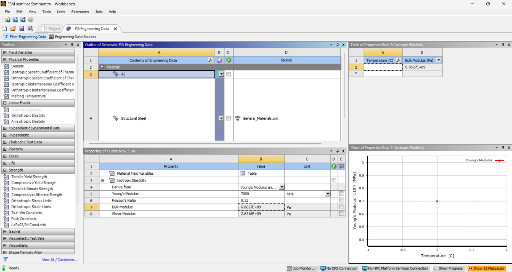
3. **Material Properties**  
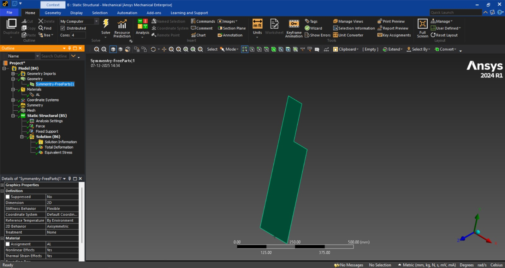
4. **Create Symmetry:**  
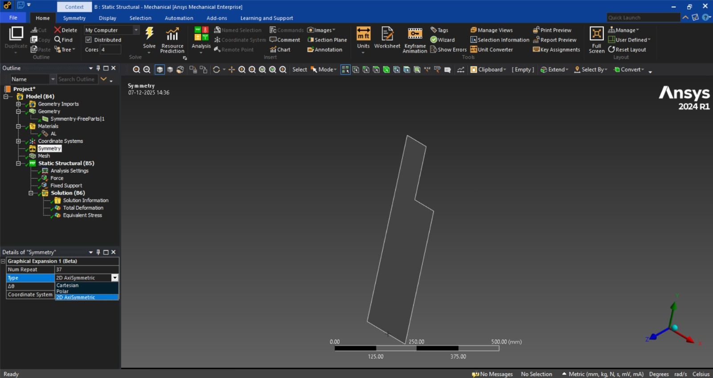

5. **Mesh generation:** — perform mesh-independence study; compare full and reduced models with same mesh characteristics.  

6. **Boundary conditions:**  
   For symmetry: apply frictionless supports on symmetry planes.
7. **Load application:** apply either Pressure and Frictionless Support

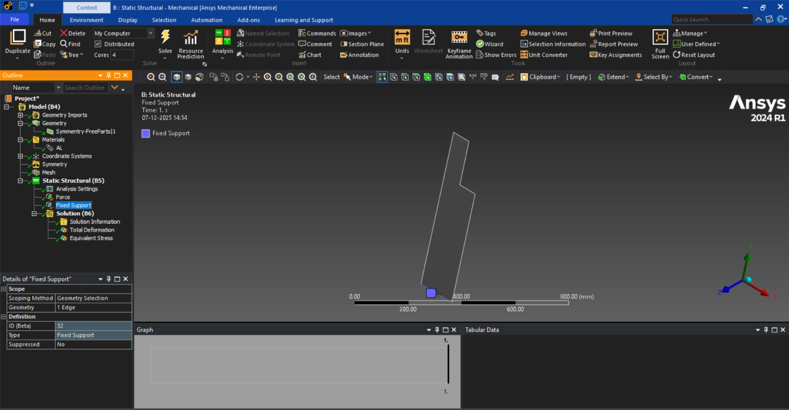
8. **Symmetry angle:** Change the degree of the symmetry to modify the symmetry angle.
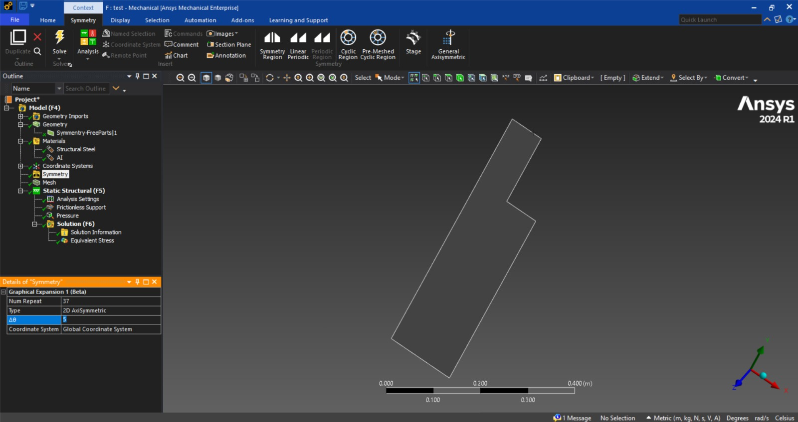
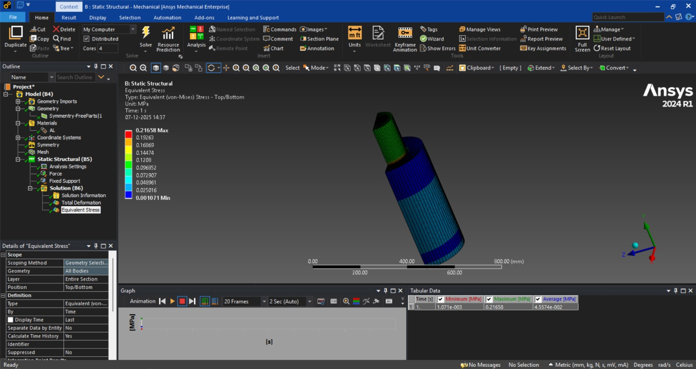
9. **Solver settings:** use default; ensure comparability between different model variants.  
 Again Change the degree of the symmetry to modify the symmetry angle

## Model Reduction in ANSYS Workbench

### 1. Introduction to Model Reduction

Model reduction is a powerful simulation technique used to simplify large and complex finite element models while preserving their essential physical behavior.

In **:contentReference[oaicite:0]{index=0}**, model reduction is mainly used for:

- Structural dynamics
- Modal analysis
- System-level simulation
- Digital twins and real-time simulation

The output of model reduction is called a **Reduced Order Model (ROM)**.

---

## 2. Why Model Reduction is Important

Modern engineering simulations often contain:

- Millions of degrees of freedom (DOF)
- Long computation times
- High memory and hardware demands

### Benefits of model reduction

- Reduces simulation time by **90–99%**
- Enables **real-time simulation**
- Supports **faster design optimization**
- Enables simulations for **control systems and digital twins**

---

## 3. Areas Where Model Reduction Is Used in ANSYS

Model reduction is commonly applied in:

- Modal Analysis
- Harmonic Response Analysis
- Transient Structural Analysis
- System Coupling
- Twin Builder
- Design Optimization

---

## 4. Mathematical Principle of Model Reduction

The full structural dynamic equation of motion with \(n\) degrees of freedom is

$$
\mathbf{M} \,\ddot{\mathbf{x}}(t) +
\mathbf{C} \,\dot{\mathbf{x}}(t) +
\mathbf{K} \,\mathbf{x}(t)
=
\mathbf{f}(t),
$$

where
where  

- $\mathbf{M} \in \mathbb{R}^{n \times n}$ – mass matrix  
- $\mathbf{C} \in \mathbb{R}^{n \times n}$ – damping matrix  
- $\mathbf{K} \in \mathbb{R}^{n \times n}$ – stiffness matrix  
- $\mathbf{x}(t) \in \mathbb{R}^{n}$ – displacement vector  
- $\mathbf{f}(t) \in \mathbb{R}^{n}$ – external force vector  

## Now introduce the reduction

### Coordinate transformation and reduced system

Model reduction introduces a low-dimensional coordinate vector
$\mathbf{q}(t) \in \mathbb{R}^{r}$ with $r \ll n$ and a
transformation matrix $\mathbf{T} \in \mathbb{R}^{n \times r}$ such that

$$
\mathbf{x}(t) \approx \mathbf{T}\,\mathbf{q}(t).
$$

Inserting this into the full equation and applying a Galerkin projection yields the
**reduced-order model**:

$$
\mathbf{M}_r \,\ddot{\mathbf{q}}(t) +
\mathbf{C}_r \,\dot{\mathbf{q}}(t) +
\mathbf{K}_r \,\mathbf{q}(t)
=
\mathbf{f}_r(t),
$$

with

$$
\mathbf{M}_r = \mathbf{T}^\mathsf{T} \mathbf{M} \mathbf{T}, \qquad
\mathbf{C}_r = \mathbf{T}^\mathsf{T} \mathbf{C} \mathbf{T}, \qquad
\mathbf{K}_r = \mathbf{T}^\mathsf{T} \mathbf{K} \mathbf{T}, \qquad
\mathbf{f}_r = \mathbf{T}^\mathsf{T} \mathbf{f}.
$$

Here  

- $(r)$ is the **reduced order** of the system (number of generalized coordinates),  
- $(\mathbf{M}_r, \mathbf{C}_r, \mathbf{K}_r \in \mathbb{R}^{r \times r})$ are the reduced matrices,  
- $(\mathbf{f}_r(t) \in \mathbb{R}^{r})$ is the reduced load vector.  

The reduced system preserves the essential dynamic behavior of the original system
while drastically reducing computational cost.

---

## 4. Mathematical Principle of Model Reduction

The full structural dynamic equation is:

$$
M\ddot{x} + C\dot{x} + Kx = F
$$
Where:

- `M` = Mass matrix  
- `C` = Damping matrix  
- `K` = Stiffness matrix  
- `x` = Displacement vector  
- `F` = Applied force vector  

After reduction, it becomes:  

$$Mrq̈ + Crq̇ + Krq = Fr$$

Where:

- `q` = Reduced system coordinates  
- `r` = Reduced system order  

This drastically lowers computational cost while maintaining accuracy.

## Idea Behind Reduction

The full finite element dynamic system contains a very large number of degrees of freedom. Solving such a system directly is computationally expensive and often unnecessary if only the dominant dynamic behavior is of interest.

The main idea of **model reduction** is to approximate the full displacement vector using only a small number of important deformation patterns:

$$\mathbf{x}(t) \approx \mathbf{T} \mathbf{q}(t)$$

Here, the motion of the full system is represented in a **low-dimensional subspace**, which drastically reduces the computational cost while preserving the essential physical behavior.

---

## Reduced Mass Matrix

$$
\mathbf{M}_r = \mathbf{T}^\top \mathbf{M} \mathbf{T}
$$

### Physical meaning

- **M** describes how mass resists acceleration in every DOF  
- **T** selects only the important motion directions  
- **Mᵣ** tells us how inertia behaves in the reduced coordinates  

✅ *It is the mass seen by the reduced system*

---

## Reduced Damping Matrix

$$
\mathbf{C}_r = \mathbf{T}^\top \mathbf{C} \mathbf{T}
$$

### Physical meaning

- Energy dissipation of the full system  
- Compressed into the reduced space  
- Keeps **realistic decay of vibrations**

---

## Reduced Stiffness Matrix

$$
\mathbf{K}_r = \mathbf{T}^\top \mathbf{K} \mathbf{T}
$$

### Physical meaning

- Elastic resistance of the structure  
- Now expressed only with respect to the selected modes  
- Controls **natural frequencies and deformation behavior**

## Reduced Force Vector

$$
\mathbf{f}_r = \mathbf{T}^\top \mathbf{f}
$$

### Physical meaning

- Real applied forces live in full space  
- We convert them into equivalent forces acting on the reduced coordinates  

✅ This ensures:  
> Reduced model feels the same physical loading as the real structure.

---

## 5. Final Reduced Dynamic Equation

After reduction, we get:

$$
\mathbf{M}_r \ddot{\mathbf{q}}(t) + \mathbf{C}_r \dot{\mathbf{q}}(t) + \mathbf{K}_r \mathbf{q}(t) = \mathbf{f}_r(t)
$$

### This equation is

- Structurally identical to the full system  
- But solved in a **much smaller space**

---

## Coordinate Transformation

The transformation introduces:

- A **reduced coordinate vector**  
  $$
  \mathbf{q}(t) \in \mathbb{R}^{r}
  $$

- A **transformation matrix**  
  $$
  \mathbf{T} \in \mathbb{R}^{n \times r}
  $$

with

$$r \ll n$$

The transformation matrix $\mathbf{T}$ contains the **dominant deformation modes** (for example, vibration modes or basis vectors).

Using this transformation, the full displacement vector is approximated as:

$$\mathbf{x}(t) \approx \mathbf{T} \mathbf{q}(t)$$

This means that instead of solving for all physical degrees of freedom, only a small number of generalized coordinates need to be computed.

---

## sReduced System via Projection

By inserting the transformation

$$\mathbf{x}(t) = \mathbf{T} \mathbf{q}(t)$$

into the full dynamic equation and applying a **Galerkin projection**, the reduced-order dynamic system is obtained:

$$\mathbf{M}_r \, \ddot{\mathbf{q}}(t)
+
\mathbf{C}_r \, \dot{\mathbf{q}}(t)
+
\mathbf{K}_r \, \mathbf{q}(t)
=
\mathbf{f}_r(t)$$

This reduced system has the same mathematical structure as the original system, but with significantly fewer degrees of freedom.

---

## Reduced Matrices Formula

The reduced matrices and force vector are obtained by projecting the full matrices into the reduced subspace:

$$
\begin{aligned}
\mathbf{M}_r &= \mathbf{T}^{\mathsf{T}} \mathbf{M} \mathbf{T}, \\
\mathbf{C}_r &= \mathbf{T}^{\mathsf{T}} \mathbf{C} \mathbf{T}, \\
\mathbf{K}_r &= \mathbf{T}^{\mathsf{T}} \mathbf{K} \mathbf{T}, \\
\mathbf{f}_r &= \mathbf{T}^{\mathsf{T}} \mathbf{f}.
\end{aligned}
$$

This projection ensures that:

- The **mass**, **damping**, and **stiffness** properties are preserved in the reduced space.
- The **external forces** are correctly transferred to the reduced system.
- The essential dynamic behavior of the original system is retained.

---

## Dimensions of the Full and Reduced Systems

### Full System Dimensions

- Displacement vector:  
  $$
  \mathbf{x}(t) \in \mathbb{R}^{n}
  $$

- System matrices:  
  $$
  \mathbf{M}, \mathbf{C}, \mathbf{K} \in \mathbb{R}^{n \times n}
  $$

- Force vector:  
  $$
  \mathbf{f}(t) \in \mathbb{R}^{n}
  $$

Here, $n$ is the **total number of degrees of freedom** of the full model.

---

### Reduced System Dimensions

- Reduced coordinate vector:  
  $$
  \mathbf{q}(t) \in \mathbb{R}^{r}
  $$

- Reduced system matrices:  
  $$
  \mathbf{M}_r, \mathbf{C}_r, \mathbf{K}_r \in \mathbb{R}^{r \times r}
  $$

- Reduced force vector:  
  $$
  \mathbf{f}_r(t) \in \mathbb{R}^{r}
  $$

Here, $r$ is the **reduced order** of the system, with:

$$
r \ll n
$$

---

## Transformation Matrix Size

The transformation matrix has the dimension:

$$
\mathbf{T} \in \mathbb{R}^{n \times r}
$$

It maps:

- Reduced coordinates $\mathbf{q}(t)$  
  → into  
- Full physical displacements $\mathbf{x}(t)$

Each column of $\mathbf{T}$ represents one **basis mode** of the reduced system.

---

## 5. Model Reduction Techniques in ANSYS

### 5.1 Modal Reduction

- Uses dominant vibration modes
- Best for structural vibration and fatigue analysis
- Most widely used method

### 5.2 Krylov-Based Reduction

- Used in dynamic and electronic systems
- Preserves frequency response over a wide range

### 5.3 Proper Orthogonal Decomposition (POD)

- Data-driven method
- Used in thermal and fluid simulations
- Extracts dominant flow or thermal patterns

---

## 6. Workflow of Model Reduction in ANSYS Workbench

1. Create full geometry
2. Generate mesh
3. Perform full-order simulation
4. Extract dominant modes or system matrices
5. Generate reduced order model (ROM)
6. Validate ROM accuracy
7. Use ROM for fast simulations or optimization

---

## 7. Engineering Applications of Model Reduction

- **Automotive:** Engine mounts, suspension systems
- **Aerospace:** Wing flutter, vibration response
- **Robotics:** Motion control and real-time simulation
- **Civil Engineering:** Earthquake response of buildings
- **Electronics:** Thermal management of chips
- **Digital Twins:** Live health monitoring of machines

---

## 8. Advantages of Model Reduction

- ✅ Extremely fast simulation time  
- ✅ Reduced hardware requirements  
- ✅ Real-time simulation capability  
- ✅ Faster design optimization  
- ✅ Efficient multi-physics coupling  

---

## 9. Limitations of Model Reduction

- ⚠ Accuracy limited to trained conditions  
- ⚠ Not ideal for highly nonlinear behavior  
- ⚠ Initial full model is required  
- ⚠ Re-training needed for new operating conditions  

---

## Model Reduction 1 (force = 2000 N)

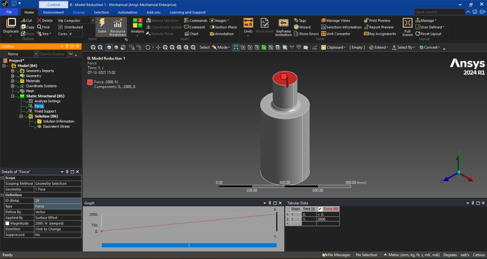

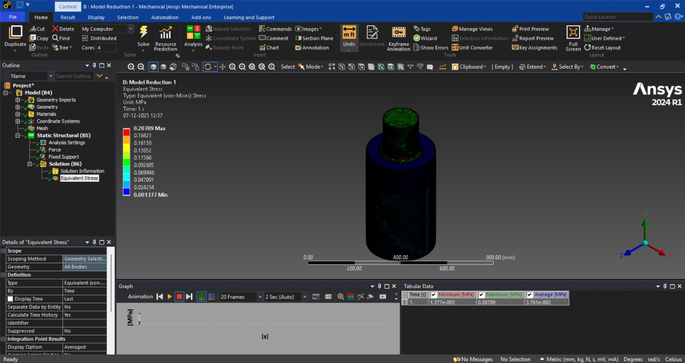

## Model Reduction 2 (force = 1000 N)

## Model Reduction 3 (force = 500 N)

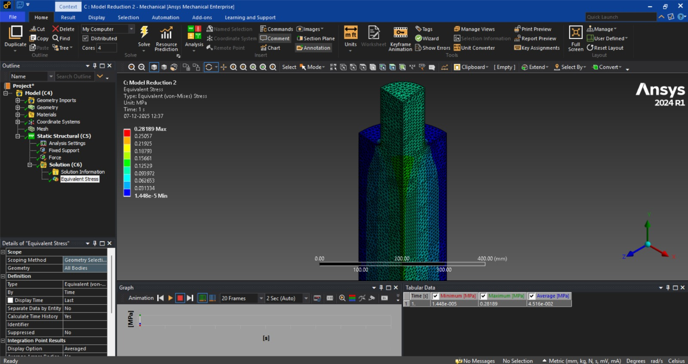

## Model Reduction 4 (force = 250 N)

### Results — Stress, Deformation, and Computation Time

| Model Variant   | Max Stress  |
|-----------------|--------------|
| Model Reduction 1      | 0.20707      |
| Model Reduction 2    | 0.28189      |
| Model Reduction 3 | 0.29276       |
| Model Reduction 4  | 0.29448     |

The reduction has only minimal influence on stress.

---

## Cyclic symmetry (NOT SOLVED?)

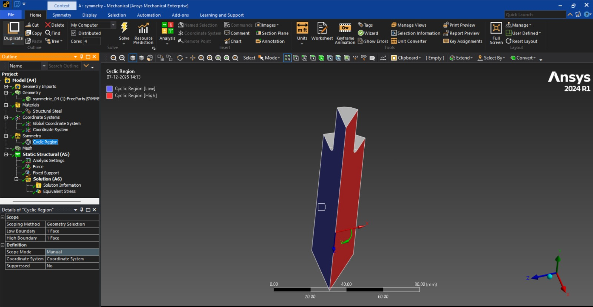
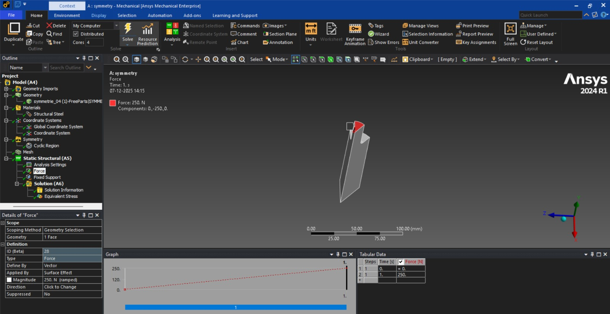

---

## References

1) Computational Methods for Fluid Dynamics, J. H. Ferziger and M. Perić, Springer, 3rd Edition — Fundamentals of model reduction and numerical symmetry handling.

2) Model Reduction and Approximation, P. Benner, A. Cohen, M. Ohlberger, and K. Willcox, Springer, 2017 — Standard reference for Reduced Order Modeling (ROM).

3) Symmetry Methods for Differential Equations, P. E. Hydon, Cambridge University Press — Foundational theory of symmetry in engineering systems.

4) Mechanical Systems and Signal Processing — Applications of modal reduction in vibration systems.

5) International Journal for Numerical Methods in Engineering — Symmetry-based FE model reduction techniques.

6) Finite Element Model Reduction Techniques, M. Friswell, J. Mottershead — Guyan, Craig-Bampton, and symmetry-based reduction.

7) SAE International Technical Papers — Symmetry and ROM in automotive vibration models.
