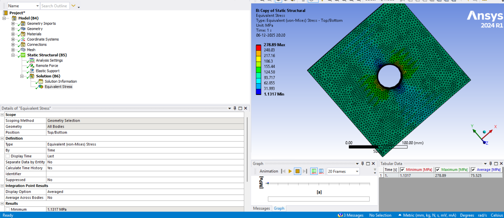

# Peer Teaching: A2 Mesh Quality & Load Application

## 1. Learning Objectives

After completing this study, students will be able to:

- Evaluate and interpret 3D mesh quality metrics such as Jacobian Ratio, Skewness, Orthogonal Quality, and Aspect Ratio.
- Identify how poor mesh quality affects stress accuracy in curved, stress-concentrated regions.
- Apply multiple mesh refinement tools in ANSYS to improve element quality.
- Understand and compare different load application methods in 3D (pressure, remote force/displacement, pressure patches, body forces).
- Interpret how mesh quality and load introduction influence equivalent (von Mises) stress distribution.

---

## 2. Task: 3D Plate With a Circular Hole Under Uniaxial Tension

In this task, the application of a tensile load on a 3D plate with a central hole is analysed.

### Given Data

- Plate width: **200 mm**
- Plate height: **200 mm**
- Plate thickness: **5 mm**
- Hole diameter: **40 mm**  
  → radius **r = 20 mm**
- Applied far-field tensile stress: **σ₀ = 100 MPa**
- Material: **Structural Steel**  
  - Young’s Modulus: **E = 200 GPa**  
  - Poisson ratio: **ν = 0.30**

Required pulling force:

$$F = \sigma_0 \cdot (200\ \text{mm}) \cdot (5\ \text{mm}) = 100{,}000\ \text{N}$$

### Geometry

Use this Geometry file for your analysis : [Geometry File (STEP)](media/peer-teaching/plate_with_hole.stp)

### Description of the Three Models

#### **Model 1 — Coarse Mesh (Baseline Model)**

A deliberately coarse 3D mesh is created using only a global element size.  
This model reveals:

- distorted elements around the hole,
- inaccurate stress concentration prediction.

It serves as the baseline for comparison.

#### **Model 2 — Refined Mesh (Targeted Mesh Improvement)**

Mesh refinement tools are applied around the hole and surrounding region:

- edge sizing,
- face sizing,
- patch conforming method.
- face meshing

This model produces:

- high-quality elements near the stress concentration zone,
- improved Jacobian ratio, skewness, and orthogonal quality,
- stress values close to the analytical solution.

#### **Model 3 — Load Application Study (Using Refined Mesh)**

Using the same refined mesh from Model 2, different load application methods are applied:

- full-face pressure,
- remote force,
- localized pressure patch,

This model illustrates how different load definitions influence the stress field, even when the mesh is good.

---

## 3. Analytical Solution – Equivalent Stress (von Mises)

The plate is subjected to a far-field uniaxial tensile **pressure**

$$
P = 100\ \text{MPa}
$$

Since pressure has units of stress (N/mm²), it already represents the applied far-field tensile stress.  
Thus, for the analytical solution we directly set:

$$
\sigma_0 = P
$$

For a plate with a central circular hole, the analytical stress concentration factor for an infinite plate is:

$$
K_t = 3.0
$$

The analytical SCF of 3.0 comes from Kirsch’s solution for an infinite plate.  
For a finite-width plate, empirical correction charts (Peterson, Pilkey) provide a reduced SCF based on the width-to-radius ratio.  

However, our finite plate geometry:

- Width = 200 mm  
- Height = 200 mm  
- Hole radius = 20 mm  
- Ratios: \( W/r = 10 \), \( H/r = 10 \)

leads to a reduced, finite-width corrected SCF:

$$
K_{t,\text{eff}} \approx 2.7\text{–}2.8
$$

The maximum tangential stress at the hole boundary is given by:

$$
\sigma_{\theta,\max} = K_{t,\text{eff}} \cdot \sigma_0
$$

Using the midpoint value \( K_{t,\text{eff}} = 2.75 \):

$$
\sigma_{\theta,\max} \approx 2.75 \cdot 100\ \text{MPa}
$$

Thus:

$$
\sigma_{\theta,\max} \approx 275\ \text{MPa}
$$

This analytical value is used to validate the FEM results.

---

## 4. Mesh Quality Metrics

In finite element analysis, the accuracy of the computed stress field depends not only on element size but also on element shape quality. Poorly shaped elements introduce numerical distortion, reduce stiffness accuracy, and lead to significant errors in regions with high stress gradients—such as the boundary of a circular hole. To avoid these issues, ANSYS provides several mesh quality metrics that quantify how well each element represents the underlying geometry.

Below, the most relevant metrics for 3D stress analysis are introduced together with recommended ranges and their influence on the final results.

---

### 4.1 Jacobian Ratio (Corner and Gauss Point Checks)

The Jacobian ratio measures deformation during the mapping of an ideal element to the actual element. ANSYS reports the minimum ratio across all integration points (Gauss points) or corner nodes.

- **Ideal:** 1.0  
- **Good:** > 0.8  
- **Acceptable:** > 0.6  
- **Poor:** < 0.6  
- **Critical:** < 0.4  

**Corner-based Jacobian check:** Detects distorted vertices.  
**Gauss-point Jacobian check:** More strict; detects distortion inside the element where stresses are evaluated.

**Influence on stress:**  
Jacobian ratio is **the most critical metric** near curved holes. Low values corrupt the stiffness matrix, producing unrealistic stress gradients and nonphysical spikes along the hole boundary.

---

### 4.2 Skewness

Skewness measures how much an element deviates from its ideal shape:

- For tetrahedra → equilateral  
- For hexahedra → orthogonal  

Values range from **0 (ideal)** to **1 (worst)**.

- **Good:** < 0.5  
- **Warning:** 0.5 – 0.9  
- **Poor:** > 0.9  

**Influence:**  
High skewness degrades the interpolation quality of shape functions. In the plate-with-hole example, skewed tetras around the hole produce jagged stress contours and reduce accuracy.

---

### 4.3 Orthogonal Quality

Evaluates how orthogonally the element’s faces and edges are arranged.

- **Ideal:** 1.0  
- **Acceptable:** > 0.2  
- **Poor:** < 0.15  

**Influence:**  
Low orthogonal quality appears when elements are forced into tight curvature or compressed transitions. It produces uneven element stiffness and noisy stresses near the hole boundary.

---

### 4.4 Aspect Ratio

Ratio of the longest element edge to its shortest edge.

- **Ideal:** ≈ 1  
- **Acceptable:** < 5  
- **Poor:** > 10  

**Influence:**  
Large aspect ratios create elements that are stiff in one direction and flexible in another. This often occurs when transitioning from fine mesh near the hole to coarse mesh away from it. Proper aspect ratio ensures smooth stress flow.

---

### 4.5 Element Quality (Composite Metric)

A combined metric calculated by ANSYS that represents overall element shape quality.

- **Ideal:** 1  
- **Acceptable:** > 0.7  
- **Unreliable:** < 0.5  

**Influence:**  
Useful as a quick indicator of mesh health, but individual metrics (Jacobian, skewness, orthogonal quality) are more diagnostic for curved geometry refinement.

### 4.6 Warping Angle

Warping angle measures how far quad or hex faces deviate from being planar. In solid tetrahedral meshes it matters less, but for mixed or swept meshes it is important.

- **Ideal:** 0°  
- **Good:** < 5°  
- **Acceptable:** < 10°  
- **Poor:** > 15°  

**Influence on stress:**  
Warped faces cause inconsistent strain interpolation across the element, leading to variations in reconstructed stresses. Effects are stronger in shells and thin regions but still relevant near curved surfaces.

---

### Summary of Recommended Quality Thresholds

| Metric | Excellent | Good | Acceptable | Poor | Very Poor |
|--------|-----------|------|------------|------|-----------|
| **Jacobian Ratio** | > 0.85 | 0.75–0.85 | 0.6–0.75 | 0.4–0.6 | < 0.4 |
| **Skewness** | < 0.25 | 0.25–0.40 | 0.40–0.70 | 0.70–0.90 | > 0.90 |
| **Orthogonal Quality** | > 0.40 | 0.25–0.40 | 0.15–0.25 | 0.10–0.15 | < 0.10 |
| **Aspect Ratio** | 1–2 | 2–3 | 3–5 | 5–10 | > 10 |
| **Element Quality (Composite)** | > 0.90 | 0.75–0.90 | 0.60–0.75 | 0.40–0.60 | < 0.40 |
| **Warping Angle** | < 2° | 2–5° | 5–10° | 10–15° | > 15° |

---

## 5. ANSYS Implementation

This section describes the numerical setup for **Model 1** (coarse mesh) and **Model 2** (refined mesh).  
Both models follow the same workflow structure used in the FEM course.

---

### **Model 1 — Coarse Mesh (Baseline)**  

*Model demonstrating intentionally poor mesh quality.*

---

#### 1. Geometry

The 3D geometry of the plate with a central hole is provided via the following link:

**Geometry File:**  

Use this Geometry file for both the Model 1 and 2 : [Geometry File (STEP)](media/peer-teaching/plate_with_hole.stp)

---

#### 2. Mesh

##### 2.1 Global Mesh

- Select **Mesh**
- Set a coarse global element size (e.g., **30 mm**)
- Turn **Advanced Size Function** → *Off*
- Turn **Capture Curvature** → *Off*
- Turn **Mesh Defeaturing** → *Off*
- Turn **Capture Proximity** → *Off*

##### 2.2 Evaluate Mesh Quality

The mesh produced in Model 1 is intentionally coarse.  
A visual inspection reveals several issues:

- The **hole boundary is poorly captured**, with only a few large elements representing the curved surface.  
- **Element shapes appear distorted**, especially around the cylindrical wall.  
- The **transition from large elements near the hole to even larger elements away from it is abrupt**, further reducing accuracy.

---

#### 3. Boundary Conditions

- Select the **bottom face**
- Apply **Fixed Support**

---

#### 4. Loads

- Select the **top face** (opposite to the face where fixed support is added)
- Apply **Pressure = 100 MPa**

---

#### 5. Solve

Insert:

- Equivalent Stress (von Mises)
- Right-click **Solution → Solve**

---

#### 6. Result Discussion

The results obtained from Model 1 clearly reflect the limitations of the coarse mesh:

- The **maximum stress near the hole deviates significantly from the analytical solution**, indicating that the coarse mesh is unable to correctly reproduce the expected stress concentration factor.
- The **stress distribution appears patchy and irregular**, showing that the elements are too large to resolve the steep stress gradient around the hole boundary.
- The **stress contours near the hole are not smooth**, exhibiting abrupt color changes instead of the continuous circular pattern predicted by theory.
- The **curvature of the hole is poorly represented**, leading to an inaccurate transfer of load around the hole.
- Overall, the model provides only a rough approximation and cannot be used for reliable evaluation of the stress concentration factor or deformation behavior.

This coarse-mesh model serves as a baseline to highlight how proper mesh refinement improves accuracy in Model 2.

---

### **Model 2 — Refined Mesh (Targeted Mesh Improvement)**  

*Model 2 uses the same geometry as Model 1. Only the mesh is refined, while all other model definitions remain unchanged including the boundary condition and the load.*

---

#### 1. Mesh

##### 1.1 Global Mesh Setup

Only Global Element Size to be changed for global element settings. All other settings are to be kept the same to best depict the influence of local mesh refinement strategies and various mesh refinement tools.

- Select **Mesh**
- Element Size → **10 mm**
- Keep all other settings the same

*Screenshot placeholder*

---

##### 1.2 Local Refinements

##### **A. Edge Sizing (Hole Edge)**

- Insert → *Sizing*
- Scope → Circular hole edge
- Number of divisions → **60**
- Behavior → *Soft*

##### **B. Face Sizing (Hole Inner Surface)**

- Insert → *Sizing*
- Scope → Cylindrical hole surface
- Element Size → **4 mm**

##### **C. Face Meshing**

1. Right-click *Mesh → Insert → Face Meshing*.  
2. Scope the **cylindrical surface of the hole**.  

##### **D. Inflation**

- Scope → Whole body
- Boundary → Cylindrical hole face

Generate the mesh after using all these mesh tools.

---

#### 1.4 Mesh Quality Evaluation

- Mesh → Quality → Mesh Matric  
- Inspect:
  - Jacobian Ratio (> 0.6 target)
  - Skewness (< 0.5 target)
  - Aspect Ratio (< 5 target)
  - Element Quality (> 0.7 target)

**

- Mesh metrics can also be viewed using Mesh Quality Worksheet to measure the quality of the mesh and find areas of low mesh quality.

---

### 2. Solution Items

Insert:

- Equivalent Stress  

---

### 3. Solve

- Right-click **Solution → Solve**

---

### 4. Results Discussion

Compared to Model 1, the refined mesh in Model 2 produces significantly improved and more reliable stress results. The enhancements introduced through different mesh tools directly influence the mesh quality in the regions of high stress gradients, leading to a solution that aligns much more closely with theoretical expectations.

Key observations include:

- **Accurate representation of the circular hole:**  
- **Smoother and more continuous stress contours:**  
- **Significant reduction in mesh distortion:**  
- **Improved proximity to the analytical stress concentration:**  
- **Better transition between fine and coarse regions:**  

Overall, Model 2 clearly shows how mesh refinement tools directly influence the results by improving Jacobian ratio, skewness and other mesh metrics. The refined mesh produces smooth, physically meaningful stress contours and yields a maximum stress value that is close to the analytical prediction. This demonstrates that checking mesh metrics and applying appropriate refinement strategies are essential steps in obtaining good FEM results.

---

### 6. Choosing the Right Mesh Tool for Your Geometry (General Guidelines)

| Mesh Tool | When to Use | Purpose / Advantage | Key Mesh Metrics Improved |
|-----------|-------------|---------------------|----------------------------|
| **Face Sizing** | Curved or critical faces (e.g., hole surface) | Local refinement on surfaces | Jacobian Ratio, Skewness |
| **Edge Sizing** | Circular edges, fillets, notches | Ensures sufficient node density along edges | Curvature representation, Aspect Ratio |
| **Face Meshing** | Need for structured 2D layout on a surface | Produces regular element pattern | Orthogonal Quality, Skewness |
| **Inflation Layers** | High stress gradients normal to surfaces | Creates boundary-layer elements | Orthogonal Quality, Warping Angle |
| **Body of Influence (BOI)** | Local refinement in a 3D region | Controls element size inside a volume | Aspect Ratio, Skewness (local) |
| **Hex Dominant Method** | Simple volumes needing mostly hexahedral elements | Improves accuracy with fewer elements | Skewness, Aspect Ratio |
| **Tetrahedrons (Patch Conforming)** | General automatic meshing | Captures complex geometry | Depends on curvature & refinement |
| **Tetrahedrons (Patch Independent)** | Geometry with many small features | Mesh ignores small edges to avoid distortion | Skewness (improved), Jacobian |
| **Sweep Method** | Extruded or revolved bodies | Produces high-quality hex elements | Orthogonal Quality, Element Quality |
| **Multizone Method** | Semi-structured hexahedral mesh in partitioned geometry | Gives hex mesh where sweep is not possible | Aspect Ratio, Jacobian |
| **Gasket Mesh** | Thin layers or interface regions (e.g., sealing layers) | Creates extremely fine, controlled thin-layer mesh | Warping Angle, Orthogonality |

---

### 7. Theory on Load Application and Boundary Conditions

In structural finite element analysis, the way external loads and supports are introduced has a direct influence on the deformation pattern and the resulting stress field. Even with a high-quality mesh, incorrect or overly restrictive boundary conditions can prevent the model from deforming naturally (e.g., suppressing Poisson expansion) and lead to non-physical stresses. Therefore, understanding different types of loads and supports is essential before comparing their effects in Model 3.

---

### 8.1 Load Types in Structural Mechanics

External actions can be introduced in ANSYS in several equivalent but conceptually different ways:

#### **1. Surface Loads (Tractions / Pressure)**

Applied over an area.  
Examples: uniform pressure, traction vector.  
Represents a physically distributed loading.

#### **2. Nodal / Remote Loads**

Forces applied at nodes or transmitted through rigid behavior.  
Examples: remote force, edge force.  
Useful for simulating loads applied through fixtures or connectors.

#### **3. Prescribed Displacements**

The boundary is moved by imposing displacement instead of force.  
Common in tensile testing machines (displacement-controlled loading).

Prescribed displacement produces a reaction force that should match the expected tensile force if BCs are correct.

---

## 8.2 Boundary Conditions

Boundary conditions define how the plate is supported and which rigid-body motions are suppressed.

### **1. Fixed Support**

Restrains all translations.  
Simple and stable, but can over-constrain Poisson expansion.

### **2. Frictionless Support**

Restrains only the displacement normal to the surface; tangential sliding is allowed.  
Useful when avoiding artificial in-plane constraints.

### **3. Remote Displacement / Remote Force**

Loads are transmitted through a virtual rigid surface.  
Ensures uniform deformation of the loaded edge or face.

### **4. Elastic Support**

Adds spring-like stiffness to a boundary.  
Models flexible mounting conditions.

---

## 8.3 Purpose of Load Application in Model 3

Model 3 investigates how different **valid** load/BC combinations influence the internal stress field of the plate under tension.  
Four representative cases are evaluated:

1. **Pressure + Fixed Bottom**  
2. **Remote Force + Fixed Support**  
3. **Pressure + Frictionless Support**  
4. **Remote Force + Elastic Support**
5. **Displacement Load + Remote Displacement Support**

This comparison shows how loads enter the structure, how supports affect deformation, and which combinations best replicate uniaxial tensile loading for the plate-with-hole problem.

---

## 9. Step-by-Step Implementation in ANSYS for Model 3  

### (Using Separate Static Structural Systems for Each Load Case)

Model 3 investigates how different valid load/support combinations influence the stress field of the refined plate model.  
To ensure a clean setup, **each load case is solved in its own Static Structural system**, all using the **same geometry and the same refined mesh** from Model 2.

Before applying loads, we first prepare the Workbench environment.

---

### 9.1 Preparing the Load Case Systems (Workbench Setup)

1. In Workbench, **right-click the Static Structural system from Model 2** →  
   **Duplicate** (Create Copy)  
   This produces a new Static Structural system with:
   - the **same geometry**,  
   - the **same mesh settings**,  
   - no loads/supports interfering with other systems.

2. Rename each duplicated system for clarity:
   - *Model 3A – Remote Force + Fixed Support*  
   - *Model 3B – Pressure + Frictionless Support*  
   - *Model 3C – Remote Force + Elastic Support*
   - *Model 3D - Displacement Load + Remote Displacement Support*

3. For each system:
   - Open Mechanical  
   - **Delete any loads or supports** carried over from duplication  
   - Reapply only the load/support combination specific to that case  
   - Use the **identical mesh** transferred from Model 2  

This ensures fair comparison between cases because the **mesh is fixed** and only the load application changes.

---

### 9.2 Model 3A — Remote Force + Fixed Support

In this model, the tensile load is applied using a Remote Force, which ensures a uniform pull on the top face.

1. Insert → Remote Force  
2. Scope the top face  
3. Set Components: FX = 0, FY = +100000 N, FZ = 0  
4. Apply Fixed Support on bottom face  
5. Solve and plot Equivalent Stress

- Result : Smooth, symmetric stress field similar to analytical SCF

---

### 9.3 Model 3B — Pressure + Frictionless Support

In this model, the tensile load is introduced as a surface pressure, while the bottom face is constrained using a frictionless support. This allows sliding in the plane but prevents vertical displacement.

1. Insert → Pressure → apply on top face → set 100 MPa  
2. Insert → Frictionless Support → apply on bottom face  
3. Solve and evaluate Equivalent Stress  

> This case isolates vertical loading while minimizing artificial in-plane constraints.

---

### 9.4 Model 3C — Remote Force + Elastic Support

In this model, the tensile load is applied through a Remote Force, and the bottom face is supported using an Elastic Support.  
Elastic Support introduces a distributed foundation stiffness, allowing controlled vertical movement instead of a fully fixed boundary.

1. Insert → Remote Force → scope top face  
2. Set Components: FX = 0, FY = +100000 N, FZ = 0  
3. Insert → Elastic Support → apply to bottom face  
4. Set stiffness 10000 N/mm^3 
5. Solve and evaluate Equivalent Stress

- This case demonstrates how boundary flexibility influences stress distribution

---

### 9.5 Model 3D — Displacement Load + Remote Displacement Support

In this model, the tensile load is applied by prescribing a vertical displacement on the top face.

The bottom face is constrained using a Remote Displacement Support that fixes only the vertical DOF (UY = 0) and leaves all other DOFs free. This combination creates a displacement-controlled loading scenario.

1. Insert → Displacement → apply on top face → set UY = 0.10 mm  
2. Insert → Remote Displacement → apply on bottom face → set UY = 0, keep all other DOFs free  
3. Solve and evaluate Equivalent Stress

  
- Demonstrates how displacement-controlled loading can amplify stresses when constraints allow limited freedom

---

## 10. Guidelines for Selecting Load Types and Boundary Conditions

The choice of load type and boundary condition strongly affects the physical meaning of the simulation.  
The table below summarizes common load types, when they should be used, and the BCs that best match real engineering behavior.

| Load Type | When to Use | Typical Structure Scenarios | Best Matching Boundary Conditions | Notes |
|-----------|-------------|-----------------------------|-----------------------------------|-------|
| **Pressure Load** | Uniform tensile or compressive loading over a surface | Plates, shells, pressure-loaded components | Fixed Support, Frictionless Support | Best for simulating far-field tensile stress. Produces smooth stress distribution. |
| **Remote Force** | Load applied through a fixture, grip, or connection point; ensures uniform displacement of loaded face | Tensile tests, gripping faces, machine fixtures | Fixed Support, Remote Displacement (UY=0) | Rigid behavior ensures uniform face motion; good replacement for ideal pressure loading. |
| **Displacement Load** | When total deformation is known but force is unknown; displacement-controlled tests | Tensile machines (crosshead displacement), thermal growth simulations | Remote Displacement (UY=0) or Elastic Support | Generates reaction force → stress depends on structure stiffness. |
| **Elastic Support (Foundation Stiffness)** | When structure rests on a compliant medium or semi-rigid base | Machines on rubber pads, soil-structure interaction, flexible supports | Pressure Load or Remote Force | Reduces constraints, lowers stress. Good for exploring stiffness effects. |
| **Frictionless Support** | When only normal reaction should be transmitted; tangential sliding allowed | Symmetry planes, vertical guide rails | Pressure or Remote Force | Avoids artificial shear reaction; useful when only vertical restraint is needed. |
| **Remote Displacement** | To impose a controlled displacement or rotation on an entire face through a reference point | Components gripped by rigid clamps, symmetric loading | Pressure, Displacement | Allows free rotations/translation except chosen DOF. |
| **Body Force (Force Density)** | When load acts as distributed mass/volume (gravity, acceleration fields) | Large bodies, dynamic or static gravitational effects | Any support type | Not suitable for generating uniaxial tension; educational only. |
| **Patch Load (Local Pressure)** | When load is concentrated over a small region of the surface | Bearing loads, bolt heads, pad supports | Fixed Support or Frictionless Support | Creates secondary local stress concentration; requires local refinement. |
| **Spring Support (Directional Stiffness)** | When the support behaves like a spring, not fully fixed | Pipelines, flexible mounts, partially restrained plates | Pressure or Remote Force | Allows studying stiffness-dependent behavior. |
| **Compression-Only Support** | When component can bear load only in compression, not tension | Contact against rigid wall, column bases | Pressure Load | Nonlinear; only blocks motion when compressive reaction occurs. |

---

## 11. Summary

This project examined how mesh quality and load–boundary-condition combinations influence the stress response of a 3D plate with a central hole. The study followed a three-model workflow: generating a deliberately coarse mesh in Model 1, refining the mesh using targeted tools in Model 2, and finally applying five different load/support combinations in Model 3.

The results demonstrate two key findings:

1. **Mesh quality is the dominant factor in obtaining accurate stresses near the hole.**  
   In Model 1, coarse and distorted elements produced an incorrect stress gradient and large deviations from the analytical value.  
   After refinement in Model 2—using edge sizing, face meshing and inflation—the mesh metrics improved significantly, and the maximum equivalent stress converged toward the analytical solution.

2. **Different load and support combinations alter the stiffness path, affecting stress magnitude.**  
   The five tested combinations—  
   **Pressure + Fixed Support**,  
   **Remote Force + Fixed Support**,  
   **Pressure + Frictionless Support**,  
   **Remote Force + Elastic Support**, and  
   **Displacement Load + Remote Displacement Support**—  
   each produced distinct deformation patterns and stress distributions.  
   Some cases approximated the analytical stress well, while others increased or decreased stresses depending on how the boundary conditions constrained the plate.

Overall, this study highlights that reliable FEA requires:

- Ensuring high mesh quality (Jacobian, Skewness, Orthogonal Quality),
- Selecting load and support types that physically reflect the test scenario,
- And comparing simulation results with analytical expectations to validate accuracy.

These steps form a consistent workflow that students can apply to more advanced FEM problems throughout the course.

---

## 12. References

Peterson, R. E. (1974). *Stress Concentration Factors*. John Wiley & Sons.

Pilkey, W. D., & Pilkey, D. F. (2008). *Peterson’s Stress Concentration Factors* (3rd ed.). John Wiley & Sons.

ANSYS, Inc. (2024). *ANSYS Mechanical User’s Guide* – Sections on Mesh Quality Metrics, Element Quality Evaluation, and Load Application Methods.

Cook, R. D., Malkus, D. S., Plesha, M. E., & Witt, R. J. (2002). *Concepts and Applications of Finite Element Analysis* (4th ed.). John Wiley & Sons.

Bathe, K. J. (1996). *Finite Element Procedures*. Prentice Hall.

Zienkiewicz, O. C., & Taylor, R. L. (2005). *The Finite Element Method* (6th ed.). Elsevier.

Prof. Jaeger. (2025). *FEM Course – Finite Element Methods*. Retrieved from  
https://jaegeste.github.io/fem-course/

----
