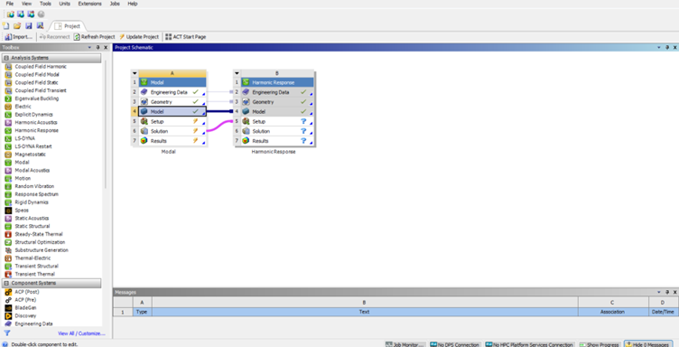
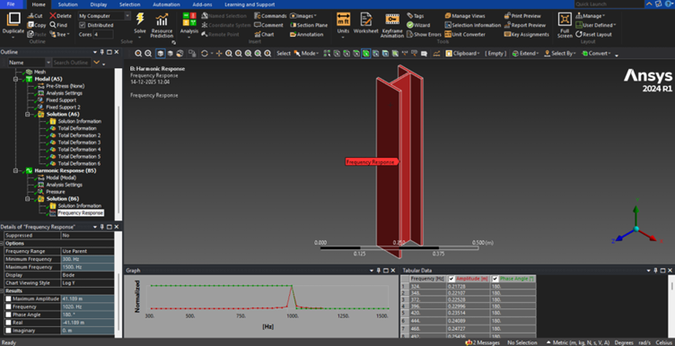
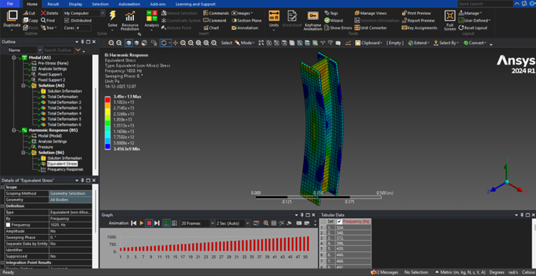

# Peer Teaching: B2 Frequency Response Analysis

## 7.0 Specific Learning Objectives – Harmonic (Frequency Response) Analysis

$$
\newcommand{\dd}{\mathrm{d}}
\newcommand{\pd}{\partial}
$$

After completing harmonic analysis, the student will be able to:

- Predict the steady-state response of a structure subjected to sinusoidal loading.
- Identify resonance frequencies and their relation to modal natural frequencies.
- Study the effect of damping on vibration amplitude.
- Analyze frequency-dependent displacement, stress, and phase response.
- Understand how modal superposition reduces computational effort.
- Evaluate the dynamic amplification factor of a structure.

## 7.1 What is Harmonic Analysis?

Harmonic analysis determines the steady-state response of a structure subjected to sinusoidal loads of known frequency.

Used when:

- Loads vary harmonically with time
- Transient effects are negligible
- Frequency content is known

## 7.2 Governing Equation of Motion

The general equation of motion for a linear dynamic system is:

$$
[\mathbf{M}]\{\ddot{\mathbf{x}}\}
+
[\mathbf{C}]\{\dot{\mathbf{x}}\}
+
[\mathbf{K}]\{\mathbf{x}\}
=
\{\mathbf{F}_0\}\sin(\omega t)
$$

where:

### [M] — Mass Matrix

- Represents how the mass of the structure is distributed over its degrees of freedom (DOFs)  
- Quantifies inertia, i.e., resistance to acceleration  
- Contributes to dynamic effects  
- Larger mass leads to lower natural frequencies  

---

### [C] — Damping Matrix

- Represents energy dissipation mechanisms such as:
  - Material damping
  - Joint damping
  - Friction  
- Relates velocity to resistive force  
- If damping is neglected, the system becomes undamped  
- Common damping models include:
  - Structural damping
  - Rayleigh damping
  - Modal damping  

---

### [K] — Stiffness Matrix

- Represents elastic resistance of the structure  
- Relates displacements to restoring forces  
- Larger stiffness leads to higher natural frequencies  

---

### {F_0} — Forcing Vector

- Amplitude vector of applied sinusoidal loads  
- Represents the external excitation applied to the system  

---

### w — Forcing Angular Frequency (rad/s)

- Angular frequency at which the load oscillates  
- Related to the ordinary frequency \(f\) by:

$$
\omega = 2\pi f
$$

- Defines the frequency range over which the response is evaluated  

---

## 7.3 Steady-State Solution

For harmonic excitation, a steady-state harmonic response is assumed:

$$
\{\mathbf{x}\} = \{\mathbf{X}\} e^{i\omega t}
$$

Substituting this expression into the governing equation yields the frequency-domain equation:

$$
\left(
-\omega^2[\mathbf{M}]
+ i\omega[\mathbf{C}]
+ [\mathbf{K}]
\right)
\{\mathbf{X}\}
=
\{\mathbf{F}_0\}
$$

ANSYS solves this equation numerically for each frequency step in the specified range.

---

## 7.4 Modal Superposition Method (Used in ANSYS)

To reduce computational effort, ANSYS commonly uses the modal superposition method:

$$
\{\mathbf{x}\} = [\boldsymbol{\Phi}]\{\mathbf{q}\}
$$

where:

- phi — matrix of mode shapes obtained from modal analysis  
- {q} — modal coordinates  

### Advantages of Modal Superposition

- Faster solution compared to full direct methods  
- High accuracy near resonance frequencies  
- Particularly suitable for linear systems  

---

## 7.5 Frequency Response Function (FRF)

The Frequency Response Function (FRF) describes the relationship between the system response and the applied excitation in the frequency domain:

$$
H(\omega) = \frac{X(\omega)}{F(\omega)}
$$

### Key Observations

- Peaks occur at resonance frequencies  
- A phase shift is observed near resonance  
- Damping controls the amplitude and sharpness of resonance peaks  

## 7.6 Derivation and Understanding of Analytical Solution

### Assumptions

For harmonic analysis of an H-beam, the following standard assumptions are made:

- Linear elastic material behavior  
- Small deformations  
- Euler–Bernoulli beam theory (shear deformation neglected)  
- Uniform cross-section along the beam length  
- Sinusoidal excitation force  

These assumptions are consistent with ANSYS beam elements.

---

### Step 1: Geometry and Material of the H-Beam

Consider an H-beam with:

- Length: \(L\)  
- Young’s modulus: \(E\)  
- Second moment of area about the bending axis: \(I\)  

For an H-beam cross-section:

$$
I = I_{\text{flanges}} + I_{\text{web}}
$$

This value is computed once from geometry and directly governs the bending stiffness of the beam.

---

### Step 2: Governing Differential Equation (Bending)

For transverse vibration of a beam, the governing equation is:

$$
EI \frac{d^4 w(x,t)}{dx^4}
+ \rho A \frac{\partial^2 w(x,t)}{\partial t^2}
= f(x,t)
$$

where:

- \(w(x,t)\) — transverse displacement  
- \(\rho A\) — mass per unit length  
- \(f(x,t)\) — external force per unit length  

This equation shows that the bending stiffness \(EI\) directly resists deformation.

---

### Step 3: Harmonic Excitation

Assume a harmonic force applied along the beam:

$$
f(x,t) = f_0(x)\sin(\omega t)
$$

Because the excitation is sinusoidal, the steady-state response is also harmonic:

$$
w(x,t) = W(x)\sin(\omega t)
$$

Substituting these expressions into the governing equation removes explicit time dependence.

---

### Step 4: Frequency-Domain Equation

After substitution, the governing equation becomes:

$$
EI \frac{d^4 W(x)}{dx^4}
- \omega^2 \rho A W(x)
= f_0(x)
$$

This is the frequency-domain form, where stiffness and inertia appear explicitly.

---

### Step 5: Finite Element Approximation (Key Step)

The displacement field is approximated using beam shape functions:

$$
W(x) = \mathbf{N}(x)\mathbf{q}
$$

where \(\mathbf{q}\) contains nodal displacements and rotations.

Using the principle of virtual work, the element stiffness matrix is obtained as:

$$
\mathbf{k}_e =
\int_0^L
EI
\left(
\frac{d^2 \mathbf{N}}{dx^2}
\right)^T
\left(
\frac{d^2 \mathbf{N}}{dx^2}
\right)
dx
$$

This integral explicitly shows:

- Dependence on \(E\) (material property)  
- Dependence on \(I\) (H-beam geometry)  

---

### Step 6: Resulting Element Stiffness Matrix (Bending)

Evaluating the integral yields the standard Euler–Bernoulli beam element stiffness matrix:

$$
\mathbf{k}_e =
\frac{EI}{L^3}
\begin{bmatrix}
12 & 6L & -12 & 6L \\
6L & 4L^2 & -6L & 2L^2 \\
-12 & -6L & 12 & -6L \\
6L & 2L^2 & -6L & 4L^2
\end{bmatrix}
$$

This stiffness matrix is directly used by ANSYS for modeling H-beam structures.

---

### Step 7: Dynamic Stiffness for Harmonic Analysis

In harmonic analysis, stiffness combines with inertia and damping to form the dynamic stiffness matrix:

$$
\mathbf{K}_{\text{dyn}}(\omega)
=
\mathbf{K}
- \omega^2 \mathbf{M}
+ i\omega \mathbf{C}
$$

This expression explains:

- Why the response depends on excitation frequency  
- Why resonance occurs near natural frequencies  
- Why modal analysis precedes harmonic analysis  

---

### Step 8: Modal Superposition Connection

Using modal decomposition, the total displacement is expressed as:

$$
\mathbf{u}(t)
=
\sum_{r=1}^{N}
\boldsymbol{\phi}_r q_r(t)
$$

Each mode behaves as an equivalent single-degree-of-freedom (SDOF) system:

$$
\left(
k_r
- \omega^2 m_r
+ i\omega c_r
\right)
Q_r(\omega)
=
F_r(\omega)
$$

where \(k_r\) originates from the stiffness matrix derived above.

---

### Interpretation for the H-Beam

- Larger \(I\) leads to higher stiffness and higher natural frequencies  
- Peaks in the harmonic response occur when the excitation frequency is close to modal frequencies  
- ANSYS computes these responses numerically, while the theory explains the underlying physical behavior  

## 7.7 Role of Damping

Types of damping in ANSYS:

- Structural damping
- Rayleigh damping
- Modal damping ratio

Effects:

- Reduces peak amplitude
- Broadens resonance curve
- Improves numerical stability

## 7.8 Differences between modal and harmonic analysis

| Modal Analysis | Harmonic Analysis |
|---------------|------------------|
| No external load | Sinusoidal load applied |
| Finds natural frequencies | Finds vibration amplitude |
| No damping | Damping included |
| Free vibration | Forced vibration |

## 7.9 Engineering significance

- Avoid resonance in design
- Predict fatigue due to vibration
- Improve structural reliability
- Optimize stiffness and mass distribution

Used in:

- Automotive components
- Aerospace structures
- Mechanical frames
- Civil structures

## 7.10 Implementation in Ansys with an example

### Phase 1: Workbench Setup

1. Open ANSYS Workbench.

2. Select System:

   In the Toolbox on the left, find Modal.
   Drag and drop it into the Project Schematic window.

3. Engineering Data (Crucial Step):

   Double-click Engineering Data.
   Ensure you define Density (for the Mass matrix) and Young's Modulus/Poisson's Ratio.

4. Geometry:

   Right-click Geometry cell ->Import Geometry

   Geometry – [Download H-beam geometry](media/peer-teaching_B2/Hbeam.stp)

### Phase 2: Mechanical Setup (The Modeling)

Double-click the Model cell to open ANSYS Mechanical.

1. Meshing

- Click on Mesh in the outline tree.
- Sizing: 15mm.
- Generate Mesh: Right-click Mesh ->Generate Mesh.
- Check: Ensure the mesh looks uniform.

2. Boundary Conditions (Setup)

- Right-click Modal (A5) ->Insert -> Fixed Support.
- Select the two H-faces of the H-bar and click Apply.

3. Analysis Settings

- Click Analysis Settings in the tree.
- Max Modes to Find: The default is usually 6.
- Solver Options: Leave as "Program Controlled" unless you have a specific requirement.

### Phase 3: Solution & post-processing

1. Solve

- Right-click Solution (A6) ->Solve.
- ANSYS will compute the eigenvalues (frequencies).

2. Reviewing Frequencies

- Once done, click Solution.
- In the bottom right table ("Tabular Data"), you will see a list of Mode numbers and their corresponding Frequencies (Hz).

3. Visualizing Mode Shapes

- Select all the rows in the Tabular Data window.
- Right-click ->Create Mode Shape Results.
- This adds "Total Deformation" items to your Solution tree.
- Right-click Solution -> Evaluate All Results.
- Click on each Total Deformation to evaluate and note the minimum and maximum frequencies.

### Phase 4

Go to ANSYS workbench and now select and drag the harmonic response from the drop down menu to the solution row of the modal to transfer and share data.

Go back to the model and now you have the harmonic response B5 in the outline tree.

In analysis settings of B5 change the input minimum and maximum frequencies according to the results obtained in total deformation and set the intervals to 50.

Now apply a pressure of 2000MPa on one of the rectangular faces in Z axis.

Under the outline tree insert frequency response-> Deformation select the entire body with direction of deformation is Z-axis in details and solve.

Insert equivalent stress for details of equivalent stress input the maximum frequency obtained in the results of frequency response and solve again.

Now provide some damping by providing a damping ratio of 0.02 under damping controls in analysis settings which is by default equal to 0. This means the vibration will damp and eventually come to rest. And solve again and analyse.

## 7.11 Important result discussions and conclusions

Discussions

- Comparison Between Damped and Undamped Systems
- Peak amplitudes: Undamped >> Damped
- Resonance sensitivity: Undamped systems are highly sensitive; damped systems show controlled response.
- Dynamic amplification factor is highest in undamped systems and reduced in damped systems.
- Practical engineering systems always include damping to avoid catastrophic failure at resonance frequencies.

Conclusions

- The H-beam exhibits maximum vibration at its natural frequencies, confirming the principle of resonance.
- Undamped systems show very high peak amplitudes at resonance, posing a risk of structural failure.
- Damping significantly reduces peak response and improves stability under harmonic loading.
- Phase response analysis indicates that damped systems lag the applied load, whereas undamped systems have abrupt phase changes near resonance.
- Modal superposition and harmonic analysis together provide accurate prediction of frequency-dependent behavior with reduced computational effort.
- Proper selection of damping and material stiffness is critical to ensure structural reliability and avoid resonance-induced failures

## 7.12 Self assessment quiz

Q1. What is the primary objective of harmonic analysis?

A. To determine transient shock response

B. To predict steady-state response under sinusoidal loading

C. To calculate buckling loads

D. To determine thermal stresses

Q2. Harmonic analysis is used when:

A. Loads are random and unpredictable

B. Frequency content of loading is unknown

C. Loads vary harmonically with time

D. Nonlinear material behavior dominates

Q3. In the governing equation

[M]{u ̈}+[C]{u ̇}+[K]{u}={F_0}sin⁡(ωt)

Which matrix represents energy dissipation?

A. Mass matrix [M]

B. Stiffness matrix [K]

C. Damping matrix [C]

D. Forcing vector {F₀}

Q4. Increasing the stiffness of a structure generally results in:

A. Lower natural frequencies

B. Higher natural frequencies

C. No change in frequency

D. Increased damping

Q5. The forcing angular frequency ω is related to ordinary frequency f by:

A.f=2πω

B. ω=2πf

C. f=ω

D. ω=f/2π

Q6. In steady-state harmonic response, displacement is assumed in the form:

A.u(t)=Ut

B. u(t)=Usin⁡(t)

C. u(t)=Ue^iωt

D. u(t)=Ue^(-t)

Q7. Which method does ANSYS commonly use to reduce computational effort in harmonic analysis?

A. Direct integration method

B. Explicit time stepping

C. Modal superposition method

D. Finite difference method

Q8. What happens to vibration amplitude near resonance?

A. It becomes zero

B. It decreases linearly

C. It reaches a peak

D. It becomes frequency independent

Q9. What is the main effect of damping on frequency response?

A. Increases resonance frequency

B. Eliminates stiffness

C. Reduces peak amplitude

D. Increases mass effect

Q10. Which statement correctly differentiates harmonic and modal analysis?

A. Both include damping and external loads

B. Modal analysis studies forced vibration

C. Harmonic analysis applies sinusoidal loading

D. Modal analysis calculates vibration amplitude

Answer Key

1.B

2.C

3.C

4.B

5.B

6.C

7.C

8.C

9.C

10.C
