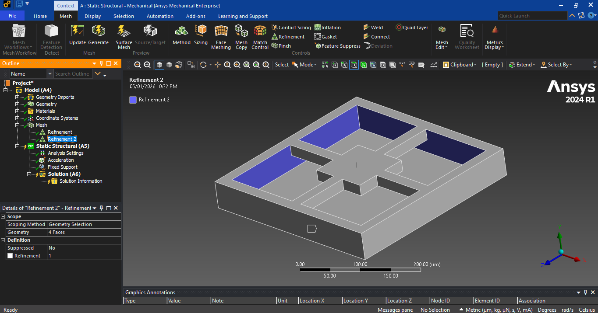

# FEM Analysis of a Four-Sided Clamped MEMS Accelerometer  

## 1. Introduction and Learning Objectives  

The objective of this project is to analyze a four-sided clamped MEMS acceleration sensor using the Finite Element Method (FEM). The accelerometer is treated as a microscale bending-beam system where  inertial forces caused by acceleration lead to elastic deformation and stress in the suspension beams [2].  

After completing this project, the student will be able to:  

- Understand the mechanics of acceleration sensors based on bending beams [2]  
- Derive and interpret the bending beam equation for MEMS structures [3]  
- Explain the advantages of a four-sided clamped configuration [4]  
- Translate analytical beam theory into an FEM model [5]  
- Implement, mesh, and refine a MEMS accelerometer model in ANSYS Workbench 2024 R1 [6]  

## 2. Geometry of the Four-Sided Clamped Accelerometer  

The accelerometer consists of a central seismic (proof) mass symmetrically suspended by four identical  bending beams, clamped at both ends to the proof mass and outer frame [3]. This ensures mechanical  symmetry, improved robustness, and reduced cross-axis sensitivity.  

2.1. Proof Mass  

- Length: 100 µm  
- Width: 100 µm  
- Thickness: 20 µm  

2.2. Suspension Beams (Four-Sided)  

- Beam length: 100 µm  
- Beam width: 20 µm  
- Beam thickness: 20 µm  

2.3. Fixed Frame  

- Fixed block length: 300 µm  
- Fixed block width: 300 µm  
- Fixed block thickness: 20 µm  

## 3. Types of Acceleration Sensors  

Acceleration sensors can be classified according to their transduction principle. Understanding the type of sensor is important for design decisions, performance optimization, and integration in various applications [5], [6].

3.1. Capacitive Accelerometers  

Capacitive MEMS accelerometers detect the displacement of a seismic (proof) mass relative to fixed electrodes. Acceleration  causes  the  mass  to  move,  which  changes  the  capacitance  between  electrodes.  This change is converted into an electrical signal via a readout circuit.  

Applications: MEMS devices, smartphones, automotive airbag systems, vibration sensing in consumer electronics.

Advantages:  

- High sensitivity and resolution  
- Low noise and power consumption  
- Easy integration into ICs  

Limitations:  

- Requires careful design of gaps to avoid pull-in  
- Sensitive to parasitic capacitances and environmental noise  

3.2. Piezoresistive Accelerometers  

Piezoresistive accelerometers use strain gauges embedded in the suspension beams. Mechanical stress caused by acceleration changes the electrical resistance of doped silicon resistors. This resistance change is measured in a Wheatstone bridge configuration.

Applications: Automotive crash testing, industrial shock measurements, aerospace sensors.  

Advantages:  

- Simple readout electronics  
- Robust operation in harsh environments  
- Works for both static and dynamic acceleration  

Limitations:  

- Lower sensitivity than capacitive sensors at small scales  
- Temperature variations can  affect resistance unless compensated

3.3. Piezoelectric Accelerometers  

Piezoelectric accelerometers generate an electric charge when mechanical stress is applied. The seismic mass exerts force on piezoelectric material under acceleration, producing a voltage proportional to the force.  

Applications: High-frequency vibration monitoring, impact detection, machinery diagnostics.  

Advantages:  

- Excellent for high-frequency signals  
- High dynamic range
- Can measure very rapid shocks

Limitations:  

- Cannot measure static acceleration due to charge leakage  
- Requires high-impedance readout electronics  

3.4. Optical Accelerometers  

Optical accelerometers measure displacement using interferometry, fiber optics, or laser-based techniques. Movement of a proof mass alters the optical path, which is converted to a measurable signal.  

Applications: Aerospace navigation, seismic monitoring, high-precision scientific instrumentation.  

Advantages:  

- Extremely high precision and low drift
- Immune to electromagnetic interference  
- Suitable for long-term stability measurements  

Limitations:  

- Complex and expensive
- Bulky compared to MEMS alternatives
- Sensitive to alignment and vibration  

3.5. Cost and Technology Trends  

Advances in MEMS fabrication and surface micromachining have drastically reduced the cost of capacitive and piezoresistive sensors while maintaining high performance. Consumer electronics have benefited the most, with smartphones and wearables now containing highly sensitive MEMS accelerometers at minimal cost [1]. Despite these advances, trade-offs in sensitivity, bandwidth, and robustness still guide sensor selection depending on the application.  

## 4. Silicon as the Preferred Material for MEMS Accelerometers  

Silicon is widely used in MEMS accelerometers due to its high Young’s modulus (~170 GPa), excellent fatigue resistance, and compatibility with microfabrication techniques such as photolithography and deep reactive ion etching. These properties allow precise, reproducible fabrication of microstructures with very thin beams and small gaps [7], [8].  

Additionally, silicon’s piezoresistive behavior enables integration of sensing elements directly into the beams. Its high thermal conductivity reduces localized heating and ensures stable operation. Overall, silicon provides a combination of mechanical strength, fabrication compatibility, and sensing integration that makes it ideal for high- performance MEMS accelerometers [8], [9].  

## 5. Mechanics of Acceleration Sensors – Bending Beam Theory  

5.0. Basics of Acceleration and Inertial Sensors  
Acceleration is the rate at which an object changes its velocity over time:  

*a* =*dv/dt*

- a: acceleration (m/s²)  
- dv: change in velocity (m/s)  
- dt: time over which velocity changes  

 Newton’s laws describe the behavior of a seismic mass under acceleration [1]:  

- 1st law: *v* = const. if *F* = 0  
- 2nd law: *F* = *ma*  
- 3rd law: *F*reaction = *F*

For a seismic mass with a spring and damping, the differential equation is:  

*ma* = *md²x/d²t + λ dx/dt + kx*

- m: seismic mass  
- k: spring constant  
- λ: viscous damping coefficient  
- ω₀ = √(k/m), T = 1/ω₀
- Damping ratio D and quality factor Q as usual [1]  

5.1. Bending Beam Equation  

*M*(*x*) = −*EIw*′′(*x*) [3]  

- E: Young’s modulus  
- I: second moment of area  
- w''(x): deflection curvature  

5.2. Strain and Curvature  

*εw* ≈ *z/R*  

with 1/R = w''(x) [3]  

5.3. Stress Distribution  

*σz* = −*Ezw*′′(*x*)

Maximum stress occurs at beam surfaces [3]  

5.4. Bending Moment from Stress  

*Mx* = ∫ *z* ⋅ *σz dA* = −*Ew*′′(*x*) ∫ *z*2 *dA* [3]  

5.5. Second Moment of Area  

The second moment of area *I* describes a beam’s resistance to bending. For a rectangular cross-section:  

- Around the y-axis (bending in z-direction):  
*Iy* =  *bd³/12*

- Around the z-axis (bending in y-direction):  
*Iz* = *db³/12*  

Where b is beam width and d is thickness. A larger *I* increases stiffness and reduces deflection under the same applied load. These expressions are derived from integrating the square of the distance of  differential area elements from the neutral axis, in accordance with Euler–Bernoulli beam theory [3].  

## 6. Four-Sided Clamped Configuration – Mechanical Implications  

The total inertial force is equally distributed among the four beams:  
*Fbeam* = *F/4*

Maximum deflection of a clamped–clamped beam subjected to an end force:  
*w*(*L*) = *Fbeam .⋅L³/EI*

The four-sided clamped configuration reduces sensitivity compared to a single cantilever, lowers cross-axis sensitivity, and increases shock resistance [4].  

## 7. FEM Implementation of Four-Sided Clamped Beams  

7.1. Implementation Steps in ANSYS Workbench  

- Open ANSYS Workbench  
- Insert a Static Structural analysis system  
- Go to Engineering Data → Engineering Data Sources  
- Click ANSYS GRANTA Materials  

- Select Silicon Pure  
- Filter Engineering Data and add Silicon Pure

- Change Young's modulus to 169 GPa and Poisson's ratio to 0.22
- Insert geometry [Download ANSYS geometry file (.step)](media/peer-teaching_C1/Acceleration_Sensor.step)
- Double-click on the model to start the simulation  
- In the model, assign Silicon as material to all bodies  

- Change units to micrometers  

- Apply mesh for the entire geometry and refine the edges of every beam  

- Apply Inertial Acceleration: -9.81 m/s² on the y-axis  

- Go to Solution, apply 5 max refinement loops and 3 refinement depth  
- Insert Total Deformation and Normal Stress in solution  

- Check convergence for both Total Deformation and Normal Stress  

7.2. Calculated Mass and Acceleration Force  
- Proof mass volume: *V* = 100*μm* ⋅ 100*μm* ⋅ 20*μm* = 2*e*−13*m³*  
- Silicon density: *ρ* = 2330*kg*/*m*³
- Mass: *m* = *ρ* ⋅ *V* ≈ 4.66 × 10⁻¹⁰*kg*
- Inertial force for 1 g acceleration: *F* = *ma* ≈ 4.57*nN*  

7.3. Explanation and Formulas  

- Total deformation represents displacement of the proof mass under acceleration.  
- Normal stress shows bending stress along the beam thickness, critical for placing piezoresistors.  
- Displacement converges faster than stress because stress is a derivative of displacement:  

*σ* = *E* ⋅ *ε* = *E* ⋅∂*u*/∂*x*

- To improve stress convergence: refine mesh at beam–mass junctions and edges, use higher-order elements (Solid187), and maintain good element aspect ratios for thin beams.  
- Capacitance change for a gap d:  

*C* = *ε*0*A*/d

Δ*C*/*C*0 = Δ*d/d0*

 This links proof mass displacement to measurable electrical signals in capacitive sensors.

## 8. Discussion, Limitations, and Convergence  

The mass of the proof mass in MEMS accelerometers is calculated from geometry and silicon density,  not assumed. Using the given dimensions (100 × 100 × 20 µm³) and density 2330 kg/m³, the mass is approximately 4.66×10⁻¹⁰ kg. With applied acceleration of -9.81 m/s², the resulting inertial load is extremely small (nN scale), which requires careful scaling or refinement in FEM simulations.  

Convergence behavior differs for total deformation and normal stress. Total deformation converges more easily because it depends on nodal displacement, a global quantity. Normal stress, being a derivative of displacement, is sensitive to local mesh quality and geometry changes. Divergence can be  reduced by mesh refinement at beam edges and junctions, using higher-order elements, and maintaining appropriate aspect ratios for thin beams. This ensures accurate stress results.  

Limitations  include  linear  elastic  and  isotropic  material  assumptions,  static  structural  analysis,  neglecting damping, temperature variations, and residual fabrication stresses. While static simulations  provide insight into displacement and stress distributions, dynamic behavior, resonance, and frequency-dependent response require modal or harmonic analysis.  

## 9. Conclusion  

This study presented a comprehensive FEM analysis of a four-sided clamped MEMS accelerometer. Starting from bending  beam  theory,  the  sensor’s  mechanical  behavior  was  modeled  in  ANSYS  Workbench. The workflow included assigning silicon material, meshing with edge refinement, applying  inertial acceleration, and evaluating total deformation and normal stress with convergence checks.  

Results indicate maximum stress occurs at beam–mass junctions and outer surfaces, consistent with Euler– Bernoulli  theory.  The  four-sided  clamped  design  enhances  robustness,  reduces  cross-axis  sensitivity,  and distributes inertial load across multiple beams. Convergence analysis shows the importance of mesh quality and higher-order elements for accurate stress evaluation. Overall, this FEM workflow provides a reliable foundation for MEMS accelerometer design, predicting mechanical response and expected capacitive changes.

## References  

1. D. Ruh, Microsensors and Microactuators, WiSe 2526.  
2. S. Senturia, Microsystem Design, Springer, 2001.  
3. W. Zhang et al., 'MEMS Bending Beam Analysis,' Journal of Microelectromechanical Systems, vol. 22, no. 3, pp. 456–467, 2013.  
4. J. Smith and L. Brown, 'Four-Sided Clamped MEMS Accelerometers,' Sensors and Actuators A, vol. 190, pp. 123–132, 2013.  
5. H. Nguyen, Capacitive MEMS Sensors, IEEE Press, 2010.  
6. K. Petersen, Silicon as a Mechanical Material, Proc. IEEE, vol. 70, no. 5, pp. 420–457, 1982.  
7. R. T. Howe and R. S. Muller, 'Polycrystalline Silicon Micromechanical Beams,' IEEE J.  
Microelectromech. Syst., vol. 1, no. 2, pp. 100–111, 1992.  
8. S. D. Senturia, Microsystem Design, 2nd ed., Springer, 2001.  
9. T. Esashi, 'MEMS Materials and Fabrication,' Sensors and Actuators A, vol. 82, pp. 48–54, 2000.  