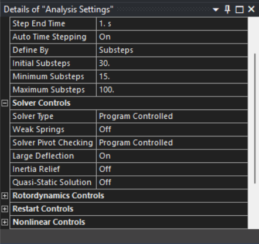
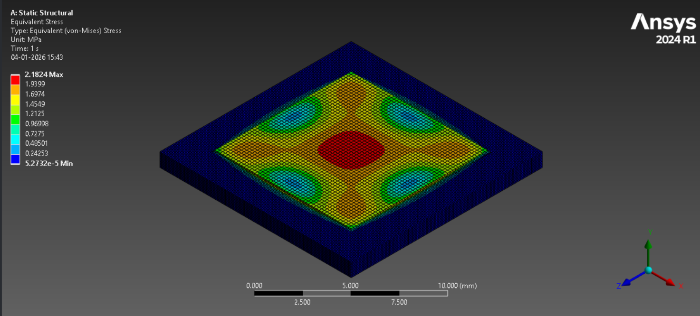

# Peer Teaching: C2 Pressure Sensor (Membrane Deformation)

## 1. Learning Objectives

- Define the working principle of diaphragm-based pressure sensors, including how
applied  pressure  results  in  mechanical  deformation  and  stress  within  the  sensing
element.
- Understand the fundamental mechanical principles governing diaphragm behaviour,
such as bending, stress–strain relationships, and the assumptions of thin plate theory.
- Differentiate between analytical and numerical (finite element) approaches used to
analyze pressure sensor diaphragms
- Implement computational analysis of a pressure sensor diaphragm using ANSYS to
determine deformation and stress distribution under uniform pressure loading.

## 2. Theoretical Background

## 2.1. Pressure Sensor

A pressure sensor is a device used to measure, detect, and monitor the pressure applied
to it, transforming mechanical pressure into an electrical signal. It usually includes a
pressure-sensitive  element  along  with  components  that  increase  its  strength  and
flexibility.

Types of Pressure Sensors:

• Differential Pressure Sensor:
A differential pressure sensor measures the difference between two pressure
values applied to two separate input ports. The sensing diaphragm responds to
the pressure difference rather than the absolute pressure, making this type
suitable  for  applications such  as  flow  measurement,  filter  condition
monitoring, and level sensing.

• Gauge Pressure Sensor:
A  gauge  pressure  sensor  measures  pressure  relative  to  the  surrounding
atmospheric pressure. The sensor output is zero when the measured pressure
equals  ambient  pressure,  and  it  is  commonly  used  in  applications  where
pressure above or below atmospheric conditions needs to be monitored.

 • Sealed Pressure Sensor:
A sealed gauge pressure sensor measures pressure relative to a sealed reference
pressure,  typically  atmospheric  pressure  at  the  time  of sealing.  Since  the
reference pressure is fixed, the sensor output remains independent of variations
in current atmospheric pressure, making it suitable for aerospace and high-
altitude applications.

 • Absolute Pressure Sensor:
An absolute pressure sensor measures pressure relative to a perfect vacuum
sealed inside the sensor. The output represents the true absolute pressure of the
system and is unaffected by atmospheric pressure changes, making it useful in
vacuum systems, altitude measurement, and weather monitoring.

## 2.2. Working Principle of a Pressure Sensor

A  pressure  sensor  operates  by  converting  an  applied  pressure  into  a  measurable
physical  response.  In  diaphragm-based  pressure  sensors,  this  response  is  the
mechanical deformation of a thin diaphragm when pressure is applied to its surface.

When pressure acts on the diaphragm, it causes the diaphragm to bend. The edges of
the diaphragm are typically clamped, which restricts motion and results in maximum
deflection at the centre  and higher stress near the boundaries. The magnitude of
deformation depends on the applied pressure as well as the diaphragm’s geometry and
material properties.

In real-world applications, this mechanical deformation is converted into an electrical
signal  using  transduction  mechanisms  such  as  piezoresistive,  capacitive,  or
piezoelectric  methods.  The  electrical  output  is  then  correlated  with  the  applied
pressure, enabling pressure measurement.

## 2.3. Thin Plate Theory and Mechanical Assumptions

Thin plate theory is commonly used to describe the mechanical behaviour of pressure
sensor diaphragms when the diaphragm thickness is much smaller than its lateral
dimensions.  Under  uniform  pressure  loading,  the  diaphragm  primarily  undergoes
bending deformation, which can be analyzed using classical plate theory.

The theory provides analytical insight into the relationship between applied pressure,
diaphragm geometry, and resulting deformation and stress. It serves as a simplified yet
effective framework for predicting diaphragm behaviour and for validating numerical
results obtained from finite element analysis.

Mechanical Assumptions:

The following assumptions are made in the application of thin plate theory:

- The diaphragm thickness is small compared to its lateral dimensions.
- The material is homogeneous, isotropic, and linearly elastic.
- The diaphragm has a uniform thickness throughout.
- Deflections are small to moderate compared to the diaphragm thickness.
- The diaphragm edges are perfectly clamped.
- Shear deformation and rotary inertia effects are neglected.
Under these assumptions, thin plate theory provides reasonably accurate estimates of
diaphragm  deflection  and  stress  distribution  for  diaphragm-based  pressure  sensor
applications.

## 2.4. Mathematical Formulation for Diaphragm Deflection and Stress

The  mechanical  response  of  a  diaphragm-based  pressure  sensor  subjected  to  uniform
pressure can be described using classical thin plate theory. The diaphragm is modelled as a
thin, clamped plate undergoing bending due to applied pressure.

The bending stiffness (flexural rigidity) of the diaphragm is given by:

D = (E · t³) / [12(1 − ν²)]

where E is Young’s modulus of the diaphragm material,
t is the diaphragm thickness,
and ν is Poisson’s ratio.

For a clamped square diaphragm of side length a, subjected to a uniform pressure p, the
maximum deflection occurs at the center of the diaphragm and can be approximated by:

w_max = α · (p · a⁴) / D

where α is  a  dimensionless  coefficient  that  depends  on  the  diaphragm  geometry  and
boundary conditions. For a clamped square plate, α≈0.0138.

The pressure-induced bending also generates stresses within the diaphragm. The maximum
bending stress occurs near the clamped edges and can be estimated using:

σ_max = β · (p · a²) / t²

where β is  a  geometry-dependent  coefficient,  typically β≈0.308 for  a  clamped  square
diaphragm.

## 3. Pressure Sensor Analysis

## 3.1. Description of the Pressure Sensor Model

The pressure sensor analyzed in this study is based on a diaphragm-type mechanical
structure that deforms when subjected to external pressure. The diaphragm acts as the
primary sensing element, while a surrounding base structure provides mechanical
support and edge clamping.

Model Description and Assumptions

- The sensing element is a thin, square diaphragm.
- The  diaphragm  is  rigidly  supported  along  its  edges,  representing  a  clamped
boundary condition.
- A surrounding base structure provides mechanical support and is assumed to be
significantly stiffer than the diaphragm.
- Pressure is applied uniformly on the top surface of the diaphragm.
- Only  the  mechanical  behaviour  of  the  diaphragm  is  considered;  electrical
transduction effects are not included.

## 3.2. Geometry and Dimensions

The pressure sensor model consists of a square diaphragm integrated into a supporting
base structure. The diaphragm acts as the sensing element, while the surrounding
support provides mechanical stiffness and clamped boundary conditions.

Geometrical Specifications:

The key dimensions of the model are as follows:

- Diaphragm shape: Square
- Diaphragm dimensions: 10 mm × 10 mm
- Diaphragm thickness: 0.1 mm
- Support structure dimensions: 14 mm × 14 mm × 1 mm

## 3.3. Mechanical Properties of Silicon

Silicon is commonly used as the diaphragm material in pressure sensors due to its high
stiffness, good elastic behaviour, and mechanical stability. In this analysis, silicon is
assumed to behave as a linear elastic and isotropic material, which is a reasonable
approximation for small to moderate deformations.

Material Properties:

- Young’s modulus, E: 163 GPa
- Poisson’s ratio, ν: 0.27

These properties determine the stiffness of the diaphragm and directly influence its
deformation and stress response under applied pressure. Since the stresses obtained in
this study remain well below the elastic limit of silicon, plastic deformation and
material nonlinearity are neglected.

## 4. Implementation in Ansys

Step 1: Workbench Setup

Step 2: Material Assignment

Step 3: Geometry Import

Geometry

Step 4: Meshing

Step 5: Boundary Conditions

Step 6: Solution Setup and Solving

## 5. Results and Discussion

## 5.1. Total Deformation

The finite element results show that the diaphragm undergoes bending deformation
when subjected to uniform pressure. The deformation pattern is symmetric, with the
maximum deflection occurring at the centre of the diaphragm and zero deformation at
the clamped edges. This behaviour is characteristic of a clamped square diaphragm.

FEM Results:

- Applied pressure: 1 kPa
- Maximum centre deflection (FEM): ≈ 1.49 μm
- Deformation shape: Smooth, bowl-shaped profile
- Maximum deformation located at the diaphragm centre

## 5.2. Equivalent Stress Distribution

The stress distribution obtained from the finite element analysis shows higher stress
concentrations near the clamped edges of the diaphragm, while lower stress levels are
observed  at  the  centre.  This  distribution  is  consistent  with  bending-dominated
behaviour.

FEM Results:

- Maximum equivalent (von Mises) stress: ≈ 2.18 MPa
- Stress concentration near diaphragm edges
- Stress well within elastic limit of silicon

## 5.3. Comparison Between FEM and Analytical Results

|**Quantity**|**Analytical Model**|**FEM Model**|
| :-: | :- | :-: |
|Modelling approach|Classical thin plate theory|3D finite element analysis|
|Geometry|Idealized clamped square diaphragm|Realistic 3D diaphragm and support|
|Material behaviour|Linear elastic, isotropic|Linear elastic, isotropic|
|Deflection assumption|Small to moderate deflection|Large deflection included|
|Stress state|Bending stress (theoretical)|Von Mises equivalent stress|
|Maximum deflection|≈ 1.15 µm|≈ 1.49 µm|
|Location of max deflection|Centre of the diaphragm|Centre of the diaphragm|
|Maximum stress|≈ 3.1 MPa|≈ 2.18 MPa|
|Location of max stress|Near clamped edges|Near clamped edges|

## 6. Conclusion

The mechanical behaviour of a diaphragm-based pressure sensor was analyzed using both
analytical methods and finite element analysis (FEA). The analytical approach, based on
thin plate theory, was used to estimate the diaphragm deflection and stress under uniform
pressure loading. The finite element model developed in ANSYS successfully analyzed the
deformation pattern and stress distribution of the diaphragm, showing maximum deflection
at the centre and higher stress near the clamped edges, which is consistent with theoretical
expectations.

A comparison between analytical and FEM results showed good agreement in terms of
deformation shape, stress location, and order of magnitude. The observed differences in
numerical values are attributed to the simplified assumptions of the analytical model and
the more detailed three-dimensional representation used in the FEM analysis.

## 7. References

[1] Pressure  sensor – an  overview. ScienceDirect  Topics.  Elsevier.  Retrieved  from
https://www.sciencedirect.com/topics/earth-and-planetary-sciences/pressure-sensor
[2] S. P. Timoshenko and S. Woinowsky-Krieger, Theory of Plates and Shells. New York,
NY, USA: McGraw-Hill, 1959.
[3] S. Beeby, G. Ensell, M. Kraft, and N. White, MEMS Mechanical Sensors. Norwood,
MA, USA: Artech House, 2004.
[4] K. E. Petersen, “Silicon as a mechanical material,” Proceedings of the IEEE, vol. 70,
no. 5, pp. 420–457, May 1982.
